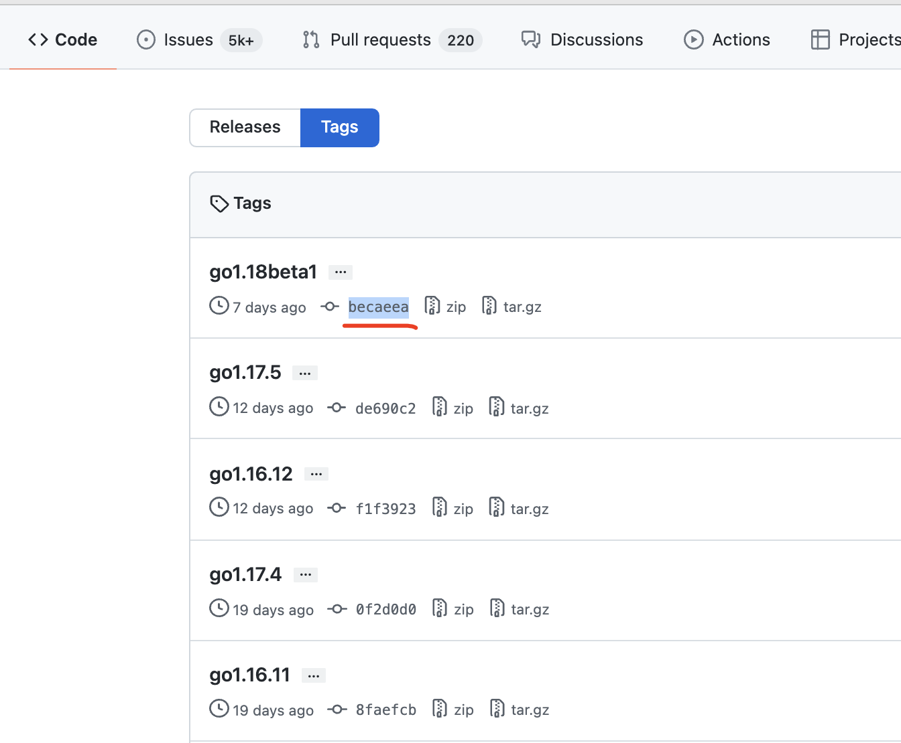
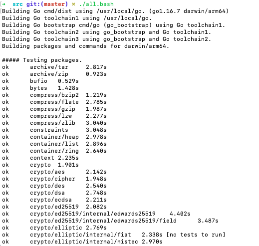
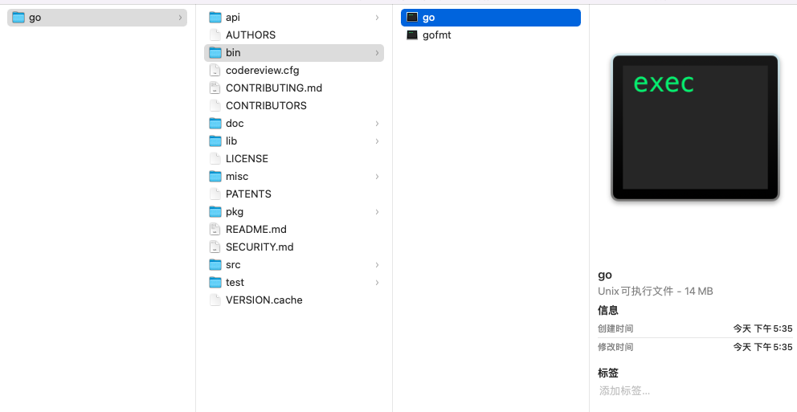
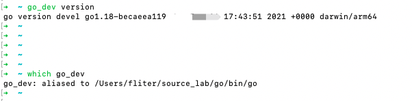

### 编译源码方式安装新版本Go

<br>

通过源代码编译安装*[go1.18beta1](https://github.com/golang/go/tags)*,





```sh
git clone https://github.com/golang/go.git
cd go
git reset --hard becaeea
cd src
vim all.bash
```

**all.bash**内容如下：

```sh
#!/usr/bin/env bash
# Copyright 2009 The Go Authors. All rights reserved.
# Use of this source code is governed by a BSD-style
# license that can be found in the LICENSE file.

set -e
if [ ! -f make.bash ]; then
	echo 'all.bash must be run from $GOROOT/src' 1>&2
	exit 1
fi
OLDPATH="$PATH"
. ./make.bash "$@" --no-banner
bash run.bash --no-rebuild
PATH="$OLDPATH"
$GOTOOLDIR/dist banner  # print build info
```

注释掉`bash run.bash --no-rebuild`这一行，这样每次构建时, 不需要重新跑一遍测试脚本，每次都要大概耗时5分钟




<br>

将**make.bash**的`./cmd/dist/dist bootstrap -a $vflag $GO_DISTFLAGS "$@"`替换为`./cmd/dist/dist bootstrap -a -v`, 默认 `-v` 标记不打开, 这样就看不到进度和错误提示


```sh
% vim make.bash
# 未替换之前的行
# ./cmd/dist/dist bootstrap -a $vflag $GO_DISTFLAGS "$@"
# 替换之后的行, -a 表示所有模块, -v 会输出任何错误提示
./cmd/dist/dist bootstrap -a -v
# 如果只更改了某个包下的文件, 并不需要重新构建整个项目, 可只指定某一个目录
# ./cmd/dist/dist install  -v "runtime"
```


<br>


<details>
<summary><b>执行编译脚本 `./all.bash`:</b></summary>

```go
Building Go cmd/dist using /usr/local/go. (go1.16.7 darwin/arm64)
Building Go toolchain1 using /usr/local/go.
math/bits
bootstrap/internal/goexperiment
bootstrap/math/bits
bootstrap/internal/unsafeheader
bootstrap/internal/goversion
bootstrap/internal/race
bootstrap/cmd/compile/internal/test
bootstrap/sort
math
bootstrap/container/heap
math/rand
bootstrap/strconv
strconv
io/ioutil
os/exec
reflect
crypto
regexp/syntax
regexp
encoding/binary
fmt
bootstrap/cmd/internal/sys
encoding/base64
crypto/sha256
crypto/sha1
crypto/md5
flag
bootstrap/cmd/internal/edit
bootstrap/cmd/internal/pkgpath
bootstrap/cmd/internal/bio
bootstrap/cmd/internal/src
bootstrap/internal/buildcfg
bootstrap/debug/dwarf
bootstrap/compress/flate
go/token
encoding/json
bootstrap/math/big
net/url
bootstrap/cmd/internal/quoted
bootstrap/cmd/internal/objabi
bootstrap/cmd/internal/gcprog
go/scanner
bootstrap/cmd/compile/internal/syntax
bootstrap/cmd/internal/dwarf
text/template/parse
bootstrap/cmd/internal/goobj
bootstrap/cmd/asm/internal/flags
bootstrap/compress/zlib
bootstrap/cmd/asm/internal/lex
bootstrap/cmd/internal/obj
go/ast
bootstrap/cmd/internal/archive
compress/flate
bootstrap/debug/elf
bootstrap/debug/macho
bootstrap/debug/pe
bootstrap/internal/xcoff
compress/gzip
bootstrap/cmd/internal/codesign
go/parser
go/printer
go/doc
bootstrap/cmd/internal/obj/arm
bootstrap/cmd/internal/obj/arm64
bootstrap/cmd/internal/obj/mips
bootstrap/cmd/internal/obj/ppc64
bootstrap/cmd/internal/obj/riscv
bootstrap/cmd/internal/obj/s390x
bootstrap/cmd/internal/obj/wasm
bootstrap/cmd/internal/obj/x86
bootstrap/cmd/cgo
bootstrap/cmd/compile/internal/base
bootstrap/go/constant
bootstrap/cmd/compile/internal/logopt
bootstrap/cmd/compile/internal/bitvec
go/build
runtime/pprof
bootstrap/cmd/link/internal/sym
bootstrap/cmd/compile/internal/types
bootstrap/cmd/compile/internal/types2
bootstrap/cmd/link/internal/loader
bootstrap/cmd/link/internal/dwtest
bootstrap/cmd/link/internal/benchmark
bootstrap/cmd/asm/internal/arch
bootstrap/cmd/compile/internal/typebits
bootstrap/cmd/compile/internal/ir
bootstrap/cmd/link/internal/loadelf
bootstrap/cmd/link/internal/loadpe
bootstrap/cmd/link/internal/loadmacho
bootstrap/cmd/asm/internal/asm
bootstrap/cmd/link/internal/loadxcoff
bootstrap/cmd/link/internal/ld
bootstrap/cmd/asm
bootstrap/cmd/compile/internal/objw
bootstrap/cmd/compile/internal/abi
bootstrap/cmd/compile/internal/deadcode
bootstrap/cmd/compile/internal/typecheck
bootstrap/cmd/compile/internal/importer
bootstrap/cmd/link/internal/amd64
bootstrap/cmd/link/internal/arm
bootstrap/cmd/link/internal/arm64
bootstrap/cmd/link/internal/riscv64
bootstrap/cmd/link/internal/mips
bootstrap/cmd/link/internal/ppc64
bootstrap/cmd/link/internal/mips64
bootstrap/cmd/link/internal/s390x
bootstrap/cmd/link/internal/wasm
bootstrap/cmd/link/internal/x86
bootstrap/cmd/link
bootstrap/cmd/compile/internal/inline
bootstrap/cmd/compile/internal/devirtualize
bootstrap/cmd/compile/internal/staticdata
bootstrap/cmd/compile/internal/escape
bootstrap/cmd/compile/internal/reflectdata
bootstrap/cmd/compile/internal/staticinit
bootstrap/cmd/compile/internal/ssa
bootstrap/cmd/compile/internal/pkginit
bootstrap/cmd/compile/internal/liveness
bootstrap/cmd/compile/internal/ssagen
bootstrap/cmd/compile/internal/amd64
bootstrap/cmd/compile/internal/mips
bootstrap/cmd/compile/internal/ppc64
bootstrap/cmd/compile/internal/arm64
bootstrap/cmd/compile/internal/dwarfgen
bootstrap/cmd/compile/internal/arm
bootstrap/cmd/compile/internal/mips64
bootstrap/cmd/compile/internal/walk
bootstrap/cmd/compile/internal/riscv64
bootstrap/cmd/compile/internal/s390x
bootstrap/cmd/compile/internal/wasm
bootstrap/cmd/compile/internal/x86
bootstrap/cmd/compile/internal/noder
bootstrap/cmd/compile/internal/gc
bootstrap/cmd/compile

Building Go bootstrap cmd/go (go_bootstrap) using Go toolchain1.
runtime
internal/abi
runtime/internal/math
runtime/internal/sys
internal/goexperiment
internal/cpu
runtime/internal/atomic
internal/goos
internal/goarch
internal/bytealg
cmd/go
cmd/go/internal/run
cmd/go/internal/fmtcmd
cmd/go/internal/tool
cmd/go/internal/trace
cmd/go/internal/modget
cmd/go/internal/envcmd
cmd/go/internal/clean
cmd/go/internal/version
errors
cmd/go/internal/help
cmd/go/internal/lockedfile
os/signal
cmd/internal/traceviewer
cmd/go/internal/str
debug/buildinfo
unicode
regexp
cmd/go/internal/workcmd
internal/reflectlite
fmt
cmd/go/internal/lockedfile/internal/filelock
internal/xcoff
context
syscall
internal/unsafeheader
debug/dwarf
cmd/go/internal/test
cmd/go/internal/bug
strings
cmd/go/internal/get
bufio
io/fs
cmd/go/internal/search
os
cmd/go/internal/work
strconv
cmd/go/internal/modfetch
log
cmd/go/internal/generate
internal/execabs
cmd/go/internal/modload
sync/atomic
cmd/vendor/golang.org/x/mod/modfile
cmd/go/internal/modcmd
cmd/go/internal/cache
text/template
cmd/go/internal/doc
cmd/go/internal/list
encoding/json
unicode/utf8
io
go/build
cmd/internal/quoted
cmd/go/internal/fsys
sort
bytes
sync
path/filepath
cmd/go/internal/web
net/url
reflect
cmd/go/internal/fix
internal/buildcfg
cmd/go/internal/vcs
debug/elf
os/exec
cmd/go/internal/base
debug/macho
runtime/debug
encoding/hex
go/token
debug/pe
go/parser
crypto/sha256
hash
encoding/binary
cmd/vendor/golang.org/x/mod/sumdb/dirhash
encoding/base64
archive/zip
cmd/go/internal/vet
cmd/go/internal/cfg
cmd/go/internal/load
cmd/internal/sys
cmd/go/internal/cmdflag
cmd/go/internal/par
math
internal/cfg
cmd/vendor/golang.org/x/mod/semver
cmd/go/internal/imports
cmd/vendor/golang.org/x/mod/module
go/scanner
go/internal/typeparams
go/ast
go/build/constraint
unicode/utf16
internal/goversion
encoding
go/doc
internal/goroot
io/ioutil
internal/syscall/execenv
flag
path
time
internal/fmtsort
encoding/xml
internal/singleflight
cmd/go/internal/modinfo
internal/lazytemplate
math/bits
crypto
math/rand
hash/crc32
compress/flate
cmd/vendor/golang.org/x/xerrors
internal/lazyregexp
internal/race
internal/oserror
cmd/vendor/golang.org/x/mod/internal/lazyregexp
cmd/vendor/golang.org/x/xerrors/internal
regexp/syntax
text/template/parse
internal/itoa
cmd/internal/test2json
compress/zlib
hash/adler32
cmd/internal/pkgpath
crypto/sha1
cmd/internal/buildid
cmd/vendor/golang.org/x/mod/zip
cmd/go/internal/robustio
cmd/go/internal/modfetch/codehost
cmd/internal/codesign
cmd/go/internal/mvs
cmd/go/internal/modconv
container/heap
cmd/internal/objabi
internal/poll
internal/testlog
internal/syscall/unix


Building Go toolchain2 using go_bootstrap and Go toolchain1.
internal/race
internal/unsafeheader
internal/goarch
internal/goexperiment
internal/goos
unicode
internal/cpu
sync/atomic
unicode/utf8
internal/abi
runtime/internal/math
internal/itoa
runtime/internal/sys
math/bits
encoding
unicode/utf16
internal/goversion
internal/bytealg
runtime/internal/atomic
math
runtime
internal/reflectlite
sync
internal/testlog
math/rand
errors
sort
internal/oserror
path
io
strconv
container/heap
syscall
bytes
hash
text/tabwriter
strings
hash/adler32
hash/crc32
reflect
crypto
bufio
go/build/constraint
regexp/syntax
html
internal/syscall/execenv
internal/syscall/unix
time
regexp
context
internal/poll
io/fs
os
internal/fmtsort
encoding/binary
cmd/internal/sys
crypto/sha1
encoding/base64
crypto/md5
crypto/sha256
io/ioutil
fmt
path/filepath
internal/lazyregexp
os/exec
log
internal/execabs
flag
internal/buildcfg
cmd/internal/edit
cmd/internal/src
text/scanner
debug/dwarf
cmd/internal/pkgpath
compress/flate
cmd/internal/bio
go/token
encoding/json
runtime/debug
math/big
net/url
go/scanner
cmd/internal/gcprog
encoding/hex
go/ast
cmd/compile/internal/syntax
cmd/internal/objabi
cmd/internal/quoted
compress/zlib
text/template/parse
internal/goroot
cmd/internal/dwarf
cmd/internal/goobj
cmd/asm/internal/flags
cmd/internal/obj
cmd/asm/internal/lex
go/internal/typeparams
go/parser
go/printer
cmd/internal/archive
compress/gzip
runtime/pprof
text/template
debug/elf
debug/macho
debug/pe
internal/xcoff
go/constant
runtime/trace
cmd/link/internal/benchmark
cmd/internal/codesign
cmd/cgo
cmd/internal/obj/arm
cmd/internal/obj/mips
cmd/internal/obj/riscv
cmd/internal/obj/ppc64
cmd/internal/obj/arm64
cmd/internal/obj/s390x
cmd/internal/obj/wasm
cmd/internal/obj/x86
cmd/compile/internal/base
cmd/compile/internal/logopt
cmd/compile/internal/types2
cmd/compile/internal/types
cmd/compile/internal/bitvec
go/doc
go/build
cmd/compile/internal/ir
cmd/compile/internal/typebits
cmd/link/internal/sym
cmd/link/internal/loader
cmd/asm/internal/arch
cmd/link/internal/loadelf
cmd/link/internal/loadpe
cmd/link/internal/loadmacho
cmd/link/internal/loadxcoff
cmd/asm/internal/asm
cmd/link/internal/ld
cmd/asm
cmd/compile/internal/objw
cmd/compile/internal/deadcode
cmd/compile/internal/abi
cmd/compile/internal/typecheck
cmd/compile/internal/importer
cmd/link/internal/mips
cmd/link/internal/mips64
cmd/link/internal/arm
cmd/link/internal/arm64
cmd/link/internal/amd64
cmd/link/internal/ppc64
cmd/compile/internal/escape
cmd/compile/internal/inline
cmd/compile/internal/staticdata
cmd/compile/internal/devirtualize
cmd/link/internal/riscv64
cmd/link/internal/s390x
cmd/link/internal/wasm
cmd/link/internal/x86
cmd/link
cmd/compile/internal/reflectdata
cmd/compile/internal/staticinit
cmd/compile/internal/ssa
cmd/compile/internal/pkginit
cmd/compile/internal/liveness
cmd/compile/internal/ssagen
cmd/compile/internal/mips
cmd/compile/internal/amd64
cmd/compile/internal/arm
cmd/compile/internal/mips64
cmd/compile/internal/arm64
cmd/compile/internal/dwarfgen
cmd/compile/internal/ppc64
cmd/compile/internal/walk
cmd/compile/internal/riscv64
cmd/compile/internal/s390x
cmd/compile/internal/wasm
cmd/compile/internal/noder
cmd/compile/internal/x86
cmd/compile/internal/gc
cmd/compile

Building Go toolchain3 using go_bootstrap and Go toolchain2.
internal/unsafeheader
internal/goos
internal/goarch
unicode
internal/race
internal/goexperiment
unicode/utf8
internal/itoa
runtime/internal/math
runtime/internal/sys
math/bits
encoding
unicode/utf16
internal/goversion
sync/atomic
internal/abi
internal/cpu
math
runtime/internal/atomic
internal/bytealg
runtime
sync
internal/reflectlite
internal/testlog
math/rand
errors
sort
internal/oserror
path
io
strconv
container/heap
syscall
text/tabwriter
bytes
hash
strings
hash/adler32
hash/crc32
reflect
crypto
go/build/constraint
bufio
html
regexp/syntax
internal/syscall/unix
time
internal/syscall/execenv
regexp
context
internal/poll
io/fs
os
internal/fmtsort
encoding/binary
internal/lazyregexp
fmt
path/filepath
io/ioutil
crypto/sha1
crypto/md5
encoding/base64
cmd/internal/sys
crypto/sha256
os/exec
log
flag
cmd/internal/src
text/scanner
cmd/internal/edit
internal/buildcfg
debug/dwarf
internal/execabs
compress/flate
go/token
cmd/internal/bio
encoding/json
cmd/internal/pkgpath
cmd/internal/objabi
cmd/internal/quoted
go/scanner
runtime/debug
math/big
cmd/internal/dwarf
cmd/asm/internal/flags
cmd/internal/goobj
cmd/asm/internal/lex
go/ast
net/url
cmd/internal/gcprog
encoding/hex
cmd/compile/internal/syntax
text/template/parse
cmd/internal/obj
compress/zlib
internal/goroot
go/internal/typeparams
go/printer
go/parser
debug/elf
debug/macho
debug/pe
internal/xcoff
cmd/internal/archive
compress/gzip
runtime/trace
runtime/pprof
cmd/internal/codesign
text/template
cmd/internal/obj/arm
cmd/internal/obj/arm64
cmd/internal/obj/mips
cmd/internal/obj/ppc64
cmd/internal/obj/riscv
cmd/internal/obj/s390x
cmd/internal/obj/wasm
cmd/internal/obj/x86
cmd/cgo
cmd/compile/internal/base
go/constant
cmd/compile/internal/logopt
go/doc
cmd/compile/internal/types2
cmd/compile/internal/types
cmd/compile/internal/bitvec
go/build
cmd/link/internal/benchmark
cmd/link/internal/sym
cmd/compile/internal/ir
cmd/compile/internal/typebits
cmd/link/internal/loader
cmd/link/internal/loadelf
cmd/link/internal/loadxcoff
cmd/link/internal/loadpe
cmd/link/internal/loadmacho
cmd/asm/internal/arch
cmd/link/internal/ld
cmd/asm/internal/asm
cmd/asm
cmd/compile/internal/deadcode
cmd/compile/internal/abi
cmd/compile/internal/typecheck
cmd/compile/internal/objw
cmd/compile/internal/importer
cmd/link/internal/arm64
cmd/link/internal/arm
cmd/link/internal/mips
cmd/link/internal/mips64
cmd/link/internal/amd64
cmd/link/internal/ppc64
cmd/link/internal/riscv64
cmd/link/internal/s390x
cmd/link/internal/wasm
cmd/link/internal/x86
cmd/link
cmd/compile/internal/escape
cmd/compile/internal/inline
cmd/compile/internal/devirtualize
cmd/compile/internal/staticdata
cmd/compile/internal/reflectdata
cmd/compile/internal/staticinit
cmd/compile/internal/ssa
cmd/compile/internal/pkginit
cmd/compile/internal/liveness
cmd/compile/internal/ssagen
cmd/compile/internal/mips
cmd/compile/internal/arm64
cmd/compile/internal/dwarfgen
cmd/compile/internal/arm
cmd/compile/internal/amd64
cmd/compile/internal/mips64
cmd/compile/internal/ppc64
cmd/compile/internal/walk
cmd/compile/internal/riscv64
cmd/compile/internal/s390x
cmd/compile/internal/wasm
cmd/compile/internal/x86
cmd/compile/internal/noder
cmd/compile/internal/gc
cmd/compile

Building packages and commands for darwin/arm64.
container/list
constraints
container/ring
crypto/internal/subtle
crypto/subtle
vendor/golang.org/x/crypto/cryptobyte/asn1
internal/nettrace
compress/bzip2
debug/plan9obj
debug/gosym
cmd/vendor/golang.org/x/arch/ppc64/ppc64asm
cmd/vendor/golang.org/x/arch/arm/armasm
cmd/vendor/golang.org/x/arch/arm64/arm64asm
cmd/vendor/golang.org/x/arch/x86/x86asm
archive/zip
compress/lzw
crypto/cipher
crypto/internal/randutil
crypto/dsa
crypto/aes
crypto/des
crypto/sha512
crypto/elliptic/internal/fiat
encoding/asn1
crypto/rand
crypto/ed25519/internal/edwards25519/field
crypto/hmac
crypto/rc4
vendor/golang.org/x/crypto/cryptobyte
crypto/ed25519/internal/edwards25519
crypto/rsa
crypto/x509/internal/macos
crypto/ed25519
crypto/x509/pkix
encoding/pem
internal/godebug
vendor/golang.org/x/net/dns/dnsmessage
vendor/golang.org/x/net/route
internal/intern
internal/singleflight
vendor/golang.org/x/crypto/internal/subtle
vendor/golang.org/x/crypto/internal/poly1305
vendor/golang.org/x/crypto/chacha20
net/netip
vendor/golang.org/x/crypto/curve25519/internal/field
runtime/cgo
vendor/golang.org/x/crypto/chacha20poly1305
vendor/golang.org/x/crypto/hkdf
database/sql/driver
embed
vendor/golang.org/x/crypto/curve25519
cmd/internal/objfile
debug/buildinfo
database/sql
crypto/elliptic/internal/nistec
encoding/ascii85
encoding/base32
encoding/csv
encoding/gob
encoding/xml
vendor/golang.org/x/text/transform
crypto/elliptic
vendor/golang.org/x/text/unicode/bidi
cmd/addr2line
vendor/golang.org/x/text/unicode/norm
vendor/golang.org/x/text/secure/bidirule
vendor/golang.org/x/net/http2/hpack
mime
mime/quotedprintable
net/http/internal
net/http/internal/ascii
go/format
go/types
hash/crc64
hash/fnv
hash/maphash
html/template
image/color
index/suffixarray
internal/cfg
internal/fuzz
image
image/color/palette
internal/lazytemplate
internal/obscuretestdata
image/internal/imageutil
internal/profile
image/draw
os/user
net
image/gif
vendor/golang.org/x/net/idna
image/jpeg
image/png
internal/sysinfo
testing
internal/trace
math/cmplx
net/http/internal/testcert
net/internal/socktest
os/exec/internal/fdtest
os/signal
os/signal/internal/pty
plugin
reflect/internal/example1
reflect/internal/example2
runtime/metrics
runtime/race
testing/iotest
internal/testenv
testing/fstest
testing/internal/testdeps
testing/quick
time/tzdata
vendor/golang.org/x/sys/cpu
cmd/internal/buildid
cmd/buildid
cmd/compile/internal/test
cmd/internal/browser
cmd/vendor/golang.org/x/tools/cover
cmd/dist
cmd/vendor/golang.org/x/mod/semver
cmd/cover
cmd/doc
cmd/internal/diff
cmd/fix
archive/tar
cmd/go/internal/str
cmd/go/internal/fsys
cmd/go/internal/lockedfile/internal/filelock
cmd/go/internal/cfg
cmd/go/internal/lockedfile
cmd/go/internal/par
cmd/go/internal/base
cmd/go/internal/imports
cmd/go/internal/robustio
cmd/internal/traceviewer
cmd/go/internal/cache
cmd/go/internal/search
cmd/go/internal/trace
cmd/vendor/golang.org/x/mod/internal/lazyregexp
cmd/vendor/golang.org/x/xerrors/internal
cmd/vendor/golang.org/x/crypto/ed25519
cmd/vendor/golang.org/x/mod/sumdb/tlog
cmd/vendor/golang.org/x/xerrors
cmd/vendor/golang.org/x/mod/sumdb/dirhash
crypto/ecdsa
cmd/vendor/golang.org/x/mod/sumdb/note
cmd/go/internal/modinfo
cmd/vendor/golang.org/x/mod/module
cmd/go/internal/doc
cmd/go/internal/cmdflag
cmd/internal/test2json
cmd/go/internal/tool
cmd/go/internal/version
cmd/go/internal/test/internal/genflags
cmd/vendor/golang.org/x/sync/semaphore
cmd/vendor/golang.org/x/mod/zip
cmd/vendor/golang.org/x/mod/modfile
cmd/go/internal/mvs
cmd/gofmt
cmd/link/internal/dwtest
cmd/nm
cmd/objdump
cmd/pack
cmd/vendor/github.com/google/pprof/internal/elfexec
cmd/vendor/github.com/google/pprof/profile
cmd/vendor/github.com/ianlancetaylor/demangle
cmd/vendor/github.com/google/pprof/third_party/d3
cmd/vendor/github.com/google/pprof/third_party/d3flamegraph
cmd/vendor/github.com/google/pprof/third_party/svgpan
cmd/go/internal/modconv
cmd/vendor/golang.org/x/sys/internal/unsafeheader
cmd/test2json
cmd/vendor/golang.org/x/sys/unix
cmd/vendor/golang.org/x/crypto/ed25519/internal/edwards25519
cmd/vendor/golang.org/x/tools/internal/lsp/fuzzy
cmd/vendor/golang.org/x/tools/go/cfg
cmd/vendor/golang.org/x/tools/txtar
vendor/golang.org/x/net/http/httpproxy
log/syslog
net/textproto
crypto/x509
vendor/golang.org/x/net/nettest
vendor/golang.org/x/net/http/httpguts
mime/multipart
net/mail
cmd/vendor/golang.org/x/term
cmd/vendor/github.com/google/pprof/internal/measurement
cmd/vendor/github.com/google/pprof/internal/graph
crypto/tls
go/internal/srcimporter
cmd/vendor/golang.org/x/tools/go/analysis/passes/internal/analysisutil
cmd/vendor/golang.org/x/tools/internal/typeparams
go/internal/gccgoimporter
cmd/api
go/internal/gcimporter
cmd/vendor/golang.org/x/tools/go/ast/astutil
cmd/vendor/golang.org/x/tools/go/ast/inspector
cmd/vendor/golang.org/x/tools/go/types/objectpath
go/importer
cmd/vendor/golang.org/x/tools/internal/analysisinternal
cmd/vendor/golang.org/x/tools/go/types/typeutil
cmd/vendor/golang.org/x/tools/go/analysis
cmd/vendor/golang.org/x/tools/go/analysis/internal/analysisflags
cmd/vendor/golang.org/x/tools/go/analysis/passes/buildtag
cmd/vendor/golang.org/x/tools/go/analysis/passes/inspect
cmd/vendor/golang.org/x/tools/go/analysis/internal/facts
cmd/vendor/golang.org/x/tools/go/analysis/passes/asmdecl
cmd/vendor/golang.org/x/tools/go/analysis/passes/cgocall
cmd/vendor/golang.org/x/tools/go/analysis/passes/framepointer
cmd/vendor/golang.org/x/tools/go/analysis/passes/assign
cmd/vendor/golang.org/x/tools/go/analysis/passes/atomic
cmd/vendor/golang.org/x/tools/go/analysis/passes/bools
cmd/vendor/golang.org/x/tools/go/analysis/passes/composite
cmd/vendor/golang.org/x/tools/go/analysis/passes/copylock
cmd/vendor/golang.org/x/tools/go/analysis/passes/ctrlflow
cmd/vendor/golang.org/x/tools/go/analysis/passes/errorsas
cmd/vendor/golang.org/x/tools/go/analysis/passes/httpresponse
cmd/vendor/golang.org/x/tools/go/analysis/passes/ifaceassert
cmd/vendor/golang.org/x/tools/go/analysis/passes/loopclosure
cmd/vendor/golang.org/x/tools/go/analysis/passes/nilfunc
cmd/vendor/golang.org/x/tools/go/analysis/passes/printf
cmd/vendor/golang.org/x/tools/go/analysis/passes/lostcancel
cmd/vendor/golang.org/x/tools/go/analysis/passes/shift
cmd/vendor/golang.org/x/tools/go/analysis/passes/sigchanyzer
cmd/vendor/golang.org/x/tools/go/analysis/passes/stdmethods
cmd/vendor/golang.org/x/tools/go/analysis/passes/stringintconv
cmd/vendor/golang.org/x/tools/go/analysis/passes/structtag
cmd/vendor/golang.org/x/tools/go/analysis/passes/testinggoroutine
cmd/vendor/golang.org/x/tools/go/analysis/passes/tests
cmd/vendor/golang.org/x/tools/go/analysis/passes/unmarshal
cmd/vendor/golang.org/x/tools/go/analysis/passes/unreachable
cmd/vendor/golang.org/x/tools/go/analysis/passes/unsafeptr
cmd/vendor/golang.org/x/tools/go/analysis/passes/unusedresult
cmd/vendor/golang.org/x/tools/go/analysis/unitchecker
cmd/vet
net/http/httptrace
net/smtp
net/http
expvar
net/http/cgi
net/http/httptest
net/http/cookiejar
net/http/pprof
cmd/go/internal/auth
net/rpc
net/http/httputil
cmd/vendor/golang.org/x/mod/sumdb
cmd/vendor/github.com/google/pprof/internal/plugin
cmd/go/internal/web
cmd/trace
net/http/fcgi
net/rpc/jsonrpc
cmd/vendor/github.com/google/pprof/internal/binutils
cmd/vendor/github.com/google/pprof/internal/report
cmd/vendor/github.com/google/pprof/internal/symbolz
cmd/go/internal/modfetch/codehost
cmd/go/internal/vcs
cmd/vendor/github.com/google/pprof/internal/transport
cmd/vendor/github.com/google/pprof/internal/symbolizer
cmd/go/internal/modfetch
cmd/vendor/github.com/google/pprof/internal/driver
cmd/go/internal/modload
cmd/vendor/github.com/google/pprof/driver
cmd/pprof
cmd/go/internal/workcmd
cmd/go/internal/help
cmd/go/internal/load
cmd/go/internal/fmtcmd
cmd/go/internal/modcmd
cmd/go/internal/work
cmd/go/internal/envcmd
cmd/go/internal/fix
cmd/go/internal/generate
cmd/go/internal/run
cmd/go/internal/modget
cmd/go/internal/clean
cmd/go/internal/get
cmd/go/internal/list
cmd/go/internal/test
cmd/go/internal/vet
cmd/go/internal/bug
cmd/go

---
Installed Go for darwin/arm64 in /Users/fliter/source_lab/go
Installed commands in /Users/fliter/source_lab/go/bin
---
Installed Go for darwin/arm64 in /Users/fliter/source_lab/go
Installed commands in /Users/fliter/source_lab/go/bin
*** You need to add /Users/fliter/source_lab/go/bin to your PATH.
```
</details>

<br>

这时在bin目录下，就有刚刚编译好的二进制文件。




将该目录起一个别名(如go_dev)加到 `~/.zshrc`中：`alias go_dev=/Users/fliter/source_lab/go/bin/go`

并执行`source .zshrc`

<br>

执行 `go_dev version`:




<br>


---


<br>


### 调试源码

<br>


#### 修改runtime/map.go

<br>

在[src/runtime/map.go]() func makemap(t *maptype, hint int, h *hmap) *hmap {}第一行插入新代码 `println("fliter debug source code")` 

(之所以不用fmt.Println，是因为会有循环引用，即runtime包和fmt包相互引用)


<br>

执行`./all.bash`重新编译源码 

(因为只改了runtime包，并不需要重新构建整个项目,所以可在make.bash中 通过`./cmd/dist/dist install  -v "runtime"` 仅指定runtime目录)

```go
package main

func main() {
	m := make(map[int]string, 10)
	m[1] = "cuishuang"

	println(m[1])
}
```

这段代码正常执行该输出`cuishuang`

而使用go_dev run 如上代码：

```go
fliter debug source code
fliter debug source code
fliter debug source code
fliter debug source code
fliter debug source code
fliter debug source code
fliter debug source code
fliter debug source code
fliter debug source code
fliter debug source code
fliter debug source code
fliter debug source code
fliter debug source code
fliter debug source code
fliter debug source code
fliter debug source code
fliter debug source code
fliter debug source code
fliter debug source code
fliter debug source code
fliter debug source code
fliter debug source code
fliter debug source code
fliter debug source code
fliter debug source code
fliter debug source code
fliter debug source code
fliter debug source code
fliter debug source code
fliter debug source code
fliter debug source code
fliter debug source code
fliter debug source code
fliter debug source code
fliter debug source code
fliter debug source code
fliter debug source code
fliter debug source code
fliter debug source code
fliter debug source code
fliter debug source code
fliter debug source code
fliter debug source code
# runtime/internal/sys
compile: cannot use concurrent backend compilation with provided flags; invoked as [/usr/local/go/pkg/tool/darwin_arm64/compile -o $WORK/b008/_pkg_.a -trimpath $WORK/b008=> -p runtime/internal/sys -std -+ -complete -buildid M2oPX2HiuTsx5AMULRO_/M2oPX2HiuTsx5AMULRO_ -shared -c=4 -nolocalimports -importcfg $WORK/b008/importcfg -pack /usr/local/go/src/runtime/internal/sys/arch.go /usr/local/go/src/runtime/internal/sys/arch_arm64.go /usr/local/go/src/runtime/internal/sys/intrinsics.go /usr/local/go/src/runtime/internal/sys/intrinsics_common.go /usr/local/go/src/runtime/internal/sys/stubs.go /usr/local/go/src/runtime/internal/sys/sys.go /usr/local/go/src/runtime/internal/sys/zgoarch_arm64.go /usr/local/go/src/runtime/internal/sys/zgoos_darwin.go /usr/local/go/src/runtime/internal/sys/zversion.go]
fliter debug source code
fliter debug source code
fliter debug source code
fliter debug source code
# internal/cpu
compile: cannot use concurrent backend compilation with provided flags; invoked as [/usr/local/go/pkg/tool/darwin_arm64/compile -o $WORK/b004/_pkg_.a -trimpath $WORK/b004=> -p internal/cpu -std -+ -buildid bZn0-nG2D-qVhCGWsVek/bZn0-nG2D-qVhCGWsVek -symabis $WORK/b004/symabis -shared -c=4 -nolocalimports -importcfg $WORK/b004/importcfg -pack -asmhdr $WORK/b004/go_asm.h /usr/local/go/src/internal/cpu/cpu.go /usr/local/go/src/internal/cpu/cpu_arm64.go /usr/local/go/src/internal/cpu/cpu_arm64_darwin.go /usr/local/go/src/internal/cpu/cpu_no_name.go]
# runtime/internal/atomic
compile: cannot use concurrent backend compilation with provided flags; invoked as [/usr/local/go/pkg/tool/darwin_arm64/compile -o $WORK/b006/_pkg_.a -trimpath $WORK/b006=> -p runtime/internal/atomic -std -+ -buildid Wh4PYLD6KyWgsgy5uHLX/Wh4PYLD6KyWgsgy5uHLX -symabis $WORK/b006/symabis -shared -c=4 -nolocalimports -importcfg $WORK/b006/importcfg -pack -asmhdr $WORK/b006/go_asm.h /usr/local/go/src/runtime/internal/atomic/atomic_arm64.go /usr/local/go/src/runtime/internal/atomic/stubs.go /usr/local/go/src/runtime/internal/atomic/unaligned.go]
```


可见某个步骤发生了问题


<br>


---

<br>


参考：

[go 源码分析 调试安装](https://github.com/zpoint/go-Internals/blob/1.14/debug/setup/setup_cn.md)


[调试源代码](https://draveness.me/golang/docs/part1-prerequisite/ch01-prepare/golang-debug/)