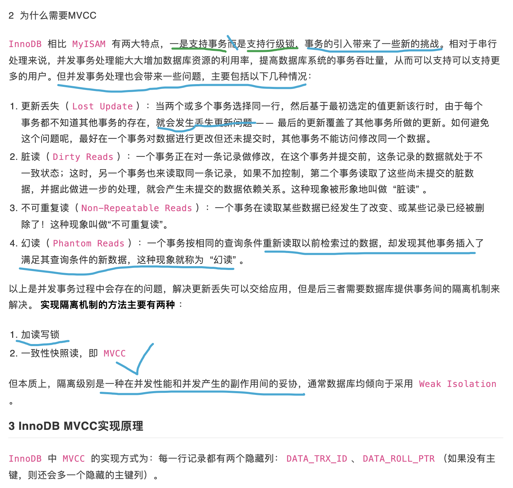

 

MySQL在Innodb存储引擎下默认的隔离级别为"Repeatable Read",可以杜绝"脏读"和"不可重复读",但无法防止"幻读".

起初,我以为在RR隔离级别下,防止"幻读"现象出现的办法,是在第一个事务的查询语句后,加"for update"即排它锁,但实际不是如此.

 

### <b>间隙锁</b>

 

**MySQL InnoDB支持三种行锁定方式:**

- 行锁（Record Lock）:记录锁, 简称行锁, 锁直接加在索引记录上面，锁住的是key。

- 间隙锁（Gap Lock）:锁定索引记录间隙，确保索引记录的间隙不变。间隙锁是针对事务隔离级别为`可重复读`或以上级别而说的。

-  Next-Key Lock ：行锁和间隙锁组合起来就叫Next-Key Lock。 

InnoDB的默认加锁方式是: **Next-Key Lcok**

默认情况下，InnoDB工作在`可重复读(Repeatable Read)`隔离级别下，并且会以`Next-Key Lock`的方式对数据行进行加锁，这样可以有效防止幻读的发生。

Next-Key Lock是行锁和间隙锁的组合，当InnoDB扫描索引记录时，会首先对索引记录加行锁（Record Lock），再对索引记录两边的间隙加上间隙锁（Gap Lock）。加上间隙锁之后，其他事务就不能在这个间隙修改或者插入记录。 

故而:

> Gap Lock在InnoDB的唯一作用就是防止其他事务的插入操作，以此防止幻读的发生。间隙锁不分什么共享锁与排它锁。 

 

当对数据进行条件/范围检索时，对其范围内的值进行加锁！当查询的索引含有唯一属性（主键索引PRI或唯一索引UNI）时，Innodb存储引擎会对`next-key lock`进行优化，将其降为record lock,即降低为行锁，而不是锁定范围！若是普通辅助索引(MUL)，则会使用传统的next-key lock进行范围锁定！

(  要禁止间隙锁的话，可以把隔离级别降为`Read Committed`，或开启参数innodb_locks_unsafe_for_binlog。)

 

**Innodb自动使用间隙锁的条件：**

（1）必须在Repeatable Read级别下

（2）检索条件必须有索引（没有索引的话，mysql会全表扫描，那样会锁定整张表所有的记录，包括不存在的记录，此时其他事务不能修改不能删除不能添加） 

 

[浅析Mysql的隔离级别及MVCC](https://www.jianshu.com/p/db334404d909)

---

 

### <b>MVCC</b>

 

Multi-Version Concurrency Control,, 多版本并发控制, MVCC主要适用于Mysql的`RC`(已提交读),`RR`(可重复读)隔离级别下.

[InnoDB MVCC 机制，看这篇就够了](https://www.codercto.com/a/88775.html) ---力荐!!!

[多版本并发控制(MVCC)在分布式系统中的应用](https://coolshell.cn/articles/6790.html)
