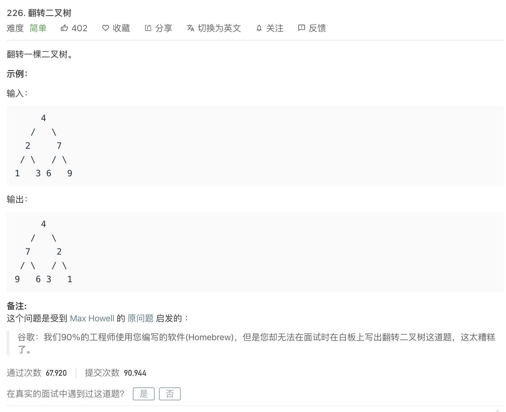

<br>

面国内某厂,享受了和[Homebrew作者一样的待遇](https://www.zhihu.com/question/31202353?rf=31187043) .ﾟヽ(｡◕‿◕｡)ﾉﾟ.:｡+ﾟ

<br>


&和反转链表一样,翻转二叉树,可能是面试中最常考察的两个算法题... &


[226. 翻转二叉树](https://leetcode-cn.com/problems/invert-binary-tree/)

难度:  <font color="green">**简单**</font>





<br>

---


所给代码中已经定义好了一个二叉树

```go
/**
 * Definition for a binary tree node.
 * type TreeNode struct {
 *     Val int
 *     Left *TreeNode
 *     Right *TreeNode
 * }
 */
func invertTree(root *TreeNode) *TreeNode {
    if root == nil {
        return root
    }

    //左右节点进行交换
    // temp := root.Right
    // root.Right = root.Left
    // root.Left = temp
    
    //可以直接更换,无需引入中间变量
    root.Left,root.Right = root.Right,root.Left

    //进行递归,反转子节点和右节点
    root.Left = invertTree(root.Left)
    root.Right = invertTree(root.Right)


    return root

}

```

[图示讲解](https://leetcode-cn.com/problems/invert-binary-tree/solution/dong-hua-yan-shi-liang-chong-shi-xian-226-fan-zhua/)


---

<br>

[三道题套路解决递归问题](https://lyl0724.github.io/2020/01/25/1/)

如链接失效,可[点击](https://note.youdao.com/web/#/file/WEB6be23dc2fd11cbe89b41b4813e1f2560/note/WEB8fd547019ee52b7059148abcbc785d2e/)


---