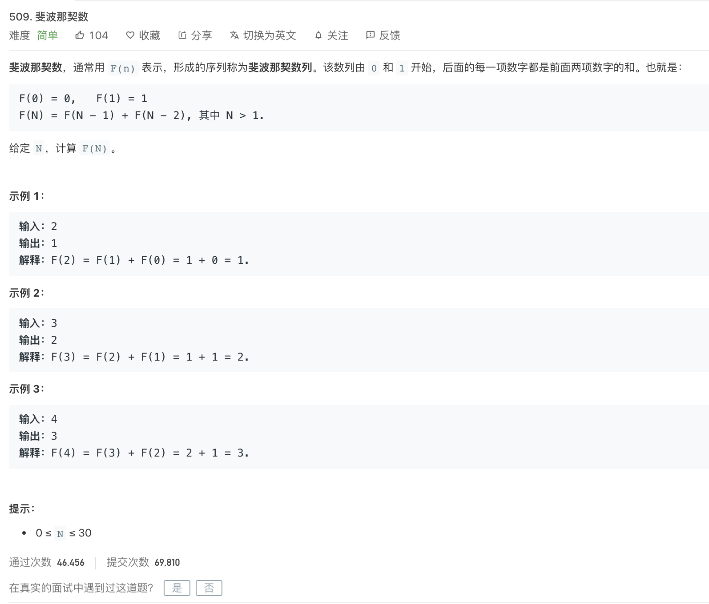
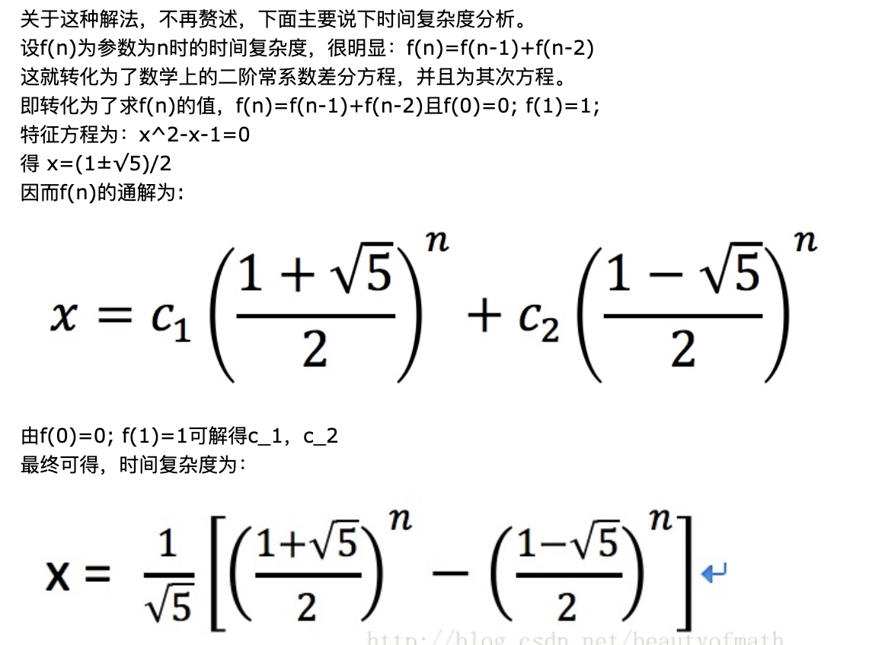
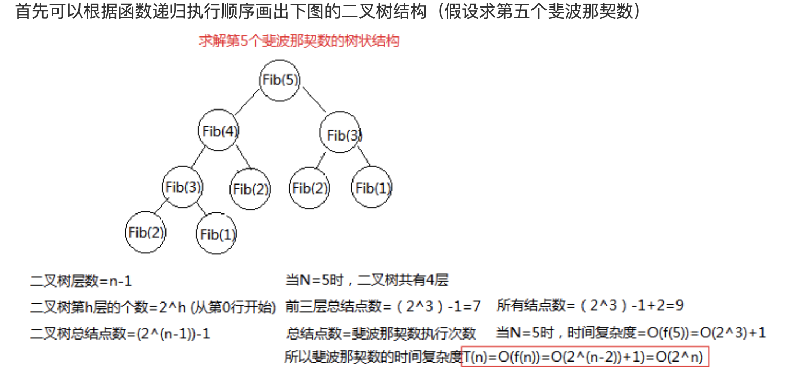
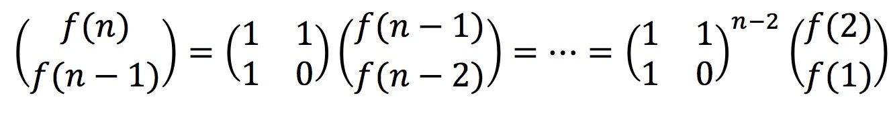

<br>


[509. 斐波那契数](https://leetcode-cn.com/problems/fibonacci-number/)


难度:  <font color="green">**简单**</font>





<br>

---

<br>


### 递归写法:

<br>

```go
func fib(N int) int {

    if N <= 1 {
        return N
    }

    return fib(N-1) + fib(N-2)

}
```


写法简洁,但效率却很低,会出现大量重复计算...(解决重复计算,优先考虑到的办法就是动态规划)




即约为 $\frac{1}{\sqrt{5} }\cdot [ (1.618)^n + (0.618)^n$]


<br>


一般都认为这种写法的时间复杂度为: $O(2^n)$ :




求解F(n),必须先计算F(n-1)和F(n-2),计算F(n-1)和F(n-2)，又必须先计算F(n-3)和F(n-4).... 以此类推，直至必须先计算F(1)和F(0),然后逆推得到F(n-1)和F(n-2)的结果，从而得到F(n).  

可见过程中要计算很多重复的值(且没有将这些过程中的值存储起来复用)，在时间上造成了很大浪费，算法的时间复杂度随着N的增大呈现指数增长，时间的复杂度为$O(2^n)$


<br>


---

<br>

### 非递归写法:

<br>


```go
func fib(N int) int {

    a,b := 0,1 //这其实就是f(0)和f(1)

    for i := 0; i < N; i++ {
        a, b = b, a+b //每次循环,依次变为1,1 / 1,2 / 2,3 / 3,5 / 5,8...
    }

    return a
}
```

<br>

时间复杂度为: $O(n)$

从 $n>2$ 开始，用F(n-1)和F(n-2)两个数相加求出结果，避免大量重复计算，其的效率比递归算法快得多，算法的时间复杂度与n成正比，即算法的时间复杂度为 $O(n)$


<br>


---


<br>


### 动态规划解法:


<br>


时间复杂度为 $O(n)$

参见:

[动态规划套路详解](https://leetcode-cn.com/problems/fibonacci-number/solution/dong-tai-gui-hua-tao-lu-xiang-jie-by-labuladong/)


[面试题10- I. 斐波那契数列（动态规划，清晰图解）](https://leetcode-cn.com/problems/fei-bo-na-qi-shu-lie-lcof/solution/mian-shi-ti-10-i-fei-bo-na-qi-shu-lie-dong-tai-gui/)


---


<br>


### 矩阵相乘法:


<br>


根据上面的递归公式, 可以得到 

 



计算f(n)就简化为计算${矩阵}^{n-2}$，而计算${矩阵}^{n-2}$，又可以进行分解，即计算$${矩阵}^{\frac{n-2}{2}}$$的平方，逐步分解下去. 由于折半计算矩阵次方，因而时间复杂度为$O(\log_2n)$


<br>

```go
func fib(N int) int {
	if N == 0 || N == 1 {
		return N
	}
	// first 是第0个和第1个元素
	first := [][2]int{[2]int{0, 1}, [2]int{0, 0}}
	// temp为系数
	temp := [][2]int{[2]int{0, 1}, [2]int{1, 1}}
	res := matrix22_pow(temp, N - 1)
	return matrix22_mul(first, res)[0][1]
}

func matrix22_pow(x [][2]int, n int) [][2]int {
	r := x
	res := [][2]int{[2]int{1, 0}, [2]int{0, 1}}
	for n != 0 {
		if n & 1 == 1 {
			// 最低二进制位为1
			res = matrix22_mul(res, r)
		}
		// 2维矩阵相乘
		r = matrix22_mul(r, r)
		n >>= 1
	}
	return res
}

func matrix22_mul(x, y [][2]int) [][2]int {
	temp := make([][2]int, 2)
	temp[0][0] = x[0][0] * y[0][0] + x[0][1] * y[0][1]
	temp[0][1] = x[0][0] * y[0][1] + x[0][1] * y[1][1]
	temp[1][0] = x[1][0] * y[0][0] + x[1][1] * y[0][1]
	temp[1][1] = x[1][0] * y[1][0] + x[1][1] * y[1][1]
	return temp
}

```


<br>


---

<br>


达到同样目的,时间复杂度可以是 $O(2^n)$,也可以是 $O(\log_2n)$.可见算法选取是有多么重要,性能可能千差万别


<br>


更多参考:


[斐波那契数列三种解法及时间复杂度分析](https://wmjtxt.github.io/2018/12/26/three_method_of_fibonacci/)

[斐波那契数的时间复杂度、空间复杂度详解](https://blog.csdn.net/lxf_style/article/details/80458519)

[斐波那契数列的三种时间复杂度](https://www.cnblogs.com/zlshtml/p/11267310.html)


[6种解法解决斐波那契数列](https://leetcode-cn.com/problems/fibonacci-number/solution/6chong-jie-fa-jie-jue-fei-bo-na-qi-shu-lie-by-sunh/)