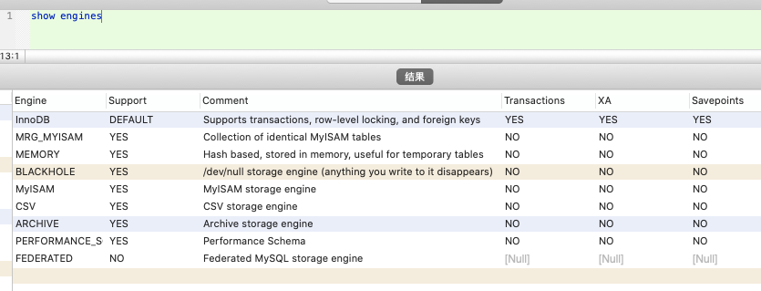
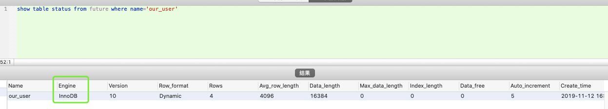
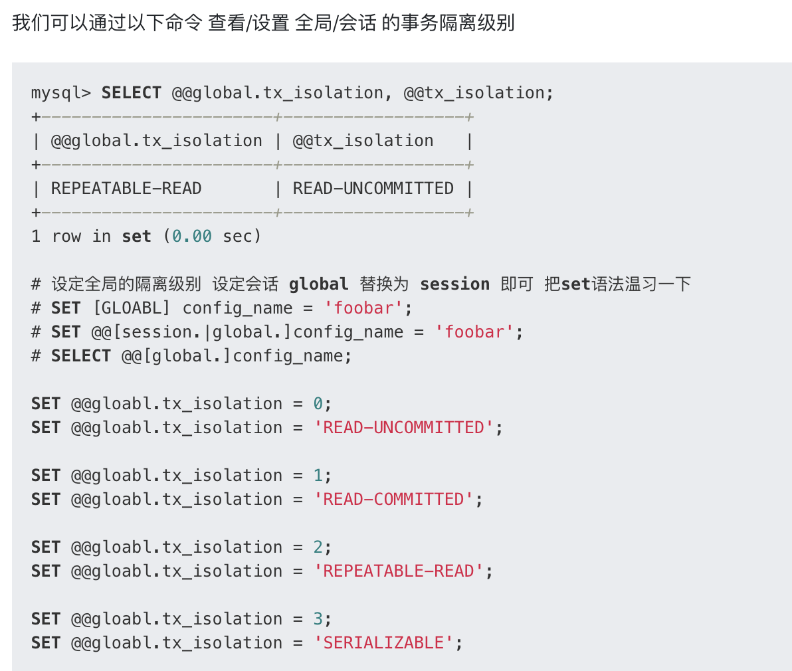
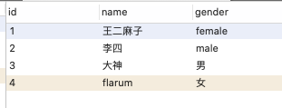
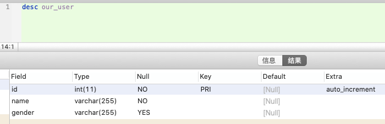
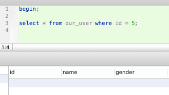
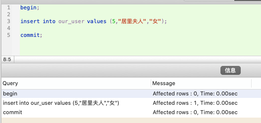
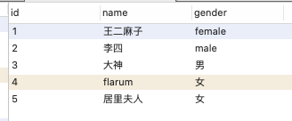
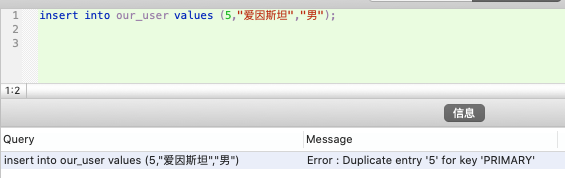

<br>

姊妹篇:

[事物的四种隔离级别](http://www.dashen.tech/2017/07/21/%E4%BA%8B%E7%89%A9%E7%9A%84%E5%9B%9B%E7%A7%8D%E9%9A%94%E7%A6%BB%E7%BA%A7%E5%88%AB/)


[Mysql中的乐观锁和悲观锁](http://www.dashen.tech/2018/01/12/Mysql%E4%B8%AD%E7%9A%84%E4%B9%90%E8%A7%82%E9%94%81%E5%92%8C%E6%82%B2%E8%A7%82%E9%94%81/)


---


<br>

### **前言 & mysql默认存储引擎的默认隔离级别**

<br>

从MySQL 5.x开始, 默认的存储引擎已经由MyISAM换为了InnoDB

[MySQL存储引擎详解](https://segmentfault.com/a/1190000019400925)

<br>

查看存储引擎信息:

```sql
show engines
```



<br>

---

查看mysql版本:

```sql
select version();
```

返回值:

```sql
version()
5.7.28
```

> <font color="purple">InnoDB默认的隔离级别是RR（Repeatable read, 可重复读），但还可能存在幻读现象;</font>

<br>


依据隔离级别逐级升高,mysql提供了如下四种隔离级别:

```sql

a) Read uncommitted（未提交读）：最低级别，任何情况都无法保证


b) Read committed（已提交读）：可避免脏读的发生 `Orancle等多数数据库的默认级别`


c) Repeateable read（可重复读）：可避免脏读、不可重复读的发生`mysql的默认级别`


d) Serializable（可串行化）：可避免脏读、不可重复读、幻读的发生

```

查看表使用的存储引擎:

```sql
show table status from future where name='our_user'
```



<br>

---


### **查看&设置 全局or会话 的事务隔离级别**

<br>




---


### **复现'幻读'**

<br>

> 副标题:  以InnoDB存储引擎下默认的隔离级别RR（Repeatable read, 可重复读）为例

[mysql 幻读的详解、实例及解决办法](https://segmentfault.com/a/1190000016566788)


>幻读会在 RU / RC / RR 级别下出现，SERIALIZABLE 则杜绝了幻读，但 RU / RC 下还会存在脏读，不可重复读，故我们就以 RR 级别来研究幻读，排除其他干扰。
<br><br>
注意：RR 级别下存在幻读的可能，但也是可以使用对记录手动加 X锁 的方法消除幻读。SERIALIZABLE 正是对所有事务都加 X锁 才杜绝了幻读，但很多场景下我们的业务sql并不会存在幻读的风险。SERIALIZABLE 的一刀切虽然事务绝对安全，但性能会有很多不必要的损失。故可以在 RR 下根据业务需求决定是否加锁，存在幻读风险我们加锁，不存在就不加锁，事务安全与性能兼备，这也是 RR 作为mysql默认隔是个事务离级别的原因，所以需要正确的理解幻读。


<br>

mysql默认的隔离级别`Repeateable read（可重复读）`,是无法防止"幻读"现象出现的,复现如下:








<br>
<br>
<br>


执行事务1: 




此时另起一个窗口,执行(干扰)事务2:






这时在事务1中,继续执行

`insert into our_user values (5,"爱因斯坦","男");`,

报错

`Error : Duplicate entry '5' for key 'PRIMARY'`




即事务1查到没有id=5的记录,同时有一个其他事物(事务2)执行对id=5进行了写入.事务1继续进行insert操作,报主键冲突....事务1就很疑惑:不对啊,我刚才查了,明明没有id=5的记录啊..

解决方案: **给事务1的查询语句加排它锁,这样事务2就无法进行写入**


`在 SERIALIZABLE 隔离级别下，事务1的查询语句 执行时是会隐式的添加 行(X)锁 / gap(X)锁，从而 事务2 会被阻塞，事务1的 插入语句 会正常执行，待 事务1 提交后，事务2 才能继续执行（报错:主键冲突执行失败），对于 事务1 来说业务是正确的，成功的阻塞扼杀了扰乱业务的事务2，对于事务1来说其前期读取的结果是可以支撑其后续业务的。
`

---


[MySQL的可重复读级别能解决幻读吗](https://juejin.im/post/5c9040e95188252d92095a9e)---~~给select语句加排它锁,这也是SERIALIZABLE隔离级别做的事~~

实际MySQL在默认的RR隔离级别下,并不是通过给第一个事务加排它锁的形式防止幻读,而是通过MMVC的一些机制(如间隙锁),

参见:

[Innodb间隙锁,以及RR隔离级别下防止幻读现象](http://www.dashen.tech/2019/04/25/Innodb%E9%97%B4%E9%9A%99%E9%94%81-%E4%BB%A5%E5%8F%8ARR%E9%9A%94%E7%A6%BB%E7%BA%A7%E5%88%AB%E4%B8%8B%E9%98%B2%E6%AD%A2%E5%B9%BB%E8%AF%BB%E7%8E%B0%E8%B1%A1/)


---

<br>


### **复现'脏读'**


---

<br>


### **复现'不可重复读'**