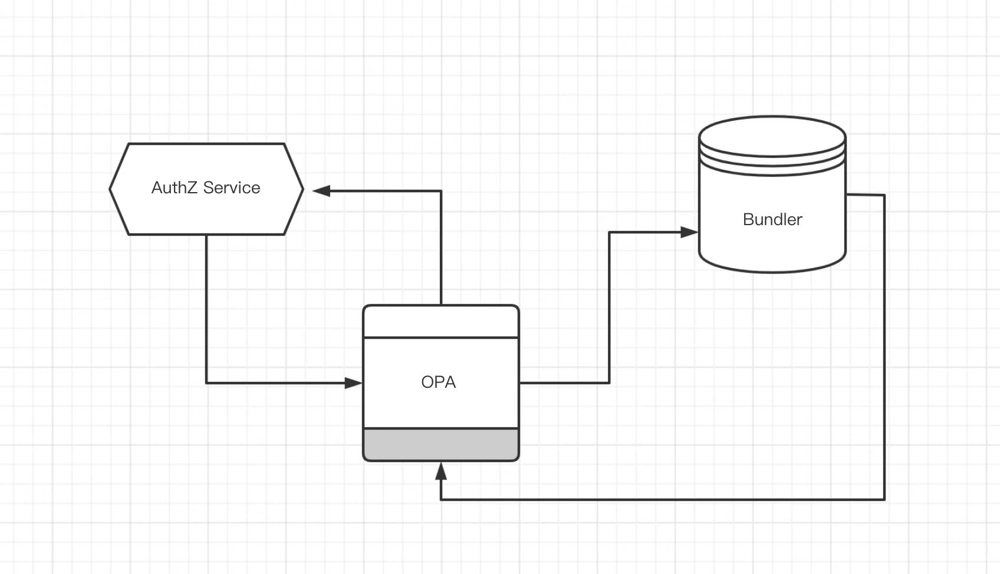
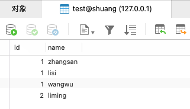
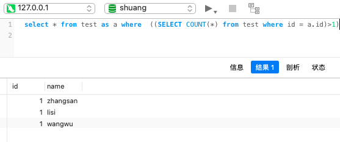
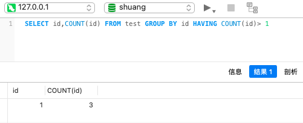

2小时20分钟的面试

问了OPA的各种信息，这是之前在HP用到的东西，后面再未使用，早忘干净了，比如Bundler是咋回事(服务端？)，多个部署还是单个？

（不过这玩意儿好像用户越来越多了，据我所知蚂蚁也在用）





<br>

写了一道算法题，实现一个线程安全的有界的阻塞队列。。。不加阻塞这个条件其实问题不大，但加了之后感到困惑：要用channel吗？ 后来告知要用**sync.Cond** `---` 我博客里有涉及([sync.Cond-让一系列Goroutine在满足特定条件时被唤醒](https://dashen.tech/2017/10/27/sync-Cond-%E8%AE%A9%E4%B8%80%E7%B3%BB%E5%88%97Goroutine%E5%9C%A8%E6%BB%A1%E8%B6%B3%E7%89%B9%E5%AE%9A%E6%9D%A1%E4%BB%B6%E6%97%B6%E8%A2%AB%E5%94%A4%E9%86%92/))，但写go这好几年，就从来没在项目里使用过


之后问了Go生态下微服务的注册与发现。

而后让写了一个sql，获取重复数据，性能尽可能高。写了一版只实现了功能，性能一般。





```sql
select * from test as a where  ((SELECT COUNT(*) from test where id = a.id)>1)
```




允许Google，从StackOverflow上找到了更好的写法。


```sql
SELECT id,COUNT(id) FROM test GROUP BY id HAVING COUNT(id)> 1
```





最后交流了框架中orm在model层和dao层的自动生成


<br>

写一个线程安全的有界阻塞队列:


```go
// write a thread safe bounded blocking queue
package main

import (
	"sync"
)

type BBQ struct {
	data       []interface{}
	capability int
	mutex      sync.Mutex
	cond       sync.Cond
}

func NewBBQ(c int) *BBQ {
	q := new(BBQ)
	q.capability = c
	q.cond = sync.Cond{L: &q.mutex}
	return q
}

func (q *BBQ) Push(value interface{}) {
	q.cond.L.Lock()
	defer q.cond.L.Unlock()

	for len(q.data) == q.capability {
		q.cond.Wait()
	}

	q.data = append(q.data, value)
	q.cond.Signal()
	return
}

func (q *BBQ) Pop() interface{} {
	q.cond.L.Lock()
	defer q.cond.L.Unlock()

	for len(q.data) == 0 {
		q.cond.Wait()
	}

	first := q.data[0]
	q.data = q.data[1:]
	q.cond.Signal()
	return first

}
```


<br>


其他语言版本的 [write a thread safe bounded blocking queue](https://www.google.com/search?q=write+a+thread+safe+bounded+blocking+queue&oq=write+a+thread+safe+bounded+blocking+queue&aqs=chrome..69i57.132j0j1&sourceid=chrome&ie=UTF-8)