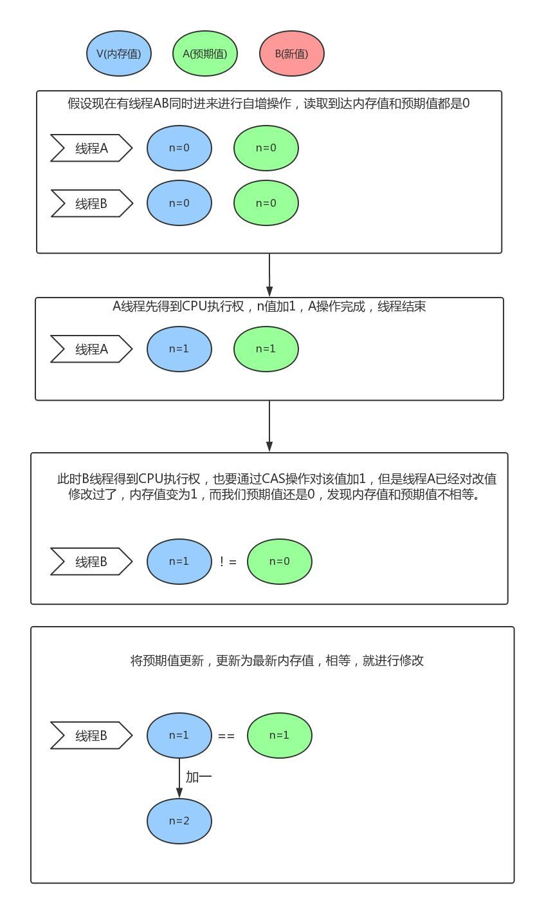

 

###  CAS的其他异义项

 

`CAS`除去计算机里的`Compare and Swap`，即`比较再交换` 外, 还有几个有意思的异义项。

- Chinese Academy of Science，[中国科学院](http://www.cas.cn/)。中国自然科学领域等级最高的机构。

- Central Authentication Service，[中央认证服务](https://www.apereo.org/projects/cas/)，耶鲁大学发起的一个开源项目，旨在为web应用提供一种可靠的单点登录方式。

- Count of Arbitration for Sports，[国际体育仲裁法庭](https://www.tas-cas.org/en/index.html)。最近这个词频上新闻。

- Chemical Abstracts Service，[美国化学会](https://baike.baidu.com/item/%E7%BE%8E%E5%9B%BD%E5%8C%96%E5%AD%A6%E4%BC%9A/1559519)给出现在文献中的物质分配的一个唯一编号，用以避免同一物质有多种名称，使检索更加方便。

---

 

###  计算机中的CAS

 

> 比较并交换(compare and swap, CAS)，是原子操作的一种，可用于在多线程编程中实现不被打断的数据交换操作，从而避免多线程同时改写某一数据时由于执行顺序不确定性以及中断的不可预知性产生的数据不一致问题。该操作通过将内存中的值与指定数据进行比较，当数值一样时将内存中的数据替换为新的值。

> 其作用是让CPU比较内存中某个值是否和预期的值相同，如果相同则将这个值更新为新值，不相同则不做更新，也就是CAS是原子性的操作(读和写两者同时具有原子性)，**其实现方式是通过借助C/C++调用CPU指令完成的，所以效率很高**

 

#### CAS 和 Synchronized

 

`CAS`和`Synchronized`(Java中的关键字)分别属于**乐观锁**和**悲观锁**

`CAS`乐观地认为程序中的并发情况不那么严重，所以让线程不断去尝试更新。（每次不加锁，而是假设修改数据之前其他线程一定不会修改，如果因为修改过产生冲突就失败重试，直到成功为止。CAS机制是(线程)乐观锁的一种，可以理解成一个无阻塞多线程争抢资源的模型）

`Synchronized`悲观地认为程序中的并发情况严重，所以严防死守。（使用Synchronized的线程一旦得到锁，其他需要锁的线程就挂起，等待持有锁的线程释放锁（思考：类似于mysql的共享锁还是独占锁/排它锁？）。当一个线程正在等待锁时，它不能做任何事，所以悲观锁有很大的缺点）

（Java中也有unsafe）

 

Java中的*sychronized*类似Go的*sync.Mutex*，可以对一段代码加锁，以保证其并发安全性。

但这样来实现并发安全并不高效，**某些场景下**可以使用原子操作类(java.util.concurrent.atomic，Go的sync.Atomic)来轻量级解决该问题 

可参考：[Mutex vs Atomic](https://dashen.tech/2017/08/25/Mutex-vs-Atomic/)

 

#### CAS的原理

 

CAS 操作包含三个操作数 `---`内存地址（V）、旧的预期值（A）和即将要更新的新值(B)。

执行CAS操作的时候，将内存位置的值与预期原值比较，如果相匹配，那么处理器会自动将该位置值更新为新值。否则，处理器不做任何操作：

 

#### CAS的缺点：

 

- 1.CPU开销较大

在并发量比较高的情况下，如果许多线程反复尝试更新某一个变量，却又一直更新不成功，循环往复，会给CPU带来很大的压力。

- 2.不能保证代码块的原子性

CAS机制所保证的只是一个变量的原子性操作，而不能保证整个代码块的原子性。比如需要保证3个变量共同进行原子性的更新，就不得不使用Synchronized了。

- 3.ABA问题

这是CAS机制最大的问题所在。

什么是ABA问题？怎么解决？[并发编程中的ABA问题](https://dashen.tech/2017/08/21/%E5%B9%B6%E5%8F%91%E7%BC%96%E7%A8%8B%E4%B8%AD%E7%9A%84ABA%E9%97%AE%E9%A2%98/)

 

---

 

图片来自 [CAS机制是什么鬼？](https://cloud.tencent.com/developer/article/1534229)

更多参考：

[漫画：什么是 CAS 机制？](https://mp.weixin.qq.com/s/f9PYMnpAgS1gAQYPDuCq-w)

[漫画：什么是CAS机制？（进阶篇）](https://mp.weixin.qq.com/s/nRnQKhiSUrDKu3mz3vItWg)

[CAS原理](https://www.jianshu.com/p/ab2c8fce878b)

[一文彻底搞懂CAS实现原理](https://zhuanlan.zhihu.com/p/94762520)

[简析CAS机制与实现原理](https://codeantenna.com/a/jLBZPOeXx9)