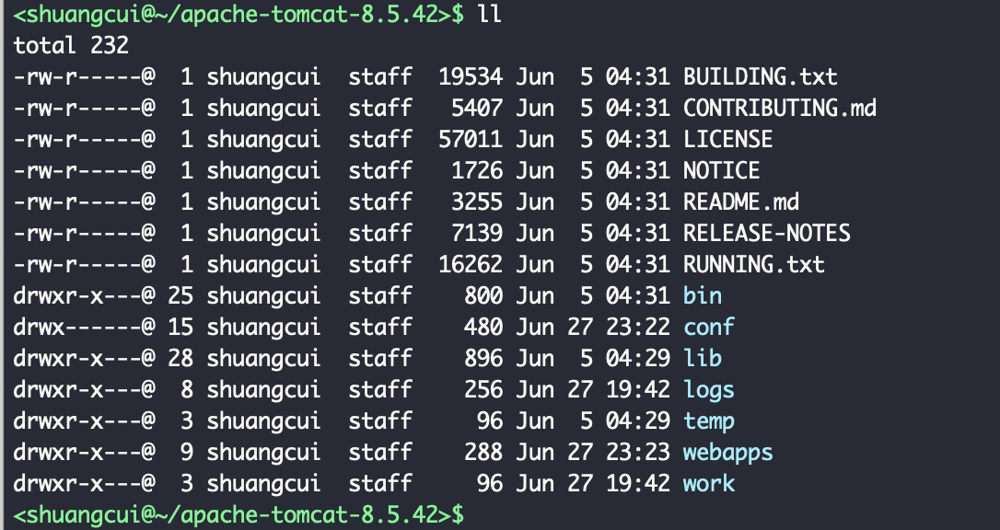
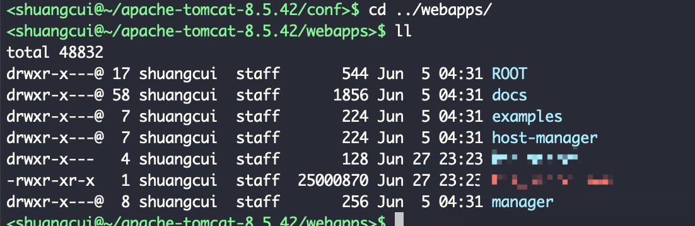
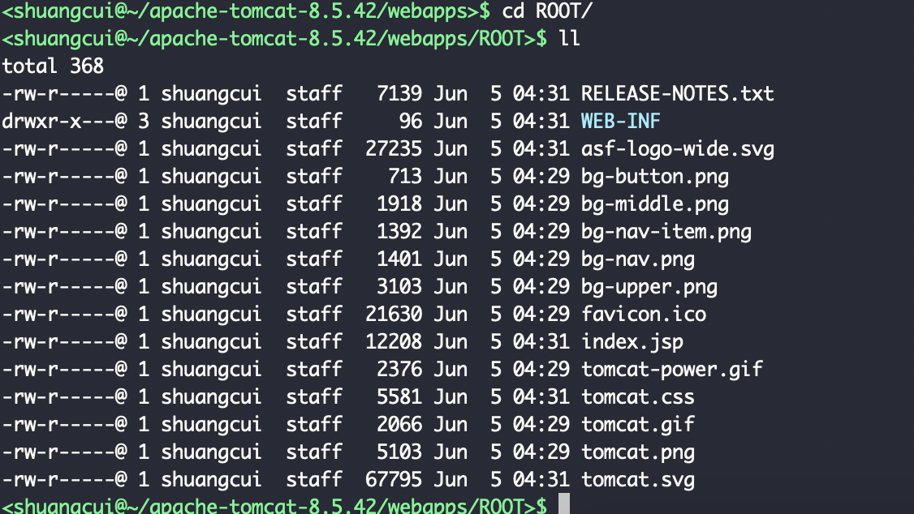
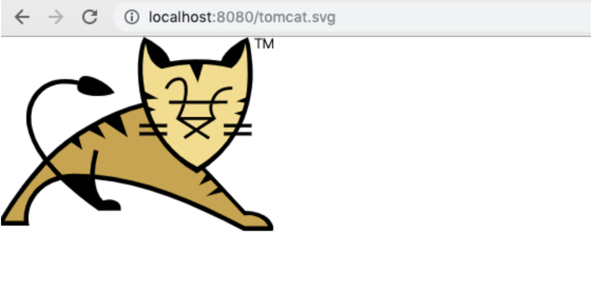
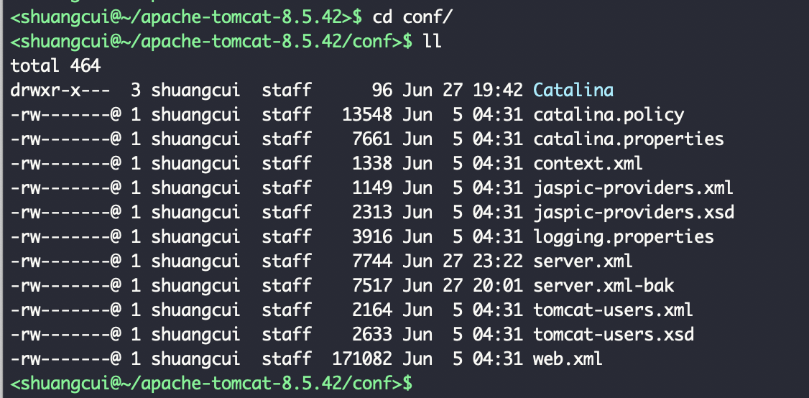

webapps目录用于存放项目war包或文件夹
(不一定要把项目非放在webapps下面,放在其他位置,在server.xml配置文件里配置一个映射也可以~)

ROOT文件夹下的这些东西,可以通过ip+端口直接访问,不需要加项目名~

---

conf目录存放配置文件

---

work目录存放tomcat在运行时编译后的文件,清空这个目录,再重启服务器,可以达到清空服务器缓存的效果~

---

temp文件夹用于存放运行过程中的临时文件,删掉没有任何影响