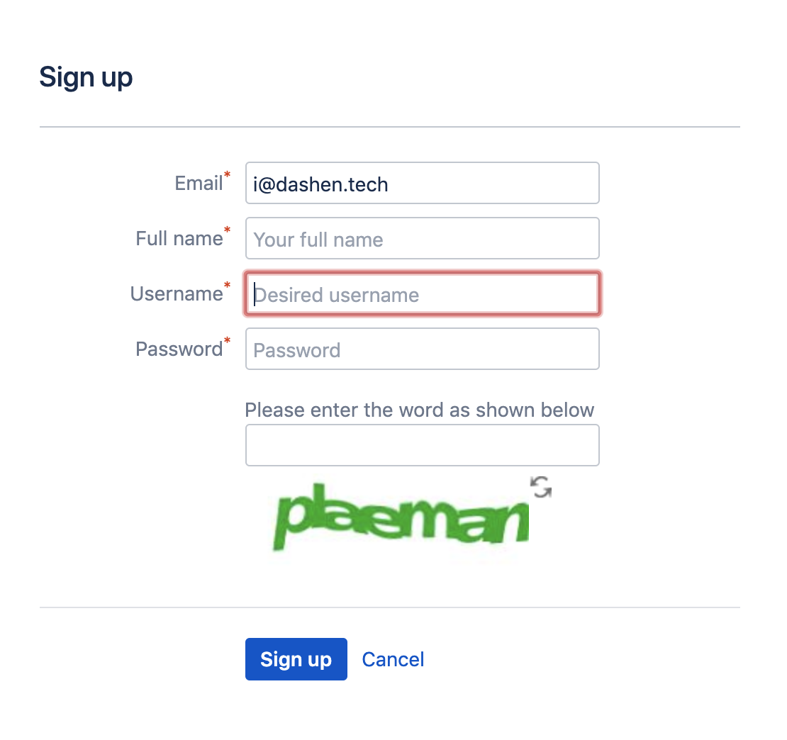
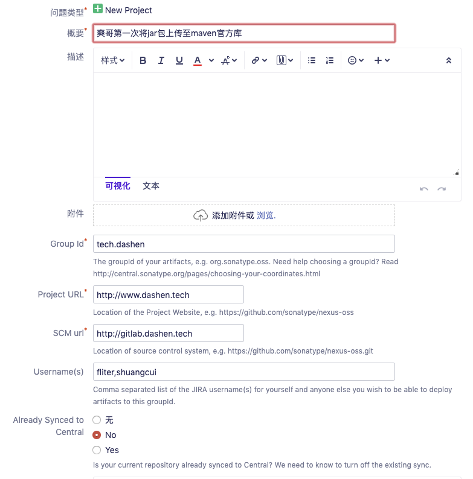
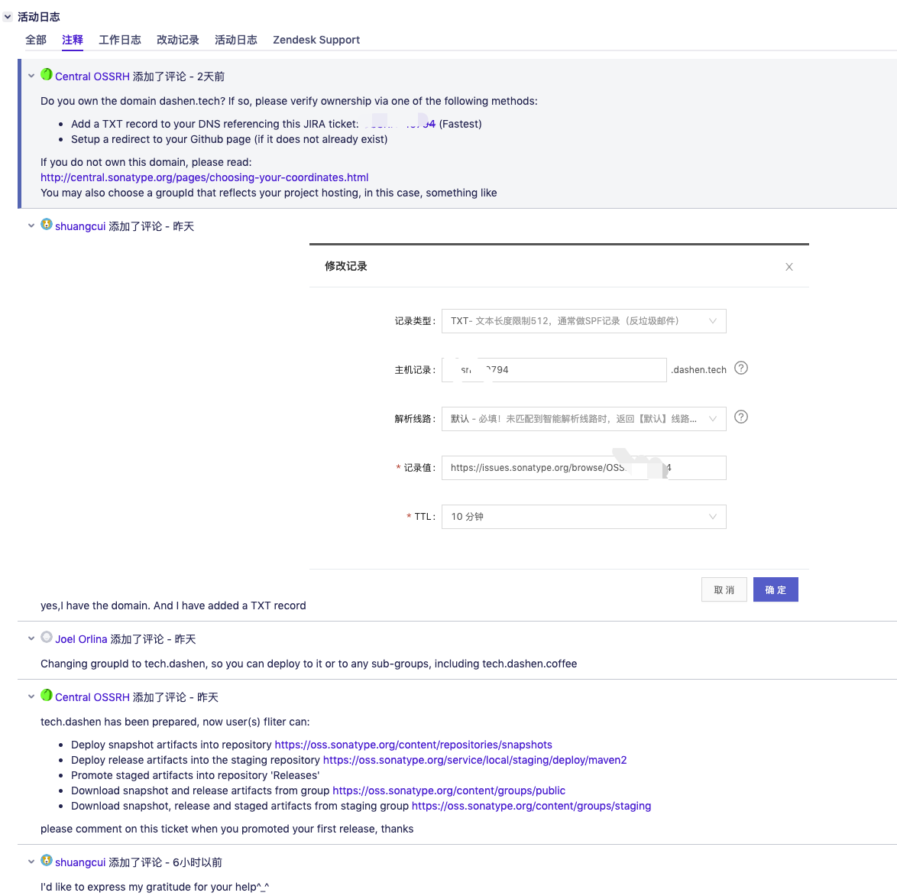
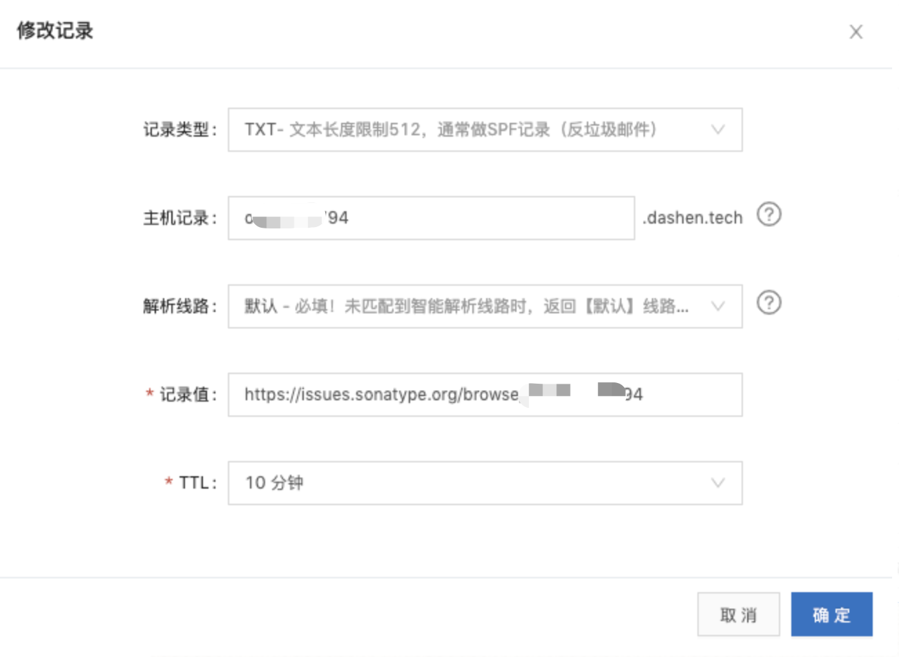
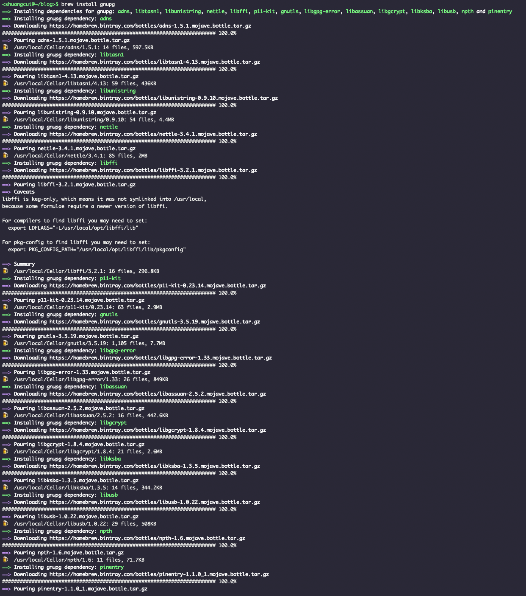
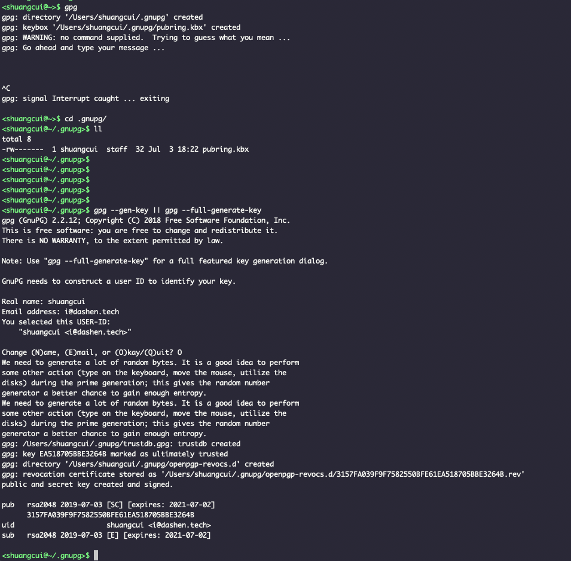
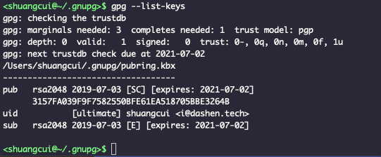

#### 注册及创建Issue
- 注册[sonatype](https://issues.sonatype.org),注:该网站在海外,速度奇慢,耐心等待..

  

- 创建Issue,
点击Create -> Issue

  

①Group Id ，唯一标识，可用自己的域名倒序如tech.dashen,也可用自己的github地址如com.github.xxxxx  

如果用自己的域名作为标识，管理员会咨询并验证该网站是不是归属于你，可通过向该域名的解析记录中添加一条TXT记录验证

② ProjectURL ，填项目源码的地址，如不想公布源码，那填写一个只含README 的项目的地址即可。

*管理员主要就是审核Group Id，保证所有权及不会和现有的地址重复*

---

#### 使用gpg生成密钥

[关于GPG](http://www.ruanyifeng.com/blog/2013/07/gpg.html)

[MAC 安装gnuPG 以及生成钥匙串](https://blog.csdn.net/hao474798383/article/details/82849984)

