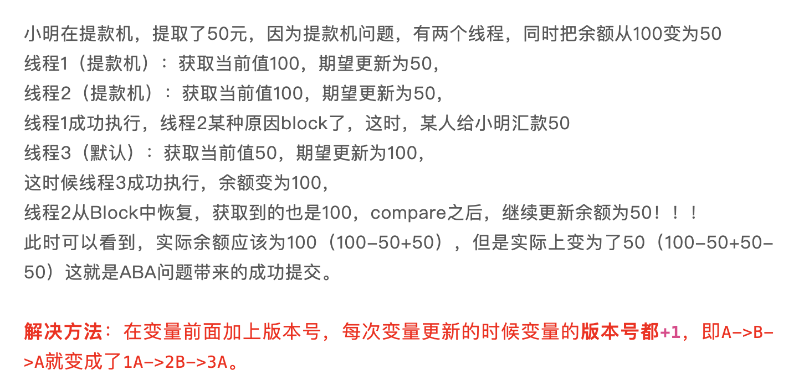
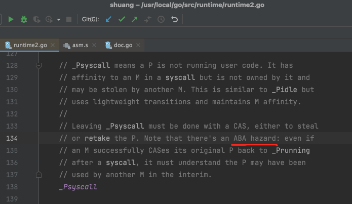

*ABA* 表面看起来没什么问题，但如果结合实际应用场景，就可以看出其问题所在

真正要做到严谨的CAS机制，我们在Compare阶段不仅要比较期望值A和地址V中的实际值，还要比较变量的版本号是否一致。

 

[漫画：什么是CAS机制？（进阶篇）](https://mp.weixin.qq.com/s/nRnQKhiSUrDKu3mz3vItWg)

[风险指针(Hazard Pointer)](https://www.google.com.hk/search?q=Hazard%E6%8C%87%E9%92%88&oq=Hazard%E6%8C%87%E9%92%88&aqs=chrome..69i57j69i60.163j0j4&sourceid=chrome&ie=UTF-8),

也称 *冒险指针*

