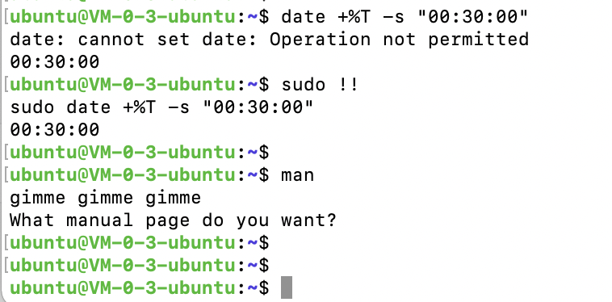

使用Linux时，当查看某命令的用法，一般都用 `man xx`（不过我更喜欢用精简版 **tldr**）

`man`即*manual*的缩略，也是`RTFM`中的*M*  (read the f**king manual)


<br>

但在凌晨**12:30**时,使用这个命令会出现

```sh
gimme gimme gimme
What manual page do you want?
```




<font size=1 color="grey">
`date +%T -s "00:30:00"` 可将系统时间置为*00:30:00*
其中
%T 显示时间，24小时制（hh:mm:ss）
date -s                        //设置当前时间，只有root权限才能设置，其他只能查看

更多可查看 [date命令](https://man.linuxde.net/date)

</font>


有人提了这个问题 [Why does man print "gimme gimme gimme" at 00:30?](https://unix.stackexchange.com/questions/405783/why-does-man-print-gimme-gimme-gimme-at-0030)


始作俑者很快“自首”，man 的维护者是其好友，其开玩笑建议如果有人大半夜之后用man命令，应该打印出 "gimme gimme gimme" ...

没想到他的好友[真这么干了](http://git.savannah.nongnu.org/cgit/man-db.git/commit/src/man.c?id=002a6339b1fe8f83f4808022a17e1aa379756d99)

```c

diff --git a/src/man.c b/src/man.c
index 1978329e..48af3c08 100644
--- a/src/man.c
+++ b/src/man.c
@@ -1154,8 +1154,16 @@ int main (int argc, char *argv[])
 
 	debug ("\nusing %s as pager\n", pager);
 
-	if (first_arg == argc)
+	if (first_arg == argc) {
+		/* http://twitter.com/#!/marnanel/status/132280557190119424 */
+		time_t now = time (NULL);
+		struct tm *localnow = localtime (&now);
+		if (localnow &&
+		    localnow->tm_hour == 0 && localnow->tm_min == 1)
+			fprintf (stderr, "gimme gimme gimme\n");
+
 		gripe_no_name (NULL);
+	}
 
 	section_list = get_section_list ();
```

<br>

那“gimme gimme gimme”到底什么意思呢？ 说是因为 Abba 乐队著名的 [《gimme gimme gimme! (a man after midnight)》(半夜后给我找一个男人)](https://www.iqiyi.com/v_19rrmnkjmc.html) ...


<br>

---


<br>


参考:


[Linux彩蛋：gimme gimme gimme](http://i.jandan.net/p/109568)

[Gimme! Gimme! Gimme! (A Man After Midnight)](https://baike.baidu.com/item/Gimme%21%20Gimme%21%20Gimme%21%20%28A%20Man%20After%20Midnight%29/53036377)


