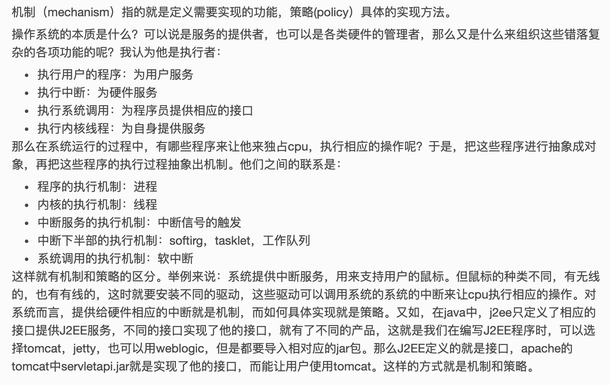
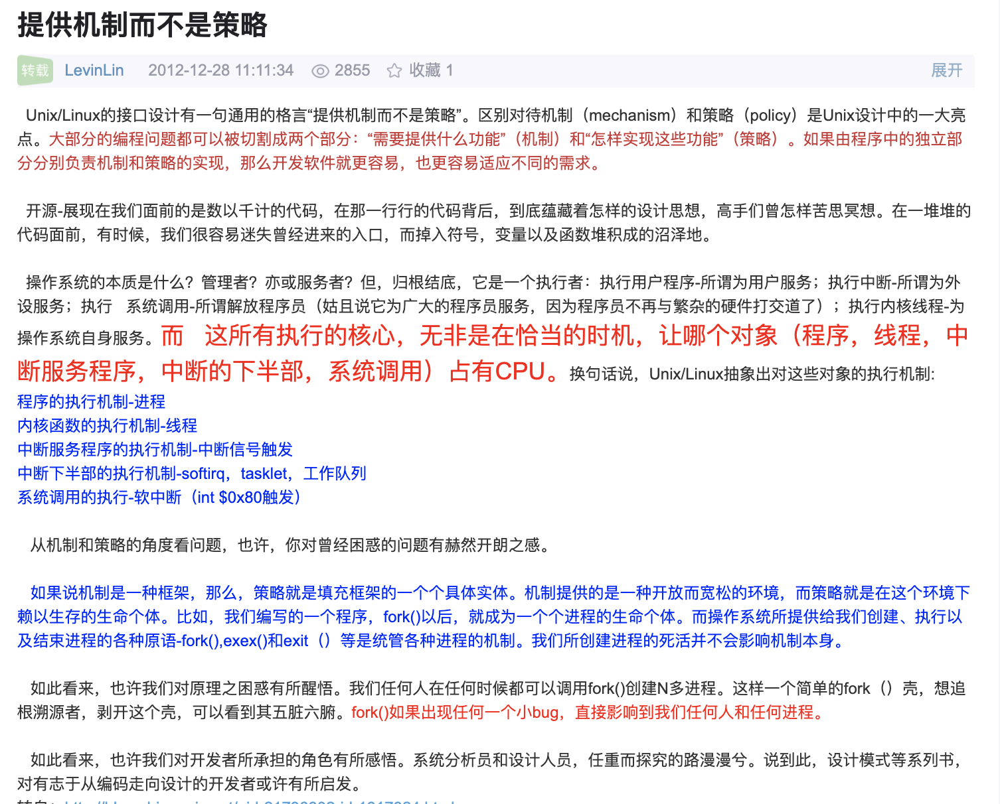

[Linux 内核分析与应用](https://next.xuetangx.com/course/XIYOU08091001441/1516763)

蜻蜓点水,可作抛砖引玉

 

---

## 1.概述

 

### 用到的几个命令:

[insmod]()

[dmesg](https://www.runoob.com/linux/linux-comm-dmesg.html)
[lsmod](https://www.runoob.com/linux/linux-comm-lsmod.html)

### 章节测试:

[部分可参考](https://tiku.link/post/106849.html)

 

<1>. Linux得以流行，是因为遵循了GPL协议，并不是因为遵循POSIX标准 (错)

[linux操作系统概述](https://wenku.baidu.com/view/b270588d1eb91a37f0115c16.html)

[linux概述](http://www.doc88.com/p-1751663666583.html)

 

<2>. 从Linux操作系统的整体结构来看，分两大部分，用户空间的应用程序和内核空间的os内核，二者之间是一种c/s结构，os是服务者，应用程序是客户，是一种请求和响应的关系。 (对)

[Linux用户空间与内核空间](https://blog.csdn.net/qq_29350001/article/details/51240230)

[阮一峰-User space 与 Kernel space](https://www.ruanyifeng.com/blog/2016/12/user_space_vs_kernel_space.html)

 

<3>.Linux内核提供机制而不是策略，系统调用是一种策略 (错)

关于Unix/Linux的设计有一句通用的格言“提供机制而不是策略”。换句话说，系统调用抽象出了用于完成某种确定目的的函数。至干这些函数怎么用完全不需要内核去关心。区别对待机制(mechanism)和策略(policy)是Unix/Linux设计中的一大亮点。大部分的编程问题都可以被切割成两个部分:“需要提供什么功能”(机制)和“怎样实现这些功能”(策略)。 

<4>.内核源码中的双向链表和哈希表都相当于内核源码中的基本类型，对其操作只需要调用内核提供的相应API就可以。  (对)

Linux内核中对双向链表的使用,简直和int型一样频繁

 

<5>.Linux内核把双链表作为基本类型存放于types.h文件中，是为了隐藏双链表的指针特性。 (对)

Linux双向链表的定义主要涉及到两个文件：

- include/linux/types.h
- [include/linux/list.h](https://github.com/torvalds/linux/blob/master/include/linux/list.h)

[Linux内核中双向链表的经典实现](https://www.cnblogs.com/skywang12345/p/3562146.html)

 

<6>. list.h中的list_entry（）宏通过一个结构体中字段的地址可以求出该结构体的地址，从而可以访问结构体的其他成员，是一种逆向思维。 (对)

[Linux内核中的list_head结构体以及list_entry宏](https://blog.csdn.net/rao_risk/article/details/8100005)

 

<7>.Linux内核是单内核结构，执行效率高，可维护性好 (错)

**微内核效率不如单内核，但可维护性要好。minix，qnx，l4，还有谷歌刚推出的fuchsia，均为微内核。linux大多数为单内核**

 

<8>.内核文档中https://www.kernel.org/doc/html/latest/ 只包含各个子系统的文档   (错)

 

<9>.可加装的内核模块在内核运行时候可加载和卸载，是开发一个新的文件系统，驱动程序的基本机制。  (对)

<10>.内核模块的修饰符__init可加可不加，对模块的运行没有什么影响  (错)

 

[linux kernel __init和__exit宏的作用](https://www.cnblogs.com/linengier/p/12380780.html)

[Linux开发实战指南文档](https://tutorial.linux.doc.embedfire.com/zh_CN/latest/linux_driver/module.html)(这篇不错)

 

<11>.编写Linux内核模块时，不需要单独写一个Makefile文件，直接编译就可以 (错)

 

<12>.Linux内核模块运行在用户空间  (错)

 

<13>. 微内核比单内核的效率高 (错)

 

<14>. Linux内核模块的插入和运行必须用root权限 (对)

 

<15>. Linux的内核模块不属于Linux的几个子系统  (对)

 

<16>.Linux在超级计算机，可穿戴设备，嵌入式系统，移动终端，桌面等系统上都可以运行。 (对)

 

<17>. Linux内核、GNU工具以及其他一些自由软件组成了人们常熟的Linux系统或者Linux发布版。 (对)

 

<18>. lisit_entry(ptr,type,member)宏返回的是member的地址
  (错)

[Linux内核双链表语句list_entry(ptr, type, member)理解](http://ilinuxkernel.com/?p=1062)

 

<19>.list_for_each_saft()宏和list_for_each()宏功能一样，安全性有差异 (对)

 

<20>. 与体系结构（如x86，ARM等）相关的代码存放在[arch目录](https://github.com/torvalds/linux/tree/master/arch)下 (对)

 

<21>. 创建进程属于一种策略而不是机制  (错)

 

<22>.  ( )不属于Linux的子系统  D

- A.进程管理

- B.内存管理

- C.文件系统

- D.模块

 

<23>.Linux操作系统遵循（ ）标准  C

- A.GUN

- B.GPL

- C.POSIX

- D.MMU

 

<24>.触摸屏属于（ ）管理   B

- A.应用程序

- B.操作系统

- C.硬件厂家

- D.系统调用

 

<25>.如果要从磁盘读取一个文件，则主要与（ ）子系统打交道   C

- A.内存管理

- B.进程调度

- C.文件系统

- D.网络

 

<26>. struct list_head 无法表达（ ）种数据结构    D

- A.队和栈

- B.图

- C.树

- D.集合

[深入理解linux内核list_head的实现](http://blog.chinaunix.net/uid-27122224-id-3277511.html)

 

<27>. 谷歌的Fuchsia操作系统属于( )结构    A

- A.微内核

- B.单内核

- C.C/S

- D.面向对象

 

