### 2.1 内存寻址

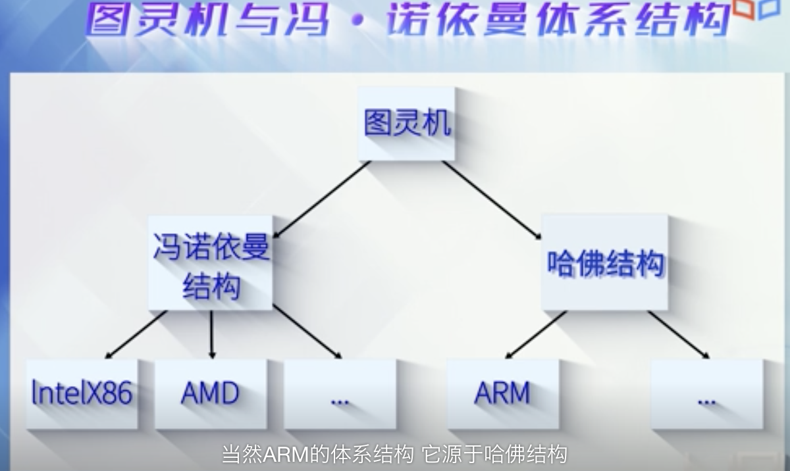

数据连续存储和选择读取思想,是目前我们使用的几乎所有机器运行背后的灵魂

计算机体系结构中的核心问题之一,就是如何有效地进行内存寻址; 内存寻址技术,从某种程度上代表了计算机技术.

 

"段"的引入:

段描述了一块有限的内存区域,区域的起始位置存在专门的寄存器,也就是段寄存器中.

"保护模式"的引入:

访问内存时不能直接从段寄存器中获得段的起始地址,而需经过额外的转化或检查

"黄金时代":

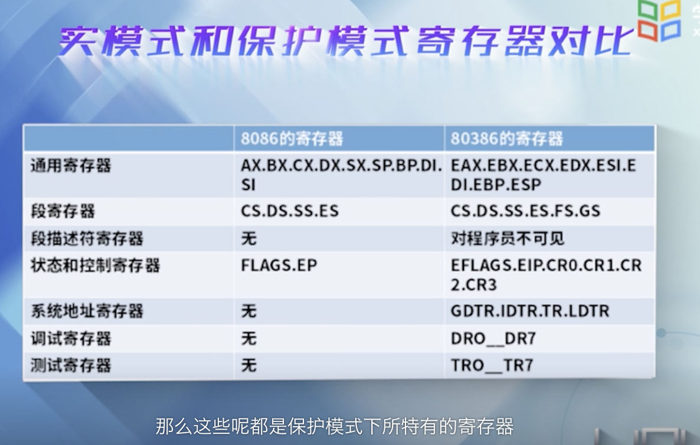

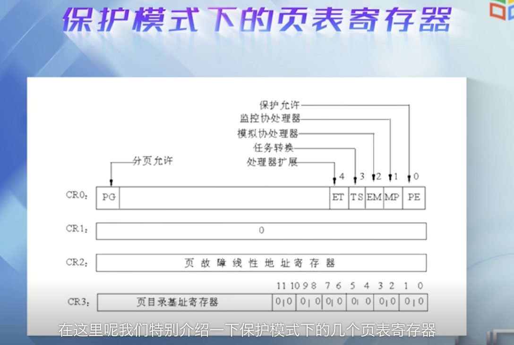

### Linux内核中的C和汇编语言

- 用的GNU的扩展C
- 汇编语言用的是AT&T的汇编格式与Intel的汇编格式稍有差异

在C语言中,也可以嵌入汇编语言,叫做GCC嵌入式汇编

---

 

### 2.2 段机制

**将虚地址转换为线性地址**

[使用readelf和objdump解析目标文件](https://www.jianshu.com/p/863b279c941e)

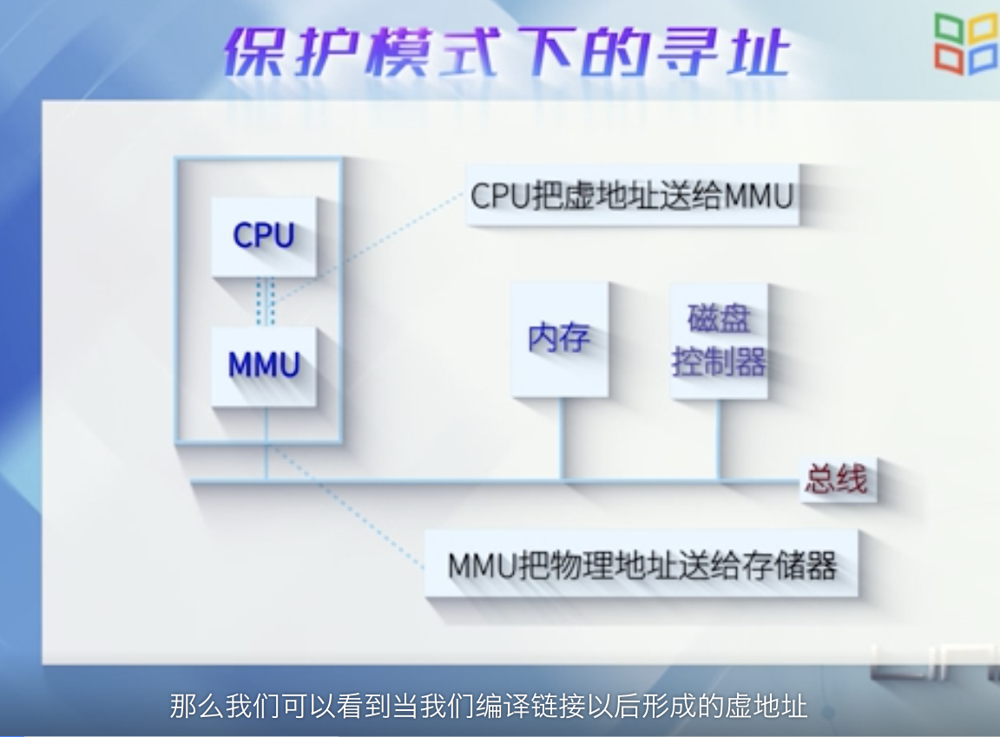

MMU: 内存管理单元,和CPU是在一起的.MMU把虚地址转化成物理地址,送给存储器.

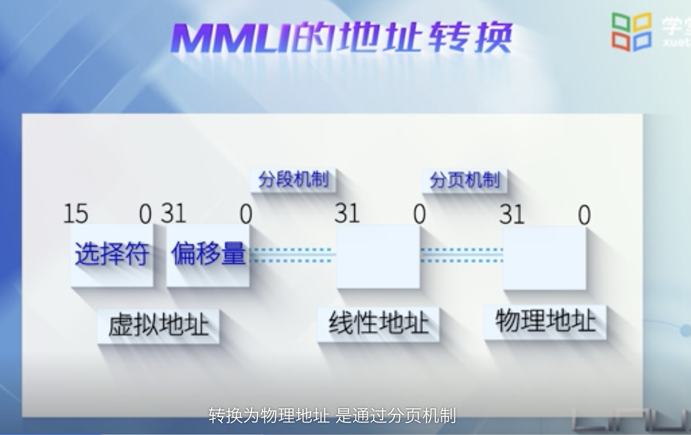

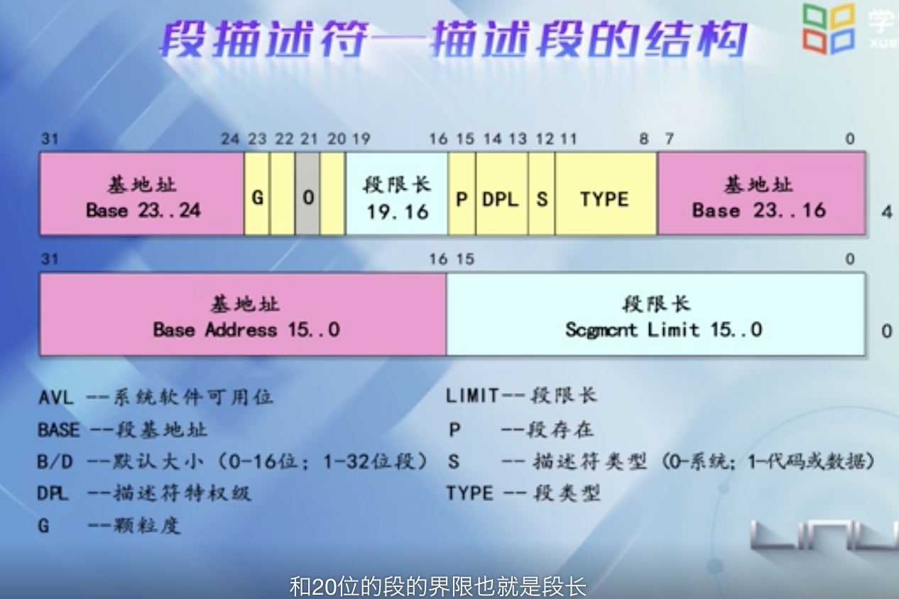

[(Intel)I386的体系结构](http://wwww.kerneltravel.net/journal/ii/part1.htm)

 

---

### 2.3 分页机制

**分页在分段之后进行,其作用是完成从线性地址到物理地址的转换**

必须在保护模式下才能启动分页功能

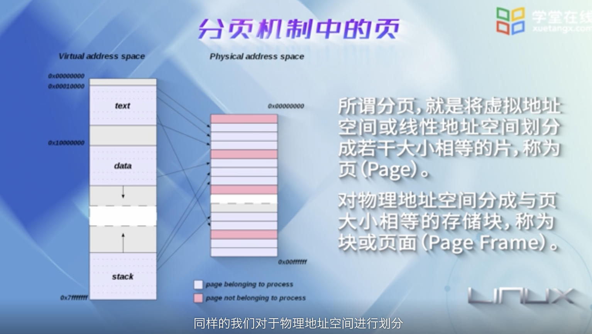

在32位系统上一般默认为4K大小,也可以是2MB或4MB

64位系统上,可以是4KB,8KB,最大可以是256MB

分页使得每个进程可以拥有自己独立的虚拟地址空间

(更多可参考 [为什么 Linux 默认页大小是 4KB](https://draveness.me/whys-the-design-linux-default-page/))

两级页表:

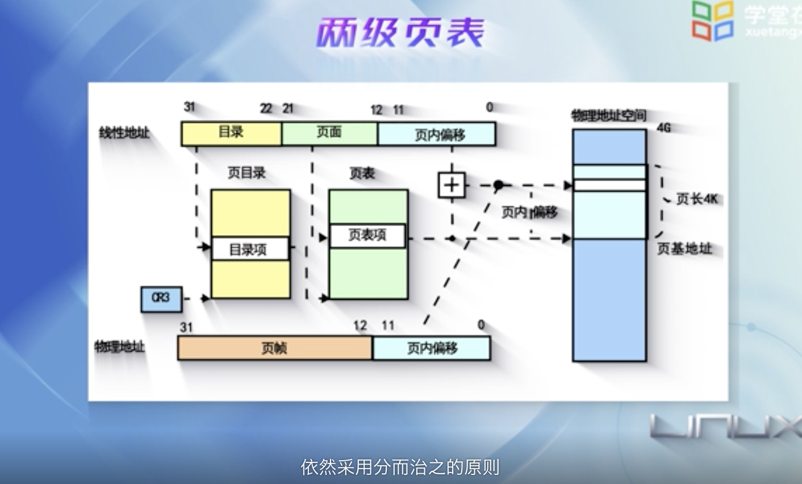

Linux四级分页模式

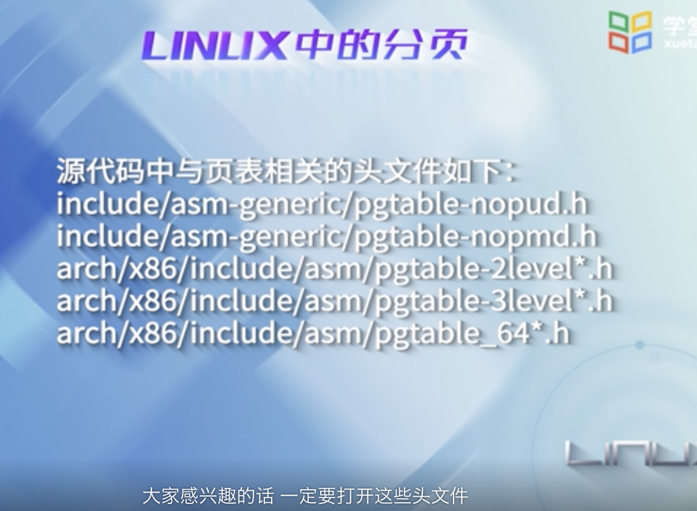

[ I386体系结构（下）](http://wwww.kerneltravel.net/journal/ii/part2.htm)

---

 

### 2.4 动手实践-将虚拟地址转换成物理地址

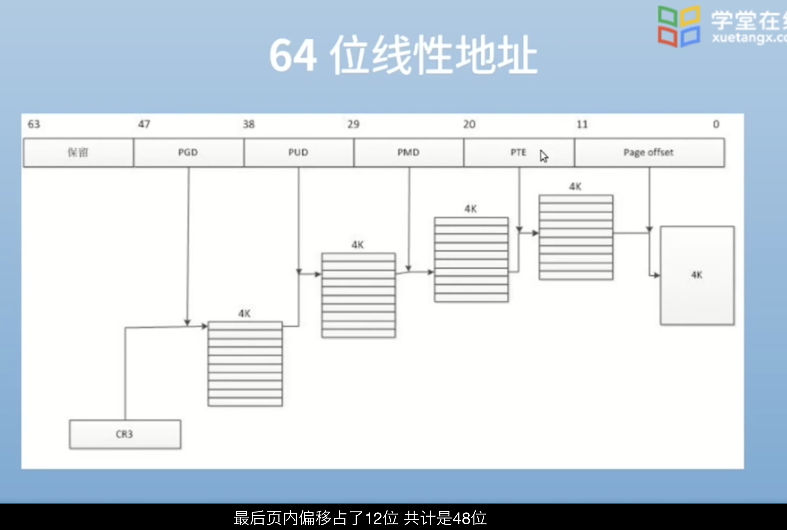

页全局目录

所有的进程都共享一个内核页表

 
最新的CPU已经支持五级页表

64位系统中已经不再用"高级内存"

[mknod命令](https://blog.csdn.net/a1010256340/article/details/83088870)

---

 

### 章节测试:

 

<1>.操作系统启动时，处理器处于保护模式  (错)

 

<2>.X86中段的描述包含基地址和界限 (错)

 

<3>.Intel8086的寻址范围是1MB，80386的寻址范围是 4GB (对)

 

<4>.分页机制是在保护模式下开启的。 (对)

 

<5>.在保护模式下，段的大小可以达到4GB (对)

 

<6>. CR3寄存器存放页目录基地址  (对)

 

<7>.x86的保护模式就是来保护操作系统的  (错)

 

<8>. 分页的原理使得每个进程可以拥有自己独立的虚拟内存空间 (对)

 

<9>. 分Linux之所以巧妙地绕过段机制，主要是因为将段的基址设为0，即偏移量等于线性地址  (对)

 

<10>. 在x86中，启用分页机制是通过启用保护允许位PE而达到的   (错)

 

[x86   保护模式 + 分页管理机制](https://www.cnblogs.com/dongguolei/p/7865381.html)

[开启分页机制———《x86汇编语言：从实模式到保护模式》读书笔记44](https://blog.csdn.net/longintchar/article/details/52198391)

 

<11>. 链接以后形成的地址空间是虚拟地址空间。 (对)

 

<12>. 虚拟地址是程序访问存储器所使用的逻辑地址  ；线性地址是逻辑地址到物理地址变换之间的中间层；物理地址是每一个字节单元的一个唯一的存储器地址  (对)

 

<13>. CPU访问的是虚拟地址。(对)

 

<14>. 80x86的控制寄存机器主要用于分段机制  (错)

 

<15>. 80x86的分段机制是必选的，分页机制是可选的 (对)

但是现实情况不是的,操作系统大多都用了分页机制

 

<16>. 保护模式提供了四个特权级，Linux使用了其中的2个，0级对应内核态，2级对应用户态  (错)

 

> 段被分为了4个特权级，分别为0-3级，有时候我们也叫做ring0-ring3，其中，数值越小特权级越高 
核心代码和数据所在的段的特权级都比较高，一般在ring0，而用户程序所在的段的特权级较低，一般在ring3。当低特权级的任务试图在未被允许的情况下访问高特权级的段时，将会产生常规保护错误。 
而处理器是如何区分所在段的特权级，进而对其进行保护的呢？这就不得不提到CPL、DPL和RPL三者了。但是在开始之前，我们需要先了解一下一致代码段和非一致代码段。

[保护模式特权级概述](https://www.cnblogs.com/tcctw/p/11332551.html)

[操作系统-保护模式中的特权级](https://blog.51cto.com/13475106/2462286)

 

<17>. 页面大小是由操作系统设计者确定的  (错)

 

<18>. 页面高速缓存是一种硬件机制，专门用来支持地址转换的  (对)

[与程序员相关的CPU缓存知识](https://coolshell.cn/articles/20793.html)

 

<19>. intel的保护模式是在80386处理器中首次出现的  (错)

 

<20>. 页目录存放在（ ）中。 D

A.CR0

B.CR1

C.CR2

D.CR3

> 控制寄存器(Control Register)（CR0～CR3）用于控制和确定处理器的操作模式以及当前执行任务的特性。 
CR0中含有控制处理器操作模式和状态的系统控制标志； 
CR1保留不用； 
CR2含有导致页错误的线性地址； 
CR3中含有页目录表物理内存基地址，因此该寄存器也被称为页目录基地址寄存器PDBR（Page-Directory Base address Register）。

[控制寄存器 CR*](https://www.cnblogs.com/coderCaoyu/p/3616055.html)

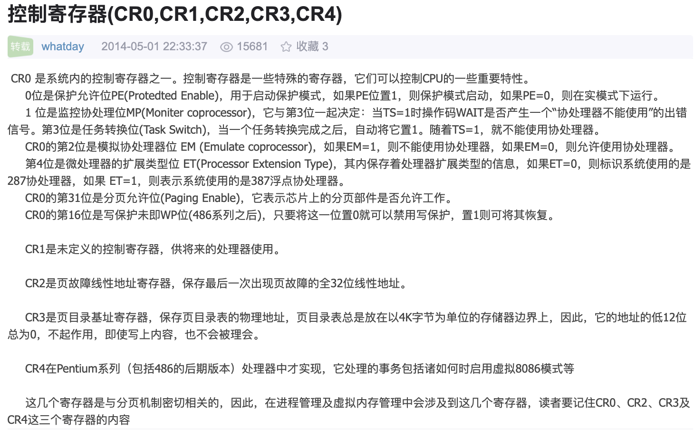

[控制寄存器](https://baike.baidu.com/item/%E6%8E%A7%E5%88%B6%E5%AF%84%E5%AD%98%E5%99%A8/9335215)

 

<21>. 一个32位虚拟地址被分为a、b、c三个域，其中a、b用于一个2级页表系统，c为页内偏移地址，则页面数为（ ）。D

A. a+b

B. a×b

C. 2a×b

D. 2a+b

 

<22>. 以下（ ）处理器不是冯诺伊曼体系(普林斯顿体系)结构   C(属于哈佛体系)

A. Intel X86

B. AMD

C. ARM

D. MIPS

 

<23>. 如下缩写，（ ）是中断描述符表  B

A. GDT

B. IDT

C. LDT

D. RPL

 

[中断描述符表](https://baike.baidu.com/item/%E4%B8%AD%E6%96%AD%E6%8F%8F%E8%BF%B0%E7%AC%A6%E8%A1%A8)

[中断机制和中断描述符表、中断和异常的处理](https://blog.csdn.net/jnu_simba/article/details/11722703)

<23>. “段：偏移量”的形式描述的是（ ） B

A. 物理地址

B. 虚拟地址

C. 线性地址

D. 段地址

[虚拟地址转换与段分割](https://zhuanlan.zhihu.com/p/56172609)

 

