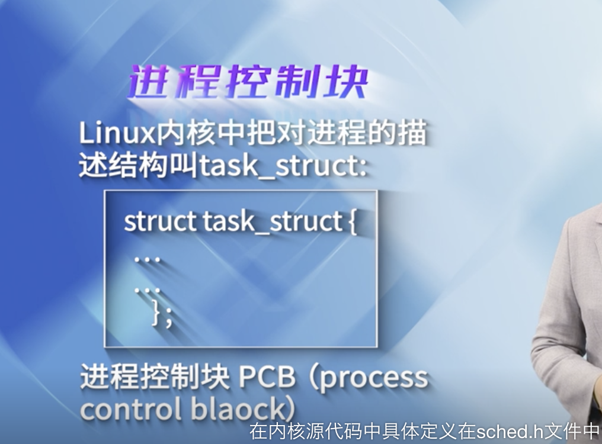
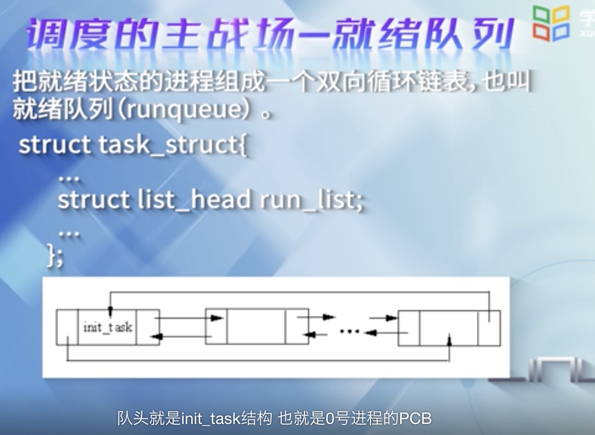
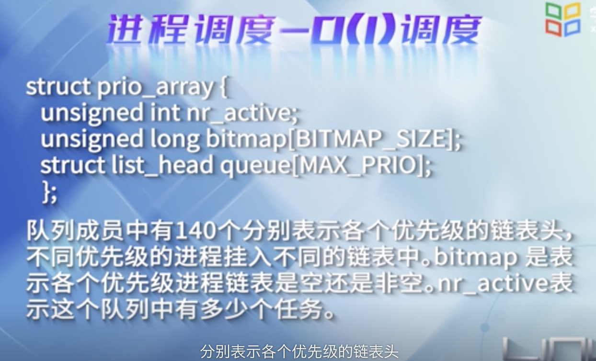

### 3.1 进程概述

一个程序通过**编译器**将其编译成*汇编程序*,经过汇编器将其汇编成目标代码,通过**链接器**形成可执行文件a.out或者elf格式,最后交给操作系统来执行

进程最基本的状态有三种: **就绪态,睡眠态和运行态**,在具体的操作系统中,可能实例化出多个状态.

PCB: Process Control Block

task_struct结构体位于sched.h中

 

对于进程来说,它的静态表现就是程序,平时都安安静静呆在磁盘上,而一旦运行起来,就变成了计算机里的数据和状态的总和; 

运行着的程序就是一个进程.

 

---

### 3.2 Linux进程创建

 

对于**进程,线程,内核线程**,内核使用唯一的数据结构`task_struct`来分别表示,也使用相同的调度算法对其进行调度.

尽管看起来差异很大,但最后都通过do_fork分别创建.

创建进程和创建线程调用了不同的函数,分别为`fork`和`pthread_create`,而对应的系统调用分别为fork和clone.

所有的系统调用进入内核只有一个入口,但进入以后就分道扬镳,各有各的服务历程;而分手是暂时的,最终还是会归到一处,do_fork就是它们的聚合点.

父子进程共享内存的地址空间,但父进程的页表除外

copy_process()函数主要是为子进程创建父进程PCB的副本

 

---

### 3.3 Linux进程调度

 

所谓调度,实际就是从就绪队列中,选择一个进程投入到CPU中运行.

"主战场"是就绪队列,核心是调度算法,实质是进程的切换

O(1)调度: 将单链表变为多链表来实现,从O(n)降低到了O(1)

**机制与策略分离**

**完全公平调度---CFS**,

没有了*时间片*的概念,而是分配CPU使用的比例

同一时刻,一个CPU上运行的进程只能有一个. 当一个进程占用CPU的时候,其他进程必须等待

使用到了**红黑树**

CFS中的就绪队列,就是一棵已*虚拟时间*为键值的红黑树, 虚拟时间越小的进程,越靠近红黑树的左端, 调度器每次选择位于红黑树左端的进程.

更多可参阅<深入理解Linux内核>第三版第七章

[蜗窝科技](http://www.wowotech.net/)

---

 

### 3.4 动手实践-打印进程描述符task_struct中的字段

 

---

### 3.5 工程实践-基于内核模块的负载监控

---

### 章节检测