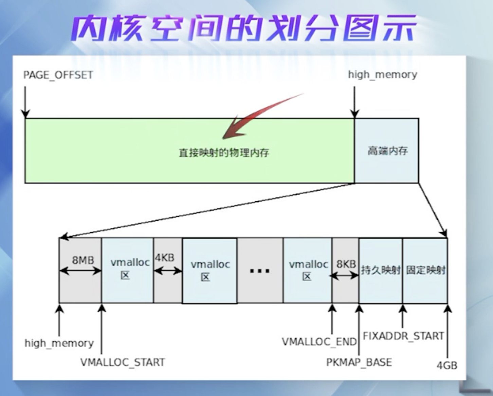

 

### 4.1 Linux内存管理机制

[lscpu](https://blog.csdn.net/chenghuikai/article/details/72832016) 命令, 类似是优化后的 `cat /proc/cpuinfo`

实现虚拟内存的几种机制:

当 程序一旦跑起来,那就变成了一个进程

一个进程的用户地址空间由两个数据结构来描述, `mm_struct`和  `vma_area_struct `,前者对进程整个用户空间进行描述,后者对用户空间的各个内存区进行描述

- 内存映射区(MMR,Memory Mapping Region)

- 虚拟内存区(VMA)

 

对于`mm_struct`,最新版本的内核代码定义在[mm_types.h]这个文件中

 

对于`vma_area_struct `:

`mm_struct`结构是由一个个VMA组成的

参考<深入理解Linux内核>第8,9章

 

---

 

### 4.2 进程用户空间管理机制

 

**写时复制技术**(copy on write)

调用do_mmap()创建一个"虚存区"

虚存区分三种: 私有映射,共享映射,匿名映射

上图显示了该进程 各个区的 起始地址

 

**请页机制**,实现虚存管理的重要手段.

当一个进程运行的时候,CPU访问的是用户空间的虚地址, Linux仅把当前要使用的少量页面装入到内存, 需要时通过**请页机制**将特定的页面调入到内存;当访问的页不在内存时,就产生一个页故障,并报告故障的原因.

如果是编程引起的异常,而且还发生在内核态,那需要毫不含糊地杀死该进程;
如果发生在用户态,说明是一个无效的内存引用,程序要停止执行;
如果是一个真正的缺页引起的异常,而且有合法的权限,这时会进入到缺页异常处理程序

do_page_fault()函数

 

用户进程访问内存 分析:

用户态进程独占 虚拟地址空间,两个进程的虚拟地址空间完全可能是相同的. 在访问用户态虚拟内存空间时,如果没有映射到物理地址,这时就需要通过**请页机制**发出缺页异常的请求, 缺页异常陷入内核,分配物理地址空间,与用户态虚拟地址空间就建立起了映射关系

 

---

 
 

### 4.3 物理内存的 分配与回收机制(上)

 

当我们说一个进程在执行的时候, 我们在说什么呢?

从操作系统角度看,一看进程最关键的特征,是其拥有独立的虚拟地址空间.

"请页机制":可以为进程请求物理内存

malloc()从堆中分配一块内存,并将首地址返回给用户.

"低端内存"和"高端内存"

- 伙伴算法: 负责大块连续物理内存的分配和释放,以*页框*为基本单位. 该机制可以避免外部碎片.

- per-CPU页框高速缓存: 内核经常请求和释放单个页框,该缓存包含预先分配的页框,用于满足本地CPU发出的单一页框请求.

- slab缓存: 服务小块物理内存的分配,并且它也作为高速缓存,主要针对内核中经常分配并释放的对象.

- vmalloc机制: 使得内核通过连续的线性地址来访问非连续的物理页框,这样可以最大限度的使用高端物理内存.

 

**slab分配机制 -- 分配小块内存**

 

---

**内核空间非连续内存区的分配**

 

最后都要调用"伙伴算法"

 

参考<深入理解Linux内核>第三版第八章

 

**思考:**

1. 用户空间(进程)是否有高端内存概念?

2. 64位 内核中有高端内存的说法吗?

3. 在32位和64位系统上,用户进程能访问多少物理内存? 内核代码能访问多少物理内存?

---

 
 

### 4.4 物理内存的 分配与回收机制(下)

 

[UMA架构与NUMA架构下的自旋锁（CLH锁与MCS锁）](https://mp.weixin.qq.com/s?src=11&timestamp=1590451729&ver=2361&signature=8ZNuxz757STL8jvZm*5LhO-B0Wr81r0*wZvytvon*elE9FhXBTTMmpmY1EhMXE-Qmyza3fNTwrYkDlPKYoqfQTaEvPkDpr78RcvbCFgCwZEG0TSFZu3yZTUhlxK32Uw7&new=1)

[Linux内核学习笔记：SMP、UMA、NUMA](https://blog.csdn.net/tiangwan2011/article/details/7298785)

[NUMA 的结构比 SMP 的结构更有优势，为什么现在的电脑不用 NUMA 的结构呢？](https://www.zhihu.com/question/19908227)

 

 

**从用户态到内核态的内存分配:**

 

当用户程序通过系统调用,申请内存时,首先陷入内核,建立虚拟地址空间的映射,获得一块虚拟内存区VMA. 当进程对这块虚存区进行访问时,如果物理内存尚未分配,此时发生一个缺页异常,通过getfreepage申请一个或者多个物理页面,并将此物理内存和虚拟内存的映射关系写入页表.

 

**思考:**

在物理内存为1G的计算机中,能否malloc(1.6G)? 为什么?

---

 
 

### 4.5 动手实践-Linux内存映射基础(上)

 

---

 
 

### 4.6 动手实践-Linux内存映射实现(中)

 

---

 
 

### 4.7 动手实践-Linux内存映射测试(下)

 

---

