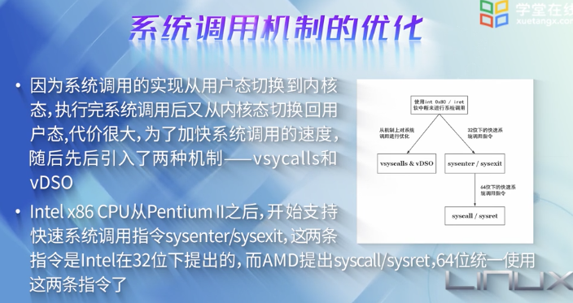

 

### 6.1 Linux中的各种API

 

LSB (Linux Standards Base)

POSIX: 可移植操作系统接口(Portable Operating System Interface of UNIX)

Linux ABI:

(为了兼容)

 

**内核API:**

主要是内核中标记为"EXPORT_SYMBOL"的函数

 

**思考:**

保持一个稳定的ABI和保持一个稳定的API相比,谁更困难,为什么?

---

 
 

### 6.2 系统调用机制

 

系统调用---内核的出口

各种工具:

如 strace ls,就可以看到ls命令所调用的系统调用

中断是异步的,异常是同步的,系统调用既可以是同步,也可以是异步

系统调用号存放在eax寄存器中, 其实现所在的源文件也不在一起.

参数存放在寄存器中,一般参数不超过6个

参考:

[系统调用](http://wwww.kerneltravel.net/journal/iv/syscall.htm)

[Linux内核之旅-电子杂志](http://wwww.kerneltravel.net/?id=2)

---

 
 

### 6.3 动手实践-添加系统调用

 

**(系统调用的实例--日志收集系统)**

