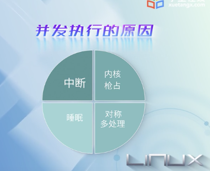

 

### 7.1 Linux同步概述

 

竞态条件,也称竞争条件,race condition

临界区

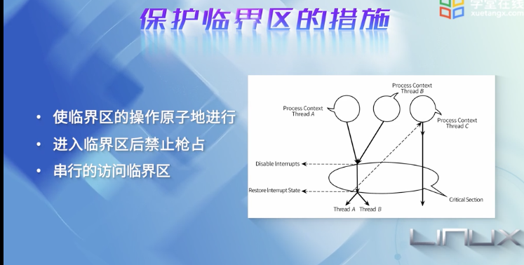

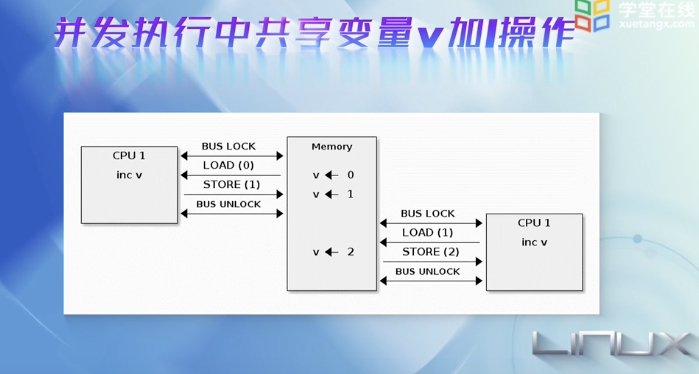

原子操作,Linux专门有一个atomic_t结构体

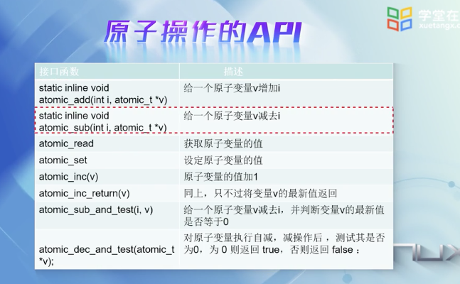

问题:

在多核系统中遇到原子操作,在系统层面上原子操作还是原子的吗?在核级还是原子的吗?

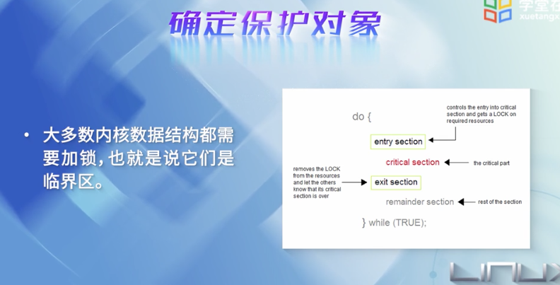

死锁:所有的任务都在相互等待,但他们永远不会释放已占有的资源,于是任何任务都无法继续执行

死锁的避免: 加锁的顺序是关键

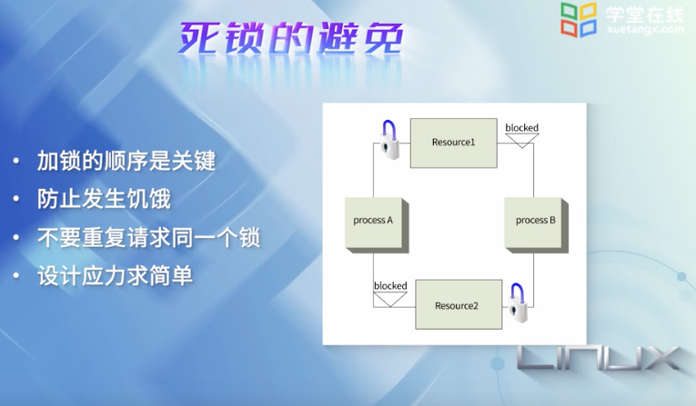

 

**思考:**

死锁是一种小概率事件还是大概率事件?如果内核出现死锁,该如何应对?

---

 
 

### 7.2 内核同步机制

 

原子操作已经讲过.

中断屏蔽:

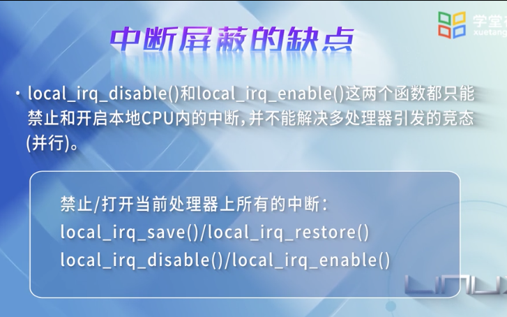

 

自旋锁:(spin lock)

专为多处理器并发而引入的一种锁,在内核中大量应用于中断处理部分

在短期时间内,进行轻量级的锁定 

同一时刻,只能为一个处理器所持有, 防止多处理器并发访问临界区,防止内核抢占造成的竞争

 

信号量:

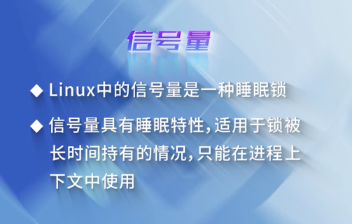

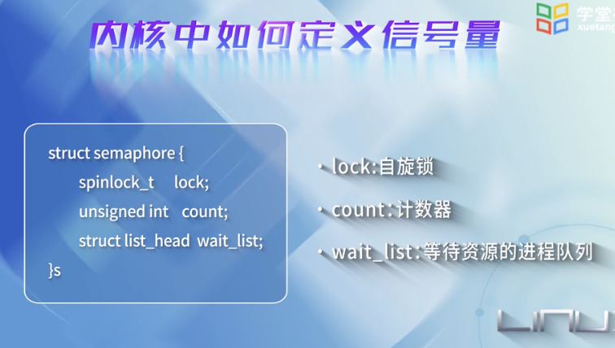

P/V操作

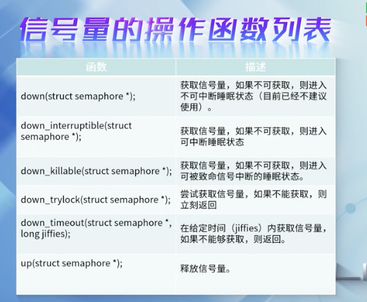

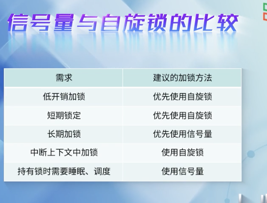
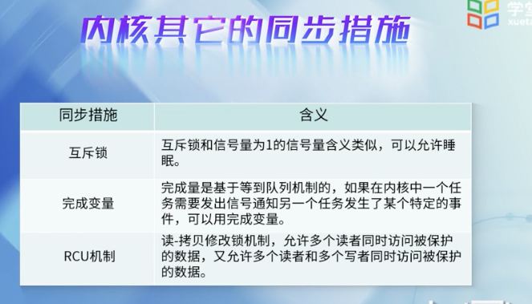

经典实例: 生产者-消费者并发实例

 

参考:

[内核中的调度与同步](http://wwww.kerneltravel.net/journal/vi/syn.htm)

---

 
 

### 7.3 动手实践-内核多任务并发实例(上)

 

---

 
 

### 7.4 动手实践-内核多任务并发实例(下)

 