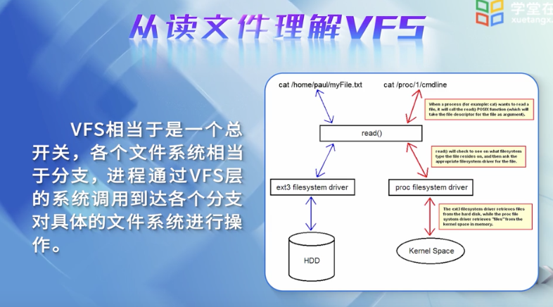
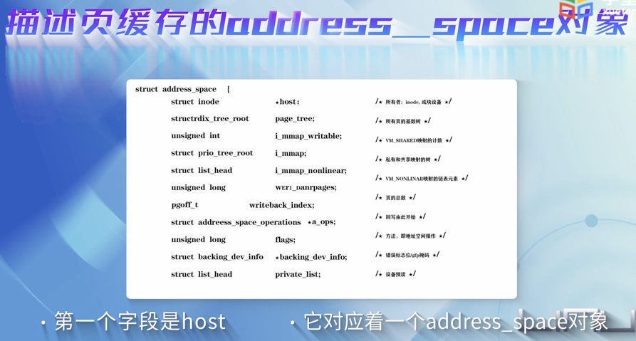

 

### 8.1 虚拟文件系统的引入

 

Linux文件系统中最重要的一个概念: **索引节点 Inode**

文件系统是具体到分区的,所以不同分区格式化时,可以是不同的文件系统类型

ext2,ext3,ext4是Linux的标准文件系统,系统将其磁盘分区作为系统的根文件系统; 除此以外的文件系统则安装在根目录系统下的某个目录中,称为系统树形结构中的一个分支.

 

VFS中的"S"是"switch"开关,而不是"system"

 

**思考:**

虚拟文件系统VFS与实际文件系统到底是什么关系?

 

---

 
 

### 8.2 虚拟文件系统(VFS)中的主要数据结构

 

 

本讲介绍了文件系统的四种对象,每个对象都对应有两个数据结构,即对象的属性和其操作方法,这是面向对象思想在文件系统设计中的一种体现.

 

**思考:**

给定一个文件名,通过文件系统的数据结构关系图,如何查找到相关的文件?请初步阅读open源代码.

---

 
 

### 8.3 虚拟文件系统(VFS)中的各种缓存

 

在文件系统中,有四种类型的缓冲区

cat /proc/meminfo

 

dcache用于把路径转换为索引节点(Inode)

inode cache用于表示文件系统中的文件或目录

 

打开文件的核心是"查找"

1. 查找根目录信息

2. 循环查找路径名后续分量

 

 

 HashTable和LRU
 

 

Buffer Cache也用到了LRU

 

 

**思考:**

给定一个文件名,如何查找到相关的文件?继续阅读open的源代码,并说明缓冲区到底起什么作用

---

 
 

### 8.4 页高速缓存机制以及读写

 

大小是2的n次方个扇区,如1k,2k,4k,4M等

 

延迟写技术

 

**思考:**

请分析从一个文件读取数据的过程,page cache到底起什么作用?

 

---

 
 

### 8.5 动手实践-编写一个文件系统(上)

 

---

 
 

### 8.6 动手实践-编写一个文件系统(中)

 

---

 
 

### 8.7 动手实践-编写一个文件系统(下)

 