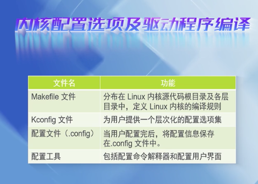
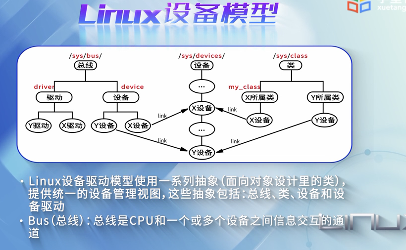
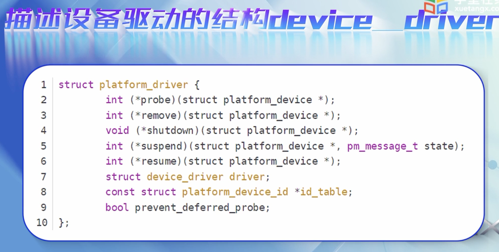
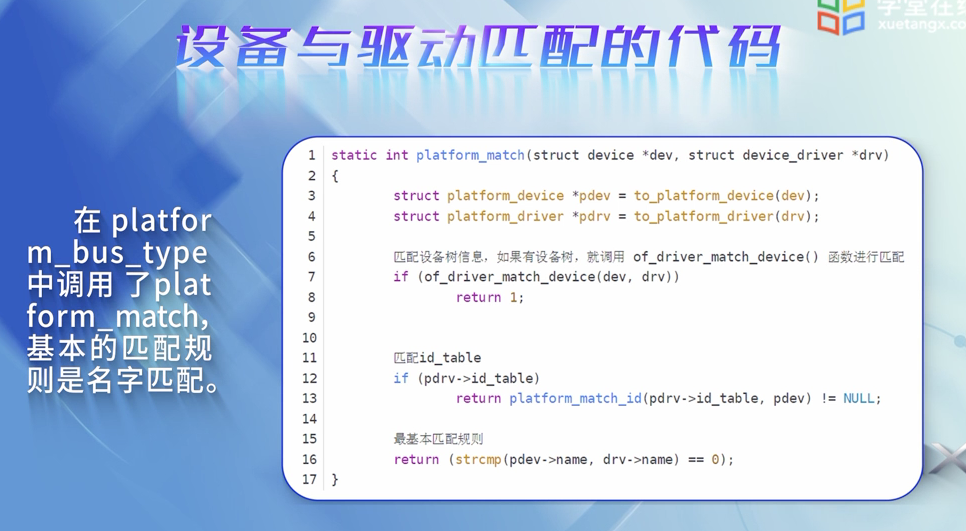

 

### 9.1 设备驱动概述

 

因为UNIX/Linux一切皆文件,所以也将`设备`纳入文件管理体系下

Linux将设备分为三大类,一类是像磁盘那样,以块或扇区为单位,成块进行输入输出的设备,称为`块设备`;

另一类像键盘那样,以字符为单位,进行输入/输出,称为`字符设备`;

还有一类,是`网络设备`,与前两者有很大不同 `----`块设备和字符设备对应/dev下的一个设备文件,而网络设备不存在这样的设备文件,采用套接字socket来访问.

文件系统通常都建立在块设备上,也有部分放在内存,如proc文件系统,则不需要驱动程序.

 

建立设备文件的两种方式:

Linux内核分为五大部分:

- 进程管理
- 内存管理
- 文件系统管理
- 设备管理
- 网络管理

每一部分都有承上启下的作用.

 

**思考:**

应用程序以什么形式访问各种硬件设备?为什么采用这种方式?

---

 
 

### 9.2 IO空间的管理

 

设备控制器:

I/O内存和I/O端口

 

**思考:**

内核对I/O资源的管理为什么采用树结构?

---

 
 

### 9.3 设备驱动模型

 

Linux支持世界上几乎所有不同功能的硬件设备,导致Linux内核中有一半的代码是设备驱动,且随着硬件的快速升级迭代,设备驱动的代码量也快速增长..为了降低设备多样性带来的Linux驱动开发的复杂度,以及设备热插拔处理,电源管理等,Linux提出了设备模型(Driver Model)

(2.x只有200多M,现在5.x版接近3G)

Sys文件系统,是一个类似proc文件系统的特殊的文件系统

地位相当于面向对象中的总基类

---

 

机制与策略分离:

 

**设备与驱动 匹配的过程**

设备和驱动是男女方,红娘相当于总线, 进行撮合

 

**思考:**

platform平台模型的优势是什么?

---

 
 

### 9.4 字符设备驱动程序简介

 

只能一个字节一个字节进行读写操作的设备,不能随机读取设备中的某个设备,必须按照先后次序来进行, 字符设备是面向流的设备.常见的字符设备有鼠标,键盘等

[Linux字符设备驱动](https://www.cnblogs.com/chen-farsight/p/6155518.html)

 

**思考:**

从原理上说明file_operations操作方法集,为什么说它是定义了字符设备提供给VFS的接口函数?

---

 
 

### 9.5 块设备驱动程序简介

 

字符设备与块设备的区别:

 

I/O调度:

希望磁头总能往一个方向移动,到底了再向另一个方向移动. 电梯调度算法

第三种调度算法常用于数据库.第四种是内核默认的调度算法.

 

**块和扇区的关系:**

扇区是磁盘读写的基本单位,是磁盘上最小的操作单位,是文件系统和块设备之间传送数据的单位.

一般一个扇区的大小是512字节,但如果是SSD,则为4096个字节.

当一个扇区的大小超过512字节时,需要将多个内核扇区对应一个设备扇区.

[Linux块设备IO子系统(一) _驱动模型](https://www.cnblogs.com/xiaojiang1025/p/6500557.html)

[linux内核之块设备驱动图解](https://my.oschina.net/fileoptions/blog/951759)

**思考:**

从虚拟文件系统到硬件,为什么要对块设备进行分层管理?

---

 
 

### 9.6 动手实践-编写字符设备驱动程序

 

---

 
 

### 9.7 工程实践-编写块设备驱动的基础(上)

 

---

 
 

### 9.7 工程实践-块设备驱动程序分析(中)

 

---

 
 

### 9.7 工程实践-块设备驱动程序实现(下)

 
