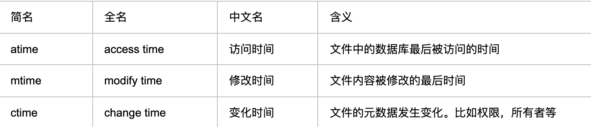

使用Go操作文件，根据创建时间(或修改时间)进行不同处理。

在Mac上，文件相关的结构体字段在[syscall/ztypes_darwin_arm64.go]()下的`Stat_t`:

<br>

```go
type Stat_t struct {
	Dev           int32
	Mode          uint16
	Nlink         uint16
	Ino           uint64
	Uid           uint32
	Gid           uint32
	Rdev          int32
	Pad_cgo_0     [4]byte
	Atimespec     Timespec
	Mtimespec     Timespec
	Ctimespec     Timespec
	Birthtimespec Timespec
	Size          int64
	Blocks        int64
	Blksize       int32
	Flags         uint32
	Gen           uint32
	Lspare        int32
	Qspare        [2]int64
}
```

<br>

时间相关的有四个字段，即Atimespec、Mtimespec、Ctimespec和Birthtimespec。根据以下代码：

```go
package main

import (
	"fmt"
	"github.com/pkg/errors"
	"os"
	"syscall"
	"time"
)

func main() {
	file, err := os.Stat("/Users/fliter/blog")
	if err != nil && errors.Is(err, os.ErrNotExist) {
		fmt.Println("文件确实不存在，err is:", err)
		//创建多级目录
		//os.MkdirAll("/Users/fliter/blog", os.ModePerm)
	}

	stat_t := file.Sys().(*syscall.Stat_t)

	fmt.Println(stat_t)
	fmt.Println(timespecToTime(stat_t.Atimespec))     // 访问时间
	fmt.Println(timespecToTime(stat_t.Ctimespec))     // 修改时间
	fmt.Println(timespecToTime(stat_t.Mtimespec))     // 修改时间
	fmt.Println(timespecToTime(stat_t.Birthtimespec)) // 创建时间

}

func timespecToTime(ts syscall.Timespec) time.Time {
	return time.Unix(ts.Sec, ts.Nsec)
}
```

<br>

创建时间并不是Ctimespec，而是Birthtimespec。


Ctimespec和Mtimespec似乎都是*修改时间*？？

<br>


 这就涉及到UNIX/Linux操作系统中，文件相关的三个time`---`atime,mtime,ctime





 mtime是指文件内容被最后一次修改的时间,ctime则指文件的元数据(如权限，所有者等)最后一次被修改的时间

 <br>


 在Linux中,可以通过[stat](https://www.runoob.com/linux/linux-comm-stat.html)命令查看

 <br>

 更多测试&验证相关，可参考[此文](https://www.cnblogs.com/zhaojiedi1992/p/zhaojiedi_linux_031_linuxtime.html)
