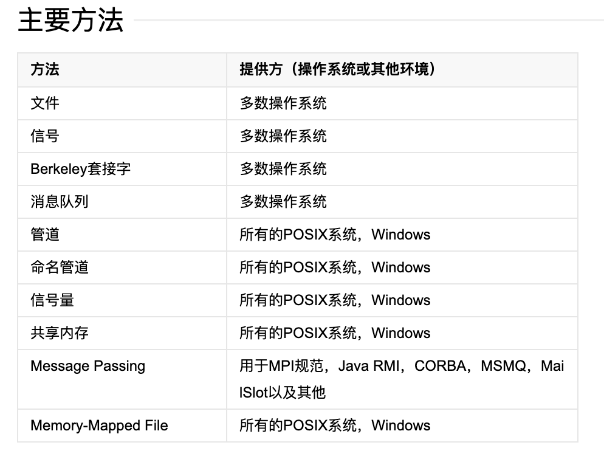
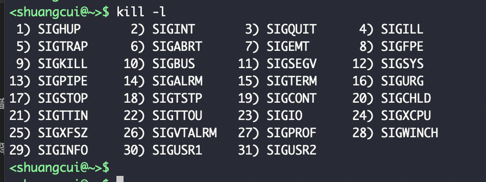
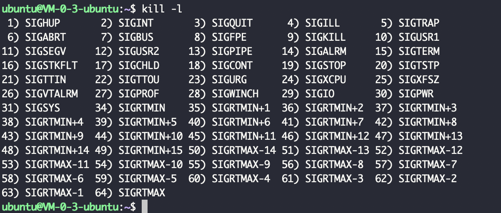

### 概述:

 

> 进程间通信（IPC，Inter-Process Communication），指至少两个进程或线程间传送数据或信号的一些技术或方法。进程是计算机系统分配资源的最小单位(进程是分配资源最小的单位，而线程是调度的最小单位，线程共用进程资源)。每个进程都有自己的一部分独立的系统资源，彼此是隔离的。为了能使不同的进程互相访问资源并进行协调工作，才有了进程间通信。

 

---

### 主要方法:

 

#### **管道:**

分为两种,

软管道: 如 ps -ef | grep xxxx,

硬管道: 

 

####  **消息队列:**

内核创建一个消息队列,操作系统中的多个进程都可以操作这个消息队列.可以向其发送消息,也可从中接收消息.

 

####  **共享内存:**

每个进程都有一个虚拟内存地址和物理内存地址的映射,一般两个进程的映射的物理内存地址是不同的,共享内存即是将其映射的物理内存地址变成一样的.这样两个进程就可以访问相同的物理内存,也就可以实现进程之间的通信.

 

####  **套接字:**

非常常见,如通过3306端口访问某个远程mysql服务, 我访问mysql的这个进程,和远程的这个mysql服务的进程之间的通信,就是通过3306端口创建的TCP的套接字.

如果是访问本机的mysql服务,则不会走TCP套接字,而是走Linux底层的套接字

 

####  **信号量:**

类似一个计数器.控制多个进程对一个共享资源的访问.

 

####  **信号:**

一个进程可以向另一个进程发送一个信号.通过`kill -l`指令可以列出所有的信号

(64种死法...)

Linux中的信号 大多数作用是把一个进程杀死,于是叫kill了..

 

当`tail -f  xxx文件`时,是会一直是阻塞. 如何结束? 一般会按`ctrl+c`,

其实该命令就是当前的shell(`$$`可以看到当前shell的pid),向`tail -f`进程发送了一个信号,该信号值是2,即**SIGINT**

 

`kill -9 pid`, 9号信号是SIGKILL.

如果不加,则默认15号信号`SIGTERM`(即Terminal)

 

9号信号即kill信号是不能被捕捉的,必须强制停止. 其他信号可以在程序中捕捉到.

 

ctrl+c : SIGINT

kill不带参数: SIGTERM

KILL -9: SIGKILL

 

---

各个编号的含义,可参见 
[linux kill -l 信号列表](https://www.cnblogs.com/xiao0913/p/11846212.html)