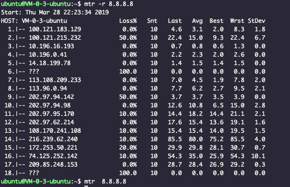

- Mac使用此命令需先安装,推荐使用`brew install mtr`
 

- 如下使用该命令测试到谷歌 DNS服务器 的连通性

 

 

+ 具体含义:
    + 第一列:显示的是IP地址，这点和traceroute很像
    + 第二列:是显示的每个对应IP的丢包率
    + 第三列:Snt:10 设置每秒发送数据包的数量，默认值是10, 可以通过参数 -c来指定。其中-c+是：–report-cycles COUNT
    + 第四列:显示的最近一次的返回时延
    + 第五列:平均值 ,发送ping包的平均时延
    + 第六列:是最好或者说是延迟最短的
    + 第七列:是最差或者说是延迟最长的
    + 第八列:是标准偏差

