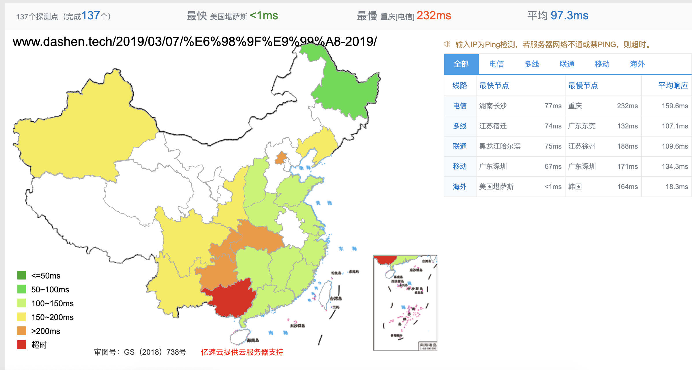

打开页面较慢,体验较差,考虑优化;

分析一下,现阶段慢的原因主要有两个,一是部署在github,服务器在美国,国内访问较慢;二则是没有做动静分离,静态资源加速,某些图片较多的文章,加载完成十分缓慢;

对于问题一,先是考虑用国内提供`pages`服务的网站,如码云和coding;但折腾半天发现二者都很坑,码云想要使用自己域名,需要支付每年99元的费用;和腾讯云深度合作的coing,免费版则对单项目的大小有严苛限制

最后想到,自己有国内服务器,为什么不自己部署呢?

研究了一下hexo,大概在执行hexo g时,将你用markdown书写的内容,转换为html;而查看.gitignore得知,大多数目录都被忽略,最终"转换"好并传到github的是public目录下的文件,该目录下index.html即主入口文件.

搞清楚了这些,剩下的也就不困难了. nginx加几行配置,阿里云域名解析加条记录,稍加测试,确实(在国内访问)速度快好多;

但这样有个问题,每次在本地执行hexo g && hexo d后,github上的代码为最新,但我的cvm服务器还需要git pull;写一个脚本如cvmpull.sh(并加入.gitignore).只需简单两行,登录服务器pull代码,记得给该脚本配置权限.下次写完再要发布时,执行`hexo g && hexo d && ./cvmpull.sh` 解决~

再下一步,就是去解决图片过多加载慢的问题~

