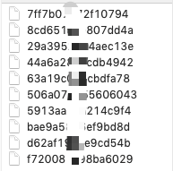
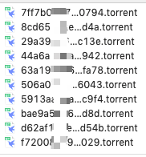
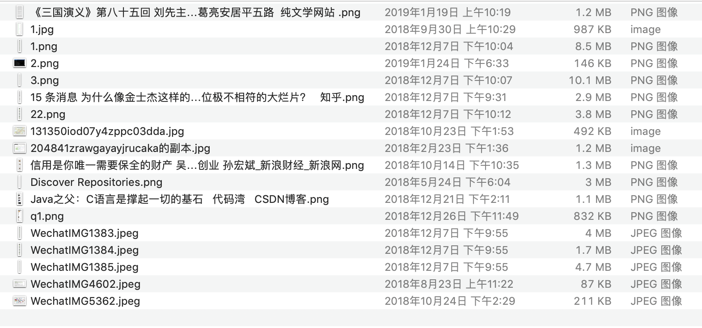
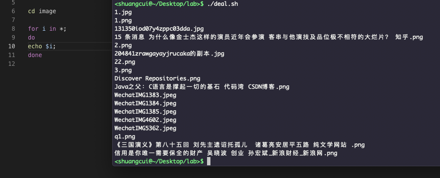
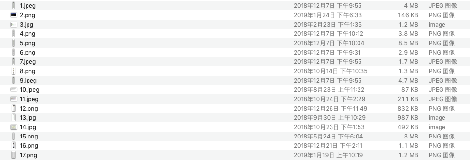
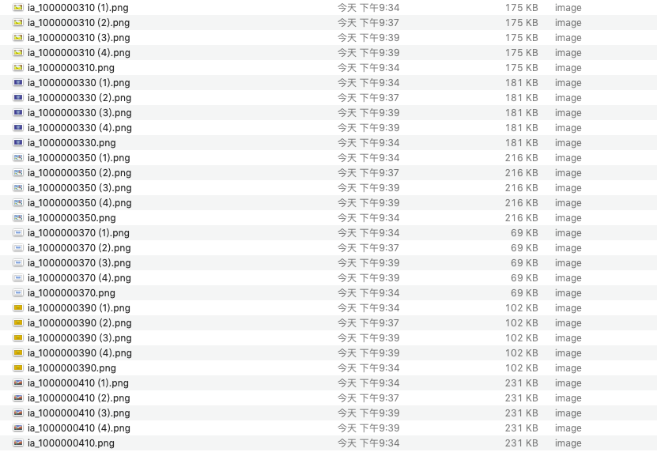
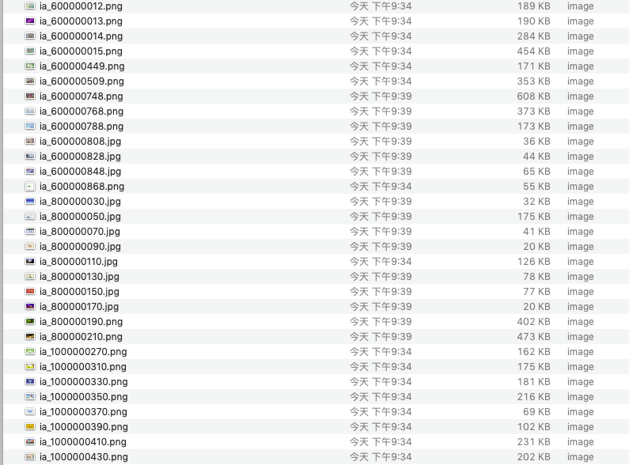

#### 场景一



给这些文件都加上`.torrent`后缀


```php
#!/bin/bash
for i in *;
do
mv "$i" "$i.torrent";
done 
```




---

#### 场景二

给某些文件按某种规则重命名,如按照1,2,3,4..命名,保留原格式




```php
cd image

declare -i j=1 
for i in * ;
do 
#echo $i; 
x=${i##*.}
#echo $j.$x
mv "$i" "$j.$x";
j+=1

done

```


注:
- [Shell中实现整数自增的几种方法示例](https://www.jb51.net/article/121268.htm),此处用于声明是数字类型的`declare -i`必须添加,否则会认为是字符串;必须j+=1,而不能用j++,否则结果会为拼接字符串

- [shell获取文件扩展名](https://blog.csdn.net/RonnyJiang/article/details/52386121)


---

#### 场景三

删除某些重复文件;如下图,想将所有带(x)的全部删掉



```php
#!/bin/bash
for i in * ;
do
#echo ${i:1:2}; #最常用的字符串截取方法,输出前两个字符
if [[ $i =~ '(' ]]
then
    echo $i;
    rm "$i";

    #如果用rm $i会分为两部分:
    #ia_800000110 (2).jpg
    #rm: ia_800000110: No such file or directory
    #rm: (2).jpg: No such file or directory
fi
done

```




参考:

[Shell判断字符串是否包含小结](https://blog.csdn.net/primeprime/article/details/79625306)

[Shell处理带空格的文件名的方法](https://www.jb51.net/article/50640.htm)

[shell 如何判断某个文件名以某个字符开头](https://blog.csdn.net/dingxy/article/details/2233665)


