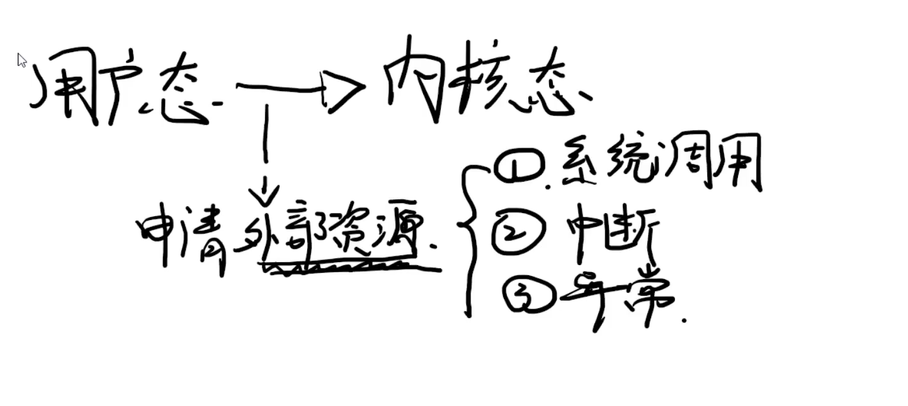
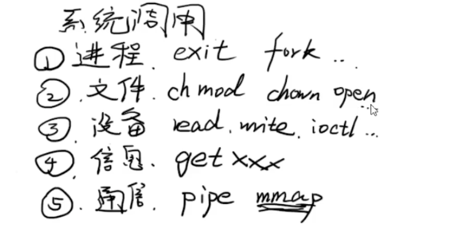
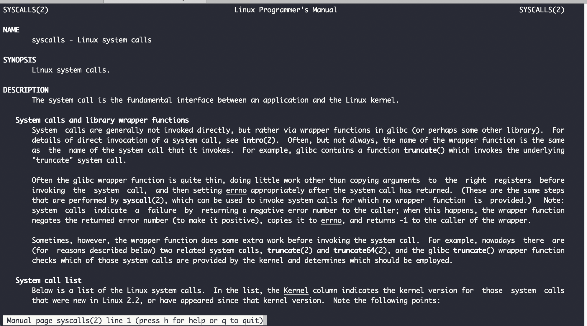
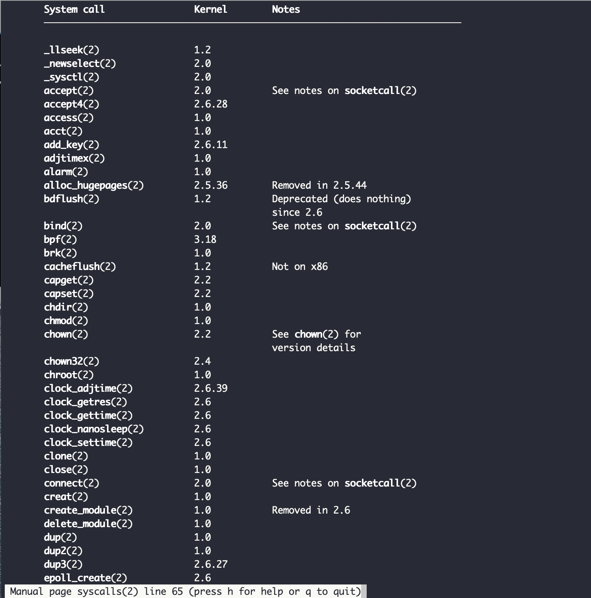

### 概述

有三种方式,可以触发`用户态`到`内核态`的切换,即

**系统调用**, **中断**,**异常**,

其中*系统调用*最为常见,*中断*和*异常*有很多相似之处





如读写文件,就会触发从`用户态`到`内核态`,会进行一个系统调用.

如申请内存,malloc命令后面有系统调用,即brk和mmap


<br>

---


<br>

### 系统调用:

分为五大类型



<br>


- 进程:

进程控制相关.

- 文件

- 设备

- 信息

如获取当前cpu,操作系统的信息

- 通信

如进程间的通信(如pipe,即管道符|)


<br>

`man syscalls`查看所有系统调用






```go
SYSCALLS(2)                                             Linux Programmer's Manual                                            SYSCALLS(2)

NAME
       syscalls - Linux system calls

SYNOPSIS
       Linux system calls.

DESCRIPTION
       The system call is the fundamental interface between an application and the Linux kernel.

   System calls and library wrapper functions
       System  calls are generally not invoked directly, but rather via wrapper functions in glibc (or perhaps some other library).  For
       details of direct invocation of a system call, see intro(2).  Often, but not always, the name of the wrapper function is the same
       as  the  name of the system call that it invokes.  For example, glibc contains a function truncate() which invokes the underlying
       "truncate" system call.

       Often the glibc wrapper function is quite thin, doing little work other than copying arguments  to  the  right  registers  before
       invoking  the  system  call,  and then setting errno appropriately after the system call has returned.  (These are the same steps
       that are performed by syscall(2), which can be used to invoke system calls for which no wrapper  function  is  provided.)   Note:
       system  calls  indicate  a  failure  by  returning a negative error number to the caller; when this happens, the wrapper function
       negates the returned error number (to make it positive), copies it to errno, and returns -1 to the caller of the wrapper.

       Sometimes, however, the wrapper function does some extra work before invoking the system call.  For example, nowadays  there  are
       (for  reasons described below) two related system calls, truncate(2) and truncate64(2), and the glibc truncate() wrapper function
       checks which of those system calls are provided by the kernel and determines which should be employed.

   System call list
       Below is a list of the Linux system calls.  In the list, the Kernel column indicates the kernel version for  those  system  calls
       that were new in Linux 2.2, or have appeared since that kernel version.  Note the following points:

       *  Where no kernel version is indicated, the system call appeared in kernel 1.0 or earlier.

       *  Where a system call is marked "1.2" this means the system call probably appeared in a 1.1.x kernel version, and first appeared
          in a stable kernel with 1.2.  (Development of the 1.2 kernel was initiated from a branch of kernel 1.0.6 via the 1.1.x  unsta‐
          ble kernel series.)

       *  Where a system call is marked "2.0" this means the system call probably appeared in a 1.3.x kernel version, and first appeared
          in a stable kernel with 2.0.  (Development of the 2.0 kernel was initiated from a branch of  kernel  1.2.x,  somewhere  around
          1.2.10, via the 1.3.x unstable kernel series.)

       *  Where a system call is marked "2.2" this means the system call probably appeared in a 2.1.x kernel version, and first appeared
          in a stable kernel with 2.2.0.  (Development of the 2.2 kernel was initiated from a branch of  kernel  2.0.21  via  the  2.1.x
```

---


<br>


### 中断:


<br>


---


### 异常:


<br>


---


<br>


**用户态与内核态切换,与cpu上下文切换的关系**

> [上下文切换](https://baike.baidu.com/item/%E4%B8%8A%E4%B8%8B%E6%96%87%E5%88%87%E6%8D%A2) 指的是内核（操作系统的核心）在CPU上对进程或者线程进行切换。上下文切换过程中的信息被保存在进程控制块（PCB-Process Control Block）中。PCB又被称作切换桢（SwitchFrame）。上下文切换的信息会一直被保存在CPU的内存中，直到被再次使用。


上下文的切换流程如下 
（1）挂起一个进程，将这个进程在CPU中的状态（上下文信息）存储于内存的PCB中。 
（2）在PCB中检索下一个进程的上下文并将其在CPU的寄存器中恢复。  
（3）跳转到程序计数器所指向的位置（即跳转到进程被中断时的代码行）并恢复该进程。 


时间片轮转方式使多个任务在同一CPU上的执行有了可能。

<br>

引起线程上下文切换的原因如下:
（1）当前正在执行的任务完成，系统的CPU正常调度下一个任务。
（2）当前正在执行的任务遇到I/O等阻塞操作，调度器挂起此任务，继续调度下一个任务。
（3）多个任务并发抢占锁资源，当前任务没有抢到锁资源，被调度器挂起，继续调度下一个任务。
（4）用户的代码挂起当前任务，比如线程执行sleep方法，让出CPU。
（5）硬件中断。

<br>


参考:


[为什么内核态和用户态的切换损耗要大于多线程上下文切换的损耗？](https://www.jianshu.com/p/5028573f1ab5)


> 多线程上下文切换的主要损耗:<br>多线程的上下文切换不需要更新虚拟内存，而且**只有一次cpu上下文切换**


> 内核态和用户态切换主要损耗:<br>
从用户态切换到内核态，需要通过系统调用的方式(也可以是异常/中断)。该过程也是有CPU上下文切换的：切换时，先保存CPU寄存器中用户态的指令位置，再重新更新为内核指令的位置。当系统调用结束时，CPU寄存器恢复到原来保存的用户态。**一次系统调用，发生了两次CPU上下文切换**


<br>

[为什么系统调用会消耗较多资源](https://draveness.me/whys-the-design-syscall-overhead/)