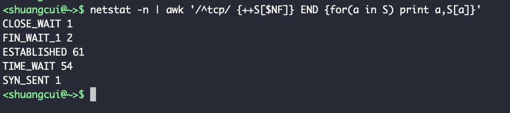
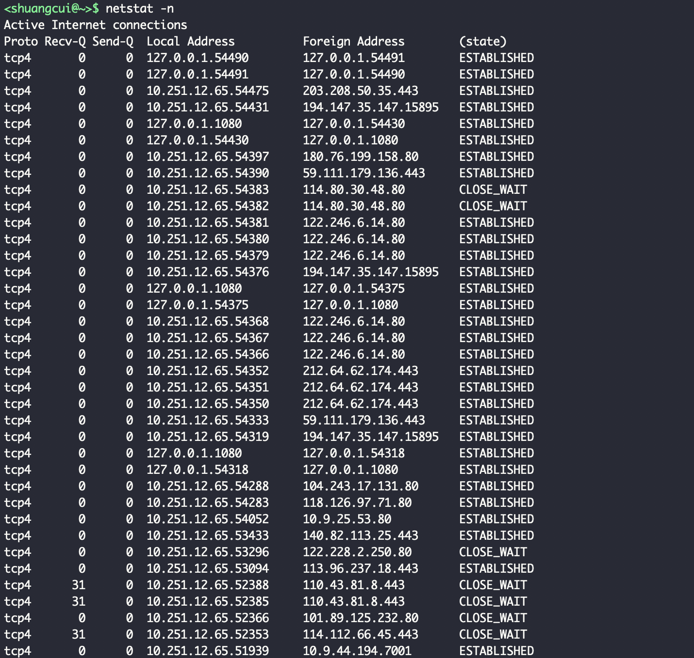
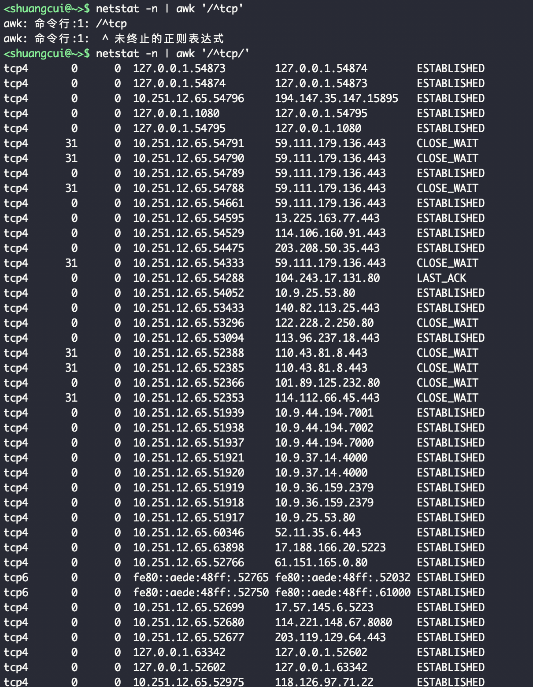
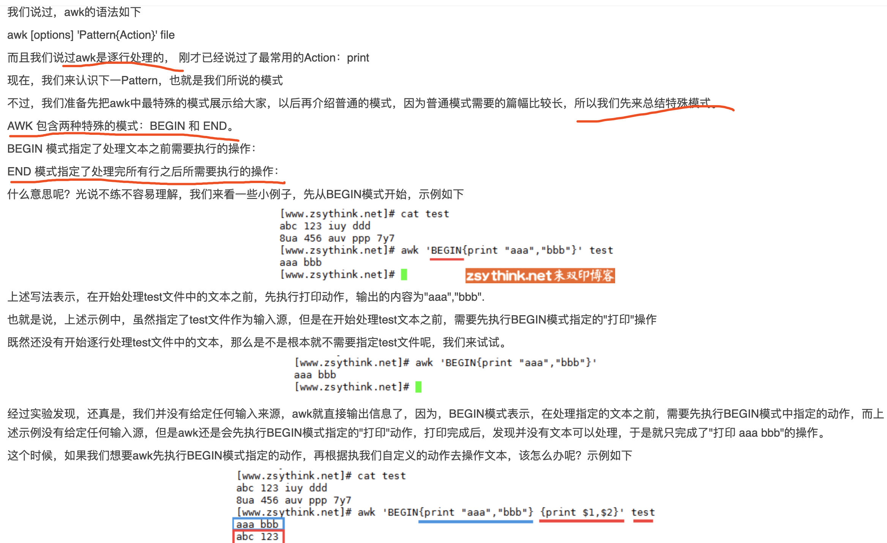
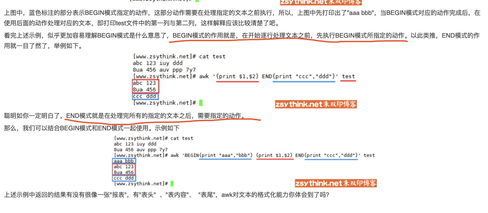
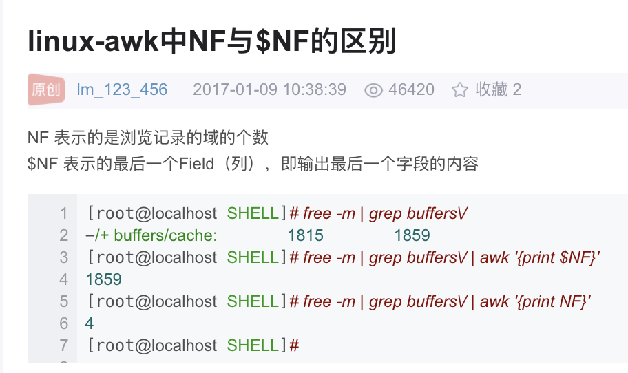
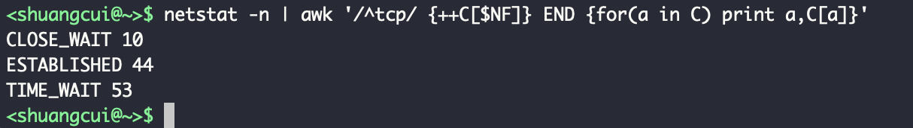
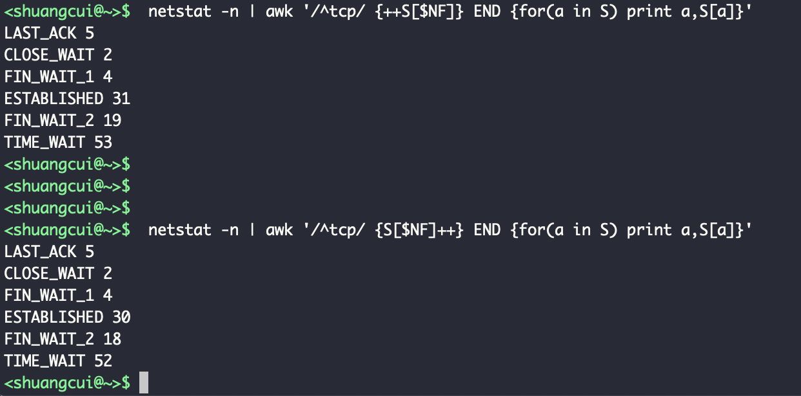
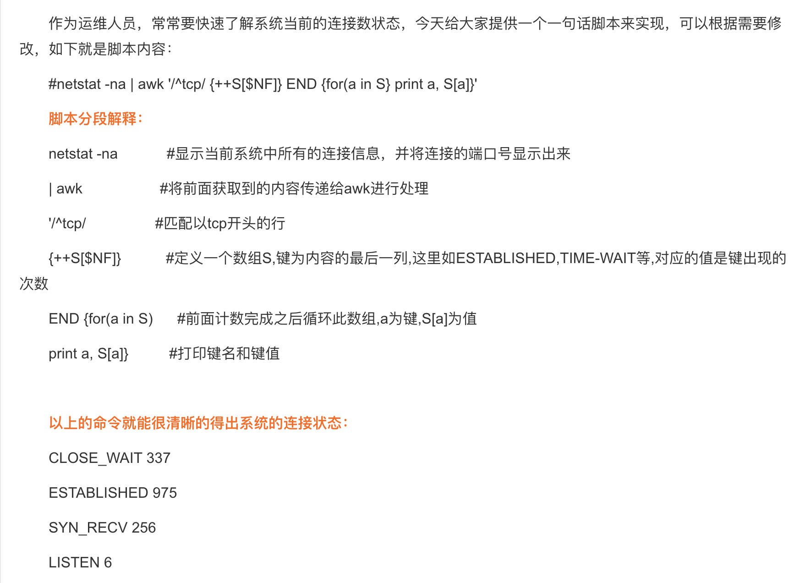
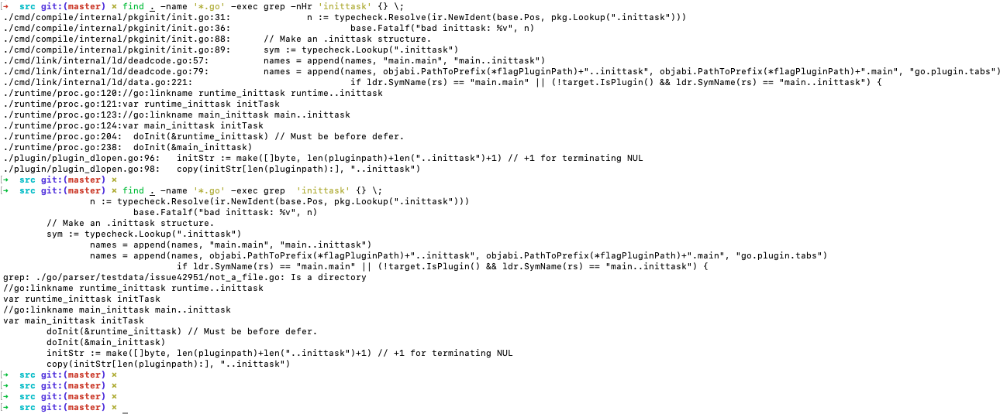

<br>

### `netstat -n | awk '/^tcp/ {++S[$NF]} END {for(a in S) print a,S[a]}'`

<br>

这行命令,可以打印出各个状态的数量



awk是如何做到的呢?一步步分拆来看:

<br>


`netstat -n`




<details>
<summary>如下:</summary>

```java
<shuangcui@~>$ netstat -n
Active Internet connections
Proto Recv-Q Send-Q  Local Address          Foreign Address        (state)
tcp4       0      0  127.0.0.1.54490        127.0.0.1.54491        ESTABLISHED
tcp4       0      0  127.0.0.1.54491        127.0.0.1.54490        ESTABLISHED
tcp4       0      0  10.251.12.65.54475     203.208.50.35.443      ESTABLISHED
tcp4       0      0  10.251.12.65.54431     194.147.35.147.15895   ESTABLISHED
tcp4       0      0  127.0.0.1.1080         127.0.0.1.54430        ESTABLISHED
tcp4       0      0  127.0.0.1.54430        127.0.0.1.1080         ESTABLISHED
tcp4       0      0  10.251.12.65.54397     180.76.199.158.80      ESTABLISHED
tcp4       0      0  10.251.12.65.54390     59.111.179.136.443     ESTABLISHED
tcp4       0      0  10.251.12.65.54383     114.80.30.48.80        CLOSE_WAIT
tcp4       0      0  10.251.12.65.54382     114.80.30.48.80        CLOSE_WAIT
tcp4       0      0  10.251.12.65.54381     122.246.6.14.80        ESTABLISHED
tcp4       0      0  10.251.12.65.54380     122.246.6.14.80        ESTABLISHED
tcp4       0      0  10.251.12.65.54379     122.246.6.14.80        ESTABLISHED
tcp4       0      0  10.251.12.65.54376     194.147.35.147.15895   ESTABLISHED
tcp4       0      0  127.0.0.1.1080         127.0.0.1.54375        ESTABLISHED
tcp4       0      0  127.0.0.1.54375        127.0.0.1.1080         ESTABLISHED
tcp4       0      0  10.251.12.65.54368     122.246.6.14.80        ESTABLISHED
tcp4       0      0  10.251.12.65.54367     122.246.6.14.80        ESTABLISHED
tcp4       0      0  10.251.12.65.54366     122.246.6.14.80        ESTABLISHED
tcp4       0      0  10.251.12.65.54352     212.64.62.174.443      ESTABLISHED
tcp4       0      0  10.251.12.65.54351     212.64.62.174.443      ESTABLISHED
tcp4       0      0  10.251.12.65.54350     212.64.62.174.443      ESTABLISHED
tcp4       0      0  10.251.12.65.54333     59.111.179.136.443     ESTABLISHED
tcp4       0      0  10.251.12.65.54319     194.147.35.147.15895   ESTABLISHED
tcp4       0      0  127.0.0.1.1080         127.0.0.1.54318        ESTABLISHED
tcp4       0      0  127.0.0.1.54318        127.0.0.1.1080         ESTABLISHED
tcp4       0      0  10.251.12.65.54288     104.243.17.131.80      ESTABLISHED
tcp4       0      0  10.251.12.65.54283     118.126.97.71.80       ESTABLISHED
tcp4       0      0  10.251.12.65.54052     10.9.25.53.80          ESTABLISHED
tcp4       0      0  10.251.12.65.53433     140.82.113.25.443      ESTABLISHED
tcp4       0      0  10.251.12.65.53296     122.228.2.250.80       CLOSE_WAIT
tcp4       0      0  10.251.12.65.53094     113.96.237.18.443      ESTABLISHED
tcp4      31      0  10.251.12.65.52388     110.43.81.8.443        CLOSE_WAIT
tcp4      31      0  10.251.12.65.52385     110.43.81.8.443        CLOSE_WAIT
tcp4       0      0  10.251.12.65.52366     101.89.125.232.80      CLOSE_WAIT
tcp4      31      0  10.251.12.65.52353     114.112.66.45.443      CLOSE_WAIT
tcp4       0      0  10.251.12.65.51939     10.9.44.194.7001       ESTABLISHED
tcp4       0      0  10.251.12.65.51938     10.9.44.194.7002       ESTABLISHED
tcp4       0      0  10.251.12.65.51937     10.9.44.194.7000       ESTABLISHED
tcp4       0      0  10.251.12.65.51921     10.9.37.14.4000        ESTABLISHED
tcp4       0      0  10.251.12.65.51920     10.9.37.14.4000        ESTABLISHED
tcp4       0      0  10.251.12.65.51919     10.9.36.159.2379       ESTABLISHED
tcp4       0      0  10.251.12.65.51918     10.9.36.159.2379       ESTABLISHED
tcp4       0      0  10.251.12.65.51917     10.9.25.53.80          ESTABLISHED
tcp4       0      0  10.251.12.65.60346     52.11.35.6.443         ESTABLISHED
tcp4       0      0  10.251.12.65.63898     17.188.166.20.5223     ESTABLISHED
tcp4       0      0  10.251.12.65.52766     61.151.165.0.80        ESTABLISHED
tcp6       0      0  fe80::aede:48ff:.52765 fe80::aede:48ff:.52032 ESTABLISHED
tcp6       0      0  fe80::aede:48ff:.52750 fe80::aede:48ff:.61000 ESTABLISHED
tcp4       0      0  10.251.12.65.52699     17.57.145.6.5223       ESTABLISHED
tcp4       0      0  10.251.12.65.52680     114.221.148.67.8080    ESTABLISHED
tcp4       0      0  10.251.12.65.52677     203.119.129.64.443     ESTABLISHED
tcp4       0      0  127.0.0.1.63342        127.0.0.1.52602        ESTABLISHED
tcp4       0      0  127.0.0.1.52602        127.0.0.1.63342        ESTABLISHED
tcp4       0      0  10.251.12.65.52975     118.126.97.71.22       ESTABLISHED
tcp4       0      0  127.0.0.1.54406        127.0.0.1.54405        TIME_WAIT
tcp4       0      0  127.0.0.1.54530        127.0.0.1.54407        TIME_WAIT
tcp4       0      0  127.0.0.1.54409        127.0.0.1.54408        TIME_WAIT
tcp4       0      0  127.0.0.1.54530        127.0.0.1.54412        TIME_WAIT
tcp4       0      0  127.0.0.1.54414        127.0.0.1.54413        TIME_WAIT
tcp4       0      0  127.0.0.1.54530        127.0.0.1.54415        TIME_WAIT
tcp4       0      0  127.0.0.1.54417        127.0.0.1.54416        TIME_WAIT
tcp4       0      0  127.0.0.1.54530        127.0.0.1.54418        TIME_WAIT
tcp4       0      0  127.0.0.1.54420        127.0.0.1.54419        TIME_WAIT
tcp4       0      0  127.0.0.1.54530        127.0.0.1.54421        TIME_WAIT
tcp4       0      0  10.251.12.65.54392     59.111.179.136.443     TIME_WAIT
tcp4       0      0  127.0.0.1.54423        127.0.0.1.54422        TIME_WAIT
tcp4       0      0  127.0.0.1.54530        127.0.0.1.54424        TIME_WAIT
tcp4       0      0  127.0.0.1.54426        127.0.0.1.54425        TIME_WAIT
tcp4       0      0  127.0.0.1.54530        127.0.0.1.54427        TIME_WAIT
tcp4       0      0  127.0.0.1.1080         127.0.0.1.54218        TIME_WAIT
tcp4       0      0  127.0.0.1.54429        127.0.0.1.54428        TIME_WAIT
tcp4       0      0  127.0.0.1.54530        127.0.0.1.54432        TIME_WAIT
tcp4       0      0  10.251.12.65.54219     194.147.35.147.15895   TIME_WAIT
tcp4       0      0  127.0.0.1.54434        127.0.0.1.54433        TIME_WAIT
tcp4       0      0  127.0.0.1.54530        127.0.0.1.54435        TIME_WAIT
tcp4       0      0  127.0.0.1.54437        127.0.0.1.54436        TIME_WAIT
tcp4       0      0  127.0.0.1.54530        127.0.0.1.54440        TIME_WAIT
tcp4       0      0  127.0.0.1.54442        127.0.0.1.54441        TIME_WAIT
tcp4       0      0  127.0.0.1.54530        127.0.0.1.54443        TIME_WAIT
tcp4       0      0  127.0.0.1.54445        127.0.0.1.54444        TIME_WAIT
tcp4       0      0  127.0.0.1.54530        127.0.0.1.54446        TIME_WAIT
tcp4       0      0  127.0.0.1.54448        127.0.0.1.54447        TIME_WAIT
tcp4       0      0  127.0.0.1.54530        127.0.0.1.54449        TIME_WAIT
tcp4       0      0  127.0.0.1.54451        127.0.0.1.54450        TIME_WAIT
tcp4       0      0  127.0.0.1.54530        127.0.0.1.54452        TIME_WAIT
tcp4       0      0  127.0.0.1.54454        127.0.0.1.54453        TIME_WAIT
tcp4       0      0  127.0.0.1.54530        127.0.0.1.54455        TIME_WAIT
tcp4       0      0  127.0.0.1.54457        127.0.0.1.54456        TIME_WAIT
tcp4       0      0  127.0.0.1.54530        127.0.0.1.54458        TIME_WAIT
tcp4       0      0  127.0.0.1.54460        127.0.0.1.54459        TIME_WAIT
tcp4       0      0  127.0.0.1.54530        127.0.0.1.54461        TIME_WAIT
tcp4       0      0  127.0.0.1.54463        127.0.0.1.54462        TIME_WAIT
tcp4       0      0  127.0.0.1.54530        127.0.0.1.54466        TIME_WAIT
tcp4       0      0  127.0.0.1.54468        127.0.0.1.54467        TIME_WAIT
tcp4       0      0  127.0.0.1.54530        127.0.0.1.54469        TIME_WAIT
tcp4       0      0  127.0.0.1.54471        127.0.0.1.54470        TIME_WAIT
tcp4       0      0  127.0.0.1.54530        127.0.0.1.54472        TIME_WAIT
tcp4       0      0  127.0.0.1.54474        127.0.0.1.54473        TIME_WAIT
tcp4       0      0  127.0.0.1.54530        127.0.0.1.54476        TIME_WAIT
tcp4       0      0  127.0.0.1.54478        127.0.0.1.54477        TIME_WAIT
tcp4       0      0  127.0.0.1.54530        127.0.0.1.54479        TIME_WAIT
tcp4       0      0  127.0.0.1.1080         127.0.0.1.54267        TIME_WAIT
tcp4       0      0  127.0.0.1.54481        127.0.0.1.54480        TIME_WAIT
tcp4       0      0  127.0.0.1.54530        127.0.0.1.54482        TIME_WAIT
tcp4       0      0  10.251.12.65.54268     194.147.35.147.15895   TIME_WAIT
tcp4       0      0  127.0.0.1.54484        127.0.0.1.54483        TIME_WAIT
tcp4       0      0  127.0.0.1.54530        127.0.0.1.54486        TIME_WAIT
tcp4       0      0  127.0.0.1.54488        127.0.0.1.54487        TIME_WAIT
tcp4       0      0  127.0.0.1.54530        127.0.0.1.54489        TIME_WAIT
udp4       0      0  127.0.0.1.61294        127.0.0.1.62523
udp4       0      0  127.0.0.1.62523        127.0.0.1.61294
udp4       0      0  127.0.0.1.56688        *.*
udp4       0      0  10.251.12.65.62732     10.9.37.12.6831
udp4       0      0  *.59612                *.*
udp4       0      0  *.53034                *.*
udp4       0      0  *.*                    *.*
udp4       0      0  *.*                    *.*
udp46      0      0  *.5353                 *.*
udp46      0      0  *.5353                 *.*
udp46      0      0  *.5353                 *.*
udp46      0      0  *.5353                 *.*
udp4       0      0  *.5353                 *.*
udp46      0      0  *.5353                 *.*
udp4       0      0  *.5353                 *.*
udp4       0      0  *.*                    *.*
udp4       0      0  *.*                    *.*
udp4       0      0  *.*                    *.*
udp6       0      0  *.53532                *.*
udp4       0      0  *.53532                *.*
udp4       0      0  *.*                    *.*
udp4       0      0  *.*                    *.*
udp4       0      0  *.*                    *.*
udp4       0      0  *.*                    *.*
udp4       0      0  *.*                    *.*
udp4       0      0  *.*                    *.*
udp4       0      0  *.*                    *.*
udp4       0      0  *.*                    *.*
udp4       0      0  *.*                    *.*
udp4       0      0  *.*                    *.*
udp4       0      0  *.*                    *.*
udp4       0      0  *.*                    *.*
udp4       0      0  *.*                    *.*
udp4       0      0  *.*                    *.*
udp4       0      0  *.51891                *.*
udp4       0      0  *.*                    *.*
udp6       0      0  *.61233                *.*
udp4       0      0  *.61233                *.*
udp4       0      0  *.*                    *.*
udp4       0      0  *.*                    *.*
udp4       0      0  *.*                    *.*
udp4       0      0  *.*                    *.*
udp4       0      0  *.*                    *.*
udp4       0      0  *.*                    *.*
udp4       0      0  *.*                    *.*
udp4       0      0  *.*                    *.*
udp4       0      0  *.*                    *.*
udp4       0      0  *.*                    *.*
udp4       0      0  *.*                    *.*
udp4       0      0  *.*                    *.*
udp4       0      0  *.*                    *.*
udp4       0      0  *.*                    *.*
udp4       0      0  *.*                    *.*
udp4       0      0  *.*                    *.*
udp4       0      0  *.*                    *.*
udp4       0      0  *.*                    *.*
udp4       0      0  *.*                    *.*
udp4       0      0  *.*                    *.*
udp46      0      0  *.*                    *.*
udp4       0      0  *.*                    *.*
udp4       0      0  *.*                    *.*
udp4       0      0  *.*                    *.*
udp4       0      0  127.0.0.1.60335        127.0.0.1.53411
udp4       0      0  127.0.0.1.53411        127.0.0.1.60335
udp4       0      0  *.*                    *.*
udp6       0      0  *.5353                 *.*
udp4       0      0  *.5353                 *.*
udp4       0      0  *.*                    *.*
udp4       0      0  *.138                  *.*
udp4       0      0  *.137                  *.*
Active Multipath Internet connections
Proto/ID  Flags      Local Address          Foreign Address        (state)
Active LOCAL (UNIX) domain sockets
Address          Type   Recv-Q Send-Q            Inode             Conn             Refs          Nextref Addr
cbd0642ad1094d13 stream      0      0                0 cbd0642ad10938c3                0                0 /var/folders/0f/46_yf9mx37ndl25v6ypqg3qc0000gn/T/iTerm2-temp-socket.uUZwd1
cbd0642ad10938c3 stream      0      0                0 cbd0642ad1094d13                0                0
cbd0642ad1092923 stream      0      0                0 cbd0642ad10929eb                0                0 ./QingBanGong_LocalPush
cbd0642ad10929eb stream      0      0                0 cbd0642ad1092923                0                0
cbd0642ad1092d0b stream      0      0                0 cbd0642ad1092e9b                0                0
cbd0642ad1092e9b stream      0      0                0 cbd0642ad1092d0b                0                0
cbd0642ad1094f6b stream      0      0 cbd0642ae0d2d2cb                0                0                0 ./wpsoffice
cbd0642ad1094c4b stream      0      0                0 cbd0642ad1094b83                0                0 ./recentfile_server
cbd0642ad1094b83 stream      0      0                0 cbd0642ad1094c4b                0                0
cbd0642ad10931bb stream      0      0                0 cbd0642ad10935a3                0                0 /var/run/mDNSResponder
cbd0642ad10935a3 stream      0      0                0 cbd0642ad10931bb                0                0
cbd0642ad109447b stream      0      0                0 cbd0642ad10943b3                0                0 ./_Thrift_Qing_IPC_
cbd0642ad10943b3 stream      0      0                0 cbd0642ad109447b                0                0
cbd0642ad1093a53 stream      0      0                0 cbd0642ad1094abb                0                0 /var/run/mDNSResponder
cbd0642ad1094abb stream      0      0                0 cbd0642ad1093a53                0                0
cbd0642ad1093413 stream      0      0                0 cbd0642ad1093fcb                0                0 /var/run/mDNSResponder
cbd0642ad1093fcb stream      0      0                0 cbd0642ad1093413                0                0
cbd0642ad1093283 stream      0      0                0 cbd0642ad10942eb                0                0 /var/folders/0f/46_yf9mx37ndl25v6ypqg3qc0000gn/T/iTerm2-temp-socket.Jx4w3a
cbd0642ad10942eb stream      0      0                0 cbd0642ad1093283                0                0
cbd0642ad10934db stream      0      0                0 cbd0642ad109492b                0                0
cbd0642ad109492b stream      0      0                0 cbd0642ad10934db                0                0
cbd0642ad10946d3 stream      0      0                0 cbd0642ad109334b                0                0
cbd0642ad109334b stream      0      0                0 cbd0642ad10946d3                0                0
cbd0642ad10949f3 stream      0      0                0 cbd0642ad109366b                0                0
cbd0642ad109366b stream      0      0                0 cbd0642ad10949f3                0                0
cbd0642ad1094863 stream      0      0                0 cbd0642ad109415b                0                0
cbd0642ad109415b stream      0      0                0 cbd0642ad1094863                0                0
cbd0642ad1094223 stream      0      0                0 cbd0642acefba793                0                0
cbd0642acefba793 stream      0      0                0 cbd0642ad1094223                0                0
cbd0642acefbc093 stream      0      0                0 cbd0642acefbd033                0                0
cbd0642acefbd033 stream      0      0                0 cbd0642acefbc093                0                0
cbd0642acefbac43 stream      0      0                0 cbd0642acefbc60b                0                0
cbd0642acefbc60b stream      0      0                0 cbd0642acefbac43                0                0
cbd0642acefbbfcb stream      0      0                0 cbd0642acefba9eb                0                0
cbd0642acefba9eb stream      0      0                0 cbd0642acefbbfcb                0                0
cbd0642acefbd28b stream      0      0                0 cbd0642acefbd41b                0                0
cbd0642acefbd41b stream      0      0                0 cbd0642acefbd28b                0                0
cbd0642ac254a4e3 stream      0      0                0 cbd0642ac7b0dabb                0                0
cbd0642ac7b0dabb stream      0      0                0 cbd0642ac254a4e3                0                0
cbd0642ac7b0c8c3 stream      0      0                0 cbd0642ac7b0c7fb                0                0
cbd0642ac7b0c7fb stream      0      0                0 cbd0642ac7b0c8c3                0                0
cbd0642ac7b0e1c3 stream      0      0                0 cbd0642ac7b0db83                0                0
cbd0642ac7b0db83 stream      0      0                0 cbd0642ac7b0e1c3                0                0
cbd0642ac7b0d9f3 stream      0      0                0 cbd0642ac7b0c66b                0                0
cbd0642ac7b0c66b stream      0      0                0 cbd0642ac7b0d9f3                0                0
cbd0642acc776abb stream      0      0                0 cbd0642acc7769f3                0                0
cbd0642acc7769f3 stream      0      0                0 cbd0642acc776abb                0                0
cbd0642acc774b7b stream      0      0                0 cbd0642acc7770fb                0                0
cbd0642acc7770fb stream      0      0                0 cbd0642acc774b7b                0                0
cbd0642ac5fa5923 stream      0      0                0 cbd0642ac5fa5793                0                0
cbd0642ac5fa5793 stream      0      0                0 cbd0642ac5fa5923                0                0
cbd0642ac5fa6e3b stream      0      0                0 cbd0642ac5fa5f63                0                0
cbd0642ac5fa5f63 stream      0      0                0 cbd0642ac5fa6e3b                0                0
cbd0642ac5fa779b stream      0      0                0 cbd0642ac5fa7f6b                0                0
cbd0642ac5fa7f6b stream      0      0                0 cbd0642ac5fa779b                0                0
cbd0642ac5fa760b stream      0      0                0 cbd0642ac5fa73b3                0                0
cbd0642ac5fa73b3 stream      0      0                0 cbd0642ac5fa760b                0                0
cbd0642ac5fa80fb stream      0      0                0 cbd0642ac5fa85ab                0                0
cbd0642ac5fa85ab stream      0      0                0 cbd0642ac5fa80fb                0                0
cbd0642ac5fa84e3 stream      0      0                0 cbd0642ac5fa634b                0                0
cbd0642ac5fa634b stream      0      0                0 cbd0642ac5fa84e3                0                0
cbd0642ac5fa76d3 stream      0      0                0 cbd0642ac5fa64db                0                0
cbd0642ac5fa64db stream      0      0                0 cbd0642ac5fa76d3                0                0
cbd0642ac5fa6413 stream      0      0                0 cbd0642ac5fa6a53                0                0
cbd0642ac5fa6a53 stream      0      0                0 cbd0642ac5fa6413                0                0
cbd0642ac5fa715b stream      0      0                0 cbd0642ac5fa7ddb                0                0
cbd0642ac5fa7ddb stream      0      0                0 cbd0642ac5fa715b                0                0
cbd0642ac5fa5e9b stream      0      0                0 cbd0642ac5fa6283                0                0
cbd0642ac5fa6283 stream      0      0                0 cbd0642ac5fa5e9b                0                0
cbd0642ac5fa79f3 stream      0      0                0 cbd0642ac5fa7abb                0                0
cbd0642ac5fa7abb stream      0      0                0 cbd0642ac5fa79f3                0                0
cbd0642ac5fa72eb stream      0      0                0 cbd0642ac5fa6fcb                0                0
cbd0642ac5fa6fcb stream      0      0                0 cbd0642ac5fa72eb                0                0
cbd0642ac5fa59eb stream      0      0                0 cbd0642ac5fa602b                0                0
cbd0642ac5fa602b stream      0      0                0 cbd0642ac5fa59eb                0                0
cbd0642ac5fa841b stream      0      0                0 cbd0642ac5fa56cb                0                0
cbd0642ac5fa56cb stream      0      0                0 cbd0642ac5fa841b                0                0
cbd0642ac5fa7863 stream      0      0                0 cbd0642ac5fa6b1b                0                0
cbd0642ac5fa6b1b stream      0      0                0 cbd0642ac5fa7863                0                0
cbd0642ac5fa5ab3 stream      0      0                0 cbd0642ac5fa585b                0                0
cbd0642ac5fa585b stream      0      0                0 cbd0642ac5fa5ab3                0                0
cbd0642ad10926cb stream      0      0                0 cbd0642ad10954e3                0                0
cbd0642ad10954e3 stream      0      0                0 cbd0642ad10926cb                0                0
cbd0642ad109541b stream      0      0                0 cbd0642ad1092793                0                0 /var/run/mDNSResponder
cbd0642ad1092793 stream      0      0                0 cbd0642ad109541b                0                0
cbd0642ad109460b stream      0      0                0 cbd0642ad1094543                0                0 /var/run/mDNSResponder
cbd0642ad1094543 stream      0      0                0 cbd0642ad109460b                0                0
cbd0642ad1094093 stream      0      0                0 cbd0642ad1093b1b                0                0 /var/folders/0f/46_yf9mx37ndl25v6ypqg3qc0000gn/T/iTerm2-temp-socket.uD8BzL
cbd0642ad1093b1b stream      0      0                0 cbd0642ad1094093                0                0
cbd0642ad1093be3 stream      0      0                0 cbd0642ad1093d73                0                0
cbd0642ad1093d73 stream      0      0                0 cbd0642ad1093be3                0                0
cbd0642ad1093cab stream      0      0                0 cbd0642ac7b0c733                0                0
cbd0642ac7b0c733 stream      0      0                0 cbd0642ad1093cab                0                0
cbd0642acc77741b stream      0      0                0 cbd0642acc7754db                0                0 /var/folders/0f/46_yf9mx37ndl25v6ypqg3qc0000gn/T/iTerm2-temp-socket.q4FdtR
cbd0642acc7754db stream      0      0                0 cbd0642acc77741b                0                0
cbd0642ac5fa7b83 stream      0      0                0 cbd0642ac5fa6cab                0                0 /var/run/mDNSResponder
cbd0642ac5fa6cab stream      0      0                0 cbd0642ac5fa7b83                0                0
cbd0642ac5fa666b stream      0      0                0 cbd0642ac5fa6be3                0                0 /var/run/mDNSResponder
cbd0642ac5fa6be3 stream      0      0                0 cbd0642ac5fa666b                0                0
cbd0642ac5fa6733 stream      0      0                0 cbd0642ac5fa6d73                0                0 /var/run/mDNSResponder
cbd0642ac5fa6d73 stream      0      0                0 cbd0642ac5fa6733                0                0
cbd0642ac5fa6f03 stream      0      0                0 cbd0642ac5fa65a3                0                0 /var/run/mDNSResponder
cbd0642ac5fa65a3 stream      0      0                0 cbd0642ac5fa6f03                0                0
cbd0642ac5fa7d13 stream      0      0                0 cbd0642ac5fa792b                0                0 /var/run/mDNSResponder
cbd0642ac5fa792b stream      0      0                0 cbd0642ac5fa7d13                0                0
cbd0642ac5fa7093 stream      0      0                0 cbd0642ac5fa60f3                0                0 /var/run/mDNSResponder
cbd0642ac5fa60f3 stream      0      0                0 cbd0642ac5fa7093                0                0
cbd0642ac5fa61bb stream      0      0                0 cbd0642ac5fa7223                0                0 ./_Thrift_Qing_IPC_
cbd0642ac5fa7223 stream      0      0                0 cbd0642ac5fa61bb                0                0
cbd0642ac5fa747b stream      0      0 cbd0642acf09d4cb                0                0                0 ./QingBanGong_LocalPush
cbd0642ac5fa5b7b stream      0      0 cbd0642adceb80cb                0                0                0 ./_#_QingBanGong_Server_#_
cbd0642ac5fa81c3 stream      0      0 cbd0642ae29746cb                0                0                0 ./ELiveClient_LiveCenter
cbd0642ac5fa5d0b stream      0      0 cbd0642adceb7fcb                0                0                0 ./_Thrift_Qing_IPC_2_
cbd0642ac5fa5dd3 stream      0      0 cbd0642adc0b24cb                0                0                0 ./_Thrift_Qing_IPC_
cbd0642ac5fa5c43 stream      0      0 cbd0642ae045fdcb                0                0                0 ./recentfile_server
cbd0642ac5fa828b stream      0      0                0 cbd0642ac5fa8353                0                0 /var/run/mDNSResponder
cbd0642ac5fa8353 stream      0      0                0 cbd0642ac5fa828b                0                0
cbd0642ac5fa7543 stream      0      0 cbd0642ac85022cb                0                0                0 ./WpsCloudSvr
cbd0642acefbd0fb stream      0      0                0 cbd0642acefba85b                0                0
cbd0642acefba85b stream      0      0                0 cbd0642acefbd0fb                0                0
cbd0642acefbcea3 stream      0      0                0 cbd0642acefbab7b                0                0 /var/run/mDNSResponder
cbd0642acefbab7b stream      0      0                0 cbd0642acefbcea3                0                0
cbd0642acefbcd13 stream      0      0                0 cbd0642acefbcddb                0                0 /var/run/mDNSResponder
cbd0642acefbcddb stream      0      0                0 cbd0642acefbcd13                0                0
cbd0642acefbc6d3 stream      0      0                0 cbd0642acefbc92b                0                0 /var/run/mDNSResponder
cbd0642acefbc92b stream      0      0                0 cbd0642acefbc6d3                0                0
cbd0642acefbc79b stream      0      0 cbd0642ad7e7b9cb                0                0                0 /var/folders/0f/46_yf9mx37ndl25v6ypqg3qc0000gn/T/.com.google.Chrome.ss4bAO/SingletonSocket
cbd0642acefbae9b stream      0      0                0 cbd0642acefbb4db                0                0 /var/folders/0f/46_yf9mx37ndl25v6ypqg3qc0000gn/T/iTerm2-temp-socket.rBcF2e
cbd0642acefbb4db stream      0      0                0 cbd0642acefbae9b                0                0
cbd0642acefbb0f3 stream      0      0                0 cbd0642acefbb1bb                0                0 /var/run/mDNSResponder
cbd0642acefbb1bb stream      0      0                0 cbd0642acefbb0f3                0                0
cbd0642acefbb7fb stream      0      0                0 cbd0642acefbc543                0                0 /var/run/mDNSResponder
cbd0642acefbc543 stream      0      0                0 cbd0642acefbb7fb                0                0
cbd0642acefbb733 stream      0      0                0                0                0                0
cbd0642acefbc15b stream      0      0                0                0                0                0
cbd0642acefbb413 stream      0      0                0 cbd0642acefbc3b3                0                0 /var/run/mDNSResponder
cbd0642acefbc3b3 stream      0      0                0 cbd0642acefbb413                0                0
cbd0642acefbc9f3 stream      0      0                0 cbd0642acefbb66b                0                0 /var/run/mDNSResponder
cbd0642acefbb66b stream      0      0                0 cbd0642acefbc9f3                0                0
cbd0642acefbb5a3 stream      0      0                0 cbd0642acefbb283                0                0 /var/run/mDNSResponder
cbd0642acefbb283 stream      0      0                0 cbd0642acefbb5a3                0                0
cbd0642acefbbf03 stream      0      0                0 cbd0642acefbba53                0                0 /var/run/mDNSResponder
cbd0642acefbba53 stream      0      0                0 cbd0642acefbbf03                0                0
cbd0642acefbbd73 stream      0      0                0 cbd0642acefbbbe3                0                0 /var/run/usbmuxd
cbd0642acefbbbe3 stream      0      0                0 cbd0642acefbbd73                0                0
cbd0642acefbbb1b stream      0      0                0 cbd0642acefbbe3b                0                0 /var/run/mDNSResponder
cbd0642acefbbe3b stream      0      0                0 cbd0642acefbbb1b                0                0
cbd0642acefbbcab stream      0      0                0 cbd0642acefbb98b                0                0
cbd0642acefbb98b stream      0      0                0 cbd0642acefbbcab                0                0
cbd0642acc77728b stream      0      0                0 cbd0642acc7749eb                0                0
cbd0642acc7749eb stream      0      0                0 cbd0642acc77728b                0                0
cbd0642acc776ddb stream      0      0                0 cbd0642acc774923                0                0
cbd0642acc774923 stream      0      0                0 cbd0642acc776ddb                0                0
cbd0642acc775733 stream      0      0                0 cbd0642acc776863                0                0 /var/run/mDNSResponder
cbd0642acc776863 stream      0      0                0 cbd0642acc775733                0                0
cbd0642acc77485b stream      0      0                0 cbd0642acc774793                0                0
cbd0642acc774793 stream      0      0                0 cbd0642acc77485b                0                0
cbd0642acc774f63 stream      0      0 cbd0642aceea6ecb                0                0                0 /tmp/mysql.sock
cbd0642acc774c43 stream      0      0                0 cbd0642acc77534b                0                0
cbd0642acc77534b stream      0      0                0 cbd0642acc774c43                0                0
cbd0642acc77502b stream      0      0 cbd0642acead4fcb                0                0                0 /Users/shuangcui/Library/Application Support/DingTalkMac/dingtalk-dd
cbd0642acc7751bb stream      0      0 cbd0642ace3bb3cb                0                0                0 /tmp/.vnc-501/vncagent.02190c267311edcb
cbd0642acc776b83 stream      0      0                0 cbd0642acc7750f3                0                0
cbd0642acc7750f3 stream      0      0                0 cbd0642acc776b83                0                0
cbd0642acc77679b stream      0      0                0 cbd0642acc7757fb                0                0 /var/run/mDNSResponder
cbd0642acc7757fb stream      0      0                0 cbd0642acc77679b                0                0
cbd0642acc7766d3 stream      0      0                0 cbd0642acc7758c3                0                0 /var/run/mDNSResponder
cbd0642acc7758c3 stream      0      0                0 cbd0642acc7766d3                0                0
cbd0642acc77660b stream      0      0                0 cbd0642acc77598b                0                0 /var/run/mDNSResponder
cbd0642acc77598b stream      0      0                0 cbd0642acc77660b                0                0
cbd0642acc775a53 stream      0      0                0 cbd0642acc775b1b                0                0 /var/run/mDNSResponder
cbd0642acc776543 stream      0      0                0 cbd0642acc77647b                0                0 /var/run/mDNSResponder
cbd0642acc775b1b stream      0      0                0 cbd0642acc775a53                0                0
cbd0642acc77647b stream      0      0                0 cbd0642acc776543                0                0
cbd0642acc7763b3 stream      0      0                0 cbd0642acc7762eb                0                0 /var/run/mDNSResponder
cbd0642acc775e3b stream      0      0                0 cbd0642acc776223                0                0 /var/run/mDNSResponder
cbd0642acc7762eb stream      0      0                0 cbd0642acc7763b3                0                0
cbd0642acc776223 stream      0      0                0 cbd0642acc775e3b                0                0
cbd0642acc775fcb stream      0      0                0 cbd0642acc775d73                0                0 /var/run/mDNSResponder
cbd0642acc775cab stream      0      0                0 cbd0642acc775be3                0                0 /var/run/mDNSResponder
cbd0642acc775d73 stream      0      0                0 cbd0642acc775fcb                0                0
cbd0642acc775be3 stream      0      0                0 cbd0642acc775cab                0                0
cbd0642acc77615b stream      0      0                0 cbd0642acc776093                0                0 /var/run/mDNSResponder
cbd0642acc776093 stream      0      0                0 cbd0642acc77615b                0                0
cbd0642acc775f03 stream      0      0                0 cbd0642ac254785b                0                0
cbd0642ac254785b stream      0      0                0 cbd0642acc775f03                0                0
cbd0642ac7b0b6cb stream      0      0                0 cbd0642ac7b0e4e3                0                0 /var/run/mDNSResponder
cbd0642ac7b0e4e3 stream      0      0                0 cbd0642ac7b0b6cb                0                0
cbd0642ac7b0e28b stream      0      0                0 cbd0642ac7b0e033                0                0 /var/run/mDNSResponder
cbd0642ac7b0e033 stream      0      0                0 cbd0642ac7b0e28b                0                0
cbd0642ac7b0e353 stream      0      0                0 cbd0642ac7b0dea3                0                0 /var/run/mDNSResponder
cbd0642ac7b0dea3 stream      0      0                0 cbd0642ac7b0e353                0                0
cbd0642ac7b0bd0b stream      0      0                0 cbd0642ac7b0b923                0                0 /var/run/mDNSResponder
cbd0642ac7b0b923 stream      0      0                0 cbd0642ac7b0bd0b                0                0
cbd0642ac7b0bab3 stream      0      0                0 cbd0642ac7b0bb7b                0                0 /var/run/mDNSResponder
cbd0642ac7b0bb7b stream      0      0                0 cbd0642ac7b0bab3                0                0
cbd0642ac7b0b9eb stream      0      0                0 cbd0642ac7b0df6b                0                0 /var/run/mDNSResponder
cbd0642ac7b0df6b stream      0      0                0 cbd0642ac7b0b9eb                0                0
cbd0642ac7b0dd13 stream      0      0                0 cbd0642ac7b0bdd3                0                0
cbd0642ac7b0bdd3 stream      0      0                0 cbd0642ac7b0dd13                0                0
cbd0642ac7b0be9b stream      0      0                0 cbd0642ac7b0bf63                0                0
cbd0642ac7b0bf63 stream      0      0                0 cbd0642ac7b0be9b                0                0
cbd0642ac7b0dc4b stream      0      0                0 cbd0642ac7b0c02b                0                0
cbd0642ac7b0c02b stream      0      0                0 cbd0642ac7b0dc4b                0                0
cbd0642ac7b0c0f3 stream      0      0                0 cbd0642ac7b0c5a3                0                0
cbd0642ac7b0c5a3 stream      0      0                0 cbd0642ac7b0c0f3                0                0
cbd0642ac7b0c34b stream      0      0                0 cbd0642ac7b0c413                0                0 /var/run/mDNSResponder
cbd0642ac7b0c413 stream      0      0                0 cbd0642ac7b0c34b                0                0
cbd0642ac7b0cd73 stream      0      0                0 cbd0642ac7b0d223                0                0 /var/run/mDNSResponder
cbd0642ac7b0d223 stream      0      0                0 cbd0642ac7b0cd73                0                0
cbd0642ac7b0c98b stream      0      0                0 cbd0642ac7b0d92b                0                0 /var/run/usbmuxd
cbd0642ac7b0d92b stream      0      0                0 cbd0642ac7b0c98b                0                0
cbd0642ac7b0d47b stream      0      0                0 cbd0642ac7b0d60b                0                0 /var/run/usbmuxd
cbd0642ac7b0d60b stream      0      0                0 cbd0642ac7b0d47b                0                0
cbd0642ac7b0cfcb stream      0      0 cbd0642ac9a607cb                0                0                0 /var/tmp/filesystemui.socket
cbd0642ac7b0d2eb stream      0      0 cbd0642ac9a608cb                0                0                0 /private/tmp/com.apple.launchd.oxVQVCPROT/Listeners
cbd0642ac7b0ccab stream      0      0                0 cbd0642ac7b0d543                0                0 /var/run/mDNSResponder
cbd0642ac7b0d543 stream      0      0                0 cbd0642ac7b0ccab                0                0
cbd0642ac2547923 stream      0      0                0 cbd0642ac254a353                0                0
cbd0642ac254a353 stream      0      0                0 cbd0642ac2547923                0                0
cbd0642ac25479eb stream      0      0                0 cbd0642ac254a28b                0                0 /var/run/mDNSResponder
cbd0642ac254a28b stream      0      0                0 cbd0642ac25479eb                0                0
cbd0642ac254a1c3 stream      0      0                0 cbd0642ac254a033                0                0 /var/run/mDNSResponder
cbd0642ac254a033 stream      0      0                0 cbd0642ac254a1c3                0                0
cbd0642ac2547b7b stream      0      0                0 cbd0642ac2547d0b                0                0
cbd0642ac2547d0b stream   5094      0                0 cbd0642ac2547b7b                0                0
cbd0642ac2547c43 stream      0      0                0 cbd0642ac2549c4b                0                0
cbd0642ac2549c4b stream      0      0                0 cbd0642ac2547c43                0                0
cbd0642ac2547dd3 stream      0      0                0 cbd0642ac2549b83                0                0
cbd0642ac2549b83 stream      0      0                0 cbd0642ac2547dd3                0                0
cbd0642ac2549ddb stream      0      0 cbd0642ac5185ccb                0                0                0 /var/run/displaypolicyd/state
cbd0642ac254992b stream      0      0                0 cbd0642ac2549863                0                0
cbd0642ac2549863 stream      0      0                0 cbd0642ac254992b                0                0
cbd0642ac25496d3 stream      0      0 cbd0642ac3a8edcb                0                0                0 /var/run/pppconfd
cbd0642ac2548413 stream      0      0 cbd0642ac292c5cb                0                0                0 /var/run/com.macpaw.CleanMyMac3.Agent.socket
cbd0642ac25493b3 stream      0      0 cbd0642ac292c4cb                0                0                0 /var/run/com.docker.vmnetd.sock
cbd0642ac25492eb stream      0      0 cbd0642ac292c0cb                0                0                0 /var/run/net.tunnelblick.tunnelblick.tunnelblickd.socket
cbd0642ac25484db stream      0      0 cbd0642ac292bbcb                0                0                0 /var/run/com.macpaw.CleanMyMac4.Agent.socket
cbd0642ac25485a3 stream      0      0 cbd0642ac28726cb                0                0                0 /var/run/usbmuxd
cbd0642ac2549223 stream      0      0 cbd0642ac28727cb                0                0                0 /var/rpc/ncalrpc/srvsvc
cbd0642ac254866b stream      0      0 cbd0642ac2872bcb                0                0                0 /var/rpc/ncacn_np/srvsvc
cbd0642ac254915b stream      0      0 cbd0642ac28637cb                0                0                0 /var/rpc/ncalrpc/wkssvc
cbd0642ac2549093 stream      0      0 cbd0642ac28638cb                0                0                0 /var/rpc/ncacn_np/wkssvc
cbd0642ac2548733 stream      0      0 cbd0642ac28642cb                0                0                0 /var/rpc/ncacn_np/mdssvc
cbd0642ac25487fb stream      0      0 cbd0642ac28641cb                0                0                0 /var/rpc/ncalrpc/lsarpc
cbd0642ac25488c3 stream      0      0 cbd0642ac2863fcb                0                0                0 /var/rpc/ncacn_np/lsarpc
cbd0642ac2548fcb stream      0      0 cbd0642ac28279cb                0                0                0 /var/run/mDNSResponder
cbd0642ac2548f03 stream      0      0 cbd0642ac28244cb                0                0                0 /var/run/systemkeychaincheck.socket
cbd0642ac2548e3b stream      0      0 cbd0642ac281f9cb                0                0                0 /private/var/run/.sim_diagnosticd_socket
cbd0642ac254898b stream      0      0 cbd0642ac28172cb                0                0                0 /var/run/portmap.socket
cbd0642ac2548a53 stream      0      0 cbd0642ac2809bcb                0                0                0 /var/run/vpncontrol.sock
cbd0642ac2548d73 stream      0      0 cbd0642ac27fb0cb                0                0                0 /var/rpc/ncalrpc/NETLOGON
cbd0642ac2548cab stream      0      0 cbd0642ac27e0acb                0                0                0 /private/var/run/cupsd
cbd0642ad1092dd3 dgram       0      0                0 cbd0642ad1092f63 cbd0642ad1092f63                0
cbd0642ad1092f63 dgram       0      0                0 cbd0642ad1092dd3 cbd0642ad1092dd3                0
cbd0642ad1094ddb dgram       0      0                0 cbd0642ac2548be3                0 cbd0642ad1093f03
cbd0642ad1093f03 dgram       0      0                0 cbd0642ac2548be3                0 cbd0642ac5fa7c4b
cbd0642ac5fa7c4b dgram       0      0                0 cbd0642ac2548be3                0 cbd0642ac5fa698b
cbd0642ac5fa698b dgram       0      0                0 cbd0642ac2548be3                0 cbd0642ac5fa8033
cbd0642ac5fa68c3 dgram       0      0                0 cbd0642ac5fa7ea3 cbd0642ac5fa7ea3                0
cbd0642ac5fa7ea3 dgram       0      0                0 cbd0642ac5fa68c3 cbd0642ac5fa68c3                0
cbd0642ac5fa8033 dgram       0      0                0 cbd0642ac2548be3                0 cbd0642ac5fa67fb
cbd0642ac5fa67fb dgram       0      0                0 cbd0642ac2548be3                0 cbd0642acc775283
cbd0642acc775283 dgram       0      0                0 cbd0642ac2548be3                0 cbd0642acc7774e3
cbd0642acc774ab3 dgram       0      0                0 cbd0642acc774e9b cbd0642acc774e9b                0
cbd0642acc774e9b dgram       0      0                0 cbd0642acc774ab3 cbd0642acc774ab3                0
cbd0642acc7774e3 dgram       0      0                0 cbd0642ac2548be3                0 cbd0642acefba6cb
cbd0642acefba6cb dgram       0      0                0 cbd0642ac2548be3                0 cbd0642acefbd1c3
cbd0642acefbd1c3 dgram       0      0                0 cbd0642ac2548be3                0 cbd0642acefbb34b
cbd0642acefbaab3 dgram       0      0                0 cbd0642acefbcf6b cbd0642acefbcf6b                0
cbd0642acefbcf6b dgram       0      0                0 cbd0642acefbaab3 cbd0642acefbaab3                0
cbd0642acefbad0b dgram       0      0                0 cbd0642acefbadd3 cbd0642acefbadd3                0
cbd0642acefbadd3 dgram       0      0                0 cbd0642acefbad0b cbd0642acefbad0b                0
cbd0642acefbb34b dgram       0      0                0 cbd0642ac2548be3                0 cbd0642acefbc223
cbd0642acefbc223 dgram       0      0                0 cbd0642ac2548be3                0 cbd0642acefbc2eb
cbd0642acefbc47b dgram       0      0                0 cbd0642acefbcb83 cbd0642acefbcb83                0
cbd0642acefbcb83 dgram       0      0                0 cbd0642acefbc47b cbd0642acefbc47b                0
cbd0642acefbc2eb dgram       0      0                0 cbd0642ac2548be3                0 cbd0642acefbcabb
cbd0642acefbcabb dgram       0      0                0 cbd0642ac2548be3                0 cbd0642acefbc863
cbd0642acefbc863 dgram       0      0                0 cbd0642ac2548be3                0 cbd0642acefbaf63
cbd0642acefbaf63 dgram       0      0                0 cbd0642ac2548be3                0 cbd0642acefbcc4b
cbd0642acefbcc4b dgram       0      0                0 cbd0642ac2548be3                0 cbd0642acefbb8c3
cbd0642acefbb8c3 dgram       0      0                0 cbd0642ac2548be3                0 cbd0642acc77566b
cbd0642acc7775ab dgram       0      0                0 cbd0642acc77692b cbd0642acc77692b                0
cbd0642acc77692b dgram       0      0                0 cbd0642acc7775ab cbd0642acc7775ab                0
cbd0642acc77566b dgram       0      0                0 cbd0642ac2548be3                0 cbd0642acc777353
cbd0642acc777353 dgram       0      0                0 cbd0642ac2548be3                0 cbd0642acc7771c3
cbd0642acc7771c3 dgram       0      0                0 cbd0642ac2548be3                0 cbd0642acc7746cb
cbd0642acc7746cb dgram       0      0                0 cbd0642ac2548be3                0 cbd0642acc774d0b
cbd0642acc774dd3 dgram       0      0                0 cbd0642acc776f6b cbd0642acc776f6b                0
cbd0642acc776f6b dgram       0      0                0 cbd0642acc774dd3 cbd0642acc774dd3                0
cbd0642acc774d0b dgram       0      0                0 cbd0642ac2548be3                0 cbd0642acc776c4b
cbd0642acc776c4b dgram       0      0                0 cbd0642ac2548be3                0 cbd0642ac7b0e5ab
cbd0642acc776ea3 dgram       0      0                0 cbd0642acc777033 cbd0642acc777033                0
cbd0642acc777033 dgram       0      0                0 cbd0642acc776ea3 cbd0642acc776ea3                0
cbd0642acc7755a3 dgram       0      0                0 cbd0642acc775413 cbd0642acc775413                0
cbd0642acc775413 dgram       0      0                0 cbd0642acc7755a3 cbd0642acc7755a3                0
cbd0642ac7b0e5ab dgram       0      0                0 cbd0642ac2548be3                0 cbd0642ac25476cb
cbd0642ac25476cb dgram       0      0                0 cbd0642ac2548be3                0 cbd0642ac7b0e0fb
cbd0642ac7b0e41b dgram       0      0                0 cbd0642ac7b0b793 cbd0642ac7b0b793                0
cbd0642ac7b0b793 dgram       0      0                0 cbd0642ac7b0e41b cbd0642ac7b0e41b                0
cbd0642ac7b0e0fb dgram       0      0                0 cbd0642ac2548be3                0 cbd0642ac7b0bc43
cbd0642ac7b0bc43 dgram       0      0                0 cbd0642ac2548be3                0 cbd0642ac7b0b85b
cbd0642ac7b0b85b dgram       0      0                0 cbd0642ac2548be3                0 cbd0642ac7b0dddb
cbd0642ac7b0dddb dgram       0      0                0 cbd0642ac2548be3                0 cbd0642ac7b0c283
cbd0642ac7b0c283 dgram       0      0                0 cbd0642ac2548be3                0 cbd0642ac7b0c4db
cbd0642ac7b0c4db dgram       0      0                0 cbd0642ac2548be3                0 cbd0642ac7b0c1bb
cbd0642ac7b0c1bb dgram       0      0                0 cbd0642ac2548be3                0 cbd0642ac7b0d3b3
cbd0642ac7b0d3b3 dgram       0      0                0 cbd0642ac2548be3                0 cbd0642ac7b0d15b
cbd0642ac7b0cf03 dgram       0      0                0 cbd0642ac7b0d79b cbd0642ac7b0d79b                0
cbd0642ac7b0d79b dgram       0      0                0 cbd0642ac7b0cf03 cbd0642ac7b0cf03                0
cbd0642ac7b0d15b dgram       0      0                0 cbd0642ac2548be3                0 cbd0642ac7b0cbe3
cbd0642ac7b0cbe3 dgram       0      0                0 cbd0642ac2548be3                0 cbd0642ac7b0ca53
cbd0642ac7b0d6d3 dgram       0      0                0 cbd0642ac7b0cb1b cbd0642ac7b0cb1b                0
cbd0642ac7b0cb1b dgram       0      0                0 cbd0642ac7b0d6d3 cbd0642ac7b0d6d3                0
cbd0642ac7b0ca53 dgram       0      0                0 cbd0642ac2548be3                0 cbd0642ac7b0d863
cbd0642ac7b0d863 dgram       0      0                0 cbd0642ac2548be3                0 cbd0642ac254a5ab
cbd0642ac7b0d093 dgram       0      0                0 cbd0642ac7b0ce3b cbd0642ac7b0ce3b                0
cbd0642ac7b0ce3b dgram       0      0                0 cbd0642ac7b0d093 cbd0642ac7b0d093                0
cbd0642ac254a5ab dgram       0      0                0 cbd0642ac2548be3                0 cbd0642ac254a41b
cbd0642ac254a41b dgram       0      0                0 cbd0642ac2548be3                0 cbd0642ac2547ab3
cbd0642ac254a0fb dgram       0      0                0 cbd0642ac2549ea3 cbd0642ac2549ea3                0
cbd0642ac2549ea3 dgram       0      0                0 cbd0642ac254a0fb cbd0642ac254a0fb                0
cbd0642ac2547ab3 dgram       0      0                0 cbd0642ac2548be3                0 cbd0642ac2549f6b
cbd0642ac2549f6b dgram       0      0                0 cbd0642ac2548be3                0 cbd0642ac254947b
cbd0642ac254947b dgram       0      0                0 cbd0642ac2548be3                0 cbd0642ac25481bb
cbd0642ac2549abb dgram       0      0                0 cbd0642ac25499f3 cbd0642ac25499f3                0
cbd0642ac25499f3 dgram       0      0                0 cbd0642ac2549abb cbd0642ac2549abb                0
cbd0642ac2547e9b dgram       0      0                0 cbd0642ac25480f3 cbd0642ac25480f3                0
cbd0642ac25480f3 dgram       0      0                0 cbd0642ac2547e9b cbd0642ac2547e9b                0
cbd0642ac2547f63 dgram       0      0                0 cbd0642ac254802b cbd0642ac254802b                0
cbd0642ac254802b dgram       0      0                0 cbd0642ac2547f63 cbd0642ac2547f63                0
cbd0642ac25481bb dgram       0      0                0 cbd0642ac2548be3                0 cbd0642ac2548283
cbd0642ac2548283 dgram       0      0                0 cbd0642ac2548be3                0 cbd0642ac254834b
cbd0642ac254834b dgram       0      0                0 cbd0642ac2548be3                0 cbd0642ac2548b1b
cbd0642ac254960b dgram       0      0                0 cbd0642ac2549543 cbd0642ac2549543                0
cbd0642ac2549543 dgram       0      0                0 cbd0642ac254960b cbd0642ac254960b                0
cbd0642ac2548b1b dgram       0      0                0 cbd0642ac2548be3                0                0
cbd0642ac2548be3 dgram       0      0 cbd0642ac24fb6cb                0 cbd0642ad1094ddb                0 /private//var/run/syslog
Registered kernel control modules
id       flags    pcbcount rcvbuf   sndbuf   name
       1        9        0   131072   131072 com.apple.flow-divert
       2        1        0    16384     2048 com.apple.nke.sockwall
       3        9        0   524288   524288 com.apple.content-filter
       4        1       14    65536    65536 com.apple.net.netagent
       5        9        2   524288   524288 com.apple.net.utun_control
       6        1        0    65536    65536 com.apple.net.ipsec_control
       7        0       54     8192     2048 com.apple.netsrc
       8       18        3     8192     2048 com.apple.network.statistics
       9        5        0     8192    32768 com.apple.network.tcp_ccdebug
       a        1        0     8192     2048 com.apple.network.advisory
       b        4        0    65536     2048 com.apple.uart.SOC
       c        4        0     8192     2048 com.apple.uart.sk.SOC
       d        4        0    65536     2048 com.apple.uart.MALS
       e        4        0     8192     2048 com.apple.uart.sk.MALS
       f        4        0    65536     2048 com.apple.uart.BLTH
      10        4        0     8192     2048 com.apple.uart.sk.BLTH
      11        0        0     8192     8192 com.apple.fileutil.kext.stateful.ctl
      12        0        0     8192     2048 com.apple.fileutil.kext.stateless.ctl
Active kernel event sockets
Proto Recv-Q Send-Q vendor  class subcla
kevt       0      0      1      6      1
kevt       0      0      1      6      1
kevt       0      0      1      1     11
kevt       0      0      1      6      1
kevt       0      0      1      6      1
kevt       0      0      1      6      1
kevt       0      0      1      6      1
kevt       0      0      1      6      1
kevt       0      0      1      6      1
kevt       0      0      1      6      1
kevt       0      0      1      6      1
kevt       0      0      1      6      1
kevt       0      0      1      6      1
kevt       0      0      1      6      1
kevt       0      0      1      1      2
kevt       0      0      1      6      1
kevt       0      0      1      6      1
kevt       0      0      1      1      7
kevt       0      0      1      1      1
kevt       0      0      1      6      1
kevt       0      0      1      1      2
kevt       0      0      1      3      3
kevt       0      0      1      1      0
Active kernel control sockets
Proto Recv-Q Send-Q   unit     id name
kctl       0      0      1      4 com.apple.net.netagent
kctl       0      0      2      4 com.apple.net.netagent
kctl       0      0      3      4 com.apple.net.netagent
kctl       0      0      4      4 com.apple.net.netagent
kctl       0      0      5      4 com.apple.net.netagent
kctl       0      0      6      4 com.apple.net.netagent
kctl       0      0      7      4 com.apple.net.netagent
kctl       0      0      8      4 com.apple.net.netagent
kctl       0      0      9      4 com.apple.net.netagent
kctl       0      0     10      4 com.apple.net.netagent
kctl       0      0     11      4 com.apple.net.netagent
kctl       0      0     12      4 com.apple.net.netagent
kctl       0      0     13      4 com.apple.net.netagent
kctl       0      0     14      4 com.apple.net.netagent
kctl       0      0      1      5 com.apple.net.utun_control
kctl       0      0      2      5 com.apple.net.utun_control
kctl       0      0      1      7 com.apple.netsrc
kctl       0      0      2      7 com.apple.netsrc
kctl       0      0      3      7 com.apple.netsrc
kctl       0      0      4      7 com.apple.netsrc
kctl       0      0      5      7 com.apple.netsrc
kctl       0      0      6      7 com.apple.netsrc
kctl       0      0      7      7 com.apple.netsrc
kctl       0      0      8      7 com.apple.netsrc
kctl       0      0      9      7 com.apple.netsrc
kctl       0      0     10      7 com.apple.netsrc
kctl       0      0     11      7 com.apple.netsrc
kctl       0      0     12      7 com.apple.netsrc
kctl       0      0     13      7 com.apple.netsrc
kctl       0      0     14      7 com.apple.netsrc
kctl       0      0     15      7 com.apple.netsrc
kctl       0      0     16      7 com.apple.netsrc
kctl       0      0     17      7 com.apple.netsrc
kctl       0      0     18      7 com.apple.netsrc
kctl       0      0     19      7 com.apple.netsrc
kctl       0      0     20      7 com.apple.netsrc
kctl       0      0     21      7 com.apple.netsrc
kctl       0      0     22      7 com.apple.netsrc
kctl       0      0     23      7 com.apple.netsrc
kctl       0      0     24      7 com.apple.netsrc
kctl       0      0     25      7 com.apple.netsrc
kctl       0      0     26      7 com.apple.netsrc
kctl       0      0     27      7 com.apple.netsrc
kctl       0      0     28      7 com.apple.netsrc
kctl       0      0     29      7 com.apple.netsrc
kctl       0      0     30      7 com.apple.netsrc
kctl       0      0     31      7 com.apple.netsrc
kctl       0      0     32      7 com.apple.netsrc
kctl       0      0     33      7 com.apple.netsrc
kctl       0      0     34      7 com.apple.netsrc
kctl       0      0     35      7 com.apple.netsrc
kctl       0      0     36      7 com.apple.netsrc
kctl       0      0     37      7 com.apple.netsrc
kctl       0      0     38      7 com.apple.netsrc
kctl       0      0     39      7 com.apple.netsrc
kctl       0      0     40      7 com.apple.netsrc
kctl       0      0     41      7 com.apple.netsrc
kctl       0      0     42      7 com.apple.netsrc
kctl       0      0     43      7 com.apple.netsrc
kctl       0      0     44      7 com.apple.netsrc
kctl       0      0     45      7 com.apple.netsrc
kctl       0      0     46      7 com.apple.netsrc
kctl       0      0     48      7 com.apple.netsrc
kctl       0      0     49      7 com.apple.netsrc
kctl       0      0     50      7 com.apple.netsrc
kctl       0      0     51      7 com.apple.netsrc
kctl       0      0     52      7 com.apple.netsrc
kctl       0      0     53      7 com.apple.netsrc
kctl       0      0     54      7 com.apple.netsrc
kctl       0      0     55      7 com.apple.netsrc
kctl       0      0      1      8 com.apple.network.statistics
kctl       0      0      2      8 com.apple.network.statistics
kctl       0      0      3      8 com.apple.network.statistics
```
</details>

<br>

---

<br>



`netstat -n | awk '/^tcp/'`


<details>
<summary>如下:</summary>

```java
tcp4       0      0  127.0.0.1.54873        127.0.0.1.54874        ESTABLISHED
tcp4       0      0  127.0.0.1.54874        127.0.0.1.54873        ESTABLISHED
tcp4       0      0  10.251.12.65.54796     194.147.35.147.15895   ESTABLISHED
tcp4       0      0  127.0.0.1.1080         127.0.0.1.54795        ESTABLISHED
tcp4       0      0  127.0.0.1.54795        127.0.0.1.1080         ESTABLISHED
tcp4      31      0  10.251.12.65.54791     59.111.179.136.443     CLOSE_WAIT
tcp4      31      0  10.251.12.65.54790     59.111.179.136.443     CLOSE_WAIT
tcp4       0      0  10.251.12.65.54789     59.111.179.136.443     ESTABLISHED
tcp4      31      0  10.251.12.65.54788     59.111.179.136.443     CLOSE_WAIT
tcp4       0      0  10.251.12.65.54661     59.111.179.136.443     ESTABLISHED
tcp4       0      0  10.251.12.65.54595     13.225.163.77.443      ESTABLISHED
tcp4       0      0  10.251.12.65.54529     114.106.160.91.443     ESTABLISHED
tcp4       0      0  10.251.12.65.54475     203.208.50.35.443      ESTABLISHED
tcp4      31      0  10.251.12.65.54333     59.111.179.136.443     CLOSE_WAIT
tcp4       0      0  10.251.12.65.54288     104.243.17.131.80      LAST_ACK
tcp4       0      0  10.251.12.65.54052     10.9.25.53.80          ESTABLISHED
tcp4       0      0  10.251.12.65.53433     140.82.113.25.443      ESTABLISHED
tcp4       0      0  10.251.12.65.53296     122.228.2.250.80       CLOSE_WAIT
tcp4       0      0  10.251.12.65.53094     113.96.237.18.443      ESTABLISHED
tcp4      31      0  10.251.12.65.52388     110.43.81.8.443        CLOSE_WAIT
tcp4      31      0  10.251.12.65.52385     110.43.81.8.443        CLOSE_WAIT
tcp4       0      0  10.251.12.65.52366     101.89.125.232.80      CLOSE_WAIT
tcp4      31      0  10.251.12.65.52353     114.112.66.45.443      CLOSE_WAIT
tcp4       0      0  10.251.12.65.51939     10.9.44.194.7001       ESTABLISHED
tcp4       0      0  10.251.12.65.51938     10.9.44.194.7002       ESTABLISHED
tcp4       0      0  10.251.12.65.51937     10.9.44.194.7000       ESTABLISHED
tcp4       0      0  10.251.12.65.51921     10.9.37.14.4000        ESTABLISHED
tcp4       0      0  10.251.12.65.51920     10.9.37.14.4000        ESTABLISHED
tcp4       0      0  10.251.12.65.51919     10.9.36.159.2379       ESTABLISHED
tcp4       0      0  10.251.12.65.51918     10.9.36.159.2379       ESTABLISHED
tcp4       0      0  10.251.12.65.51917     10.9.25.53.80          ESTABLISHED
tcp4       0      0  10.251.12.65.60346     52.11.35.6.443         ESTABLISHED
tcp4       0      0  10.251.12.65.63898     17.188.166.20.5223     ESTABLISHED
tcp4       0      0  10.251.12.65.52766     61.151.165.0.80        ESTABLISHED
tcp6       0      0  fe80::aede:48ff:.52765 fe80::aede:48ff:.52032 ESTABLISHED
tcp6       0      0  fe80::aede:48ff:.52750 fe80::aede:48ff:.61000 ESTABLISHED
tcp4       0      0  10.251.12.65.52699     17.57.145.6.5223       ESTABLISHED
tcp4       0      0  10.251.12.65.52680     114.221.148.67.8080    ESTABLISHED
tcp4       0      0  10.251.12.65.52677     203.119.129.64.443     ESTABLISHED
tcp4       0      0  127.0.0.1.63342        127.0.0.1.52602        ESTABLISHED
tcp4       0      0  127.0.0.1.52602        127.0.0.1.63342        ESTABLISHED
tcp4       0      0  10.251.12.65.52975     118.126.97.71.22       ESTABLISHED
tcp4       0      0  127.0.0.1.54787        127.0.0.1.54786        TIME_WAIT
tcp4       0      0  127.0.0.1.54530        127.0.0.1.54792        TIME_WAIT
tcp4       0      0  127.0.0.1.1080         127.0.0.1.54608        TIME_WAIT
tcp4       0      0  10.251.12.65.54609     194.147.35.147.15895   TIME_WAIT
tcp4       0      0  127.0.0.1.54794        127.0.0.1.54793        TIME_WAIT
tcp4       0      0  127.0.0.1.54530        127.0.0.1.54797        TIME_WAIT
tcp4       0      0  127.0.0.1.54799        127.0.0.1.54798        TIME_WAIT
tcp4       0      0  127.0.0.1.54530        127.0.0.1.54800        TIME_WAIT
tcp4       0      0  127.0.0.1.54802        127.0.0.1.54801        TIME_WAIT
tcp4       0      0  127.0.0.1.54530        127.0.0.1.54803        TIME_WAIT
tcp4       0      0  127.0.0.1.54805        127.0.0.1.54804        TIME_WAIT
tcp4       0      0  127.0.0.1.54530        127.0.0.1.54806        TIME_WAIT
tcp4       0      0  127.0.0.1.1080         127.0.0.1.54631        TIME_WAIT
tcp4       0      0  10.251.12.65.54632     194.147.35.147.15895   TIME_WAIT
tcp4       0      0  127.0.0.1.54808        127.0.0.1.54807        TIME_WAIT
tcp4       0      0  127.0.0.1.54530        127.0.0.1.54809        TIME_WAIT
tcp4       0      0  127.0.0.1.54811        127.0.0.1.54810        TIME_WAIT
tcp4       0      0  127.0.0.1.54530        127.0.0.1.54812        TIME_WAIT
tcp4       0      0  127.0.0.1.54814        127.0.0.1.54813        TIME_WAIT
tcp4       0      0  127.0.0.1.54530        127.0.0.1.54817        TIME_WAIT
tcp4       0      0  127.0.0.1.54819        127.0.0.1.54818        TIME_WAIT
tcp4       0      0  127.0.0.1.54530        127.0.0.1.54820        TIME_WAIT
tcp4       0      0  127.0.0.1.54822        127.0.0.1.54821        TIME_WAIT
tcp4       0      0  127.0.0.1.54530        127.0.0.1.54823        TIME_WAIT
tcp4       0      0  127.0.0.1.54825        127.0.0.1.54824        TIME_WAIT
tcp4       0      0  127.0.0.1.54530        127.0.0.1.54826        TIME_WAIT
tcp4       0      0  127.0.0.1.54828        127.0.0.1.54827        TIME_WAIT
tcp4       0      0  127.0.0.1.54530        127.0.0.1.54829        TIME_WAIT
tcp4       0      0  127.0.0.1.54831        127.0.0.1.54830        TIME_WAIT
tcp4       0      0  127.0.0.1.54530        127.0.0.1.54832        TIME_WAIT
tcp4       0      0  127.0.0.1.54834        127.0.0.1.54833        TIME_WAIT
tcp4       0      0  127.0.0.1.54530        127.0.0.1.54835        TIME_WAIT
tcp4       0      0  127.0.0.1.54837        127.0.0.1.54836        TIME_WAIT
tcp4       0      0  127.0.0.1.54530        127.0.0.1.54838        TIME_WAIT
tcp4       0      0  127.0.0.1.54840        127.0.0.1.54839        TIME_WAIT
tcp4       0      0  127.0.0.1.54530        127.0.0.1.54843        TIME_WAIT
tcp4       0      0  127.0.0.1.54845        127.0.0.1.54844        TIME_WAIT
tcp4       0      0  127.0.0.1.54530        127.0.0.1.54846        TIME_WAIT
tcp4       0      0  127.0.0.1.54848        127.0.0.1.54847        TIME_WAIT
tcp4       0      0  127.0.0.1.54530        127.0.0.1.54849        TIME_WAIT
tcp4       0      0  127.0.0.1.54851        127.0.0.1.54850        TIME_WAIT
tcp4       0      0  127.0.0.1.54530        127.0.0.1.54852        TIME_WAIT
tcp4       0      0  127.0.0.1.54854        127.0.0.1.54853        TIME_WAIT
tcp4       0      0  127.0.0.1.54530        127.0.0.1.54855        TIME_WAIT
tcp4       0      0  127.0.0.1.54857        127.0.0.1.54856        TIME_WAIT
tcp4       0      0  127.0.0.1.54530        127.0.0.1.54858        TIME_WAIT
tcp4       0      0  127.0.0.1.54860        127.0.0.1.54859        TIME_WAIT
tcp4       0      0  127.0.0.1.54530        127.0.0.1.54861        TIME_WAIT
tcp4       0      0  127.0.0.1.54863        127.0.0.1.54862        TIME_WAIT
tcp4       0      0  127.0.0.1.54530        127.0.0.1.54864        TIME_WAIT
tcp4       0      0  127.0.0.1.54866        127.0.0.1.54865        TIME_WAIT
tcp4       0      0  127.0.0.1.54530        127.0.0.1.54869        TIME_WAIT
tcp4       0      0  127.0.0.1.54871        127.0.0.1.54870        TIME_WAIT
tcp4       0      0  127.0.0.1.54530        127.0.0.1.54872        TIME_WAIT
```
</details>

这个'^'的作用是值匹配每行最前面的字符,如果不匹配,就下一行.如

`netstat -n | awk '/stream/'`:

<details>
<summary>如下:</summary>
```java
cbd0642ae7c7ddd3 stream      0      0                0 cbd0642ae7c801c3                0                0 /var/run/mDNSResponder
cbd0642ae7c801c3 stream      0      0                0 cbd0642ae7c7ddd3                0                0
cbd0642ae7c7e4db stream      0      0 cbd0642ae73f4dcb                0                0                0 /var/folders/0f/46_yf9mx37ndl25v6ypqg3qc0000gn/T/vscode-git-ipc-ed7242e63826e64a90e3d0d38a60aff3fe0ee10
cbd0642ae7c7fea3 stream      0      0                0 cbd0642ae7c7e413                0                0 /var/folders/0f/46_yf9mx37ndl25v6ypqg3qc0000gn/T/vscode-lang-522a68475808fd1f1e9a5e59fc8a4a172431b826.s
cbd0642ae7c7e413 stream      0      0                0 cbd0642ae7c7fea3                0                0
cbd0642ae7c7e733 stream      0      0                0 cbd0642ae7c7fd13                0                0 /var/folders/0f/46_yf9mx37ndl25v6ypqg3qc0000gn/T/vscode-lang-cf81ac15856ed6de769a87e6630f555ab18f51a1.s
cbd0642ae7c7fd13 stream      0      0                0 cbd0642ae7c7e733                0                0
cbd0642ae7c7fc4b stream      0      0                0 cbd0642ae7c7e7fb                0                0
cbd0642ae7c7e7fb stream      0      0                0 cbd0642ae7c7fc4b                0                0
cbd0642ae7c7e8c3 stream      0      0                0 cbd0642ae7c7fb83                0                0
cbd0642ae7c7fb83 stream      0      0                0 cbd0642ae7c7e8c3                0                0
cbd0642ae7c7fabb stream      0      0                0 cbd0642ae7c7f9f3                0                0
cbd0642ae7c7f9f3 stream      0      0                0 cbd0642ae7c7fabb                0                0
cbd0642ae7c7e98b stream      0      0                0 cbd0642ae7c7ea53                0                0
cbd0642ae7c7ea53 stream      0      0                0 cbd0642ae7c7e98b                0                0
cbd0642ae7c7f92b stream      0      0                0 cbd0642ae7c7f863                0                0
cbd0642ae7c7f863 stream      0      0                0 cbd0642ae7c7f92b                0                0
cbd0642ae7c7f79b stream      0      0                0 cbd0642ae7c7eb1b                0                0
cbd0642ae7c7eb1b stream      0      0                0 cbd0642ae7c7f79b                0                0
cbd0642ae7c7f6d3 stream      0      0                0 cbd0642ae7c7f60b                0                0
cbd0642ae7c7f60b stream      0      0                0 cbd0642ae7c7f6d3                0                0
cbd0642ae7c7f543 stream      0      0                0 cbd0642ae7c7ebe3                0                0
cbd0642ae7c7ebe3 stream      0      0                0 cbd0642ae7c7f543                0                0
cbd0642ae7c7ecab stream      0      0 cbd0642ae73f6ccb                0                0                0 /var/folders/0f/46_yf9mx37ndl25v6ypqg3qc0000gn/T/vscode-lang-cf81ac15856ed6de769a87e6630f555ab18f51a1.s
cbd0642ae7c7f2eb stream      0      0                0 cbd0642acefbd5ab                0                0
cbd0642acefbd5ab stream      0      0                0 cbd0642ae7c7f2eb                0                0
cbd0642acefbd353 stream      0      0                0 cbd0642acefbb02b                0                0 /var/run/mDNSResponder
cbd0642acefbb02b stream      0      0                0 cbd0642acefbd353                0                0
cbd0642acefba923 stream      0      0                0 cbd0642acefbd4e3                0                0 /Users/shuangcui/Library/Application Support/Code/1.44.2-shared.sock
cbd0642acefbd4e3 stream      0      0                0 cbd0642acefba923                0                0
cbd0642ac254979b stream      0      0                0 cbd0642ac2547793                0                0 /var/run/mDNSResponder
cbd0642ac2547793 stream      0      0                0 cbd0642ac254979b                0                0
cbd0642ac2549d13 stream      0      0                0 cbd0642acc776d13                0                0 /Users/shuangcui/Library/Application Support/Code/1.44.2-shared.sock
cbd0642acc776d13 stream      0      0                0 cbd0642ac2549d13                0                0
cbd0642ad10955ab stream      0      0 cbd0642adacd98cb                0                0                0 /Users/shuangcui/Library/Application Support/Code/1.44.2-shared.sock
cbd0642ad1093733 stream      0      0                0 cbd0642ad1095033                0                0
cbd0642ad1095033 stream      0      0                0 cbd0642ad1093733                0                0
cbd0642ad109479b stream      0      0                0 cbd0642ad10950fb                0                0 /var/folders/0f/46_yf9mx37ndl25v6ypqg3qc0000gn/T/vscode-ipc-764473fd-6f90-47a0-a538-95c0805c4581.sock
cbd0642ad10950fb stream      0      0                0 cbd0642ad109479b                0                0
cbd0642ad1092ab3 stream      0      0                0 cbd0642ad109302b                0                0
cbd0642ad109302b stream      0      0                0 cbd0642ad1092ab3                0                0
cbd0642ad1094ea3 stream      0      0                0 cbd0642ad1092b7b                0                0
cbd0642ad1092b7b stream      0      0                0 cbd0642ad1094ea3                0                0
cbd0642ad109528b stream      0      0                0 cbd0642ad109285b                0                0
cbd0642ad109285b stream      0      0                0 cbd0642ad109528b                0                0
cbd0642ad1095353 stream      0      0                0 cbd0642ad109398b                0                0
cbd0642ad109398b stream      0      0                0 cbd0642ad1095353                0                0
cbd0642ad1092c43 stream      0      0 cbd0642ae647e8cb                0                0                0 /Users/shuangcui/Library/Application Support/Code/1.44.2-main.sock
cbd0642ad10937fb stream      0      0                0 cbd0642ad10951c3                0                0 /var/folders/0f/46_yf9mx37ndl25v6ypqg3qc0000gn/T/iTerm2-temp-socket.WfWndb
cbd0642ad10951c3 stream      0      0                0 cbd0642ad10937fb                0                0
cbd0642ad10930f3 stream      0      0                0 cbd0642ad1093e3b                0                0 /var/folders/0f/46_yf9mx37ndl25v6ypqg3qc0000gn/T/iTerm2-temp-socket.LBaxrY
cbd0642ad1093e3b stream      0      0                0 cbd0642ad10930f3                0                0
cbd0642ad1094d13 stream      0      0                0 cbd0642ad10938c3                0                0 /var/folders/0f/46_yf9mx37ndl25v6ypqg3qc0000gn/T/iTerm2-temp-socket.uUZwd1
cbd0642ad10938c3 stream      0      0                0 cbd0642ad1094d13                0                0
cbd0642ad1092923 stream      0      0                0 cbd0642ad10929eb                0                0 ./QingBanGong_LocalPush
cbd0642ad10929eb stream      0      0                0 cbd0642ad1092923                0                0
cbd0642ad1092d0b stream      0      0                0 cbd0642ad1092e9b                0                0
cbd0642ad1092e9b stream      0      0                0 cbd0642ad1092d0b                0                0
cbd0642ad1094f6b stream      0      0 cbd0642ae0d2d2cb                0                0                0 ./wpsoffice
cbd0642ad1094c4b stream      0      0                0 cbd0642ad1094b83                0                0 ./recentfile_server
cbd0642ad1094b83 stream      0      0                0 cbd0642ad1094c4b                0                0
cbd0642ad10931bb stream      0      0                0 cbd0642ad10935a3                0                0 /var/run/mDNSResponder
cbd0642ad10935a3 stream      0      0                0 cbd0642ad10931bb                0                0
cbd0642ad109447b stream      0      0                0 cbd0642ad10943b3                0                0 ./_Thrift_Qing_IPC_
cbd0642ad10943b3 stream      0      0                0 cbd0642ad109447b                0                0
cbd0642ad1093a53 stream      0      0                0 cbd0642ad1094abb                0                0 /var/run/mDNSResponder
cbd0642ad1094abb stream      0      0                0 cbd0642ad1093a53                0                0
cbd0642ad1093413 stream      0      0                0 cbd0642ad1093fcb                0                0 /var/run/mDNSResponder
cbd0642ad1093fcb stream      0      0                0 cbd0642ad1093413                0                0
cbd0642ad1093283 stream      0      0                0 cbd0642ad10942eb                0                0 /var/folders/0f/46_yf9mx37ndl25v6ypqg3qc0000gn/T/iTerm2-temp-socket.Jx4w3a
cbd0642ad10942eb stream      0      0                0 cbd0642ad1093283                0                0
cbd0642ad10934db stream      0      0                0 cbd0642ad109492b                0                0
cbd0642ad109492b stream      0      0                0 cbd0642ad10934db                0                0
cbd0642ad10946d3 stream      0      0                0 cbd0642ad109334b                0                0
cbd0642ad109334b stream      0      0                0 cbd0642ad10946d3                0                0
cbd0642ad10949f3 stream      0      0                0 cbd0642ad109366b                0                0
cbd0642ad109366b stream      0      0                0 cbd0642ad10949f3                0                0
cbd0642ad1094863 stream      0      0                0 cbd0642ad109415b                0                0
cbd0642ad109415b stream      0      0                0 cbd0642ad1094863                0                0
cbd0642ad1094223 stream      0      0                0 cbd0642acefba793                0                0
cbd0642acefba793 stream      0      0                0 cbd0642ad1094223                0                0
cbd0642acefbc093 stream      0      0                0 cbd0642acefbd033                0                0
cbd0642acefbd033 stream      0      0                0 cbd0642acefbc093                0                0
cbd0642acefbac43 stream      0      0                0 cbd0642acefbc60b                0                0
cbd0642acefbc60b stream      0      0                0 cbd0642acefbac43                0                0
cbd0642acefbbfcb stream      0      0                0 cbd0642acefba9eb                0                0
cbd0642acefba9eb stream      0      0                0 cbd0642acefbbfcb                0                0
cbd0642acefbd28b stream      0      0                0 cbd0642acefbd41b                0                0
cbd0642acefbd41b stream      0      0                0 cbd0642acefbd28b                0                0
cbd0642ac254a4e3 stream      0      0                0 cbd0642ac7b0dabb                0                0
cbd0642ac7b0dabb stream      0      0                0 cbd0642ac254a4e3                0                0
cbd0642ac7b0c8c3 stream      0      0                0 cbd0642ac7b0c7fb                0                0
cbd0642ac7b0c7fb stream      0      0                0 cbd0642ac7b0c8c3                0                0
cbd0642ac7b0e1c3 stream      0      0                0 cbd0642ac7b0db83                0                0
cbd0642ac7b0db83 stream      0      0                0 cbd0642ac7b0e1c3                0                0
cbd0642ac7b0d9f3 stream      0      0                0 cbd0642ac7b0c66b                0                0
cbd0642ac7b0c66b stream      0      0                0 cbd0642ac7b0d9f3                0                0
cbd0642acc776abb stream      0      0                0 cbd0642acc7769f3                0                0
cbd0642acc7769f3 stream      0      0                0 cbd0642acc776abb                0                0
cbd0642acc774b7b stream      0      0                0 cbd0642acc7770fb                0                0
cbd0642acc7770fb stream      0      0                0 cbd0642acc774b7b                0                0
cbd0642ac5fa5923 stream      0      0                0 cbd0642ac5fa5793                0                0
cbd0642ac5fa5793 stream      0      0                0 cbd0642ac5fa5923                0                0
cbd0642ac5fa6e3b stream      0      0                0 cbd0642ac5fa5f63                0                0
cbd0642ac5fa5f63 stream      0      0                0 cbd0642ac5fa6e3b                0                0
cbd0642ac5fa779b stream      0      0                0 cbd0642ac5fa7f6b                0                0
cbd0642ac5fa7f6b stream      0      0                0 cbd0642ac5fa779b                0                0
cbd0642ac5fa760b stream      0      0                0 cbd0642ac5fa73b3                0                0
cbd0642ac5fa73b3 stream      0      0                0 cbd0642ac5fa760b                0                0
cbd0642ac5fa80fb stream      0      0                0 cbd0642ac5fa85ab                0                0
cbd0642ac5fa85ab stream      0      0                0 cbd0642ac5fa80fb                0                0
cbd0642ac5fa84e3 stream      0      0                0 cbd0642ac5fa634b                0                0
cbd0642ac5fa634b stream      0      0                0 cbd0642ac5fa84e3                0                0
cbd0642ac5fa76d3 stream      0      0                0 cbd0642ac5fa64db                0                0
cbd0642ac5fa64db stream      0      0                0 cbd0642ac5fa76d3                0                0
cbd0642ac5fa6413 stream      0      0                0 cbd0642ac5fa6a53                0                0
cbd0642ac5fa6a53 stream      0      0                0 cbd0642ac5fa6413                0                0
cbd0642ac5fa715b stream      0      0                0 cbd0642ac5fa7ddb                0                0
cbd0642ac5fa7ddb stream      0      0                0 cbd0642ac5fa715b                0                0
cbd0642ac5fa5e9b stream      0      0                0 cbd0642ac5fa6283                0                0
cbd0642ac5fa6283 stream      0      0                0 cbd0642ac5fa5e9b                0                0
cbd0642ac5fa79f3 stream      0      0                0 cbd0642ac5fa7abb                0                0
cbd0642ac5fa7abb stream      0      0                0 cbd0642ac5fa79f3                0                0
cbd0642ac5fa72eb stream      0      0                0 cbd0642ac5fa6fcb                0                0
cbd0642ac5fa6fcb stream      0      0                0 cbd0642ac5fa72eb                0                0
cbd0642ac5fa59eb stream      0      0                0 cbd0642ac5fa602b                0                0
cbd0642ac5fa602b stream      0      0                0 cbd0642ac5fa59eb                0                0
cbd0642ac5fa841b stream      0      0                0 cbd0642ac5fa56cb                0                0
cbd0642ac5fa56cb stream      0      0                0 cbd0642ac5fa841b                0                0
cbd0642ac5fa7863 stream      0      0                0 cbd0642ac5fa6b1b                0                0
cbd0642ac5fa6b1b stream      0      0                0 cbd0642ac5fa7863                0                0
cbd0642ac5fa5ab3 stream      0      0                0 cbd0642ac5fa585b                0                0
cbd0642ac5fa585b stream      0      0                0 cbd0642ac5fa5ab3                0                0
cbd0642ad10926cb stream      0      0                0 cbd0642ad10954e3                0                0
cbd0642ad10954e3 stream      0      0                0 cbd0642ad10926cb                0                0
cbd0642ad109541b stream      0      0                0 cbd0642ad1092793                0                0 /var/run/mDNSResponder
cbd0642ad1092793 stream      0      0                0 cbd0642ad109541b                0                0
cbd0642ad109460b stream      0      0                0 cbd0642ad1094543                0                0 /var/run/mDNSResponder
cbd0642ad1094543 stream      0      0                0 cbd0642ad109460b                0                0
cbd0642ad1094093 stream      0      0                0 cbd0642ad1093b1b                0                0 /var/folders/0f/46_yf9mx37ndl25v6ypqg3qc0000gn/T/iTerm2-temp-socket.uD8BzL
cbd0642ad1093b1b stream      0      0                0 cbd0642ad1094093                0                0
cbd0642ad1093be3 stream      0      0                0 cbd0642ad1093d73                0                0
cbd0642ad1093d73 stream      0      0                0 cbd0642ad1093be3                0                0
cbd0642ad1093cab stream      0      0                0 cbd0642ac7b0c733                0                0
cbd0642ac7b0c733 stream      0      0                0 cbd0642ad1093cab                0                0
cbd0642acc77741b stream      0      0                0 cbd0642acc7754db                0                0 /var/folders/0f/46_yf9mx37ndl25v6ypqg3qc0000gn/T/iTerm2-temp-socket.q4FdtR
cbd0642acc7754db stream      0      0                0 cbd0642acc77741b                0                0
cbd0642ac5fa7b83 stream      0      0                0 cbd0642ac5fa6cab                0                0 /var/run/mDNSResponder
cbd0642ac5fa6cab stream      0      0                0 cbd0642ac5fa7b83                0                0
cbd0642ac5fa666b stream      0      0                0 cbd0642ac5fa6be3                0                0 /var/run/mDNSResponder
cbd0642ac5fa6be3 stream      0      0                0 cbd0642ac5fa666b                0                0
cbd0642ac5fa6733 stream      0      0                0 cbd0642ac5fa6d73                0                0 /var/run/mDNSResponder
cbd0642ac5fa6d73 stream      0      0                0 cbd0642ac5fa6733                0                0
cbd0642ac5fa6f03 stream      0      0                0 cbd0642ac5fa65a3                0                0 /var/run/mDNSResponder
cbd0642ac5fa65a3 stream      0      0                0 cbd0642ac5fa6f03                0                0
cbd0642ac5fa7d13 stream      0      0                0 cbd0642ac5fa792b                0                0 /var/run/mDNSResponder
cbd0642ac5fa792b stream      0      0                0 cbd0642ac5fa7d13                0                0
cbd0642ac5fa7093 stream      0      0                0 cbd0642ac5fa60f3                0                0 /var/run/mDNSResponder
cbd0642ac5fa60f3 stream      0      0                0 cbd0642ac5fa7093                0                0
cbd0642ac5fa61bb stream      0      0                0 cbd0642ac5fa7223                0                0 ./_Thrift_Qing_IPC_
cbd0642ac5fa7223 stream      0      0                0 cbd0642ac5fa61bb                0                0
cbd0642ac5fa747b stream      0      0 cbd0642acf09d4cb                0                0                0 ./QingBanGong_LocalPush
cbd0642ac5fa5b7b stream      0      0 cbd0642adceb80cb                0                0                0 ./_#_QingBanGong_Server_#_
cbd0642ac5fa81c3 stream      0      0 cbd0642ae29746cb                0                0                0 ./ELiveClient_LiveCenter
cbd0642ac5fa5d0b stream      0      0 cbd0642adceb7fcb                0                0                0 ./_Thrift_Qing_IPC_2_
cbd0642ac5fa5dd3 stream      0      0 cbd0642adc0b24cb                0                0                0 ./_Thrift_Qing_IPC_
cbd0642ac5fa5c43 stream      0      0 cbd0642ae045fdcb                0                0                0 ./recentfile_server
cbd0642ac5fa828b stream      0      0                0 cbd0642ac5fa8353                0                0 /var/run/mDNSResponder
cbd0642ac5fa8353 stream      0      0                0 cbd0642ac5fa828b                0                0
cbd0642ac5fa7543 stream      0      0 cbd0642ac85022cb                0                0                0 ./WpsCloudSvr
cbd0642acefbd0fb stream      0      0                0 cbd0642acefba85b                0                0
cbd0642acefba85b stream      0      0                0 cbd0642acefbd0fb                0                0
cbd0642acefbcea3 stream      0      0                0 cbd0642acefbab7b                0                0 /var/run/mDNSResponder
cbd0642acefbab7b stream      0      0                0 cbd0642acefbcea3                0                0
cbd0642acefbcd13 stream      0      0                0 cbd0642acefbcddb                0                0 /var/run/mDNSResponder
cbd0642acefbcddb stream      0      0                0 cbd0642acefbcd13                0                0
cbd0642acefbc6d3 stream      0      0                0 cbd0642acefbc92b                0                0 /var/run/mDNSResponder
cbd0642acefbc92b stream      0      0                0 cbd0642acefbc6d3                0                0
cbd0642acefbc79b stream      0      0 cbd0642ad7e7b9cb                0                0                0 /var/folders/0f/46_yf9mx37ndl25v6ypqg3qc0000gn/T/.com.google.Chrome.ss4bAO/SingletonSocket
cbd0642acefbae9b stream      0      0                0 cbd0642acefbb4db                0                0 /var/folders/0f/46_yf9mx37ndl25v6ypqg3qc0000gn/T/iTerm2-temp-socket.rBcF2e
cbd0642acefbb4db stream      0      0                0 cbd0642acefbae9b                0                0
cbd0642acefbb0f3 stream      0      0                0 cbd0642acefbb1bb                0                0 /var/run/mDNSResponder
cbd0642acefbb1bb stream      0      0                0 cbd0642acefbb0f3                0                0
cbd0642acefbb7fb stream      0      0                0 cbd0642acefbc543                0                0 /var/run/mDNSResponder
cbd0642acefbc543 stream      0      0                0 cbd0642acefbb7fb                0                0
cbd0642acefbb733 stream      0      0                0                0                0                0
cbd0642acefbc15b stream      0      0                0                0                0                0
cbd0642acefbb413 stream      0      0                0 cbd0642acefbc3b3                0                0 /var/run/mDNSResponder
cbd0642acefbc3b3 stream      0      0                0 cbd0642acefbb413                0                0
cbd0642acefbc9f3 stream      0      0                0 cbd0642acefbb66b                0                0 /var/run/mDNSResponder
cbd0642acefbb66b stream      0      0                0 cbd0642acefbc9f3                0                0
cbd0642acefbb5a3 stream      0      0                0 cbd0642acefbb283                0                0 /var/run/mDNSResponder
cbd0642acefbb283 stream      0      0                0 cbd0642acefbb5a3                0                0
cbd0642acefbbf03 stream      0      0                0 cbd0642acefbba53                0                0 /var/run/mDNSResponder
cbd0642acefbba53 stream      0      0                0 cbd0642acefbbf03                0                0
cbd0642acefbbd73 stream      0      0                0 cbd0642acefbbbe3                0                0 /var/run/usbmuxd
cbd0642acefbbbe3 stream      0      0                0 cbd0642acefbbd73                0                0
cbd0642acefbbb1b stream      0      0                0 cbd0642acefbbe3b                0                0 /var/run/mDNSResponder
cbd0642acefbbe3b stream      0      0                0 cbd0642acefbbb1b                0                0
cbd0642acefbbcab stream      0      0                0 cbd0642acefbb98b                0                0
cbd0642acefbb98b stream      0      0                0 cbd0642acefbbcab                0                0
cbd0642acc77728b stream      0      0                0 cbd0642acc7749eb                0                0
cbd0642acc7749eb stream      0      0                0 cbd0642acc77728b                0                0
cbd0642acc776ddb stream      0      0                0 cbd0642acc774923                0                0
cbd0642acc774923 stream      0      0                0 cbd0642acc776ddb                0                0
cbd0642acc775733 stream      0      0                0 cbd0642acc776863                0                0 /var/run/mDNSResponder
cbd0642acc776863 stream      0      0                0 cbd0642acc775733                0                0
cbd0642acc77485b stream      0      0                0 cbd0642acc774793                0                0
cbd0642acc774793 stream      0      0                0 cbd0642acc77485b                0                0
cbd0642acc774f63 stream      0      0 cbd0642aceea6ecb                0                0                0 /tmp/mysql.sock
cbd0642acc774c43 stream      0      0                0 cbd0642acc77534b                0                0
cbd0642acc77534b stream      0      0                0 cbd0642acc774c43                0                0
cbd0642acc77502b stream      0      0 cbd0642acead4fcb                0                0                0 /Users/shuangcui/Library/Application Support/DingTalkMac/dingtalk-dd
cbd0642acc7751bb stream      0      0 cbd0642ace3bb3cb                0                0                0 /tmp/.vnc-501/vncagent.02190c267311edcb
cbd0642acc776b83 stream      0      0                0 cbd0642acc7750f3                0                0
cbd0642acc7750f3 stream      0      0                0 cbd0642acc776b83                0                0
cbd0642acc77679b stream      0      0                0 cbd0642acc7757fb                0                0 /var/run/mDNSResponder
cbd0642acc7757fb stream      0      0                0 cbd0642acc77679b                0                0
cbd0642acc7766d3 stream      0      0                0 cbd0642acc7758c3                0                0 /var/run/mDNSResponder
cbd0642acc7758c3 stream      0      0                0 cbd0642acc7766d3                0                0
cbd0642acc77660b stream      0      0                0 cbd0642acc77598b                0                0 /var/run/mDNSResponder
cbd0642acc77598b stream      0      0                0 cbd0642acc77660b                0                0
cbd0642acc775a53 stream      0      0                0 cbd0642acc775b1b                0                0 /var/run/mDNSResponder
cbd0642acc776543 stream      0      0                0 cbd0642acc77647b                0                0 /var/run/mDNSResponder
cbd0642acc775b1b stream      0      0                0 cbd0642acc775a53                0                0
cbd0642acc77647b stream      0      0                0 cbd0642acc776543                0                0
cbd0642acc7763b3 stream      0      0                0 cbd0642acc7762eb                0                0 /var/run/mDNSResponder
cbd0642acc775e3b stream      0      0                0 cbd0642acc776223                0                0 /var/run/mDNSResponder
cbd0642acc7762eb stream      0      0                0 cbd0642acc7763b3                0                0
cbd0642acc776223 stream      0      0                0 cbd0642acc775e3b                0                0
cbd0642acc775fcb stream      0      0                0 cbd0642acc775d73                0                0 /var/run/mDNSResponder
cbd0642acc775cab stream      0      0                0 cbd0642acc775be3                0                0 /var/run/mDNSResponder
cbd0642acc775d73 stream      0      0                0 cbd0642acc775fcb                0                0
cbd0642acc775be3 stream      0      0                0 cbd0642acc775cab                0                0
cbd0642acc77615b stream      0      0                0 cbd0642acc776093                0                0 /var/run/mDNSResponder
cbd0642acc776093 stream      0      0                0 cbd0642acc77615b                0                0
cbd0642acc775f03 stream      0      0                0 cbd0642ac254785b                0                0
cbd0642ac254785b stream      0      0                0 cbd0642acc775f03                0                0
cbd0642ac7b0b6cb stream      0      0                0 cbd0642ac7b0e4e3                0                0 /var/run/mDNSResponder
cbd0642ac7b0e4e3 stream      0      0                0 cbd0642ac7b0b6cb                0                0
cbd0642ac7b0e28b stream      0      0                0 cbd0642ac7b0e033                0                0 /var/run/mDNSResponder
cbd0642ac7b0e033 stream      0      0                0 cbd0642ac7b0e28b                0                0
cbd0642ac7b0e353 stream      0      0                0 cbd0642ac7b0dea3                0                0 /var/run/mDNSResponder
cbd0642ac7b0dea3 stream      0      0                0 cbd0642ac7b0e353                0                0
cbd0642ac7b0bd0b stream      0      0                0 cbd0642ac7b0b923                0                0 /var/run/mDNSResponder
cbd0642ac7b0b923 stream      0      0                0 cbd0642ac7b0bd0b                0                0
cbd0642ac7b0bab3 stream      0      0                0 cbd0642ac7b0bb7b                0                0 /var/run/mDNSResponder
cbd0642ac7b0bb7b stream      0      0                0 cbd0642ac7b0bab3                0                0
cbd0642ac7b0b9eb stream      0      0                0 cbd0642ac7b0df6b                0                0 /var/run/mDNSResponder
cbd0642ac7b0df6b stream      0      0                0 cbd0642ac7b0b9eb                0                0
cbd0642ac7b0dd13 stream      0      0                0 cbd0642ac7b0bdd3                0                0
cbd0642ac7b0bdd3 stream      0      0                0 cbd0642ac7b0dd13                0                0
cbd0642ac7b0be9b stream      0      0                0 cbd0642ac7b0bf63                0                0
cbd0642ac7b0bf63 stream      0      0                0 cbd0642ac7b0be9b                0                0
cbd0642ac7b0dc4b stream      0      0                0 cbd0642ac7b0c02b                0                0
cbd0642ac7b0c02b stream      0      0                0 cbd0642ac7b0dc4b                0                0
cbd0642ac7b0c0f3 stream      0      0                0 cbd0642ac7b0c5a3                0                0
cbd0642ac7b0c5a3 stream      0      0                0 cbd0642ac7b0c0f3                0                0
cbd0642ac7b0c34b stream      0      0                0 cbd0642ac7b0c413                0                0 /var/run/mDNSResponder
cbd0642ac7b0c413 stream      0      0                0 cbd0642ac7b0c34b                0                0
cbd0642ac7b0cd73 stream      0      0                0 cbd0642ac7b0d223                0                0 /var/run/mDNSResponder
cbd0642ac7b0d223 stream      0      0                0 cbd0642ac7b0cd73                0                0
cbd0642ac7b0c98b stream      0      0                0 cbd0642ac7b0d92b                0                0 /var/run/usbmuxd
cbd0642ac7b0d92b stream      0      0                0 cbd0642ac7b0c98b                0                0
cbd0642ac7b0d47b stream      0      0                0 cbd0642ac7b0d60b                0                0 /var/run/usbmuxd
cbd0642ac7b0d60b stream      0      0                0 cbd0642ac7b0d47b                0                0
cbd0642ac7b0cfcb stream      0      0 cbd0642ac9a607cb                0                0                0 /var/tmp/filesystemui.socket
cbd0642ac7b0d2eb stream      0      0 cbd0642ac9a608cb                0                0                0 /private/tmp/com.apple.launchd.oxVQVCPROT/Listeners
cbd0642ac7b0ccab stream      0      0                0 cbd0642ac7b0d543                0                0 /var/run/mDNSResponder
cbd0642ac7b0d543 stream      0      0                0 cbd0642ac7b0ccab                0                0
cbd0642ac2547923 stream      0      0                0 cbd0642ac254a353                0                0
cbd0642ac254a353 stream      0      0                0 cbd0642ac2547923                0                0
cbd0642ac25479eb stream      0      0                0 cbd0642ac254a28b                0                0 /var/run/mDNSResponder
cbd0642ac254a28b stream      0      0                0 cbd0642ac25479eb                0                0
cbd0642ac254a1c3 stream      0      0                0 cbd0642ac254a033                0                0 /var/run/mDNSResponder
cbd0642ac254a033 stream      0      0                0 cbd0642ac254a1c3                0                0
cbd0642ac2547b7b stream      0      0                0 cbd0642ac2547d0b                0                0
cbd0642ac2547d0b stream   5248      0                0 cbd0642ac2547b7b                0                0
cbd0642ac2547c43 stream      0      0                0 cbd0642ac2549c4b                0                0
cbd0642ac2549c4b stream      0      0                0 cbd0642ac2547c43                0                0
cbd0642ac2547dd3 stream      0      0                0 cbd0642ac2549b83                0                0
cbd0642ac2549b83 stream      0      0                0 cbd0642ac2547dd3                0                0
cbd0642ac2549ddb stream      0      0 cbd0642ac5185ccb                0                0                0 /var/run/displaypolicyd/state
cbd0642ac254992b stream      0      0                0 cbd0642ac2549863                0                0
cbd0642ac2549863 stream      0      0                0 cbd0642ac254992b                0                0
cbd0642ac25496d3 stream      0      0 cbd0642ac3a8edcb                0                0                0 /var/run/pppconfd
cbd0642ac2548413 stream      0      0 cbd0642ac292c5cb                0                0                0 /var/run/com.macpaw.CleanMyMac3.Agent.socket
cbd0642ac25493b3 stream      0      0 cbd0642ac292c4cb                0                0                0 /var/run/com.docker.vmnetd.sock
cbd0642ac25492eb stream      0      0 cbd0642ac292c0cb                0                0                0 /var/run/net.tunnelblick.tunnelblick.tunnelblickd.socket
cbd0642ac25484db stream      0      0 cbd0642ac292bbcb                0                0                0 /var/run/com.macpaw.CleanMyMac4.Agent.socket
cbd0642ac25485a3 stream      0      0 cbd0642ac28726cb                0                0                0 /var/run/usbmuxd
cbd0642ac2549223 stream      0      0 cbd0642ac28727cb                0                0                0 /var/rpc/ncalrpc/srvsvc
cbd0642ac254866b stream      0      0 cbd0642ac2872bcb                0                0                0 /var/rpc/ncacn_np/srvsvc
cbd0642ac254915b stream      0      0 cbd0642ac28637cb                0                0                0 /var/rpc/ncalrpc/wkssvc
cbd0642ac2549093 stream      0      0 cbd0642ac28638cb                0                0                0 /var/rpc/ncacn_np/wkssvc
cbd0642ac2548733 stream      0      0 cbd0642ac28642cb                0                0                0 /var/rpc/ncacn_np/mdssvc
cbd0642ac25487fb stream      0      0 cbd0642ac28641cb                0                0                0 /var/rpc/ncalrpc/lsarpc
cbd0642ac25488c3 stream      0      0 cbd0642ac2863fcb                0                0                0 /var/rpc/ncacn_np/lsarpc
cbd0642ac2548fcb stream      0      0 cbd0642ac28279cb                0                0                0 /var/run/mDNSResponder
cbd0642ac2548f03 stream      0      0 cbd0642ac28244cb                0                0                0 /var/run/systemkeychaincheck.socket
cbd0642ac2548e3b stream      0      0 cbd0642ac281f9cb                0                0                0 /private/var/run/.sim_diagnosticd_socket
cbd0642ac254898b stream      0      0 cbd0642ac28172cb                0                0                0 /var/run/portmap.socket
cbd0642ac2548a53 stream      0      0 cbd0642ac2809bcb                0                0                0 /var/run/vpncontrol.sock
cbd0642ac2548d73 stream      0      0 cbd0642ac27fb0cb                0                0                0 /var/rpc/ncalrpc/NETLOGON
cbd0642ac2548cab stream      0      0 cbd0642ac27e0acb                0                0                0 /private/var/run/cupsd
```
</details>

但

`netstat -n | awk '/^stream/'`,

则无任何匹配.

如去掉'^',执行:

`netstat -n | awk '/tcp/'`

<details>
<summary>如下:</summary>

```java
tcp4       0      0  127.0.0.1.56560        127.0.0.1.56561        ESTABLISHED
tcp4       0      0  127.0.0.1.56561        127.0.0.1.56560        ESTABLISHED
tcp4       0      0  10.251.12.65.56518     36.110.170.32.80       ESTABLISHED
tcp4       0      0  10.251.12.65.56514     194.147.35.147.15895   ESTABLISHED
tcp4       0      0  127.0.0.1.1080         127.0.0.1.56513        ESTABLISHED
tcp4       0      0  127.0.0.1.56513        127.0.0.1.1080         ESTABLISHED
tcp4       0      0  10.251.12.65.56492     36.110.170.32.80       ESTABLISHED
tcp4       0      0  10.251.12.65.56402     17.250.120.76.443      ESTABLISHED
tcp4       0      0  10.251.12.65.56216     124.236.35.11.443      ESTABLISHED
tcp4       0      0  10.251.12.65.54789     59.111.179.136.443     ESTABLISHED
tcp4       0      0  10.251.12.65.54661     59.111.179.136.443     ESTABLISHED
tcp4       0      0  10.251.12.65.53433     140.82.113.25.443      ESTABLISHED
tcp4       0      0  10.251.12.65.53296     122.228.2.250.80       CLOSE_WAIT
tcp4       0      0  10.251.12.65.53094     113.96.237.18.443      ESTABLISHED
tcp4      31      0  10.251.12.65.52388     110.43.81.8.443        CLOSE_WAIT
tcp4      31      0  10.251.12.65.52385     110.43.81.8.443        CLOSE_WAIT
tcp4       0      0  10.251.12.65.52366     101.89.125.232.80      CLOSE_WAIT
tcp4      31      0  10.251.12.65.52353     114.112.66.45.443      CLOSE_WAIT
tcp4       0      0  10.251.12.65.51939     10.9.44.194.7001       ESTABLISHED
tcp4       0      0  10.251.12.65.51938     10.9.44.194.7002       ESTABLISHED
tcp4       0      0  10.251.12.65.51937     10.9.44.194.7000       ESTABLISHED
tcp4       0      0  10.251.12.65.51921     10.9.37.14.4000        ESTABLISHED
tcp4       0      0  10.251.12.65.51920     10.9.37.14.4000        ESTABLISHED
tcp4       0      0  10.251.12.65.51919     10.9.36.159.2379       ESTABLISHED
tcp4       0      0  10.251.12.65.51918     10.9.36.159.2379       ESTABLISHED
tcp4       0      0  10.251.12.65.51917     10.9.25.53.80          ESTABLISHED
tcp4       0      0  10.251.12.65.60346     52.11.35.6.443         ESTABLISHED
tcp4       0      0  10.251.12.65.63898     17.188.166.20.5223     ESTABLISHED
tcp4       0      0  10.251.12.65.52766     61.151.165.0.80        ESTABLISHED
tcp6       0      0  fe80::aede:48ff:.52765 fe80::aede:48ff:.52032 ESTABLISHED
tcp6       0      0  fe80::aede:48ff:.52750 fe80::aede:48ff:.61000 ESTABLISHED
tcp4       0      0  10.251.12.65.52699     17.57.145.6.5223       ESTABLISHED
tcp4       0      0  10.251.12.65.52680     114.221.148.67.8080    ESTABLISHED
tcp4       0      0  10.251.12.65.52677     203.119.129.64.443     ESTABLISHED
tcp4       0      0  127.0.0.1.63342        127.0.0.1.52602        ESTABLISHED
tcp4       0      0  127.0.0.1.52602        127.0.0.1.63342        ESTABLISHED
tcp4       0      0  10.251.12.65.52975     118.126.97.71.22       ESTABLISHED
tcp4       0      0  127.0.0.1.56472        127.0.0.1.56471        TIME_WAIT
tcp4       0      0  127.0.0.1.54530        127.0.0.1.56474        TIME_WAIT
tcp4       0      0  127.0.0.1.56476        127.0.0.1.56475        TIME_WAIT
tcp4       0      0  127.0.0.1.54530        127.0.0.1.56477        TIME_WAIT
tcp4       0      0  127.0.0.1.56479        127.0.0.1.56478        TIME_WAIT
tcp4       0      0  127.0.0.1.54530        127.0.0.1.56480        TIME_WAIT
tcp4       0      0  127.0.0.1.56482        127.0.0.1.56481        TIME_WAIT
tcp4       0      0  127.0.0.1.54530        127.0.0.1.56483        TIME_WAIT
tcp4       0      0  127.0.0.1.56485        127.0.0.1.56484        TIME_WAIT
tcp4       0      0  127.0.0.1.56486        127.0.0.1.54530        TIME_WAIT
tcp4       0      0  127.0.0.1.56488        127.0.0.1.56487        TIME_WAIT
tcp4       0      0  127.0.0.1.54530        127.0.0.1.56489        TIME_WAIT
tcp4       0      0  127.0.0.1.56491        127.0.0.1.56490        TIME_WAIT
tcp4       0      0  127.0.0.1.54530        127.0.0.1.56493        TIME_WAIT
tcp4       0      0  127.0.0.1.56495        127.0.0.1.56494        TIME_WAIT
tcp4       0      0  127.0.0.1.54530        127.0.0.1.56498        TIME_WAIT
tcp4       0      0  127.0.0.1.56500        127.0.0.1.56499        TIME_WAIT
tcp4       0      0  127.0.0.1.54530        127.0.0.1.56501        TIME_WAIT
tcp4       0      0  127.0.0.1.56503        127.0.0.1.56502        TIME_WAIT
tcp4       0      0  127.0.0.1.54530        127.0.0.1.56504        TIME_WAIT
tcp4       0      0  127.0.0.1.56506        127.0.0.1.56505        TIME_WAIT
tcp4       0      0  127.0.0.1.54530        127.0.0.1.56507        TIME_WAIT
tcp4       0      0  127.0.0.1.56509        127.0.0.1.56508        TIME_WAIT
tcp4       0      0  127.0.0.1.54530        127.0.0.1.56510        TIME_WAIT
tcp4       0      0  127.0.0.1.1080         127.0.0.1.56333        TIME_WAIT
tcp4       0      0  10.251.12.65.56334     194.147.35.147.15895   TIME_WAIT
tcp4       0      0  127.0.0.1.56512        127.0.0.1.56511        TIME_WAIT
tcp4       0      0  127.0.0.1.54530        127.0.0.1.56515        TIME_WAIT
tcp4       0      0  127.0.0.1.56517        127.0.0.1.56516        TIME_WAIT
tcp4       0      0  127.0.0.1.54530        127.0.0.1.56519        TIME_WAIT
tcp4       0      0  127.0.0.1.56521        127.0.0.1.56520        TIME_WAIT
tcp4       0      0  127.0.0.1.54530        127.0.0.1.56522        TIME_WAIT
tcp4       0      0  127.0.0.1.56524        127.0.0.1.56523        TIME_WAIT
tcp4       0      0  127.0.0.1.54530        127.0.0.1.56527        TIME_WAIT
tcp4       0      0  127.0.0.1.56529        127.0.0.1.56528        TIME_WAIT
tcp4       0      0  127.0.0.1.54530        127.0.0.1.56530        TIME_WAIT
tcp4       0      0  127.0.0.1.56532        127.0.0.1.56531        TIME_WAIT
tcp4       0      0  127.0.0.1.54530        127.0.0.1.56533        TIME_WAIT
tcp4       0      0  127.0.0.1.56535        127.0.0.1.56534        TIME_WAIT
tcp4       0      0  127.0.0.1.54530        127.0.0.1.56536        TIME_WAIT
tcp4       0      0  127.0.0.1.56538        127.0.0.1.56537        TIME_WAIT
tcp4       0      0  127.0.0.1.54530        127.0.0.1.56540        TIME_WAIT
tcp4       0      0  10.251.12.65.56539     183.131.57.100.443     TIME_WAIT
tcp4       0      0  127.0.0.1.56542        127.0.0.1.56541        TIME_WAIT
tcp4       0      0  127.0.0.1.54530        127.0.0.1.56543        TIME_WAIT
tcp4       0      0  10.251.12.65.56546     101.89.38.155.80       TIME_WAIT
tcp4       0      0  127.0.0.1.56545        127.0.0.1.56544        TIME_WAIT
tcp4       0      0  127.0.0.1.54530        127.0.0.1.56547        TIME_WAIT
tcp4       0      0  127.0.0.1.56549        127.0.0.1.56548        TIME_WAIT
tcp4       0      0  127.0.0.1.54530        127.0.0.1.56550        TIME_WAIT
tcp4       0      0  127.0.0.1.56552        127.0.0.1.56551        TIME_WAIT
tcp4       0      0  127.0.0.1.54530        127.0.0.1.56556        TIME_WAIT
tcp4       0      0  127.0.0.1.56558        127.0.0.1.56557        TIME_WAIT
tcp4       0      0  127.0.0.1.54530        127.0.0.1.56559        TIME_WAIT
       9        5        0     8192    32768 com.apple.network.tcp_ccdebug
```
</details>


则最后一行(无用项)无法过滤


<br>

---


<br>



awk有两种模式,

BEGIN模式类似golang的init,END有些类似defer



再回到`netstat -n | awk '/^tcp/ {++S[$NF]} END {for(a in S) print a,S[a]}'`,

先用`{++S[$NF]}`去操作数据,再处理完后,再做
`{for(a in S) print a,S[a]}`操作.


如果把`END`去掉,即` netstat -n | awk '/^tcp/ {++S[$NF]} {for(a in S) print a,S[a]}'`,结果为:

<details>
<summary>如下:</summary>

```java
ESTABLISHED 1
ESTABLISHED 2
ESTABLISHED 3
ESTABLISHED 4
ESTABLISHED 5
ESTABLISHED 6
ESTABLISHED 7
ESTABLISHED 8
ESTABLISHED 9
ESTABLISHED 10
ESTABLISHED 11
ESTABLISHED 12
ESTABLISHED 13
ESTABLISHED 14
ESTABLISHED 15
ESTABLISHED 16
ESTABLISHED 17
ESTABLISHED 18
ESTABLISHED 19
ESTABLISHED 20
ESTABLISHED 21
ESTABLISHED 22
ESTABLISHED 23
CLOSE_WAIT 1
ESTABLISHED 23
CLOSE_WAIT 2
ESTABLISHED 23
CLOSE_WAIT 3
ESTABLISHED 23
CLOSE_WAIT 4
ESTABLISHED 23
CLOSE_WAIT 5
ESTABLISHED 23
CLOSE_WAIT 5
ESTABLISHED 24
CLOSE_WAIT 5
ESTABLISHED 25
CLOSE_WAIT 5
ESTABLISHED 26
CLOSE_WAIT 5
ESTABLISHED 27
CLOSE_WAIT 5
ESTABLISHED 28
CLOSE_WAIT 5
ESTABLISHED 29
CLOSE_WAIT 5
ESTABLISHED 30
CLOSE_WAIT 5
ESTABLISHED 31
CLOSE_WAIT 5
ESTABLISHED 32
CLOSE_WAIT 5
ESTABLISHED 33
CLOSE_WAIT 5
ESTABLISHED 34
CLOSE_WAIT 5
ESTABLISHED 34
TIME_WAIT 1
CLOSE_WAIT 5
ESTABLISHED 34
TIME_WAIT 2
CLOSE_WAIT 5
ESTABLISHED 34
TIME_WAIT 3
CLOSE_WAIT 5
ESTABLISHED 34
TIME_WAIT 4
CLOSE_WAIT 5
ESTABLISHED 34
TIME_WAIT 5
CLOSE_WAIT 5
ESTABLISHED 34
TIME_WAIT 6
CLOSE_WAIT 5
ESTABLISHED 34
TIME_WAIT 7
CLOSE_WAIT 5
ESTABLISHED 34
TIME_WAIT 8
CLOSE_WAIT 5
ESTABLISHED 34
TIME_WAIT 9
CLOSE_WAIT 5
ESTABLISHED 34
TIME_WAIT 10
CLOSE_WAIT 5
ESTABLISHED 34
TIME_WAIT 11
CLOSE_WAIT 5
ESTABLISHED 34
TIME_WAIT 12
CLOSE_WAIT 5
ESTABLISHED 34
TIME_WAIT 13
CLOSE_WAIT 5
ESTABLISHED 34
TIME_WAIT 14
CLOSE_WAIT 5
ESTABLISHED 34
TIME_WAIT 15
CLOSE_WAIT 5
ESTABLISHED 34
TIME_WAIT 16
CLOSE_WAIT 5
ESTABLISHED 34
TIME_WAIT 17
CLOSE_WAIT 5
ESTABLISHED 34
TIME_WAIT 18
CLOSE_WAIT 5
ESTABLISHED 34
TIME_WAIT 19
CLOSE_WAIT 5
ESTABLISHED 34
TIME_WAIT 20
CLOSE_WAIT 5
ESTABLISHED 34
TIME_WAIT 21
CLOSE_WAIT 5
ESTABLISHED 34
TIME_WAIT 22
CLOSE_WAIT 5
ESTABLISHED 34
TIME_WAIT 23
CLOSE_WAIT 5
ESTABLISHED 34
TIME_WAIT 24
CLOSE_WAIT 5
ESTABLISHED 34
TIME_WAIT 25
CLOSE_WAIT 5
ESTABLISHED 34
TIME_WAIT 26
CLOSE_WAIT 5
ESTABLISHED 34
TIME_WAIT 27
CLOSE_WAIT 5
ESTABLISHED 34
TIME_WAIT 28
CLOSE_WAIT 5
ESTABLISHED 34
TIME_WAIT 29
CLOSE_WAIT 5
ESTABLISHED 34
TIME_WAIT 30
CLOSE_WAIT 5
ESTABLISHED 34
TIME_WAIT 31
CLOSE_WAIT 5
ESTABLISHED 34
TIME_WAIT 32
CLOSE_WAIT 5
ESTABLISHED 34
TIME_WAIT 33
CLOSE_WAIT 5
ESTABLISHED 34
TIME_WAIT 34
CLOSE_WAIT 5
ESTABLISHED 34
TIME_WAIT 35
CLOSE_WAIT 5
ESTABLISHED 34
TIME_WAIT 36
CLOSE_WAIT 5
ESTABLISHED 34
TIME_WAIT 37
CLOSE_WAIT 5
ESTABLISHED 34
TIME_WAIT 38
CLOSE_WAIT 5
ESTABLISHED 34
TIME_WAIT 39
CLOSE_WAIT 5
ESTABLISHED 34
TIME_WAIT 40
CLOSE_WAIT 5
ESTABLISHED 34
TIME_WAIT 41
CLOSE_WAIT 5
ESTABLISHED 34
TIME_WAIT 42
CLOSE_WAIT 5
ESTABLISHED 34
TIME_WAIT 43
CLOSE_WAIT 5
ESTABLISHED 34
TIME_WAIT 44
CLOSE_WAIT 5
ESTABLISHED 34
TIME_WAIT 45
CLOSE_WAIT 5
ESTABLISHED 34
TIME_WAIT 46
CLOSE_WAIT 5
ESTABLISHED 34
TIME_WAIT 47
CLOSE_WAIT 5
ESTABLISHED 34
TIME_WAIT 48
CLOSE_WAIT 5
ESTABLISHED 34
TIME_WAIT 49
CLOSE_WAIT 5
ESTABLISHED 34
TIME_WAIT 50
CLOSE_WAIT 5
ESTABLISHED 34
TIME_WAIT 51
CLOSE_WAIT 5
ESTABLISHED 34
TIME_WAIT 52
CLOSE_WAIT 5
ESTABLISHED 34
TIME_WAIT 53
CLOSE_WAIT 5
ESTABLISHED 34
TIME_WAIT 54
CLOSE_WAIT 5
ESTABLISHED 34
TIME_WAIT 54
CLOSE_WAIT 5
ESTABLISHED 34
TIME_WAIT 54
CLOSE_WAIT 5
ESTABLISHED 34
TIME_WAIT 54
CLOSE_WAIT 5
ESTABLISHED 34
TIME_WAIT 54
CLOSE_WAIT 5
ESTABLISHED 34
TIME_WAIT 54
CLOSE_WAIT 5
ESTABLISHED 34
TIME_WAIT 54
CLOSE_WAIT 5
ESTABLISHED 34
TIME_WAIT 54
CLOSE_WAIT 5
ESTABLISHED 34
TIME_WAIT 54
CLOSE_WAIT 5
ESTABLISHED 34
TIME_WAIT 54
CLOSE_WAIT 5
ESTABLISHED 34
TIME_WAIT 54
CLOSE_WAIT 5
ESTABLISHED 34
TIME_WAIT 54
CLOSE_WAIT 5
ESTABLISHED 34
TIME_WAIT 54
CLOSE_WAIT 5
ESTABLISHED 34
TIME_WAIT 54
CLOSE_WAIT 5
ESTABLISHED 34
TIME_WAIT 54
CLOSE_WAIT 5
ESTABLISHED 34
TIME_WAIT 54
CLOSE_WAIT 5
ESTABLISHED 34
TIME_WAIT 54
CLOSE_WAIT 5
ESTABLISHED 34
TIME_WAIT 54
CLOSE_WAIT 5
ESTABLISHED 34
TIME_WAIT 54
CLOSE_WAIT 5
ESTABLISHED 34
TIME_WAIT 54
CLOSE_WAIT 5
ESTABLISHED 34
TIME_WAIT 54
CLOSE_WAIT 5
ESTABLISHED 34
TIME_WAIT 54
CLOSE_WAIT 5
ESTABLISHED 34
TIME_WAIT 54
CLOSE_WAIT 5
ESTABLISHED 34
TIME_WAIT 54
CLOSE_WAIT 5
ESTABLISHED 34
TIME_WAIT 54
CLOSE_WAIT 5
ESTABLISHED 34
TIME_WAIT 54
CLOSE_WAIT 5
ESTABLISHED 34
TIME_WAIT 54
CLOSE_WAIT 5
ESTABLISHED 34
TIME_WAIT 54
CLOSE_WAIT 5
ESTABLISHED 34
TIME_WAIT 54
CLOSE_WAIT 5
ESTABLISHED 34
TIME_WAIT 54
CLOSE_WAIT 5
ESTABLISHED 34
TIME_WAIT 54
CLOSE_WAIT 5
ESTABLISHED 34
TIME_WAIT 54
CLOSE_WAIT 5
ESTABLISHED 34
TIME_WAIT 54
CLOSE_WAIT 5
ESTABLISHED 34
TIME_WAIT 54
CLOSE_WAIT 5
ESTABLISHED 34
TIME_WAIT 54
CLOSE_WAIT 5
ESTABLISHED 34
TIME_WAIT 54
CLOSE_WAIT 5
ESTABLISHED 34
TIME_WAIT 54
CLOSE_WAIT 5
ESTABLISHED 34
TIME_WAIT 54
CLOSE_WAIT 5
ESTABLISHED 34
TIME_WAIT 54
CLOSE_WAIT 5
ESTABLISHED 34
TIME_WAIT 54
CLOSE_WAIT 5
ESTABLISHED 34
TIME_WAIT 54
CLOSE_WAIT 5
ESTABLISHED 34
TIME_WAIT 54
CLOSE_WAIT 5
ESTABLISHED 34
TIME_WAIT 54
CLOSE_WAIT 5
ESTABLISHED 34
TIME_WAIT 54
CLOSE_WAIT 5
ESTABLISHED 34
TIME_WAIT 54
CLOSE_WAIT 5
ESTABLISHED 34
TIME_WAIT 54
CLOSE_WAIT 5
ESTABLISHED 34
TIME_WAIT 54
CLOSE_WAIT 5
ESTABLISHED 34
TIME_WAIT 54
CLOSE_WAIT 5
ESTABLISHED 34
TIME_WAIT 54
CLOSE_WAIT 5
ESTABLISHED 34
TIME_WAIT 54
CLOSE_WAIT 5
ESTABLISHED 34
TIME_WAIT 54
CLOSE_WAIT 5
ESTABLISHED 34
TIME_WAIT 54
CLOSE_WAIT 5
ESTABLISHED 34
TIME_WAIT 54
CLOSE_WAIT 5
ESTABLISHED 34
TIME_WAIT 54
CLOSE_WAIT 5
ESTABLISHED 34
TIME_WAIT 54
CLOSE_WAIT 5
ESTABLISHED 34
TIME_WAIT 54
CLOSE_WAIT 5
ESTABLISHED 34
TIME_WAIT 54
CLOSE_WAIT 5
ESTABLISHED 34
TIME_WAIT 54
CLOSE_WAIT 5
ESTABLISHED 34
TIME_WAIT 54
CLOSE_WAIT 5
ESTABLISHED 34
TIME_WAIT 54
CLOSE_WAIT 5
ESTABLISHED 34
TIME_WAIT 54
CLOSE_WAIT 5
ESTABLISHED 34
TIME_WAIT 54
CLOSE_WAIT 5
ESTABLISHED 34
TIME_WAIT 54
CLOSE_WAIT 5
ESTABLISHED 34
TIME_WAIT 54
CLOSE_WAIT 5
ESTABLISHED 34
TIME_WAIT 54
CLOSE_WAIT 5
ESTABLISHED 34
TIME_WAIT 54
CLOSE_WAIT 5
ESTABLISHED 34
TIME_WAIT 54
CLOSE_WAIT 5
ESTABLISHED 34
TIME_WAIT 54
CLOSE_WAIT 5
ESTABLISHED 34
TIME_WAIT 54
CLOSE_WAIT 5
ESTABLISHED 34
TIME_WAIT 54
CLOSE_WAIT 5
ESTABLISHED 34
TIME_WAIT 54
CLOSE_WAIT 5
ESTABLISHED 34
TIME_WAIT 54
CLOSE_WAIT 5
ESTABLISHED 34
TIME_WAIT 54
CLOSE_WAIT 5
ESTABLISHED 34
TIME_WAIT 54
CLOSE_WAIT 5
ESTABLISHED 34
TIME_WAIT 54
CLOSE_WAIT 5
ESTABLISHED 34
TIME_WAIT 54
CLOSE_WAIT 5
ESTABLISHED 34
TIME_WAIT 54
CLOSE_WAIT 5
ESTABLISHED 34
TIME_WAIT 54
CLOSE_WAIT 5
ESTABLISHED 34
TIME_WAIT 54
CLOSE_WAIT 5
ESTABLISHED 34
TIME_WAIT 54
CLOSE_WAIT 5
ESTABLISHED 34
TIME_WAIT 54
CLOSE_WAIT 5
ESTABLISHED 34
TIME_WAIT 54
CLOSE_WAIT 5
ESTABLISHED 34
TIME_WAIT 54
CLOSE_WAIT 5
ESTABLISHED 34
TIME_WAIT 54
CLOSE_WAIT 5
ESTABLISHED 34
TIME_WAIT 54
CLOSE_WAIT 5
ESTABLISHED 34
TIME_WAIT 54
CLOSE_WAIT 5
ESTABLISHED 34
TIME_WAIT 54
CLOSE_WAIT 5
ESTABLISHED 34
TIME_WAIT 54
CLOSE_WAIT 5
ESTABLISHED 34
TIME_WAIT 54
CLOSE_WAIT 5
ESTABLISHED 34
TIME_WAIT 54
CLOSE_WAIT 5
ESTABLISHED 34
TIME_WAIT 54
CLOSE_WAIT 5
ESTABLISHED 34
TIME_WAIT 54
CLOSE_WAIT 5
ESTABLISHED 34
TIME_WAIT 54
CLOSE_WAIT 5
ESTABLISHED 34
TIME_WAIT 54
CLOSE_WAIT 5
ESTABLISHED 34
TIME_WAIT 54
CLOSE_WAIT 5
ESTABLISHED 34
TIME_WAIT 54
CLOSE_WAIT 5
ESTABLISHED 34
TIME_WAIT 54
CLOSE_WAIT 5
ESTABLISHED 34
TIME_WAIT 54
CLOSE_WAIT 5
ESTABLISHED 34
TIME_WAIT 54
CLOSE_WAIT 5
ESTABLISHED 34
TIME_WAIT 54
CLOSE_WAIT 5
ESTABLISHED 34
TIME_WAIT 54
CLOSE_WAIT 5
ESTABLISHED 34
TIME_WAIT 54
CLOSE_WAIT 5
ESTABLISHED 34
TIME_WAIT 54
CLOSE_WAIT 5
ESTABLISHED 34
TIME_WAIT 54
CLOSE_WAIT 5
ESTABLISHED 34
TIME_WAIT 54
CLOSE_WAIT 5
ESTABLISHED 34
TIME_WAIT 54
CLOSE_WAIT 5
ESTABLISHED 34
TIME_WAIT 54
CLOSE_WAIT 5
ESTABLISHED 34
TIME_WAIT 54
CLOSE_WAIT 5
ESTABLISHED 34
TIME_WAIT 54
CLOSE_WAIT 5
ESTABLISHED 34
TIME_WAIT 54
CLOSE_WAIT 5
ESTABLISHED 34
TIME_WAIT 54
CLOSE_WAIT 5
ESTABLISHED 34
TIME_WAIT 54
CLOSE_WAIT 5
ESTABLISHED 34
TIME_WAIT 54
CLOSE_WAIT 5
ESTABLISHED 34
TIME_WAIT 54
CLOSE_WAIT 5
ESTABLISHED 34
TIME_WAIT 54
CLOSE_WAIT 5
ESTABLISHED 34
TIME_WAIT 54
CLOSE_WAIT 5
ESTABLISHED 34
TIME_WAIT 54
CLOSE_WAIT 5
ESTABLISHED 34
TIME_WAIT 54
CLOSE_WAIT 5
ESTABLISHED 34
TIME_WAIT 54
CLOSE_WAIT 5
ESTABLISHED 34
TIME_WAIT 54
CLOSE_WAIT 5
ESTABLISHED 34
TIME_WAIT 54
CLOSE_WAIT 5
ESTABLISHED 34
TIME_WAIT 54
CLOSE_WAIT 5
ESTABLISHED 34
TIME_WAIT 54
CLOSE_WAIT 5
ESTABLISHED 34
TIME_WAIT 54
CLOSE_WAIT 5
ESTABLISHED 34
TIME_WAIT 54
CLOSE_WAIT 5
ESTABLISHED 34
TIME_WAIT 54
CLOSE_WAIT 5
ESTABLISHED 34
TIME_WAIT 54
CLOSE_WAIT 5
ESTABLISHED 34
TIME_WAIT 54
CLOSE_WAIT 5
ESTABLISHED 34
TIME_WAIT 54
CLOSE_WAIT 5
ESTABLISHED 34
TIME_WAIT 54
CLOSE_WAIT 5
ESTABLISHED 34
TIME_WAIT 54
CLOSE_WAIT 5
ESTABLISHED 34
TIME_WAIT 54
CLOSE_WAIT 5
ESTABLISHED 34
TIME_WAIT 54
CLOSE_WAIT 5
ESTABLISHED 34
TIME_WAIT 54
CLOSE_WAIT 5
ESTABLISHED 34
TIME_WAIT 54
CLOSE_WAIT 5
ESTABLISHED 34
TIME_WAIT 54
CLOSE_WAIT 5
ESTABLISHED 34
TIME_WAIT 54
CLOSE_WAIT 5
ESTABLISHED 34
TIME_WAIT 54
CLOSE_WAIT 5
ESTABLISHED 34
TIME_WAIT 54
CLOSE_WAIT 5
ESTABLISHED 34
TIME_WAIT 54
CLOSE_WAIT 5
ESTABLISHED 34
TIME_WAIT 54
CLOSE_WAIT 5
ESTABLISHED 34
TIME_WAIT 54
CLOSE_WAIT 5
ESTABLISHED 34
TIME_WAIT 54
CLOSE_WAIT 5
ESTABLISHED 34
TIME_WAIT 54
CLOSE_WAIT 5
ESTABLISHED 34
TIME_WAIT 54
CLOSE_WAIT 5
ESTABLISHED 34
TIME_WAIT 54
CLOSE_WAIT 5
ESTABLISHED 34
TIME_WAIT 54
CLOSE_WAIT 5
ESTABLISHED 34
TIME_WAIT 54
CLOSE_WAIT 5
ESTABLISHED 34
TIME_WAIT 54
CLOSE_WAIT 5
ESTABLISHED 34
TIME_WAIT 54
CLOSE_WAIT 5
ESTABLISHED 34
TIME_WAIT 54
CLOSE_WAIT 5
ESTABLISHED 34
TIME_WAIT 54
CLOSE_WAIT 5
ESTABLISHED 34
TIME_WAIT 54
CLOSE_WAIT 5
ESTABLISHED 34
TIME_WAIT 54
CLOSE_WAIT 5
ESTABLISHED 34
TIME_WAIT 54
CLOSE_WAIT 5
ESTABLISHED 34
TIME_WAIT 54
CLOSE_WAIT 5
ESTABLISHED 34
TIME_WAIT 54
CLOSE_WAIT 5
ESTABLISHED 34
TIME_WAIT 54
CLOSE_WAIT 5
ESTABLISHED 34
TIME_WAIT 54
CLOSE_WAIT 5
ESTABLISHED 34
TIME_WAIT 54
CLOSE_WAIT 5
ESTABLISHED 34
TIME_WAIT 54
CLOSE_WAIT 5
ESTABLISHED 34
TIME_WAIT 54
CLOSE_WAIT 5
ESTABLISHED 34
TIME_WAIT 54
CLOSE_WAIT 5
ESTABLISHED 34
TIME_WAIT 54
CLOSE_WAIT 5
ESTABLISHED 34
TIME_WAIT 54
CLOSE_WAIT 5
ESTABLISHED 34
TIME_WAIT 54
CLOSE_WAIT 5
ESTABLISHED 34
TIME_WAIT 54
CLOSE_WAIT 5
ESTABLISHED 34
TIME_WAIT 54
CLOSE_WAIT 5
ESTABLISHED 34
TIME_WAIT 54
CLOSE_WAIT 5
ESTABLISHED 34
TIME_WAIT 54
CLOSE_WAIT 5
ESTABLISHED 34
TIME_WAIT 54
CLOSE_WAIT 5
ESTABLISHED 34
TIME_WAIT 54
CLOSE_WAIT 5
ESTABLISHED 34
TIME_WAIT 54
CLOSE_WAIT 5
ESTABLISHED 34
TIME_WAIT 54
CLOSE_WAIT 5
ESTABLISHED 34
TIME_WAIT 54
CLOSE_WAIT 5
ESTABLISHED 34
TIME_WAIT 54
CLOSE_WAIT 5
ESTABLISHED 34
TIME_WAIT 54
CLOSE_WAIT 5
ESTABLISHED 34
TIME_WAIT 54
CLOSE_WAIT 5
ESTABLISHED 34
TIME_WAIT 54
CLOSE_WAIT 5
ESTABLISHED 34
TIME_WAIT 54
CLOSE_WAIT 5
ESTABLISHED 34
TIME_WAIT 54
CLOSE_WAIT 5
ESTABLISHED 34
TIME_WAIT 54
CLOSE_WAIT 5
ESTABLISHED 34
TIME_WAIT 54
CLOSE_WAIT 5
ESTABLISHED 34
TIME_WAIT 54
CLOSE_WAIT 5
ESTABLISHED 34
TIME_WAIT 54
CLOSE_WAIT 5
ESTABLISHED 34
TIME_WAIT 54
CLOSE_WAIT 5
ESTABLISHED 34
TIME_WAIT 54
CLOSE_WAIT 5
ESTABLISHED 34
TIME_WAIT 54
CLOSE_WAIT 5
ESTABLISHED 34
TIME_WAIT 54
CLOSE_WAIT 5
ESTABLISHED 34
TIME_WAIT 54
CLOSE_WAIT 5
ESTABLISHED 34
TIME_WAIT 54
CLOSE_WAIT 5
ESTABLISHED 34
TIME_WAIT 54
CLOSE_WAIT 5
ESTABLISHED 34
TIME_WAIT 54
CLOSE_WAIT 5
ESTABLISHED 34
TIME_WAIT 54
CLOSE_WAIT 5
ESTABLISHED 34
TIME_WAIT 54
CLOSE_WAIT 5
ESTABLISHED 34
TIME_WAIT 54
CLOSE_WAIT 5
ESTABLISHED 34
TIME_WAIT 54
CLOSE_WAIT 5
ESTABLISHED 34
TIME_WAIT 54
CLOSE_WAIT 5
ESTABLISHED 34
TIME_WAIT 54
CLOSE_WAIT 5
ESTABLISHED 34
TIME_WAIT 54
CLOSE_WAIT 5
ESTABLISHED 34
TIME_WAIT 54
CLOSE_WAIT 5
ESTABLISHED 34
TIME_WAIT 54
CLOSE_WAIT 5
ESTABLISHED 34
TIME_WAIT 54
CLOSE_WAIT 5
ESTABLISHED 34
TIME_WAIT 54
CLOSE_WAIT 5
ESTABLISHED 34
TIME_WAIT 54
CLOSE_WAIT 5
ESTABLISHED 34
TIME_WAIT 54
CLOSE_WAIT 5
ESTABLISHED 34
TIME_WAIT 54
CLOSE_WAIT 5
ESTABLISHED 34
TIME_WAIT 54
CLOSE_WAIT 5
ESTABLISHED 34
TIME_WAIT 54
CLOSE_WAIT 5
ESTABLISHED 34
TIME_WAIT 54
CLOSE_WAIT 5
ESTABLISHED 34
TIME_WAIT 54
CLOSE_WAIT 5
ESTABLISHED 34
TIME_WAIT 54
CLOSE_WAIT 5
ESTABLISHED 34
TIME_WAIT 54
CLOSE_WAIT 5
ESTABLISHED 34
TIME_WAIT 54
CLOSE_WAIT 5
ESTABLISHED 34
TIME_WAIT 54
CLOSE_WAIT 5
ESTABLISHED 34
TIME_WAIT 54
CLOSE_WAIT 5
ESTABLISHED 34
TIME_WAIT 54
CLOSE_WAIT 5
ESTABLISHED 34
TIME_WAIT 54
CLOSE_WAIT 5
ESTABLISHED 34
TIME_WAIT 54
CLOSE_WAIT 5
ESTABLISHED 34
TIME_WAIT 54
CLOSE_WAIT 5
ESTABLISHED 34
TIME_WAIT 54
CLOSE_WAIT 5
ESTABLISHED 34
TIME_WAIT 54
CLOSE_WAIT 5
ESTABLISHED 34
TIME_WAIT 54
CLOSE_WAIT 5
ESTABLISHED 34
TIME_WAIT 54
CLOSE_WAIT 5
ESTABLISHED 34
TIME_WAIT 54
CLOSE_WAIT 5
ESTABLISHED 34
TIME_WAIT 54
CLOSE_WAIT 5
ESTABLISHED 34
TIME_WAIT 54
CLOSE_WAIT 5
ESTABLISHED 34
TIME_WAIT 54
CLOSE_WAIT 5
ESTABLISHED 34
TIME_WAIT 54
CLOSE_WAIT 5
ESTABLISHED 34
TIME_WAIT 54
CLOSE_WAIT 5
ESTABLISHED 34
TIME_WAIT 54
CLOSE_WAIT 5
ESTABLISHED 34
TIME_WAIT 54
CLOSE_WAIT 5
ESTABLISHED 34
TIME_WAIT 54
CLOSE_WAIT 5
ESTABLISHED 34
TIME_WAIT 54
CLOSE_WAIT 5
ESTABLISHED 34
TIME_WAIT 54
CLOSE_WAIT 5
ESTABLISHED 34
TIME_WAIT 54
CLOSE_WAIT 5
ESTABLISHED 34
TIME_WAIT 54
CLOSE_WAIT 5
ESTABLISHED 34
TIME_WAIT 54
CLOSE_WAIT 5
ESTABLISHED 34
TIME_WAIT 54
CLOSE_WAIT 5
ESTABLISHED 34
TIME_WAIT 54
CLOSE_WAIT 5
ESTABLISHED 34
TIME_WAIT 54
CLOSE_WAIT 5
ESTABLISHED 34
TIME_WAIT 54
CLOSE_WAIT 5
ESTABLISHED 34
TIME_WAIT 54
CLOSE_WAIT 5
ESTABLISHED 34
TIME_WAIT 54
CLOSE_WAIT 5
ESTABLISHED 34
TIME_WAIT 54
CLOSE_WAIT 5
ESTABLISHED 34
TIME_WAIT 54
CLOSE_WAIT 5
ESTABLISHED 34
TIME_WAIT 54
CLOSE_WAIT 5
ESTABLISHED 34
TIME_WAIT 54
CLOSE_WAIT 5
ESTABLISHED 34
TIME_WAIT 54
CLOSE_WAIT 5
ESTABLISHED 34
TIME_WAIT 54
CLOSE_WAIT 5
ESTABLISHED 34
TIME_WAIT 54
CLOSE_WAIT 5
ESTABLISHED 34
TIME_WAIT 54
CLOSE_WAIT 5
ESTABLISHED 34
TIME_WAIT 54
CLOSE_WAIT 5
ESTABLISHED 34
TIME_WAIT 54
CLOSE_WAIT 5
ESTABLISHED 34
TIME_WAIT 54
CLOSE_WAIT 5
ESTABLISHED 34
TIME_WAIT 54
CLOSE_WAIT 5
ESTABLISHED 34
TIME_WAIT 54
CLOSE_WAIT 5
ESTABLISHED 34
TIME_WAIT 54
CLOSE_WAIT 5
ESTABLISHED 34
TIME_WAIT 54
CLOSE_WAIT 5
ESTABLISHED 34
TIME_WAIT 54
CLOSE_WAIT 5
ESTABLISHED 34
TIME_WAIT 54
CLOSE_WAIT 5
ESTABLISHED 34
TIME_WAIT 54
CLOSE_WAIT 5
ESTABLISHED 34
TIME_WAIT 54
CLOSE_WAIT 5
ESTABLISHED 34
TIME_WAIT 54
CLOSE_WAIT 5
ESTABLISHED 34
TIME_WAIT 54
CLOSE_WAIT 5
ESTABLISHED 34
TIME_WAIT 54
CLOSE_WAIT 5
ESTABLISHED 34
TIME_WAIT 54
CLOSE_WAIT 5
ESTABLISHED 34
TIME_WAIT 54
CLOSE_WAIT 5
ESTABLISHED 34
TIME_WAIT 54
CLOSE_WAIT 5
ESTABLISHED 34
TIME_WAIT 54
CLOSE_WAIT 5
ESTABLISHED 34
TIME_WAIT 54
CLOSE_WAIT 5
ESTABLISHED 34
TIME_WAIT 54
CLOSE_WAIT 5
ESTABLISHED 34
TIME_WAIT 54
CLOSE_WAIT 5
ESTABLISHED 34
TIME_WAIT 54
CLOSE_WAIT 5
ESTABLISHED 34
TIME_WAIT 54
CLOSE_WAIT 5
ESTABLISHED 34
TIME_WAIT 54
CLOSE_WAIT 5
ESTABLISHED 34
TIME_WAIT 54
CLOSE_WAIT 5
ESTABLISHED 34
TIME_WAIT 54
CLOSE_WAIT 5
ESTABLISHED 34
TIME_WAIT 54
CLOSE_WAIT 5
ESTABLISHED 34
TIME_WAIT 54
CLOSE_WAIT 5
ESTABLISHED 34
TIME_WAIT 54
CLOSE_WAIT 5
ESTABLISHED 34
TIME_WAIT 54
CLOSE_WAIT 5
ESTABLISHED 34
TIME_WAIT 54
CLOSE_WAIT 5
ESTABLISHED 34
TIME_WAIT 54
CLOSE_WAIT 5
ESTABLISHED 34
TIME_WAIT 54
CLOSE_WAIT 5
ESTABLISHED 34
TIME_WAIT 54
CLOSE_WAIT 5
ESTABLISHED 34
TIME_WAIT 54
CLOSE_WAIT 5
ESTABLISHED 34
TIME_WAIT 54
CLOSE_WAIT 5
ESTABLISHED 34
TIME_WAIT 54
CLOSE_WAIT 5
ESTABLISHED 34
TIME_WAIT 54
CLOSE_WAIT 5
ESTABLISHED 34
TIME_WAIT 54
CLOSE_WAIT 5
ESTABLISHED 34
TIME_WAIT 54
CLOSE_WAIT 5
ESTABLISHED 34
TIME_WAIT 54
CLOSE_WAIT 5
ESTABLISHED 34
TIME_WAIT 54
CLOSE_WAIT 5
ESTABLISHED 34
TIME_WAIT 54
CLOSE_WAIT 5
ESTABLISHED 34
TIME_WAIT 54
CLOSE_WAIT 5
ESTABLISHED 34
TIME_WAIT 54
CLOSE_WAIT 5
ESTABLISHED 34
TIME_WAIT 54
CLOSE_WAIT 5
ESTABLISHED 34
TIME_WAIT 54
CLOSE_WAIT 5
ESTABLISHED 34
TIME_WAIT 54
CLOSE_WAIT 5
ESTABLISHED 34
TIME_WAIT 54
CLOSE_WAIT 5
ESTABLISHED 34
TIME_WAIT 54
CLOSE_WAIT 5
ESTABLISHED 34
TIME_WAIT 54
CLOSE_WAIT 5
ESTABLISHED 34
TIME_WAIT 54
CLOSE_WAIT 5
ESTABLISHED 34
TIME_WAIT 54
CLOSE_WAIT 5
ESTABLISHED 34
TIME_WAIT 54
CLOSE_WAIT 5
ESTABLISHED 34
TIME_WAIT 54
CLOSE_WAIT 5
ESTABLISHED 34
TIME_WAIT 54
CLOSE_WAIT 5
ESTABLISHED 34
TIME_WAIT 54
CLOSE_WAIT 5
ESTABLISHED 34
TIME_WAIT 54
CLOSE_WAIT 5
ESTABLISHED 34
TIME_WAIT 54
CLOSE_WAIT 5
ESTABLISHED 34
TIME_WAIT 54
CLOSE_WAIT 5
ESTABLISHED 34
TIME_WAIT 54
CLOSE_WAIT 5
ESTABLISHED 34
TIME_WAIT 54
CLOSE_WAIT 5
ESTABLISHED 34
TIME_WAIT 54
CLOSE_WAIT 5
ESTABLISHED 34
TIME_WAIT 54
CLOSE_WAIT 5
ESTABLISHED 34
TIME_WAIT 54
CLOSE_WAIT 5
ESTABLISHED 34
TIME_WAIT 54
CLOSE_WAIT 5
ESTABLISHED 34
TIME_WAIT 54
CLOSE_WAIT 5
ESTABLISHED 34
TIME_WAIT 54
CLOSE_WAIT 5
ESTABLISHED 34
TIME_WAIT 54
CLOSE_WAIT 5
ESTABLISHED 34
TIME_WAIT 54
CLOSE_WAIT 5
ESTABLISHED 34
TIME_WAIT 54
CLOSE_WAIT 5
ESTABLISHED 34
TIME_WAIT 54
CLOSE_WAIT 5
ESTABLISHED 34
TIME_WAIT 54
CLOSE_WAIT 5
ESTABLISHED 34
TIME_WAIT 54
CLOSE_WAIT 5
ESTABLISHED 34
TIME_WAIT 54
CLOSE_WAIT 5
ESTABLISHED 34
TIME_WAIT 54
CLOSE_WAIT 5
ESTABLISHED 34
TIME_WAIT 54
CLOSE_WAIT 5
ESTABLISHED 34
TIME_WAIT 54
CLOSE_WAIT 5
ESTABLISHED 34
TIME_WAIT 54
CLOSE_WAIT 5
ESTABLISHED 34
TIME_WAIT 54
CLOSE_WAIT 5
ESTABLISHED 34
TIME_WAIT 54
CLOSE_WAIT 5
ESTABLISHED 34
TIME_WAIT 54
CLOSE_WAIT 5
ESTABLISHED 34
TIME_WAIT 54
CLOSE_WAIT 5
ESTABLISHED 34
TIME_WAIT 54
CLOSE_WAIT 5
ESTABLISHED 34
TIME_WAIT 54
CLOSE_WAIT 5
ESTABLISHED 34
TIME_WAIT 54
CLOSE_WAIT 5
ESTABLISHED 34
TIME_WAIT 54
CLOSE_WAIT 5
ESTABLISHED 34
TIME_WAIT 54
CLOSE_WAIT 5
ESTABLISHED 34
TIME_WAIT 54
CLOSE_WAIT 5
ESTABLISHED 34
TIME_WAIT 54
CLOSE_WAIT 5
ESTABLISHED 34
TIME_WAIT 54
CLOSE_WAIT 5
ESTABLISHED 34
TIME_WAIT 54
CLOSE_WAIT 5
ESTABLISHED 34
TIME_WAIT 54
CLOSE_WAIT 5
ESTABLISHED 34
TIME_WAIT 54
CLOSE_WAIT 5
ESTABLISHED 34
TIME_WAIT 54
CLOSE_WAIT 5
ESTABLISHED 34
TIME_WAIT 54
CLOSE_WAIT 5
ESTABLISHED 34
TIME_WAIT 54
CLOSE_WAIT 5
ESTABLISHED 34
TIME_WAIT 54
CLOSE_WAIT 5
ESTABLISHED 34
TIME_WAIT 54
CLOSE_WAIT 5
ESTABLISHED 34
TIME_WAIT 54
CLOSE_WAIT 5
ESTABLISHED 34
TIME_WAIT 54
CLOSE_WAIT 5
ESTABLISHED 34
TIME_WAIT 54
CLOSE_WAIT 5
ESTABLISHED 34
TIME_WAIT 54
CLOSE_WAIT 5
ESTABLISHED 34
TIME_WAIT 54
CLOSE_WAIT 5
ESTABLISHED 34
TIME_WAIT 54
CLOSE_WAIT 5
ESTABLISHED 34
TIME_WAIT 54
CLOSE_WAIT 5
ESTABLISHED 34
TIME_WAIT 54
CLOSE_WAIT 5
ESTABLISHED 34
TIME_WAIT 54
CLOSE_WAIT 5
ESTABLISHED 34
TIME_WAIT 54
CLOSE_WAIT 5
ESTABLISHED 34
TIME_WAIT 54
CLOSE_WAIT 5
ESTABLISHED 34
TIME_WAIT 54
CLOSE_WAIT 5
ESTABLISHED 34
TIME_WAIT 54
CLOSE_WAIT 5
ESTABLISHED 34
TIME_WAIT 54
CLOSE_WAIT 5
ESTABLISHED 34
TIME_WAIT 54
CLOSE_WAIT 5
ESTABLISHED 34
TIME_WAIT 54
CLOSE_WAIT 5
ESTABLISHED 34
TIME_WAIT 54
CLOSE_WAIT 5
ESTABLISHED 34
TIME_WAIT 54
CLOSE_WAIT 5
ESTABLISHED 34
TIME_WAIT 54
CLOSE_WAIT 5
ESTABLISHED 34
TIME_WAIT 54
CLOSE_WAIT 5
ESTABLISHED 34
TIME_WAIT 54
CLOSE_WAIT 5
ESTABLISHED 34
TIME_WAIT 54
CLOSE_WAIT 5
ESTABLISHED 34
TIME_WAIT 54
CLOSE_WAIT 5
ESTABLISHED 34
TIME_WAIT 54
CLOSE_WAIT 5
ESTABLISHED 34
TIME_WAIT 54
CLOSE_WAIT 5
ESTABLISHED 34
TIME_WAIT 54
CLOSE_WAIT 5
ESTABLISHED 34
TIME_WAIT 54
CLOSE_WAIT 5
ESTABLISHED 34
TIME_WAIT 54
CLOSE_WAIT 5
ESTABLISHED 34
TIME_WAIT 54
CLOSE_WAIT 5
ESTABLISHED 34
TIME_WAIT 54
CLOSE_WAIT 5
ESTABLISHED 34
TIME_WAIT 54
CLOSE_WAIT 5
ESTABLISHED 34
TIME_WAIT 54
CLOSE_WAIT 5
ESTABLISHED 34
TIME_WAIT 54
CLOSE_WAIT 5
ESTABLISHED 34
TIME_WAIT 54
CLOSE_WAIT 5
ESTABLISHED 34
TIME_WAIT 54
CLOSE_WAIT 5
ESTABLISHED 34
TIME_WAIT 54
CLOSE_WAIT 5
ESTABLISHED 34
TIME_WAIT 54
CLOSE_WAIT 5
ESTABLISHED 34
TIME_WAIT 54
CLOSE_WAIT 5
ESTABLISHED 34
TIME_WAIT 54
CLOSE_WAIT 5
ESTABLISHED 34
TIME_WAIT 54
CLOSE_WAIT 5
ESTABLISHED 34
TIME_WAIT 54
CLOSE_WAIT 5
ESTABLISHED 34
TIME_WAIT 54
CLOSE_WAIT 5
ESTABLISHED 34
TIME_WAIT 54
CLOSE_WAIT 5
ESTABLISHED 34
TIME_WAIT 54
CLOSE_WAIT 5
ESTABLISHED 34
TIME_WAIT 54
CLOSE_WAIT 5
ESTABLISHED 34
TIME_WAIT 54
CLOSE_WAIT 5
ESTABLISHED 34
TIME_WAIT 54
CLOSE_WAIT 5
ESTABLISHED 34
TIME_WAIT 54
CLOSE_WAIT 5
ESTABLISHED 34
TIME_WAIT 54
CLOSE_WAIT 5
ESTABLISHED 34
TIME_WAIT 54
CLOSE_WAIT 5
ESTABLISHED 34
TIME_WAIT 54
CLOSE_WAIT 5
ESTABLISHED 34
TIME_WAIT 54
CLOSE_WAIT 5
ESTABLISHED 34
TIME_WAIT 54
CLOSE_WAIT 5
ESTABLISHED 34
TIME_WAIT 54
CLOSE_WAIT 5
ESTABLISHED 34
TIME_WAIT 54
CLOSE_WAIT 5
ESTABLISHED 34
TIME_WAIT 54
CLOSE_WAIT 5
ESTABLISHED 34
TIME_WAIT 54
CLOSE_WAIT 5
ESTABLISHED 34
TIME_WAIT 54
CLOSE_WAIT 5
ESTABLISHED 34
TIME_WAIT 54
CLOSE_WAIT 5
ESTABLISHED 34
TIME_WAIT 54
CLOSE_WAIT 5
ESTABLISHED 34
TIME_WAIT 54
CLOSE_WAIT 5
ESTABLISHED 34
TIME_WAIT 54
CLOSE_WAIT 5
ESTABLISHED 34
TIME_WAIT 54
CLOSE_WAIT 5
ESTABLISHED 34
TIME_WAIT 54
CLOSE_WAIT 5
ESTABLISHED 34
TIME_WAIT 54
CLOSE_WAIT 5
ESTABLISHED 34
TIME_WAIT 54
CLOSE_WAIT 5
ESTABLISHED 34
TIME_WAIT 54
CLOSE_WAIT 5
ESTABLISHED 34
TIME_WAIT 54
CLOSE_WAIT 5
ESTABLISHED 34
TIME_WAIT 54
CLOSE_WAIT 5
ESTABLISHED 34
TIME_WAIT 54
CLOSE_WAIT 5
ESTABLISHED 34
TIME_WAIT 54
CLOSE_WAIT 5
ESTABLISHED 34
TIME_WAIT 54
CLOSE_WAIT 5
ESTABLISHED 34
TIME_WAIT 54
CLOSE_WAIT 5
ESTABLISHED 34
TIME_WAIT 54
CLOSE_WAIT 5
ESTABLISHED 34
TIME_WAIT 54
CLOSE_WAIT 5
ESTABLISHED 34
TIME_WAIT 54
CLOSE_WAIT 5
ESTABLISHED 34
TIME_WAIT 54
CLOSE_WAIT 5
ESTABLISHED 34
TIME_WAIT 54
CLOSE_WAIT 5
ESTABLISHED 34
TIME_WAIT 54
CLOSE_WAIT 5
ESTABLISHED 34
TIME_WAIT 54
CLOSE_WAIT 5
ESTABLISHED 34
TIME_WAIT 54
CLOSE_WAIT 5
ESTABLISHED 34
TIME_WAIT 54
CLOSE_WAIT 5
ESTABLISHED 34
TIME_WAIT 54
CLOSE_WAIT 5
ESTABLISHED 34
TIME_WAIT 54
CLOSE_WAIT 5
ESTABLISHED 34
TIME_WAIT 54
CLOSE_WAIT 5
ESTABLISHED 34
TIME_WAIT 54
CLOSE_WAIT 5
ESTABLISHED 34
TIME_WAIT 54
CLOSE_WAIT 5
ESTABLISHED 34
TIME_WAIT 54
CLOSE_WAIT 5
ESTABLISHED 34
TIME_WAIT 54
CLOSE_WAIT 5
ESTABLISHED 34
TIME_WAIT 54
CLOSE_WAIT 5
ESTABLISHED 34
TIME_WAIT 54
CLOSE_WAIT 5
ESTABLISHED 34
TIME_WAIT 54
CLOSE_WAIT 5
ESTABLISHED 34
TIME_WAIT 54
CLOSE_WAIT 5
ESTABLISHED 34
TIME_WAIT 54
CLOSE_WAIT 5
ESTABLISHED 34
TIME_WAIT 54
CLOSE_WAIT 5
ESTABLISHED 34
TIME_WAIT 54
CLOSE_WAIT 5
ESTABLISHED 34
TIME_WAIT 54
CLOSE_WAIT 5
ESTABLISHED 34
TIME_WAIT 54
CLOSE_WAIT 5
ESTABLISHED 34
TIME_WAIT 54
CLOSE_WAIT 5
ESTABLISHED 34
TIME_WAIT 54
CLOSE_WAIT 5
ESTABLISHED 34
TIME_WAIT 54
CLOSE_WAIT 5
ESTABLISHED 34
TIME_WAIT 54
CLOSE_WAIT 5
ESTABLISHED 34
TIME_WAIT 54
CLOSE_WAIT 5
ESTABLISHED 34
TIME_WAIT 54
CLOSE_WAIT 5
ESTABLISHED 34
TIME_WAIT 54
CLOSE_WAIT 5
ESTABLISHED 34
TIME_WAIT 54
CLOSE_WAIT 5
ESTABLISHED 34
TIME_WAIT 54
CLOSE_WAIT 5
ESTABLISHED 34
TIME_WAIT 54
CLOSE_WAIT 5
ESTABLISHED 34
TIME_WAIT 54
CLOSE_WAIT 5
ESTABLISHED 34
TIME_WAIT 54
CLOSE_WAIT 5
ESTABLISHED 34
TIME_WAIT 54
CLOSE_WAIT 5
ESTABLISHED 34
TIME_WAIT 54
CLOSE_WAIT 5
ESTABLISHED 34
TIME_WAIT 54
CLOSE_WAIT 5
ESTABLISHED 34
TIME_WAIT 54
CLOSE_WAIT 5
ESTABLISHED 34
TIME_WAIT 54
CLOSE_WAIT 5
ESTABLISHED 34
TIME_WAIT 54
CLOSE_WAIT 5
ESTABLISHED 34
TIME_WAIT 54
CLOSE_WAIT 5
ESTABLISHED 34
TIME_WAIT 54
CLOSE_WAIT 5
ESTABLISHED 34
TIME_WAIT 54
CLOSE_WAIT 5
ESTABLISHED 34
TIME_WAIT 54
CLOSE_WAIT 5
ESTABLISHED 34
TIME_WAIT 54
CLOSE_WAIT 5
ESTABLISHED 34
TIME_WAIT 54
CLOSE_WAIT 5
ESTABLISHED 34
TIME_WAIT 54
CLOSE_WAIT 5
ESTABLISHED 34
TIME_WAIT 54
CLOSE_WAIT 5
ESTABLISHED 34
TIME_WAIT 54
CLOSE_WAIT 5
ESTABLISHED 34
TIME_WAIT 54
CLOSE_WAIT 5
ESTABLISHED 34
TIME_WAIT 54
CLOSE_WAIT 5
ESTABLISHED 34
TIME_WAIT 54
CLOSE_WAIT 5
ESTABLISHED 34
TIME_WAIT 54
CLOSE_WAIT 5
ESTABLISHED 34
TIME_WAIT 54
CLOSE_WAIT 5
ESTABLISHED 34
TIME_WAIT 54
CLOSE_WAIT 5
ESTABLISHED 34
TIME_WAIT 54
CLOSE_WAIT 5
ESTABLISHED 34
TIME_WAIT 54
CLOSE_WAIT 5
ESTABLISHED 34
TIME_WAIT 54
CLOSE_WAIT 5
ESTABLISHED 34
TIME_WAIT 54
CLOSE_WAIT 5
ESTABLISHED 34
TIME_WAIT 54
CLOSE_WAIT 5
ESTABLISHED 34
TIME_WAIT 54
CLOSE_WAIT 5
ESTABLISHED 34
TIME_WAIT 54
CLOSE_WAIT 5
ESTABLISHED 34
TIME_WAIT 54
CLOSE_WAIT 5
ESTABLISHED 34
TIME_WAIT 54
CLOSE_WAIT 5
ESTABLISHED 34
TIME_WAIT 54
CLOSE_WAIT 5
ESTABLISHED 34
TIME_WAIT 54
CLOSE_WAIT 5
ESTABLISHED 34
TIME_WAIT 54
CLOSE_WAIT 5
ESTABLISHED 34
TIME_WAIT 54
CLOSE_WAIT 5
ESTABLISHED 34
TIME_WAIT 54
CLOSE_WAIT 5
ESTABLISHED 34
TIME_WAIT 54
CLOSE_WAIT 5
ESTABLISHED 34
TIME_WAIT 54
CLOSE_WAIT 5
ESTABLISHED 34
TIME_WAIT 54
CLOSE_WAIT 5
ESTABLISHED 34
TIME_WAIT 54
CLOSE_WAIT 5
ESTABLISHED 34
TIME_WAIT 54
CLOSE_WAIT 5
ESTABLISHED 34
TIME_WAIT 54
CLOSE_WAIT 5
ESTABLISHED 34
TIME_WAIT 54
CLOSE_WAIT 5
ESTABLISHED 34
TIME_WAIT 54
CLOSE_WAIT 5
ESTABLISHED 34
TIME_WAIT 54
CLOSE_WAIT 5
ESTABLISHED 34
TIME_WAIT 54
CLOSE_WAIT 5
ESTABLISHED 34
TIME_WAIT 54
CLOSE_WAIT 5
ESTABLISHED 34
TIME_WAIT 54
CLOSE_WAIT 5
ESTABLISHED 34
TIME_WAIT 54
CLOSE_WAIT 5
ESTABLISHED 34
TIME_WAIT 54
CLOSE_WAIT 5
ESTABLISHED 34
TIME_WAIT 54
CLOSE_WAIT 5
ESTABLISHED 34
TIME_WAIT 54
CLOSE_WAIT 5
ESTABLISHED 34
TIME_WAIT 54
CLOSE_WAIT 5
ESTABLISHED 34
TIME_WAIT 54
CLOSE_WAIT 5
ESTABLISHED 34
TIME_WAIT 54
CLOSE_WAIT 5
ESTABLISHED 34
TIME_WAIT 54
CLOSE_WAIT 5
ESTABLISHED 34
TIME_WAIT 54
CLOSE_WAIT 5
ESTABLISHED 34
TIME_WAIT 54
CLOSE_WAIT 5
ESTABLISHED 34
TIME_WAIT 54
CLOSE_WAIT 5
ESTABLISHED 34
TIME_WAIT 54
CLOSE_WAIT 5
ESTABLISHED 34
TIME_WAIT 54
CLOSE_WAIT 5
ESTABLISHED 34
TIME_WAIT 54
CLOSE_WAIT 5
ESTABLISHED 34
TIME_WAIT 54
CLOSE_WAIT 5
ESTABLISHED 34
TIME_WAIT 54
CLOSE_WAIT 5
ESTABLISHED 34
TIME_WAIT 54
CLOSE_WAIT 5
ESTABLISHED 34
TIME_WAIT 54
CLOSE_WAIT 5
ESTABLISHED 34
TIME_WAIT 54
CLOSE_WAIT 5
ESTABLISHED 34
TIME_WAIT 54
CLOSE_WAIT 5
ESTABLISHED 34
TIME_WAIT 54
CLOSE_WAIT 5
ESTABLISHED 34
TIME_WAIT 54
CLOSE_WAIT 5
ESTABLISHED 34
TIME_WAIT 54
CLOSE_WAIT 5
ESTABLISHED 34
TIME_WAIT 54
CLOSE_WAIT 5
ESTABLISHED 34
TIME_WAIT 54
CLOSE_WAIT 5
ESTABLISHED 34
TIME_WAIT 54
CLOSE_WAIT 5
ESTABLISHED 34
TIME_WAIT 54
CLOSE_WAIT 5
ESTABLISHED 34
TIME_WAIT 54
CLOSE_WAIT 5
ESTABLISHED 34
TIME_WAIT 54
CLOSE_WAIT 5
ESTABLISHED 34
TIME_WAIT 54
CLOSE_WAIT 5
ESTABLISHED 34
TIME_WAIT 54
CLOSE_WAIT 5
ESTABLISHED 34
TIME_WAIT 54
CLOSE_WAIT 5
ESTABLISHED 34
TIME_WAIT 54
CLOSE_WAIT 5
ESTABLISHED 34
TIME_WAIT 54
CLOSE_WAIT 5
ESTABLISHED 34
TIME_WAIT 54
CLOSE_WAIT 5
ESTABLISHED 34
TIME_WAIT 54
CLOSE_WAIT 5
ESTABLISHED 34
TIME_WAIT 54
CLOSE_WAIT 5
ESTABLISHED 34
TIME_WAIT 54
CLOSE_WAIT 5
ESTABLISHED 34
TIME_WAIT 54
CLOSE_WAIT 5
ESTABLISHED 34
TIME_WAIT 54
CLOSE_WAIT 5
ESTABLISHED 34
TIME_WAIT 54
CLOSE_WAIT 5
ESTABLISHED 34
TIME_WAIT 54
CLOSE_WAIT 5
ESTABLISHED 34
TIME_WAIT 54
CLOSE_WAIT 5
ESTABLISHED 34
TIME_WAIT 54
CLOSE_WAIT 5
ESTABLISHED 34
TIME_WAIT 54
CLOSE_WAIT 5
ESTABLISHED 34
TIME_WAIT 54
CLOSE_WAIT 5
ESTABLISHED 34
TIME_WAIT 54
CLOSE_WAIT 5
ESTABLISHED 34
TIME_WAIT 54
CLOSE_WAIT 5
ESTABLISHED 34
TIME_WAIT 54
CLOSE_WAIT 5
ESTABLISHED 34
TIME_WAIT 54
CLOSE_WAIT 5
ESTABLISHED 34
TIME_WAIT 54
CLOSE_WAIT 5
ESTABLISHED 34
TIME_WAIT 54
CLOSE_WAIT 5
ESTABLISHED 34
TIME_WAIT 54
CLOSE_WAIT 5
ESTABLISHED 34
TIME_WAIT 54
CLOSE_WAIT 5
ESTABLISHED 34
TIME_WAIT 54
CLOSE_WAIT 5
ESTABLISHED 34
TIME_WAIT 54
CLOSE_WAIT 5
ESTABLISHED 34
TIME_WAIT 54
CLOSE_WAIT 5
ESTABLISHED 34
TIME_WAIT 54
CLOSE_WAIT 5
ESTABLISHED 34
TIME_WAIT 54
CLOSE_WAIT 5
ESTABLISHED 34
TIME_WAIT 54
CLOSE_WAIT 5
ESTABLISHED 34
TIME_WAIT 54
CLOSE_WAIT 5
ESTABLISHED 34
TIME_WAIT 54
CLOSE_WAIT 5
ESTABLISHED 34
TIME_WAIT 54
CLOSE_WAIT 5
ESTABLISHED 34
TIME_WAIT 54
CLOSE_WAIT 5
ESTABLISHED 34
TIME_WAIT 54
CLOSE_WAIT 5
ESTABLISHED 34
TIME_WAIT 54
CLOSE_WAIT 5
ESTABLISHED 34
TIME_WAIT 54
CLOSE_WAIT 5
ESTABLISHED 34
TIME_WAIT 54
CLOSE_WAIT 5
ESTABLISHED 34
TIME_WAIT 54
CLOSE_WAIT 5
ESTABLISHED 34
TIME_WAIT 54
CLOSE_WAIT 5
ESTABLISHED 34
TIME_WAIT 54
CLOSE_WAIT 5
ESTABLISHED 34
TIME_WAIT 54
CLOSE_WAIT 5
ESTABLISHED 34
TIME_WAIT 54
CLOSE_WAIT 5
ESTABLISHED 34
TIME_WAIT 54
```
</details>


<br>


<br>


$NF 表示的最后一个Field（列），即输出最后一个字段的内容




`S`只是一个临时变量,换成其它字符表示一样,如:




<br>


`++`和其他编程语言作用一样,可以放在前面即++i,也可以放在后面即i++




如, 打印九九乘法表:

`seq 9 | sed 'H;g' | awk -v RS='' '{for(i=1;i<=NF;i++)printf("%dx%d=%d%s", i, NR, i*NR, i==NR?"\n":"\t")}'`

参考:

[菜鸟教程-awk](https://www.runoob.com/linux/linux-comm-awk.html)


---





<br>

### `find . -name '*.go' -exec grep -nHr 'inittask' {} \;`

<br>


-exec 能替换为 | 吗？ `---`exec是对匹配到的结果，[再执行某项操作，比如更改权限](https://www.myfreax.com/how-to-use-the-find-command-to-search-for-files/)


[grep的nHr选项](https://www.runoob.com/linux/linux-comm-grep.html)


加不加的区别：



