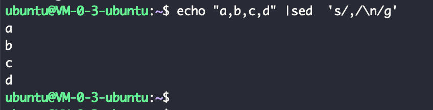
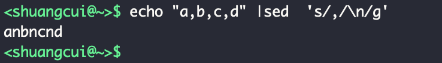
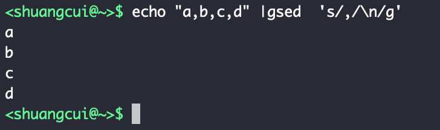

 

### 问题

<b>

（1）Windows系统里，文件每行结尾是'<回车><换行>', '\r\n'

（2）Mac系统里，       文件每行结尾是'<回车>'，即'\r'

（3）Unix系统里，      文件每行结尾是'<换行>'，即'\n'

所以，用'\n'作为作为换行符的文件，用Windows的记事本打开时 会没有换行；

而用'\r\n'作为换行符的文件（windows文件），用Linux或mac的vim打开时 会将\r显示成^M。
</b>

 

`echo "a,b,c,d" `  

在Mac或Linux系统下,以上结果皆为 
`a,b,c,d` 

现用sed,将","替换为换行,&nbsp;&nbsp;Linux系统下执行  
` echo "a,b,c,d" |sed  's/,/\n/g' `,  
结果为:
 

 

相同命令,在Mac下执行结果则为:
 

 

### 解决
通过安装gsed来解决,
 

`brew install gnu-sed`

然后使用gsed,

在bash_profile中加一条alias,用gsed替换掉sed

---

 

[更多相关问题,可参考](https://www.google.com/search?newwindow=1&rlz=1C5CHFA_enCN758CN758&sxsrf=ACYBGNRgj_G2k3S1PNhmPd8Zzs-Jfyor2g%3A1574328575244&ei=_1jWXeHFDvTXz7sPn_KXWA&q=sed%E5%91%BD%E4%BB%A4+mac+%E5%8C%BA%E5%88%AB&oq=sed%E5%91%BD%E4%BB%A4+mac+%E5%8C%BA%E5%88%AB&gs_l=psy-ab.3...295935.300081..300238...4.2..0.311.2569.0j2j7j1......0....1..gws-wiz.......0i71j0i12j0i8i30j33i160.jDax8rOLIAk&ved=0ahUKEwihwfL7_vrlAhX063MBHR_5BQsQ4dUDCAs&uact=5)
