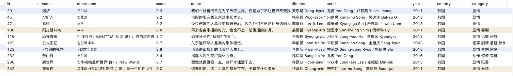
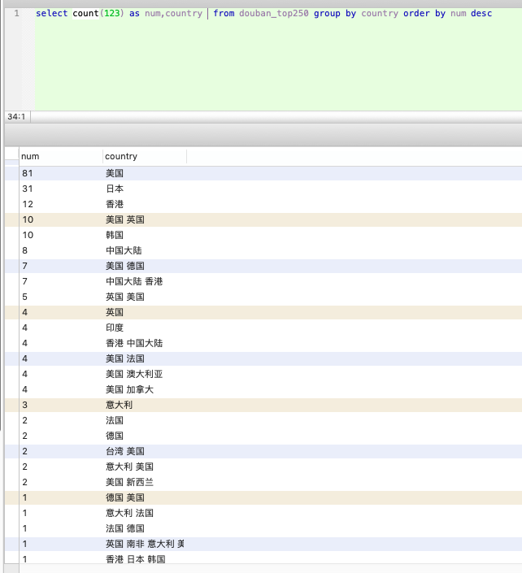
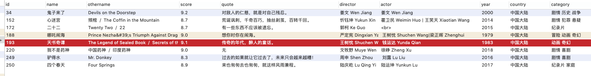
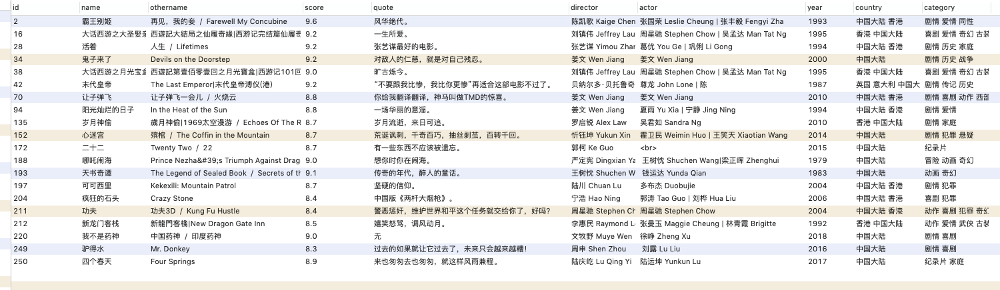
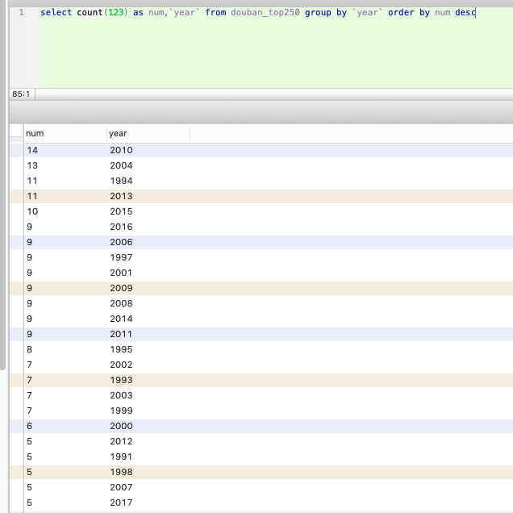
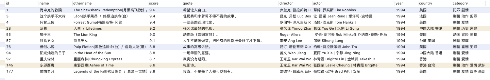
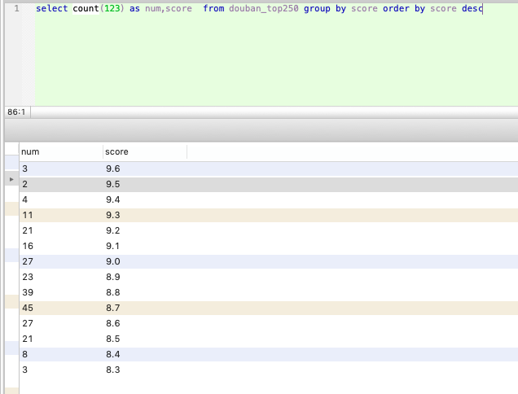
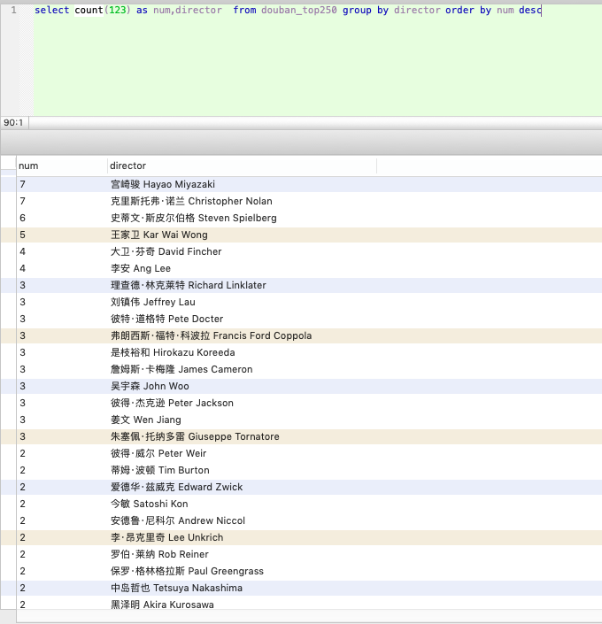
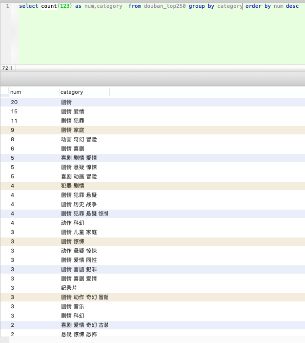

### 爬取&分析

<br>
豆瓣关闭了api接口，只好用爬虫方式，获取此刻Top250以及所看700余部影片的相关信息。

避开豆瓣设置的各种坑，略费周章将数据爬取&入库。简要分析如下:


- <1>.在此时间点，Top250中，韩国电影占据10席。排名最前的是<熔炉>，位列第20。这是自<辩护人>后我看的第二部韩国电影，从此彻底改变对其偏见，也为孔侑圈粉。



- <2>.Top250中，美国是独自完成数量最多的国家，有81部。日本和中国香港紧随其后，分别占31和12席。中国大陆占据8席，分别是姜文禁片<鬼子来了>，<心迷宫>，<二十二>，<哪吒闹海>，<天书奇谭>，<我不是药神>，<驴得水>，<四个春天>。如果扩大到“合拍作品”，则为20部。其中如<霸王别姬>，<活着>，<让子弹飞>，<可可西里>，<疯狂的石头>，主创团队绝大部分属中国大陆。

<div align=center></div>







- <3>.年份分布中，2010年是诞生Top250最多的一年，高达14部。2004年以13部紧随其后。众所周知的“电影奇迹年” 1994，有11部作品上榜，与2013年并列第三。这11部作品参见下图。

<div align=center></div>





- <4>.上榜作品中，评分最高的为9.6分，分别是常年占据榜首的<肖申克的救赎>，挤下<阿甘正传>跃升第二的<霸王别姬>，以及62年前的老片<控方证人>。8.7分是250部电影中，分布最多的一个区间，有45部。

<div align=center></div>


- <5>.导演方面，宫崎骏和诺兰以7部并列榜首。斯皮尔伯格，王家卫和李安以6部/5部/4部紧随其后。刘镇伟，吴宇森，姜文，各有3部入选。

<div align=center></div>


- <6>.类型方面，剧情片是无可撼动的霸主。


<div align=center> </div>


---

2013年，我极是欣赏的“贾科长”，有一部作品，将当时发生的一些轰动性社会事件串联在一起，果不其然，问世即被禁。…我看完<熔炉>，想到无论历史还是人口疆域都远不及我们的韩国电影，不说太远只联系最近几天的时事——女童失踪，豪车醉驾，栾川判决，山大学伴，猥亵幼女，稍微放开一个口子，艺术来源生活反映事实，我们完全可以有比韩国人波澜壮阔或入木三分得多得作品。


### 代码及sql建表语句

```PHP
<?php
$pdo = new PDO("mysql:host=127.0.0.1;dbname=future", "root", "123456");
$pdo->query('set names utf8');


function deal()
{

    for ($i = 0; $i <= 225; $i = $i + 25) {

        $url = "https://movie.douban.com/top250?start=" . $i . "&filter=";

        $rs = curl($url);

        $preg = '/<ol class="grid_view">[\s\S]*?<\/ol>/i';
        preg_match_all($preg, $rs, $res);

        $newStr = $res[0][0];

        $allArr = explode("</li>", $newStr);

        foreach ($allArr as $k => $str) {

            $reg2 = "#<span[^>]*>([\s\S]*?)</span>#i";

            $str = str_replace("&nbsp;", "", $str);
            preg_match_all($reg2, $str, $arr);
            
            $name = $arr[1][0];

            if (count($arr[1]) == 9) {
                $otherName = substr($arr[1][1], 1) . "|" . substr($arr[1][2], 1); //去掉开头的"/",两个名称拼接在一起
                $score = $arr[1][5];
                $quote = $arr[1][8];
            }

            if (count($arr[1]) == 8) {
                $otherName = substr($arr[1][1], 1);
                $score = $arr[1][4];
                $quote = $arr[1][7];
            }

            if (count($arr[1]) == 7) {
                $otherName = substr($arr[1][1], 1);
                $score = $arr[1][3];

                if ($score == "") {
                    $score = $arr[1][4]; //我是不是药神
                }
                $quote = $arr[1][6];

                if (strstr($quote, "评价")) {

                    $quote = "无";
                }
            }

            $reg3 = "#<p[^>]*>([\s\S]*?)</p>#i";
            preg_match_all($reg3, $str, $arr2);
            $infoStr = trim($arr2[1][0]);

            if ($infoStr == "") {
                continue;
            }

            $infoStr = str_replace("&nbsp;", "", $infoStr);
            $infoStr = str_replace("导演: ", "", $infoStr);
            $infoStr = str_replace("主演: ", "/", $infoStr);
            $infoStr = str_replace('...<br>', "/", $infoStr);

            $infoArr = explode("/", $infoStr);

            $director = str_replace("'", "", $infoArr[0]);//如海豚湾 主演: Richard O'Barry

            $actor = str_replace("'", "", $infoArr[1]);//如海豚湾 主演: Richard O'Barry

            if (count($infoArr) == 7) {

                $year = substr(trim($infoArr[4]), -4);
                $country = $infoArr[5];
                $category = $infoArr[6];

                //天书奇谭
                if (strstr($infoArr[4], '重映')) {
                    $year = trim($infoArr[3]);
                    $year = substr($year, 0, 4);
                }
            }
            
            if (count($infoArr) == 6 && $infoArr[2] != "") {
                $actor = $actor . "|" . str_replace("'", "", $infoArr[2]);
            }

            if (count($infoArr) == 6) {
                $year = substr(trim($infoArr[3]), -4);
                $country = $infoArr[4];
                $category = $infoArr[5];
            }

            if (count($infoArr) == 5) {
                $year = substr(trim($infoArr[2]), -4); //截取最后4位,当展示出的演员多于两位时,就会有此情况
                $country = $infoArr[3];
                $category = $infoArr[4];
            }
            
            //172,二十二
            if (count($infoArr) == 4) {
                $year = substr(trim($infoArr[1]), -4);
                $country = $infoArr[2];
                $category = $infoArr[3];
            }

            $sql = "insert into douban_top250(`name`,othername,score,`quote`,director,actor,`year`,country,category) VALUES ( '$name' , '$otherName','$score', '$quote','$director','$actor','$year','$country','$category')";
            global $pdo;
            $pdo->exec($sql);
        }
    }
}


function curl($domain)
{
    $ch = curl_init();
    curl_setopt($ch, CURLOPT_URL, $domain);
    curl_setopt($ch, CURLOPT_RETURNTRANSFER, 1);
    //若给定url自动跳转到新的url,有了下面参数可自动获取新url内容：302跳转
    curl_setopt($ch, CURLOPT_FOLLOWLOCATION, 1);  ### 该条设置十分重要,相当于curl的-L参数;但curl -L 61.com依然无法得到预期返回,上面方法中的添加www操作仍然不能少;但添加该设置后,一般可不用再尝试https,基本都会自动跳过去
    // 在尝试连接时等待的秒数
    curl_setopt($ch, CURLOPT_CONNECTTIMEOUT, 30);
    // 最大执行时间
    curl_setopt($ch, CURLOPT_TIMEOUT, 30);
    $output = curl_exec($ch);
    curl_close($ch);
    return $output;
}

deal();
```

---

```sql
CREATE TABLE `douban_top250` (
  `id` int(11) NOT NULL AUTO_INCREMENT,
  `name` varchar(255) DEFAULT NULL COMMENT '电影名称',
  `othername` varchar(255) DEFAULT NULL COMMENT '其他名称',
  `score` varchar(255) DEFAULT NULL COMMENT '评分',
  `quote` varchar(255) DEFAULT NULL COMMENT '评价',
  `director` varchar(255) DEFAULT NULL COMMENT '导演',
  `actor` varchar(255) DEFAULT NULL COMMENT '主演',
  `year` varchar(255) DEFAULT NULL COMMENT '年份',
  `country` varchar(255) DEFAULT NULL COMMENT '国家',
  `category` varchar(255) DEFAULT NULL COMMENT '类型',
  PRIMARY KEY (`id`)
) ENGINE=InnoDB AUTO_INCREMENT=251 DEFAULT CHARSET=utf8
```