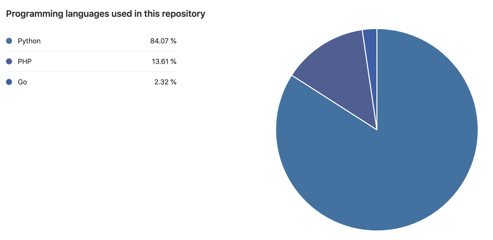
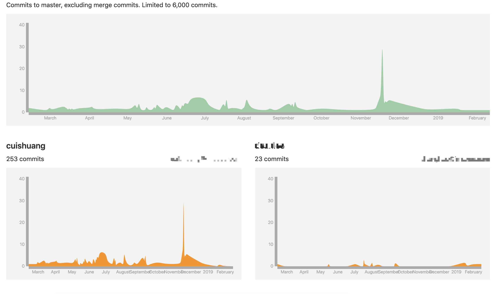
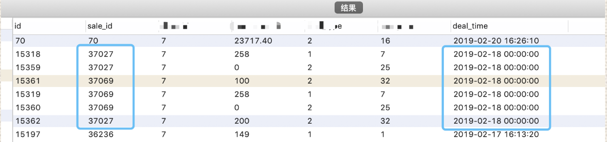
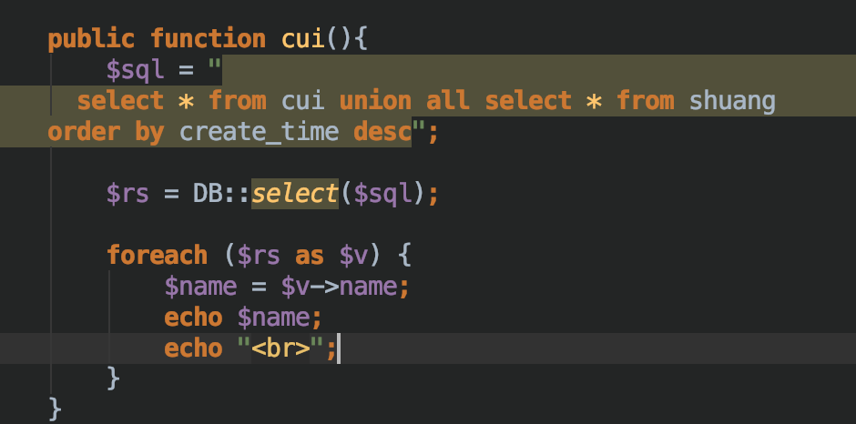
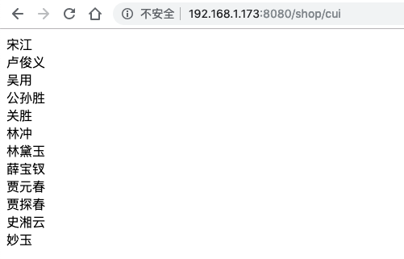
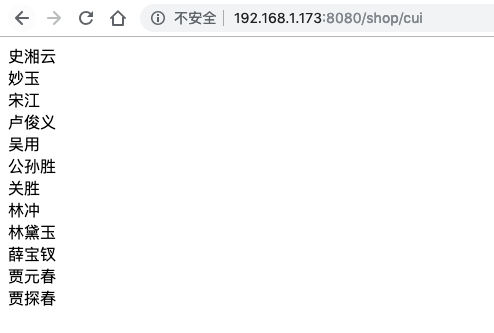
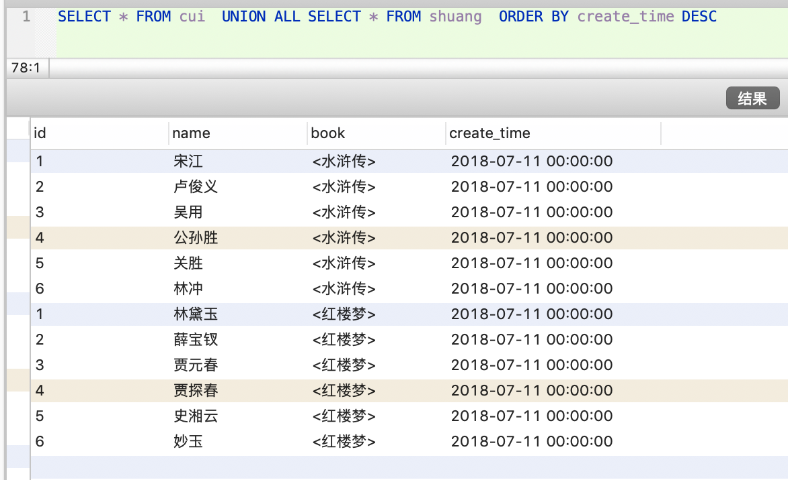
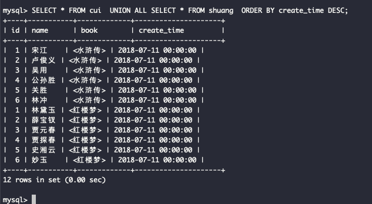
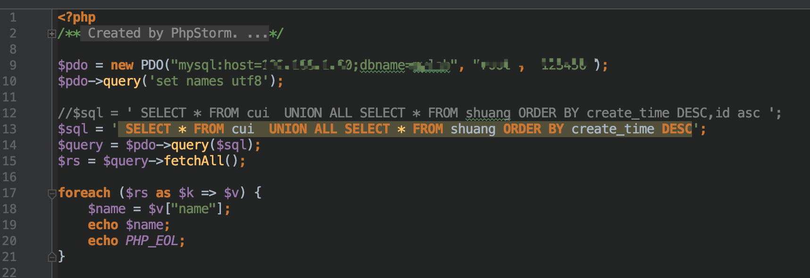
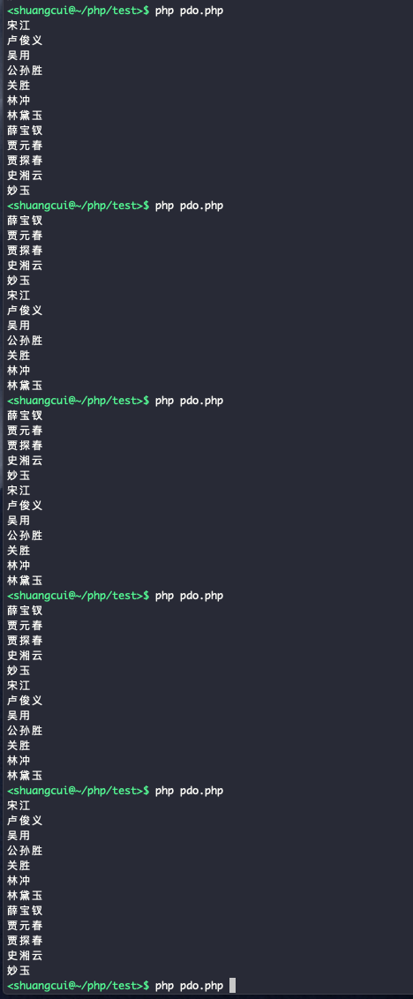

>1785年，卡文迪许在实验中发现，把不含水蒸气、二氧化碳的空气除去氧气和氮气后，仍有很少量的残余气体存在。这种现象在当时并没有引起化学家的重视。
一百多年后，英国物理学家瑞利测定氮气的密度时，发现从空气里分离出来的氮气每升质量是1.2572克，而从含氮物质制得的氮气每升质量是1.2505克。经多次测定，两者质量相差仍然是几毫克。--- <氩气的发现>
[点击查看更多](http://www.bast.net.cn/art/2016/7/25/art_16694_314978.html)


### 对账系统的核心计算部分在定时任务timetask项目中,其中python脚本从sql server中按规则获取并计算当天符合条件的记录,写入到mysql中;展示部分(店主端)属于早期项目,没有用golang,用php的lumen框架,从mysql相应表中查取数据

<br>



<br>

### 后来同事反应,店主端资金明细展示,出现重复或者漏项等情况.查看了数据库,数据本身并无问题,不存在重复或缺少,于是推出是展示部分出现了问题

- 看了一下sql语句,因业务要求,这段sql由几个union all拼接而成,然后有order by,再limit;于是推断每次请求查出的结果不同(每次顺序会变化),再经过limit分页,就出现了所谓的数据"重复"和"缺漏"

- 网上很多关于union all order by 导致乱序的问题,但我这段sql,并不会如此;

- 后来发现顺序发生改变的一个原因,是有几条记录order by的字段完全一样;看上去只需要再加一个order by的字段如id asc,就可以解决问题



### 但不想就此停止,因为看上去用navicat执行这段sql,无论多少次,结果顺序都是稳定的;为了深入研究,抽象化后建了两张表

```sql
CREATE TABLE `cui` (
  `id` int(11) NOT NULL AUTO_INCREMENT,
  `name` varchar(255) DEFAULT '',
  `book` varchar(255) DEFAULT NULL,
  `create_time` datetime DEFAULT CURRENT_TIMESTAMP,
  PRIMARY KEY (`id`)
) ENGINE=InnoDB AUTO_INCREMENT=7 DEFAULT CHARSET=utf8

insert into `你的库名`.`cui` ( `id`, `name`, `book`, `create_time`) values ( '1', '宋江', '<水浒传>', '2018-07-11 00:00:00');
insert into `你的库名`.`cui` ( `id`, `name`, `book`, `create_time`) values ( '2', '卢俊义', '<水浒传>', '2018-07-11 00:00:00');
insert into `你的库名`.`cui` ( `id`, `name`, `book`, `create_time`) values ( '3', '吴用', '<水浒传>', '2018-07-11 00:00:00');
insert into `你的库名`.`cui` ( `id`, `name`, `book`, `create_time`) values ( '4', '公孙胜', '<水浒传>', '2018-07-11 00:00:00');
insert into `你的库名`.`cui` ( `id`, `name`, `book`, `create_time`) values ( '5', '关胜', '<水浒传>', '2018-07-11 00:00:00');
insert into `你的库名`.`cui` ( `id`, `name`, `book`, `create_time`) values ( '6', '林冲', '<水浒传>', '2018-07-11 00:00:00');

```

```sql
CREATE TABLE `shuang` (
  `id` int(11) NOT NULL AUTO_INCREMENT,
  `name` varchar(255) DEFAULT '',
  `book` varchar(255) DEFAULT NULL,
  `create_time` datetime DEFAULT CURRENT_TIMESTAMP,
  PRIMARY KEY (`id`)
) ENGINE=InnoDB AUTO_INCREMENT=7 DEFAULT CHARSET=utf8

insert into `你的库名`.`shuang` ( `id`, `name`, `book`, `create_time`) values ( '1', '林黛玉', '<红楼梦>', '2018-07-11 00:00:00');
insert into `你的库名`.`shuang` ( `id`, `name`, `book`, `create_time`) values ( '2', '薛宝钗', '<红楼梦>', '2018-07-11 00:00:00');
insert into `你的库名`.`shuang` ( `id`, `name`, `book`, `create_time`) values ( '3', '贾元春', '<红楼梦>', '2018-07-11 00:00:00');
insert into `你的库名`.`shuang` ( `id`, `name`, `book`, `create_time`) values ( '4', '贾探春', '<红楼梦>', '2018-07-11 00:00:00');
insert into `你的库名`.`shuang` ( `id`, `name`, `book`, `create_time`) values ( '5', '史湘云', '<红楼梦>', '2018-07-11 00:00:00');
insert into `你的库名`.`shuang` ( `id`, `name`, `book`, `create_time`) values ( '6', '妙玉', '<红楼梦>', '2018-07-11 00:00:00');


```

- ***经过多次实践发现,用lumen或者pdo执行几次后,最开始几次一定会乱序,随着执行次数的增多,会渐"趋于稳定",这是个神奇的现象;为复现顺序会变,可多次修改表名 ***

- 在lumen中写一个方法测验:


<br>

<br>

<br>

<br>


- navicat中的执行结果如下,无论执行多次,返回值始终幂等如一


- 但此时还不能认为是lumen存有问题,也许是navicat做了什么处理,还需要查看执行原始sql的结果;见下图,执行多次亦始终如一


- 其实这里还有一个小问题,那就是虽然同样"稳定",但navicat和命令行执行结果,可能出现不一样的情况...即用navicat执行上面这段sql无论多少次,返回的结果始终如a不会改变;命令行执行这段sql无论多少次,始终如b,但a和b顺序可能不同;这是实践得出的一个非必现的诡异现象

- 在我准备给lumen提pr时,h哥提出,还要看看php的mysql扩展(在此即pdo)有无问题.框架的orm操作基于php的mysql扩展,如果上游数据即会变序,lumen这里肯定会每次执行顺序不同


- pdo直连数据库,代码及结果如下:





<br>

- 在pdo这一步,如果union all中order by的字段存在相同的情况,就会发生乱序;不知道这是扩展的bug,还是官方已说明如此,为此,需要和PECL进行沟通;

### 我们多只是使用,对于其更深层次的具体实现和原理,其实还缺乏足够认知...这是需要补充加强处


