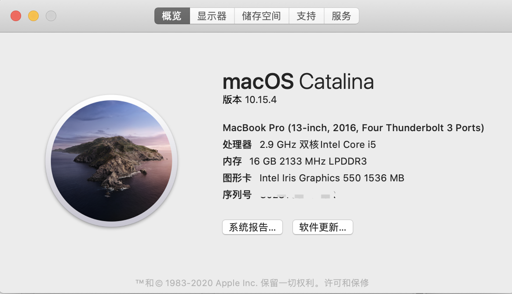
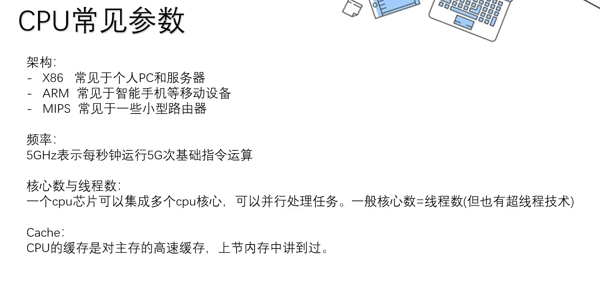
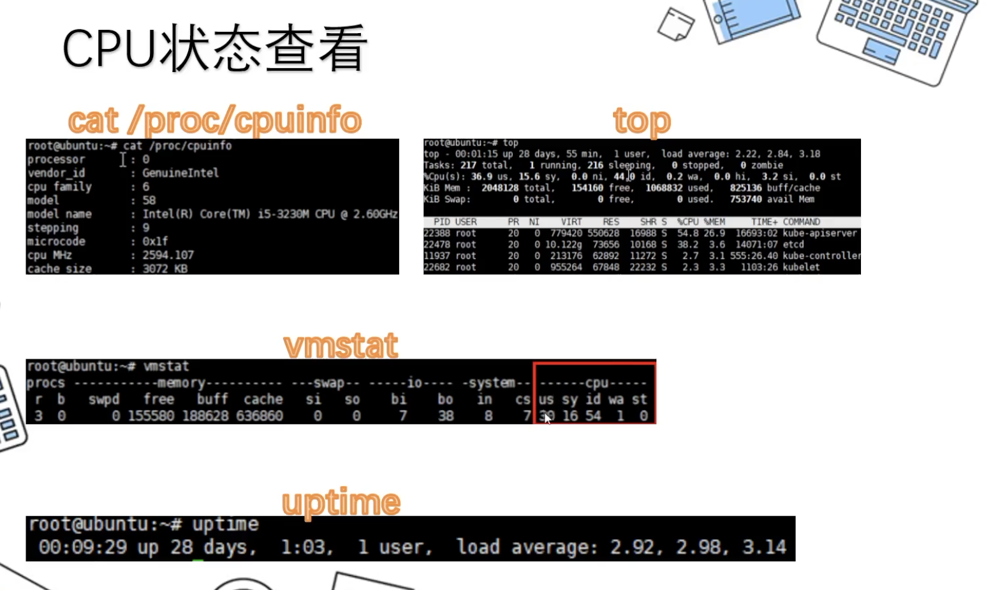
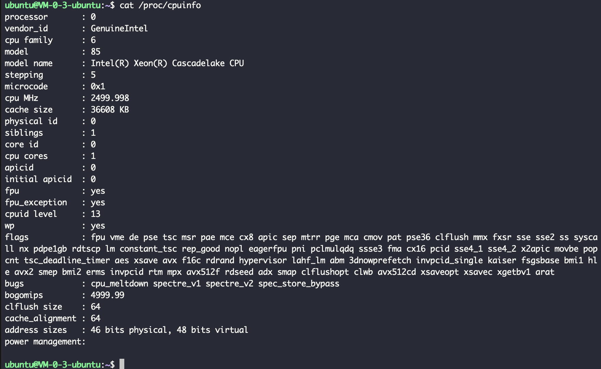
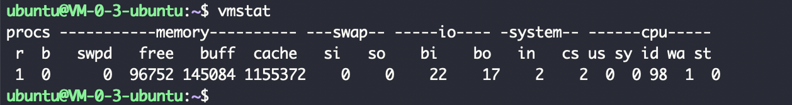
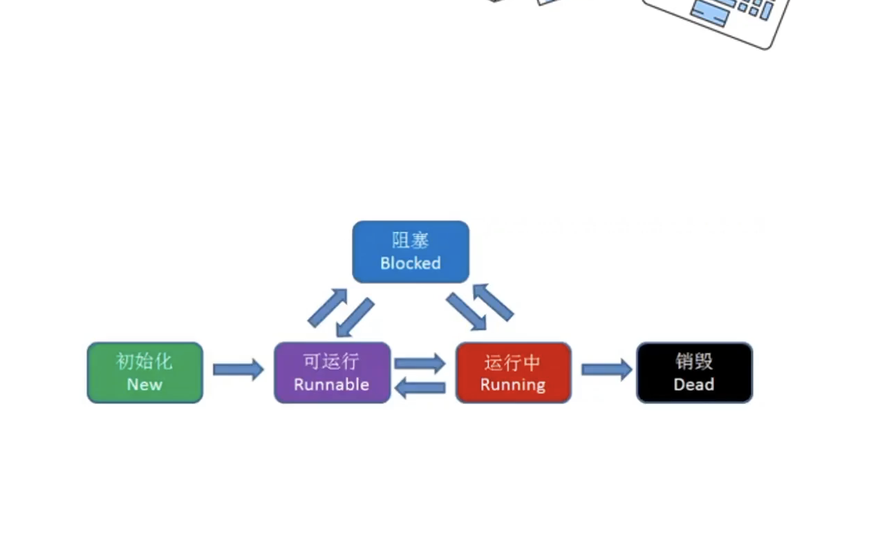
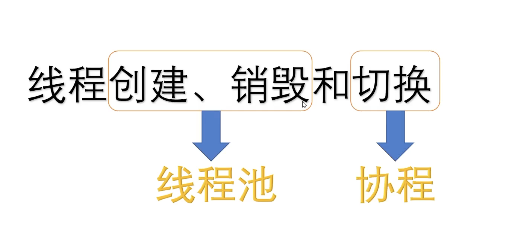
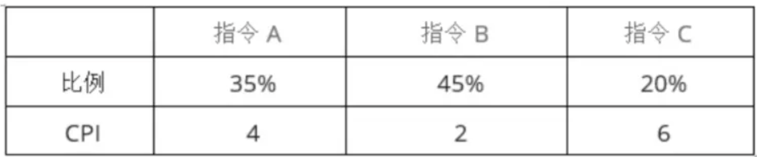

2.9G Hz,即每秒进行2.9G次运算(即29亿次)

 

几个命令

- us: 用户使用的cpu

- sy: 系统(内核)使用的cpu

- id: idle,即空闲cpu

- wa: 等待I/O的cpu

- st: 开虚拟机后会有的一个指标,即虚拟机的cpu使用率

 

---

 

一个进程拥有一整套虚拟地址空间,该进程的所有线程都共享该地址空间.

线程是CPU运算的最小单位.CPU不关注是哪个进程,只是轮换着线程来运行,不需要知道该线程属于哪个进程.

 

#### 线程的五种状态:

只有`运行中`占用CPU资源,其他包括阻塞状态,都不占用CPU资源.

使用**线程池**,可以优化线程`创建/销毁`带来的性能损耗(申请cpu计算资源需进入内核态)

协程是用户自定义的线程,不需要进入内核态进入申请计算资源.(这里的用户就是指应用程序及编程语言了..)

 

---

 

#### CPU性能衡量参数

 

##### 主频

 

**主频**又称*时钟频率*，指CPU内部晶振的频率，常用单位为MHz或GHz，它反映了CPU的基本工作节拍;

一般用 **f** 表示  (frequency)

 

##### 时钟周期

 

时钟周期 $ t = \frac{1}{f} $

即 `时钟周期 = 主频的倒数`

 

##### 机器周期

 

机器周期  = m`*`t 

一个**机器周期**包含若干个*时钟周期*

 

##### 指令周期

 

指令周期 = m`*`t`*`n
 
执行一条指令所需要的时间，一般包含若干个*机器周期*

 

##### CPI

 

CPI = m`*`n;  

每条指令的平均时钟周期个数

指令周期 = CPI×机器周期 = n（CPI=n）×m×时钟周期=nm/主频f

注意指令周期单位是s或者ns，CPI无量纲

 

##### MIPS(MillionInstructions Per Second）

 

 MIPS = 每秒执行百万条指令数 = 1/（CPI×时钟周期）= 主频/CPI

MFLOPS 每秒百万浮点运算次数。

表示秒钟所能执行的指令条数，对于微型计算机, 可用CPU的主频和每条指令执行所需的时钟周期来衡量。

 

包含关系：指令周期通常用若干个机器周期来表示，在机器语言中，使用执行一条指令所需要的机器周期数来说明指令执行的速度。而机器周期又包含若干个时钟周期。时钟周期是最基本的操作单位。

注意：计算机的运算速度一般用每秒钟所能执行的指令条数来表示。由于不同类型的指令所需时间长度不同，因而运算速度的计算方法也不同。例如，根据不同类型的指令出现的频度，乘上不同的系数求得统计平均值，得到平均运算速度。这种方法用MIPS(Millions of Instruction Per Second)作单位，即每秒百万条指令。

又如，直接给出CPU的主频和每条指令的执行所需的时钟周期。周期一般以MHz为单位。主频即计算机的时钟频率，它在很大程度上决定了主机的工作速度。例如，型号为486DX-133的微型计算机，表明它的CPU型号为486，DX为含浮点处理器，数字133的含义是主频为133MHz。

---

 

#### 例题

 

> <1>： 若某处理器的时钟频率为500MHz，每4个时钟周期组成一个机器周期，执行一条指令需要3个机器周期，则该处理器的一个机器周期▁8▁ns，平均执行速度为▁42▁MIPS

 

解析如下：

时钟周期T等于主频的倒数，即T=1/500MHz=1/（0.5×10的9次方Hz）=2 ns，机器周期等于4个时钟周期即=4T=4×2 ns=8 ns，每条指令的时钟周期数CPI=3×4=12，则平均速度为：f/（CPI×10的6次方）=（500×10的6次方）/（12×10的6次 方）=500/12=41.6≈42MIPS.计算主频的倒数时要注意把主频的MHz换算成Hz即500后面加6个0=500×10的6次方=0.5×10的9次方，1/10的9次方 Hz=1ns

每条指令的时钟周期数CPI=3×4=12，执行一条指令需要3个机器周期数，一个机器周期包含4个时钟周期，所以CPI=3×4=12，这里计算 的都是周期的个数，和具体的时间ns纳秒没有关系，若带上具体的时间，一个时钟周期T=2ns，一个机器周期就是2×4=8ns，执行一条指令需要三个机 器周期得出执行一条指令需要的具体时间为3×8=24ns，执行每条指令的需要的时钟周期数CPI换句话说就是把执行每条指令需要的时间24ns换算成时 钟周期个数表示，为多少个时钟周期个数?时钟周期是最基本的时间操作单位，500MHz主频的处理器一个时钟周期为2ns，24ns等于多少个时钟周期？24/2=12个时钟周期，即那一句：“每条指令的时钟周期数CPI=12”。

 

---

 

> <2>:某计算机系统的CPU主频为2.8GHz。某应用程序包括3类指令，各类指令的CPI(执行每条指令所需要的时钟周期数)及指令比例 如下表所示。

执行该应用程序时的平均CPI为（  ）；

A、25               B、3            C、3.5             D、4  

运算速度用MIPS表示，约为（  ）。

A、700               B、800             C、930            D、1100  

 

解:

(1) 求 平均CPI,即对列出的CPI求平均数

4`*`35% + 2`*`45% + 6`*`20% = 3.5

 

(2) 求MIPS,即每秒执行的百万条指令数

根据第一问CPI，每条指令需要的时钟周期为4，每个时钟周期为主频的倒数，即1/2.8G秒，则每条指令需要时间3.5/2.8G秒。

每秒执行指令数为`1/(3.5/2.8G)=2.8G/3.5=0.8G=800M`。

（1M=106，1G=109）

 

---

 

拓展阅读：

[阮一峰-为什么寄存器比内存快？](http://www.ruanyifeng.com/blog/2013/10/register.html)

[阮一峰-汇编语言入门教程](http://www.ruanyifeng.com/blog/2018/01/assembly-language-primer.html)

[CPU性能衡量参数-主频，MIPS，CPI，时钟周期，机器周期，指令周期](https://blog.csdn.net/xiaojianpitt/article/details/7613489)