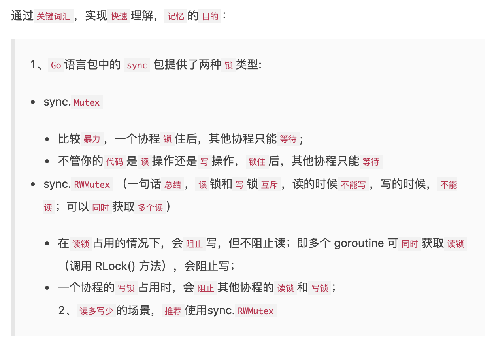

## 基本原语

 

### sync.Mutex与sync.RWMutex

 

互斥锁**sync.Mutex**比较暴力,一个协程锁住后,其他协程只能等待;而不管这个协程是读操作还是写操作.

读写(互斥)锁**sync.RWMutex**是细粒度的互斥锁, 它不限制资源的并发读. 但是读写、写写操作无法并行执行.

> 一个常见的服务对资源的读写比例会非常高，因为大多数的读请求之间不会相互影响，所以我们可以读写资源操作的分离，在类似场景下提高服务的性能。 **读多写少**的场景,推荐使用**sync.RWMutex**

二者的区别,有点类似mysql的排它锁(X锁/写锁)和共享锁(S锁/读锁)

 

[sync包--Mutex](https://dashen.tech/2019/05/08/sync%E5%8C%85-Mutex/)

sync.RWMutex的实现需要基于**sync.Mutex**

 

---

 

### sync.Waitgroup

 

[sync包-Waitgroup实现原理](https://dashen.tech/2017/07/25/sync%E5%8C%85-Waitgroup%E5%AE%9E%E7%8E%B0%E5%8E%9F%E7%90%86/)

依赖了**sync.Mutex**

 

---

 

### sync.Once

 

[sync.Once-保证运行期间的某段代码只会执行一次](https://dashen.tech/2019/10/14/sync-Once-%E4%BF%9D%E8%AF%81%E8%BF%90%E8%A1%8C%E6%9C%9F%E9%97%B4%E7%9A%84%E6%9F%90%E6%AE%B5%E4%BB%A3%E7%A0%81%E5%8F%AA%E4%BC%9A%E6%89%A7%E8%A1%8C%E4%B8%80%E6%AC%A1/)

依赖了**sync.Mutex**

 

---

 

### sync.Cond

 

[sync.Cond-让一系列Goroutine在满足特定条件时被唤醒](https://dashen.tech/2020/10/07/sync-Cond-%E8%AE%A9%E4%B8%80%E7%B3%BB%E5%88%97Goroutine%E5%9C%A8%E6%BB%A1%E8%B6%B3%E7%89%B9%E5%AE%9A%E6%9D%A1%E4%BB%B6%E6%97%B6%E8%A2%AB%E5%94%A4%E9%86%92/)

依赖了**sync.Mutex**

 

---

 

## 扩展原语

 

### ErrGroup

 

[ErrGroup-有错误返回的Goroutine控制](https://dashen.tech/2020/10/15/ErrGroup-%E6%9C%89%E9%94%99%E8%AF%AF%E8%BF%94%E5%9B%9E%E7%9A%84Goroutine%E6%8E%A7%E5%88%B6/)

 

---

 

### Semaphore

 

[Semaphore-带权重的信号量](https://dashen.tech/2020/10/15/Semaphore-%E5%B8%A6%E6%9D%83%E9%87%8D%E7%9A%84%E4%BF%A1%E5%8F%B7%E9%87%8F/)

 

---

 

### SingleFlight

 

[SingleFlight-抑制对下游多次重复请求,防止缓存击穿的利器](https://dashen.tech/2020/10/15/SingleFlight-%E6%8A%91%E5%88%B6%E5%AF%B9%E4%B8%8B%E6%B8%B8%E5%A4%9A%E6%AC%A1%E9%87%8D%E5%A4%8D%E8%AF%B7%E6%B1%82-%E9%98%B2%E6%AD%A2%E7%BC%93%E5%AD%98%E5%87%BB%E7%A9%BF%E7%9A%84%E5%88%A9%E5%99%A8/)

 

---

 

## 番外:并发安全的几个工具

 

### sync.Pool

 

[sync包-Pool](https://dashen.tech/2017/10/20/sync%E5%8C%85-Pool/)

 

---

 

### sync.Map

 

[sync包-Map](https://dashen.tech/2010/03/02/sync%E5%8C%85-Map/)

[golang之map并发访问](https://dashen.tech/2019/01/18/golang%E4%B9%8Bmap%E5%B9%B6%E5%8F%91%E8%AE%BF%E9%97%AE/)

 

---

 

参考:

[同步原语与锁](https://draveness.me/golang/docs/part3-runtime/ch06-concurrency/golang-sync-primitives/)