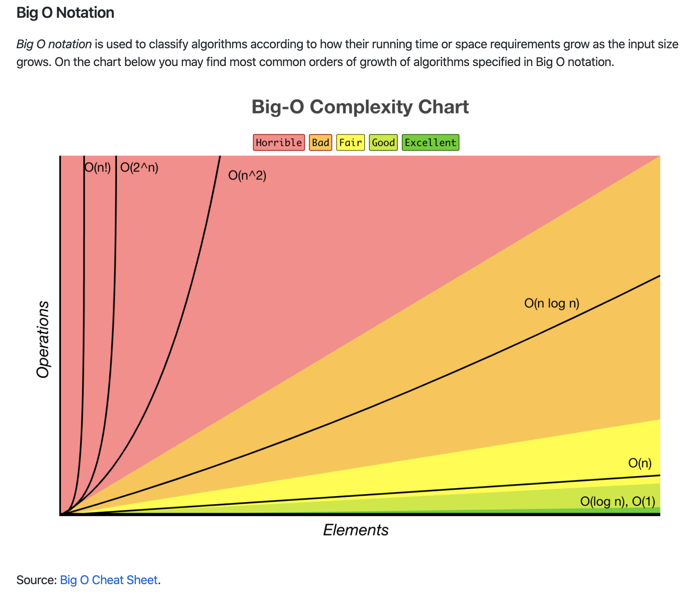
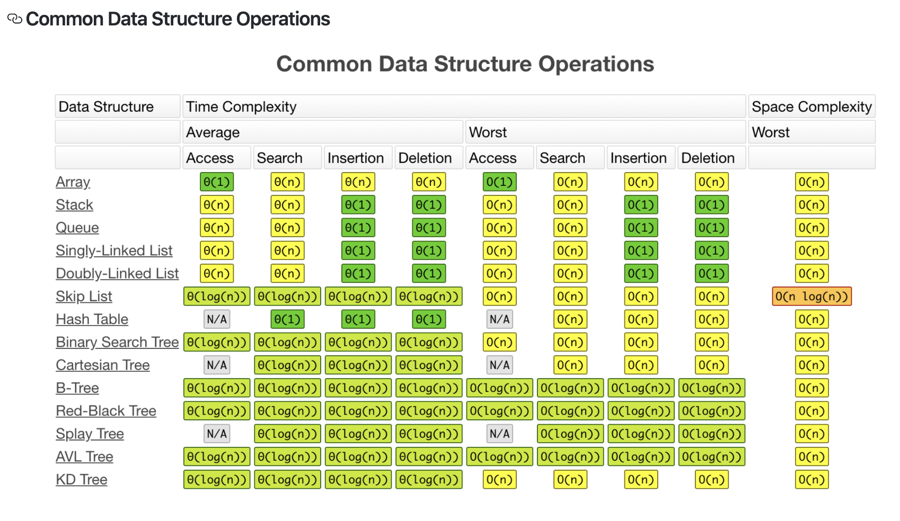
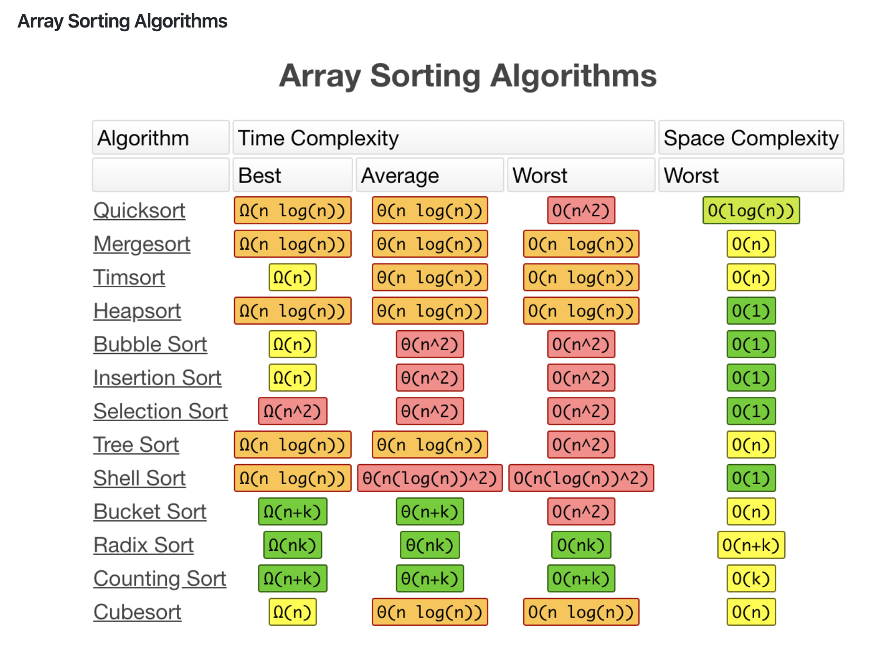

 

## 第三方库

 

[golang-algorithms](https://github.com/TomorrowWu/golang-algorithms)

 

---

 

另外几个不错的库:

- [GoDS](https://github.com/emirpasic/gods): GoDS (Go Data Structures). Containers (Sets, Lists, Stacks, Maps, Trees), Sets (HashSet, TreeSet, LinkedHashSet), Lists (ArrayList, SinglyLinkedList, DoublyLinkedList), Stacks (LinkedListStack, ArrayStack), Maps (HashMap, TreeMap, HashBidiMap, TreeBidiMap, LinkedHashMap), Trees (RedBlackTree, AVLTree, BTree, BinaryHeap), Comparators, Iterators, …

- [argo](https://github.com/csunny/argo/): 使用go语言实现数据结构与算法，涵盖字符串、数组、链表、队列、栈、树、图等数据结构。在实现算法的基础上，进行go语言实战。此外也包含经典算法在go实战项目中的应用，以及开源项目算法方面源码分析。 

https://studygolang.com/topics/3172

https://hansedong.github.io/2019/04/02/15/

https://my.oschina.net/u/615967/blog/689219

https://www.jianshu.com/p/d1f9a309f364

---

 

## 自己实现

 

### list

 

### set

### 二叉树
