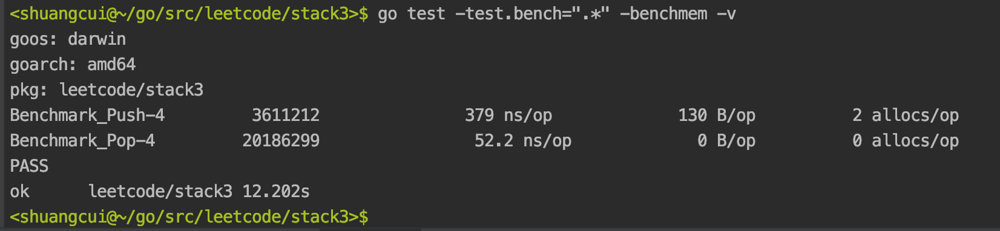

<br>


### 简述:

<br>

测试分为**单元测试**（测试功能,Unit Test,简称UT）和**基准测试**（测试性能,Benchmark Test,简称BMT）。

<br>

对于xx.go文件, 使用xx_test.go作为其对应的测试文件.

```go
go test -v -run="指定函数名"
```


`-v` 表示冗余(verbose)输出,其实并不是一般理解的"可视化"(visualize)

---


<br>

### 单元测试:

<br>


对于**单元测试**,函数名以Test开头, 接收一个指针型参数（*testing.T）


<br>

---

<br>

### 基准测试:

<br>

**基准测试**以Benchmark开头, 接收一个指针型参数（*testing.B）

```go
go test -v -run="none" -bench=.
```

- -run="none", 不允许单元测试, 运行所有基准测试.
- -bench 可以指定函数名, 支持正则.
- -benchmem 表示分配内存的次数和字节数.
- -benchtime="3s" 表示持续3秒.


<br>

如:

```go
package main

import (
	"strconv"
	"testing"
)

var stack *ItemStack

func init() {
	stack = NewStack()
}

func Benchmark_Push(b *testing.B) {
	for i := 0; i < b.N; i++ { //use b.N for looping
		now := strconv.Itoa(i)
		stack.Push("test" + now)
	}

	//fmt.Println(stack)
}

func Benchmark_Pop(b *testing.B) {
	b.StopTimer() //类似时间锁,在StopTimer()和StartTimer()之见的代码,不计入测量
	for i := 0; i < b.N; i++ { //use b.N for looping
		now := strconv.Itoa(i)
		stack.Push("test" + now)
	}
	b.StartTimer()
	for i := 0; i < b.N; i++ { //use b.N for looping
		stack.Pop()
	}
}
```

<br>





- 379 ns/op 表示每次操作耗时379纳秒
- 130 B 表示每次操作 用了130字节(Byte)
- 2 allocs 表示每次操作分配2次内存

<br>

---


<br>

参考:

[go test命令（Go语言测试命令）完全攻略](http://c.biancheng.net/view/124.html)

[golang 测试，单元测试和基准测试](https://blog.csdn.net/hjmnasdkl/article/details/81304329)


[译文 Go 高性能系列教程之一：基准测试](https://zhuanlan.zhihu.com/p/376796701)

