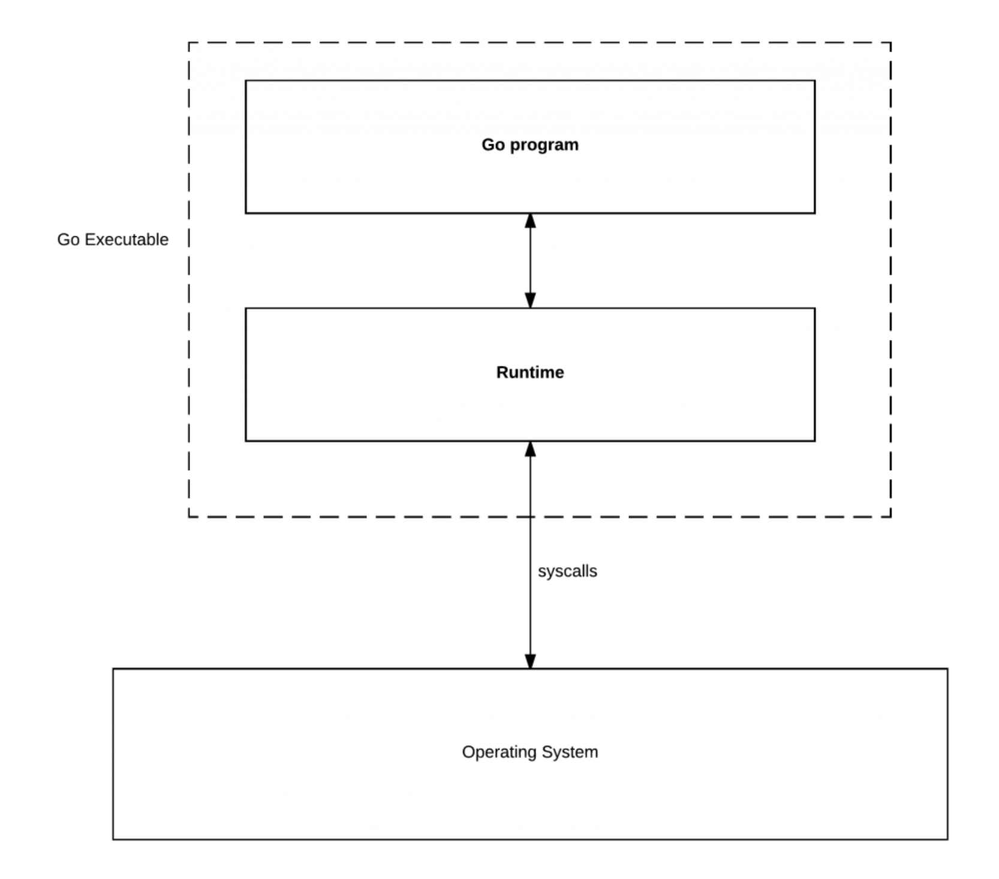
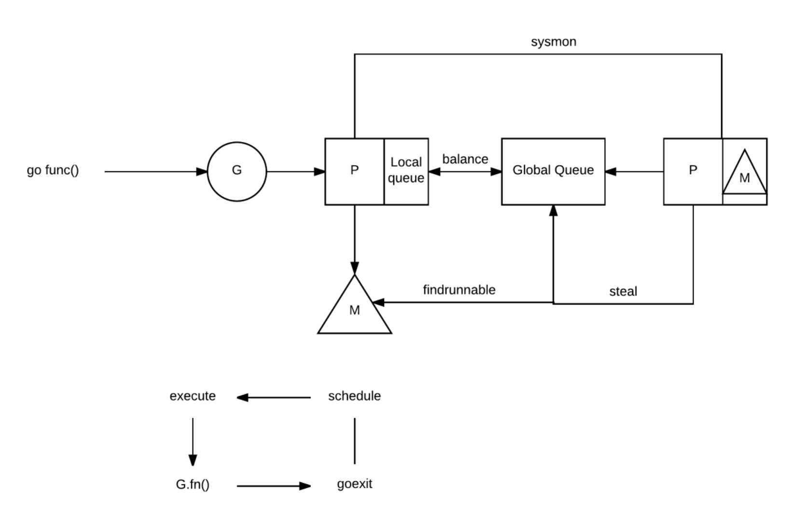

<br>


参考:

[Golang源码探索(二) 协程的实现原理](https://www.cnblogs.com/zkweb/p/7815600.html)

[Goroutine调度机制](https://blog.csdn.net/u013474436/article/details/104760880)

[Go 调度器](https://colobu.com/2017/05/04/go-scheduler/)

[深入Go语言 - 8](https://colobu.com/2016/06/27/dive-into-go-8/)


[golang 在 runtime 中的一些骚东西](https://mp.weixin.qq.com/s/GSdLAAWphI_z83jSRndEqA)


<br>


---


<font size=4>1.基础</font>

<br>

<font size=3> 1.1 关于*运行时*</font>

Go的**运行时**(runtime)管理着<font color="#9AFF9A"><b>调度(scheduler)</b></font>、<font color="#8EE5EE"><b>垃圾回收(GC)</b></font>以及<font color="#F4A460"><b>goroutine的运行环境</b></font>,此篇只探讨**调度**


Go的**运行时**负责运行goroutine, 并把它们映射到操作系统的**线程**(thread,包含在进程之中, 是进程中的实际运作单位, 是独立调度和分派的基本单位)上。goroutine比线程还轻量, 启动的时候花费很少.  

每个goroutine都是由一个 <font color="#006400"><b>G</b></font> 结构来表示，这个结构体的字段用来跟踪此goroutine的栈(stack)和状态，

所以可以认为**G = goroutine**

<br>

**runtime** 管理着 <font color="#006400"><b>G</b></font> 并把它们映射到**Logical Processor**(称之为<font color="#DC143C"><b>P </b></font>). 

<font color="#DC143C"><b>P</b></font> 可以看作是一个抽象的资源或者一个上下文，它需要获取以便**操作系统线程**(称之为 <font color="#104E8B"><b>M</b></font> )可以运行 <font color="#006400"><b>G</b></font>。


通过
```go
runtime.GOMAXPROCS (numLogicalProcessors)
```
可以控制多少<font color="#DC143C"><b>P</b></font>可以获取

<br>




<br>

操作系统运行**线程**，*线程运行你的代码*。Go的技巧是编译器会在Go**运行时**的一些地方插入系统调用，（如通过channel发送值,调用runtime包等），所以Go可以通知调度器执行特定的操作。


---


<br>

<font size=4>2. GPM之间的交互</font>

<br>

 <font color="#006400"><b>G</b></font> :

Goroutine，每个Goroutine对应一个G结构体，G存储Goroutine的运行堆栈、状态以及任务函数，可重用。

<font color="#DC143C"><b>P</b></font> :

Processor，是一个抽象的概念，代表了Machine所需的上下文环境(context)，是处理用户级代码逻辑的处理器。可译为"逻辑处理器"，G只有绑定到P上才可以被调度，存放Goroutine队列（local runqueue），P的数量决定了系统真正可并行的最大G数量，P的数量由GOMAXPROCS()决定。


<font color="#104E8B"><b>M</b></font> :

Machine Thread, 指go语言对一个关联的内核线程的封装。 OS线程，G所依赖的系统级线程，亦即真正执行计算的资源，M里面维护了小对象内存，当前执行的goroutine，以及其他很多信息。


<font color="#8B1A1A"><b>Local Runqueue</b></font> :

`本地运行队列`

由P所维护的G队列，每次从local runqueue中取出可执行的Goroutine


<font color="#473C8B"><b>Global Runbqueue</b></font> :

`全局运行队列`

由go调度器所维护的全局G队列，当Local Runqueue中没有G的时候，P就会从Global Runqueue中取出可执行的G


<br>




<br>

Go`运行时` 存在两种类型的queue： 一种是一个全局的queue(在`schedt结构体`中，很少用到)， 一种是每个 <font color="#DC143C"><b>P</b></font> 都维护自己的 <font color="#006400"><b>G</b></font> 的queue。

为了运行`goroutine`, <font color="#104E8B"><b>M</b></font> 需要持有上下文 <font color="#DC143C"><b>P</b></font> 。<font color="#104E8B"><b>M</b></font> 会从 <font color="#DC143C"><b>P</b></font> 的queue弹出一个goroutine并执行。

当你创建一个新的goroutine的时候(go func())，它会被放入 <font color="#DC143C"><b>P</b></font> 的queue。当然还有一个 [work-stealing调度算法](https://studygolang.com/articles/27146?fr=sidebar)，当 <font color="#104E8B"><b>M</b></font> 执行了一些  <font color="#006400"><b>G</b></font> 后,如果它的queue为空，它会随机的选择另外一个 <font color="#DC143C"><b>P</b></font> ,从它的queue中取走一半的 <font color="#006400"><b>G</b></font> 到自己的queue中执行。(偷..)

当你的goroutine执行阻塞的系统调用时(syscall)，阻塞的系统调用会中断(intercepted)，如果当前有一些 <font color="#006400"><b>G</b></font> 在执行，运行时会把这个线程从 <font color="#DC143C"><b>P</b></font> 中摘除(detach)，然后再创建一个新的操作系统的线程(如果没有空闲的线程可用的话)来服务于这个 <font color="#DC143C"><b>P</b></font> 。

当系统调用继续的时候，这个goroutine被放入到本地运行queue，线程会park它自己(休眠)， 加入到空闲线程中。

如果一个goroutine执行网络调用，`运行时`会做类似的动作。调用会被中断，但是由于Go使用集成的network poller,它有自己的线程，所以还给它。

Go`运行时`会在下面的goroutine被阻塞的情况下运行另外一个goroutine：

- blocking syscall (for example opening a file),
- network input,
- channel operations,
- primitives in the sync package.


---

<br>


<font size=4>3.Goroutine调度机制</font>


<br>


<font size=3>3.1 GPM都是如何被创建出来</font>

<font color="#8B4500">
G :

在可执行函数前面加关键字go即可，这样便创建出了一个Goroutine，**创建出的Goroutine会进入P所维护的Local Runqueue**


P :

指定GOMAXPROCS之后，会在程序运行之初创建好对应数目的P


M :

当满足以下三个条件以后，M就会被创建：
1.队列中G太多<br>
2.系统级线程M太少<br>
3.有空闲的P

</font>

<br>


<font size=3>3.2 M和P之间的调度</font>


<br>

P是在程序运行之初就创建好的，数量由GOMAXPROCS决定（最大256个），从go1.5以后默认即CPU的核数，1.5之前默认是一个。P绑定到M上执行运算，**当一个OS线程也就是一个M陷入阻塞的时候**，会释放出P，P转而寻找另一个M（M可能是被新创建，也可能来自于线程缓存），继续执行其他G，如果没有其他的idle M，但是P的`local runqueue`中仍有G需要执行，就会创建一个新的M。

当上述阻塞完成后，G会尝试寻找一个idle的P进入它的`Local Runqueue`中恢复执行，如果没有找到，G就会进入`Global Runqueue`，等待其他P从队列中取出。

对M&P的调度有了一个大概了解后，再继续深入理解上述的阻塞，什么情况下会阻塞呢？如下：

- blocking syscall (for example opening a file)
- *network input* (已通过[netpoller](https://cloud.tencent.com/developer/article/1234360)实现了网络I/O阻塞不会导致M被阻塞，仅阻塞G)
- **channel operations**
- primitives in the sync package


这四种场景又可以分为两种类型：

<br>

#### 用户态阻塞与唤醒

<br>

当goroutine因为`channel操作`或者`network I/O`而阻塞时（实际上golang已经用[netpoller](https://www.jianshu.com/p/91bd702d7593)实现了goroutine网络I/O阻塞不会导致M被阻塞，仅阻塞G，这里仅仅是举个例子），对应的G会被放置到某个wait队列(如channel的waitq)，该G的状态由_Gruning变为_Gwaitting，而M会跳过该G尝试获取并执行下一个G，如果此时没有runnable的G供M运行，那么M将解绑P，并进入sleep状态；当阻塞的G被另一端的G2唤醒时（比如channel的可读/写通知），G被标记为runnable，尝试加入G2所在P的runnext，然后再是P的Local队列和Global队列。

<br>

#### 系统调用阻塞

<br>

当G被阻塞在某个系统调用上时，此时G会阻塞在_Gsyscall状态，M也处于 block on syscall 状态，此时的M可被抢占调度：执行该G的M会与P解绑，而P则尝试与其它idle的M绑定，继续执行其它G。如果没有其它idle的M，但P的Local队列中仍然有G需要执行，则创建一个新的M；当系统调用完成后，G会重新尝试获取一个idle的P进入它的Local队列恢复执行，如果没有idle的P，G会被标记为runnable加入到Global队列。

---

<br>


<font size=3>3.3 P和G之间的调度</font>


<br>

G维护在P所维持的Local Runqueue以及调度器维持的Global Runqueue中。

一、首先需要搞清楚Local Runqueue的入队出队操作。

- 出队:<br>
首先讲出队，每次执行一个G，P会从Local Runqueue中获取一个G执行，此为出队操作。

- 入队:<br>
每次用go关键字创建出来的Goroutine会进入P的Local Runqueue中，包括上述用户态阻塞后被唤醒的G的操作为入队操作。

- 其次<br>
当一个P的Local Runqueue中没有可供执行的G后，该P会随机从其他P的队列中拿一半的G出来，这叫`work stealing`算法，这又是另一种入队出队操作。

<br>

二、然后讲Global Runqueue的入队出队操作

- 入队:<br>
当M所运行的阻塞状态的G重新唤醒后，如果没有获取到空闲的P，这个G就会进入Global Runqueue中，此为入队。

- 出队:<br>
其他P没有可执行的G之后描绘直接从Global Runqueue中取，此为出队。

<br>

**总结：P调度G的时候，首先从P的Local Runqueue中获取G，**

**如果Local Queue中没有的话，就从Global Runqueue中获取，**

**如果Global Runqueue中也没有的话，就随机从其他P的Local Runqueue中偷一半的G出来。**


P相当于在G和M之间加了一个中间处理层,是一个broker,更直白说,像个拉皮条的,撮合无数的G和有限的M

<br>


---

<br>


<font size=3>4. 跟踪调试</font>

<br>


```go
package main

import (
	"sync"
	"time"
)

func main() {

	var wg sync.WaitGroup

	print("123...")

	wg.Add(1)

	go func() {

		print("567...")
		time.Sleep(2e9)
		wg.Done()

	}()

	wg.Wait()

	print("789...")

}
```

<br>

Go可以跟踪`运行时`(runtime)的`调度器`(scheduler)，是通过 GODEBUG 环境变量实现的:


```go
$ GODEBUG=scheddetail=1,schedtrace=1000 ./program
```

注意输出使用了 <font color="#006400"><b>G</b></font>、<font color="#104E8B"><b>M</b></font> 和<font color="#DC143C"><b>P</b></font>的概念以及它们的状态， 比如<font color="#DC143C"><b>P</b></font>的queue的大小。 


输出为:

```go
SCHED 0ms: gomaxprocs=4 idleprocs=2 threads=3 spinningthreads=1 idlethreads=0 runqueue=0 gcwaiting=0 nmidlelocked=0 stopwait=0 sysmonwait=0

  P0: status=1 schedtick=0 syscalltick=0 m=0 runqsize=1 gfreecnt=0
  P1: status=1 schedtick=0 syscalltick=0 m=2 runqsize=0 gfreecnt=0
  P2: status=0 schedtick=0 syscalltick=0 m=-1 runqsize=0 gfreecnt=0
  P3: status=0 schedtick=0 syscalltick=0 m=-1 runqsize=0 gfreecnt=0
  M2: p=1 curg=-1 mallocing=0 throwing=0 preemptoff= locks=1 dying=0 spinning=false blocked=false lockedg=-1
  M1: p=-1 curg=-1 mallocing=0 throwing=0 preemptoff= locks=1 dying=0 spinning=false blocked=false lockedg=-1
  M0: p=0 curg=-1 mallocing=0 throwing=0 preemptoff= locks=1 dying=0 spinning=false blocked=false lockedg=1
  G1: status=1() m=-1 lockedm=0
  G2: status=1() m=-1 lockedm=-1
  G3: status=1() m=-1 lockedm=-1
  G4: status=1() m=-1 lockedm=-1

123...567...SCHED 1008ms: gomaxprocs=4 idleprocs=4 threads=5 spinningthreads=0 idlethreads=3 runqueue=0 gcwaiting=0 nmidlelocked=0 stopwait=0 sysmonwait=0

  P0: status=0 schedtick=1 syscalltick=1 m=-1 runqsize=0 gfreecnt=0
  P1: status=0 schedtick=3 syscalltick=0 m=-1 runqsize=0 gfreecnt=0
  P2: status=0 schedtick=0 syscalltick=0 m=-1 runqsize=0 gfreecnt=0
  P3: status=0 schedtick=0 syscalltick=0 m=-1 runqsize=0 gfreecnt=0
  M4: p=-1 curg=-1 mallocing=0 throwing=0 preemptoff= locks=0 dying=0 spinning=false blocked=true lockedg=-1
  M3: p=-1 curg=-1 mallocing=0 throwing=0 preemptoff= locks=0 dying=0 spinning=false blocked=true lockedg=-1
  M2: p=-1 curg=-1 mallocing=0 throwing=0 preemptoff= locks=0 dying=0 spinning=false blocked=true lockedg=-1
  M1: p=-1 curg=-1 mallocing=0 throwing=0 preemptoff= locks=1 dying=0 spinning=false blocked=false lockedg=-1
  M0: p=-1 curg=6 mallocing=0 throwing=0 preemptoff= locks=0 dying=0 spinning=false blocked=true lockedg=-1
  G1: status=4(semacquire) m=-1 lockedm=-1
  G2: status=4(force gc (idle)) m=-1 lockedm=-1
  G3: status=4(GC sweep wait) m=-1 lockedm=-1
  G4: status=4(GC scavenge wait) m=-1 lockedm=-1
  G5: status=4(sleep) m=-1 lockedm=-1
  G6: status=3() m=0 lockedm=-1


789...
```

<br>

如果你不想关心这些细节，可以使用：

```go
$ GODEBUG=schedtrace=1000 ./program
```

输出为:

```go
SCHED 0ms: gomaxprocs=4 idleprocs=1 threads=5 spinningthreads=1 idlethreads=0 runqueue=0 [0 0 0 0]

123...567...SCHED 1002ms: gomaxprocs=4 idleprocs=4 threads=5 spinningthreads=0 idlethreads=3 runqueue=0 [0 0 0 0]

789...
```

更多参考:

[Scheduler Tracing In Go](https://www.ardanlabs.com/blog/2015/02/scheduler-tracing-in-go.html)


除此,还可以使用[golang自己的工具](http://www.dashen.tech/2018/07/22/Golang%E8%B0%83%E4%BC%98%E7%A5%9E%E5%99%A8trace/) `go tool trace`, 它有一个UI, 用来查看`程序`和`运行时`的状况.


---


<br>


更多值得一读:


[Golang调度器源码分析](http://ga0.github.io/golang/2015/09/20/golang-runtime-scheduler.html)

[Goroutine与GMP模型](https://www.bitlogs.tech/2019/03/goroutine%E4%B8%8Egmp%E6%A8%A1%E5%9E%8B/)


[30+张图讲解：Golang调度器GMP原理与调度全分析](https://mp.weixin.qq.com/s/SEPP56sr16bep4C_S0TLgA)

[大神是如何学习 Go 语言之调度器与 Goroutine](https://mp.weixin.qq.com/s?__biz=MzAxMTA4Njc0OQ==&mid=2651438277&idx=4&sn=6afb0ebd60a5a4db5c77e075b3914095&chksm=80bb6237b7cceb217150de4d41a9e98a4e3285c7c885728f92f644d8b0161338319e890783ae&scene=21#wechat_redirect)


[第 64 期深入浅出 Golang Runtime](https://reading.developerlearning.cn/reading/64-2019-10-24-go-runtime/)

[GC 的认识](https://github.com/qcrao/Go-Questions/blob/master/GC/GC.md)

[Golang 的 goroutine 是如何实现的？](https://www.zhihu.com/question/20862617)


更多关于
[netpoller](https://www.google.com/search?q=Go+netpoller&rlz=1C5CHFA_enCN758CN758&oq=Go+netpoller&aqs=chrome..69i57j69i64l3j69i61l2.241j0j1&sourceid=chrome&ie=UTF-8)


---

值得一看:

[Go 为什么这么“快”](https://studygolang.com/articles/26879?fr=sidebar)

A.) Goroutine 非常轻量，主要体现在以下两个方面：

1.上下文切换代价小： Goroutine 上下文切换只涉及到三个寄存器(PC / SP / DX)的值修改;而对比线程的上下文切换则需要涉及模式切换(从用户态切换到内核态)、以及 16 个寄存器、PC、SP…等寄存器的刷新;

2.内存占用少：线程栈空间通常是 2M，Goroutine 栈空间最小 2K;Golang 程序中可以轻松支持10w 级别的 Goroutine 运行，而线程数量达到 1k 时，内存占用就已经达到 2G。


B.) 为了更加充分利用线程的计算资源，Go 调度器采取了以下几种调度策略：

1. 任务窃取(work-stealing)

实际执行时有的 Goroutine 运行的快，有的慢，那势必带来的问题是，忙的忙死，闲的闲死，Go 肯定不允许摸鱼的 P 存在，势必要充分利用好计算资源。

为了提高 Go 并行处理能力，调高整体处理效率，当每个 P 之间的 G 任务不均衡时，调度器允许从 GRQ，或者其他 P 的 LRQ 中获取 G 执行。

2. 减少阻塞

如果正在执行的 Goroutine 阻塞了线程 M 怎么办?P 上 LRQ 中的 Goroutine 会获取不到调度么?

在 Go 里面阻塞主要分为一下 4 种场景：

(1).由于原子、互斥量或通道操作调用导致 Goroutine 阻塞，调度器将把当前阻塞的 Goroutine 切换出去，重新调度 LRQ 上的其他 Goroutine;

(2).由于网络请求和 IO 操作导致 Goroutine 阻塞，这种阻塞的情况下，G 和 M 又会怎么做呢?


Go 程序提供了网络轮询器(NetPoller)来处理网络请求和 IO 操作的问题，其后台通过 kqueue(MacOS)，epoll(Linux)或 iocp(Windows)来实现 IO 多路复用。


通过使用 NetPoller 进行网络系统调用，调度器可以防止 Goroutine 在进行这些系统调用时阻塞 M。这可以让 M 执行 P 的 LRQ 中其他的 Goroutines，而不需要创建新的 M。有助于减少操作系统上的调度负载。

...

(3).当调用一些系统方法的时候，如果系统方法调用的时候发生阻塞，这种情况下，网络轮询器(NetPoller)无法使用，而进行系统调用的 Goroutine 将阻塞当前 M。

例如:

同步系统调用(如文件 I/O)会导致 M 阻塞的情况：G1 将进行同步系统调用以阻塞 M1。

调度器介入后：识别出 G1 已导致 M1 阻塞，此时，调度器将 M1 与 P 分离，同时也将 G1 带走。然后调度器引入新的 M2 来服务 P。此时，可以从 LRQ 中选择 G2 并在 M2 上进行上下文切换。

阻塞的系统调用完成后：G1 可以移回 LRQ 并再次由 P 执行。如果这种情况再次发生，M1 将被放在旁边以备将来重复使用。


(4).在 Goroutine 去执行一个 sleep 操作，导致 M 被阻塞了。

Go 程序后台有一个监控线程 sysmon，它监控那些长时间运行的 G 任务然后设置可以强占的标识符，别的 Goroutine 就可以抢先进来执行。

只要下次这个 Goroutine 进行函数调用，那么就会被强占，同时也会保护现场，然后重新放入 P 的本地队列里面等待下次执行。

---

<br>

协程(此处的协程指用户线程"co-routine")跟线程是有区别的，线程由CPU调度是抢占式的，协程由用户态调度是协作式的，一个协程让出CPU后，才执行下一个协程。

老的调度器只有一个全局的G队列, 取用时需要加全局的互斥锁; 后来引入了P, 有了local sequence之后, global sequence的作用就被弱化了
