`show global status `

<details>
<summary>结果如下:</summary>

```sql
Aborted_clients	2
Aborted_connects	322
Binlog_cache_disk_use	0
Binlog_cache_use	0
Binlog_stmt_cache_disk_use	0
Binlog_stmt_cache_use	0
Bytes_received	35910
Bytes_sent	381776
Com_admin_commands	4
Com_assign_to_keycache	0
Com_alter_db	0
Com_alter_db_upgrade	0
Com_alter_event	0
Com_alter_function	0
Com_alter_instance	0
Com_alter_procedure	0
Com_alter_server	0
Com_alter_table	0
Com_alter_tablespace	0
Com_alter_user	0
Com_analyze	0
Com_begin	0
Com_binlog	0
Com_call_procedure	0
Com_change_db	27
Com_change_master	0
Com_change_repl_filter	0
Com_check	0
Com_checksum	0
Com_commit	0
Com_create_db	0
Com_create_event	0
Com_create_function	0
Com_create_index	0
Com_create_procedure	0
Com_create_server	0
Com_create_table	0
Com_create_trigger	0
Com_create_udf	0
Com_create_user	0
Com_create_view	0
Com_dealloc_sql	0
Com_delete	0
Com_delete_multi	0
Com_do	0
Com_drop_db	0
Com_drop_event	0
Com_drop_function	0
Com_drop_index	0
Com_drop_procedure	0
Com_drop_server	0
Com_drop_table	0
Com_drop_trigger	0
Com_drop_user	0
Com_drop_view	0
Com_empty_query	0
Com_execute_sql	0
Com_explain_other	0
Com_flush	4
Com_get_diagnostics	0
Com_grant	0
Com_ha_close	0
Com_ha_open	0
Com_ha_read	0
Com_help	0
Com_insert	0
Com_insert_select	0
Com_install_plugin	0
Com_kill	0
Com_load	0
Com_lock_tables	0
Com_optimize	0
Com_preload_keys	0
Com_prepare_sql	0
Com_purge	0
Com_purge_before_date	0
Com_release_savepoint	0
Com_rename_table	0
Com_rename_user	0
Com_repair	0
Com_replace	0
Com_replace_select	0
Com_reset	0
Com_resignal	0
Com_revoke	0
Com_revoke_all	0
Com_rollback	0
Com_rollback_to_savepoint	0
Com_savepoint	0
Com_select	40
Com_set_option	11
Com_signal	0
Com_show_binlog_events	0
Com_show_binlogs	0
Com_show_charsets	0
Com_show_collations	0
Com_show_create_db	0
Com_show_create_event	0
Com_show_create_func	0
Com_show_create_proc	0
Com_show_create_table	0
Com_show_create_trigger	0
Com_show_databases	0
Com_show_engine_logs	0
Com_show_engine_mutex	0
Com_show_engine_status	0
Com_show_events	0
Com_show_errors	0
Com_show_fields	78
Com_show_function_code	0
Com_show_function_status	0
Com_show_grants	0
Com_show_keys	0
Com_show_master_status	0
Com_show_open_tables	0
Com_show_plugins	0
Com_show_privileges	0
Com_show_procedure_code	0
Com_show_procedure_status	0
Com_show_processlist	0
Com_show_profile	0
Com_show_profiles	0
Com_show_relaylog_events	0
Com_show_slave_hosts	0
Com_show_slave_status	0
Com_show_status	3
Com_show_storage_engines	0
Com_show_table_status	4
Com_show_tables	5
Com_show_triggers	0
Com_show_variables	6
Com_show_warnings	0
Com_show_create_user	0
Com_shutdown	0
Com_slave_start	0
Com_slave_stop	0
Com_group_replication_start	0
Com_group_replication_stop	0
Com_stmt_execute	0
Com_stmt_close	0
Com_stmt_fetch	0
Com_stmt_prepare	0
Com_stmt_reset	0
Com_stmt_send_long_data	0
Com_truncate	0
Com_uninstall_plugin	0
Com_unlock_tables	0
Com_update	0
Com_update_multi	0
Com_xa_commit	0
Com_xa_end	0
Com_xa_prepare	0
Com_xa_recover	0
Com_xa_rollback	0
Com_xa_start	0
Com_stmt_reprepare	0
Connection_errors_accept	0
Connection_errors_internal	0
Connection_errors_max_connections	0
Connection_errors_peer_address	0
Connection_errors_select	0
Connection_errors_tcpwrap	0
Connections	342
Created_tmp_disk_tables	107
Created_tmp_files	8
Created_tmp_tables	164
Delayed_errors	0
Delayed_insert_threads	0
Delayed_writes	0
Flush_commands	1
Handler_commit	5
Handler_delete	0
Handler_discover	0
Handler_external_lock	249
Handler_mrr_init	0
Handler_prepare	0
Handler_read_first	115
Handler_read_key	1806
Handler_read_last	0
Handler_read_next	386
Handler_read_prev	0
Handler_read_rnd	2001
Handler_read_rnd_next	13162
Handler_rollback	0
Handler_savepoint	0
Handler_savepoint_rollback	0
Handler_update	0
Handler_write	4740
Innodb_buffer_pool_dump_status	Dumping of buffer pool not started
Innodb_buffer_pool_load_status	Buffer pool(s) load completed at 200917 19:39:58
Innodb_buffer_pool_resize_status	
Innodb_buffer_pool_pages_data	396
Innodb_buffer_pool_bytes_data	6488064
Innodb_buffer_pool_pages_dirty	3
Innodb_buffer_pool_bytes_dirty	49152
Innodb_buffer_pool_pages_flushed	138
Innodb_buffer_pool_pages_free	7795
Innodb_buffer_pool_pages_misc	0
Innodb_buffer_pool_pages_total	8191
Innodb_buffer_pool_read_ahead_rnd	0
Innodb_buffer_pool_read_ahead	0
Innodb_buffer_pool_read_ahead_evicted	0
Innodb_buffer_pool_read_requests	11382
Innodb_buffer_pool_reads	328
Innodb_buffer_pool_wait_free	0
Innodb_buffer_pool_write_requests	5342
Innodb_data_fsyncs	7
Innodb_data_pending_fsyncs	0
Innodb_data_pending_reads	0
Innodb_data_pending_writes	0
Innodb_data_read	5444096
Innodb_data_reads	368
Innodb_data_writes	155
Innodb_data_written	2295808
Innodb_dblwr_pages_written	2
Innodb_dblwr_writes	1
Innodb_log_waits	0
Innodb_log_write_requests	0
Innodb_log_writes	2
Innodb_os_log_fsyncs	4
Innodb_os_log_pending_fsyncs	0
Innodb_os_log_pending_writes	0
Innodb_os_log_written	1024
Innodb_page_size	16384
Innodb_pages_created	69
Innodb_pages_read	327
Innodb_pages_written	138
Innodb_row_lock_current_waits	0
Innodb_row_lock_time	0
Innodb_row_lock_time_avg	0
Innodb_row_lock_time_max	0
Innodb_row_lock_waits	0
Innodb_rows_deleted	0
Innodb_rows_inserted	4440
Innodb_rows_read	6149
Innodb_rows_updated	0
Innodb_num_open_files	32
Innodb_truncated_status_writes	0
Innodb_available_undo_logs	128
Key_blocks_not_flushed	0
Key_blocks_unused	13394
Key_blocks_used	3
Key_read_requests	38
Key_reads	5
Key_write_requests	0
Key_writes	0
Locked_connects	0
Max_execution_time_exceeded	0
Max_execution_time_set	0
Max_execution_time_set_failed	0
Max_used_connections	3
Max_used_connections_time	2020-09-17 21:26:19
Not_flushed_delayed_rows	0
Ongoing_anonymous_transaction_count	0
Open_files	14
Open_streams	0
Open_table_definitions	131
Open_tables	93
Opened_files	355
Opened_table_definitions	131
Opened_tables	309
Performance_schema_accounts_lost	0
Performance_schema_cond_classes_lost	0
Performance_schema_cond_instances_lost	0
Performance_schema_digest_lost	0
Performance_schema_file_classes_lost	0
Performance_schema_file_handles_lost	0
Performance_schema_file_instances_lost	0
Performance_schema_hosts_lost	0
Performance_schema_index_stat_lost	0
Performance_schema_locker_lost	0
Performance_schema_memory_classes_lost	0
Performance_schema_metadata_lock_lost	0
Performance_schema_mutex_classes_lost	0
Performance_schema_mutex_instances_lost	0
Performance_schema_nested_statement_lost	0
Performance_schema_prepared_statements_lost	0
Performance_schema_program_lost	0
Performance_schema_rwlock_classes_lost	0
Performance_schema_rwlock_instances_lost	0
Performance_schema_session_connect_attrs_lost	0
Performance_schema_socket_classes_lost	0
Performance_schema_socket_instances_lost	0
Performance_schema_stage_classes_lost	0
Performance_schema_statement_classes_lost	0
Performance_schema_table_handles_lost	0
Performance_schema_table_instances_lost	0
Performance_schema_table_lock_stat_lost	0
Performance_schema_thread_classes_lost	0
Performance_schema_thread_instances_lost	0
Performance_schema_users_lost	0
Prepared_stmt_count	0
Qcache_free_blocks	1
Qcache_free_memory	16760152
Qcache_hits	0
Qcache_inserts	0
Qcache_lowmem_prunes	0
Qcache_not_cached	40
Qcache_queries_in_cache	0
Qcache_total_blocks	1
Queries	198
Questions	193
Select_full_join	0
Select_full_range_join	0
Select_range	0
Select_range_check	0
Select_scan	161
Slave_open_temp_tables	0
Slow_launch_threads	0
Slow_queries	0
Sort_merge_passes	1
Sort_range	0
Sort_rows	2001
Sort_scan	21
Ssl_accept_renegotiates	0
Ssl_accepts	0
Ssl_callback_cache_hits	0
Ssl_cipher	
Ssl_cipher_list	
Ssl_client_connects	0
Ssl_connect_renegotiates	0
Ssl_ctx_verify_depth	0
Ssl_ctx_verify_mode	0
Ssl_default_timeout	0
Ssl_finished_accepts	0
Ssl_finished_connects	0
Ssl_server_not_after	
Ssl_server_not_before	
Ssl_session_cache_hits	0
Ssl_session_cache_misses	0
Ssl_session_cache_mode	NONE
Ssl_session_cache_overflows	0
Ssl_session_cache_size	0
Ssl_session_cache_timeouts	0
Ssl_sessions_reused	0
Ssl_used_session_cache_entries	0
Ssl_verify_depth	0
Ssl_verify_mode	0
Ssl_version	
Table_locks_immediate	115
Table_locks_waited	0
Table_open_cache_hits	207
Table_open_cache_misses	309
Table_open_cache_overflows	209
Tc_log_max_pages_used	0
Tc_log_page_size	0
Tc_log_page_waits	0
Threads_cached	2
Threads_connected	1
Threads_created	3
Threads_running	1
Uptime	344001
Uptime_since_flush_status	344001

```
</details>

<br>


`show global status like "Innodb_page_size"`

返回为:

**Innodb_page_size	16384**

单位为字节(Byte).

16384/1024=16,即为16KB

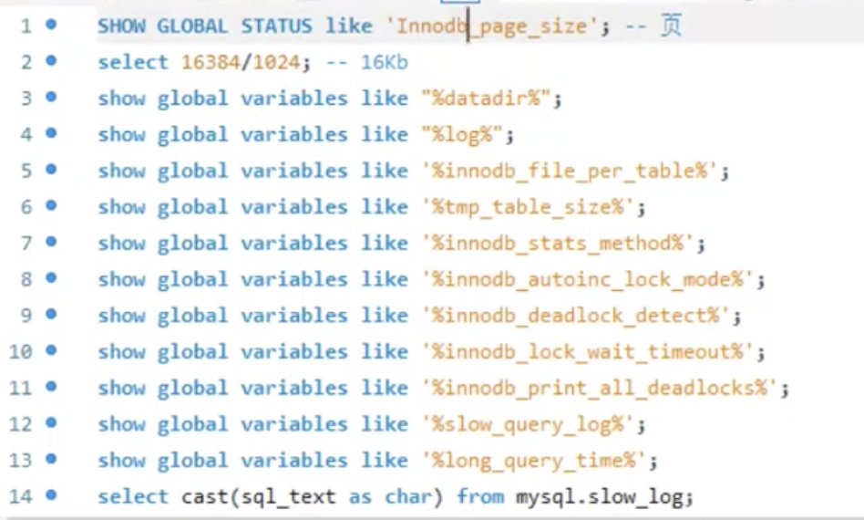

---

而对于Linux操作系统,其默认的文件系统的页大小为

`getconf PAGE_SIZE`


即4KB.

(Mac也支持该命令,且默认的Page大小也是4KB)

---


<br>

mysql中, 一个int类型占4个字节,对于varchar,最多可以占65532字节即64KB(最多能存纯汉字21844个),但绝大多数情况下,不会超过100Byte.

[MySQL中varchar最大长度是多少？](https://blog.csdn.net/qq_30336433/article/details/81669957)

即一般情况下,一行记录不太会超过1000Byte.

也就是说,一般一个Page能存10-20行数据


根据**局部性原理**, 当执行查询某条记录时,会把那一页的查出来放在内存,所以再查其相邻几行记录时,少了磁盘IO速度会快得多.

<br>


Mysql的"页",有三个重要的结构: *页头*,*页目录*,*用户数据区*

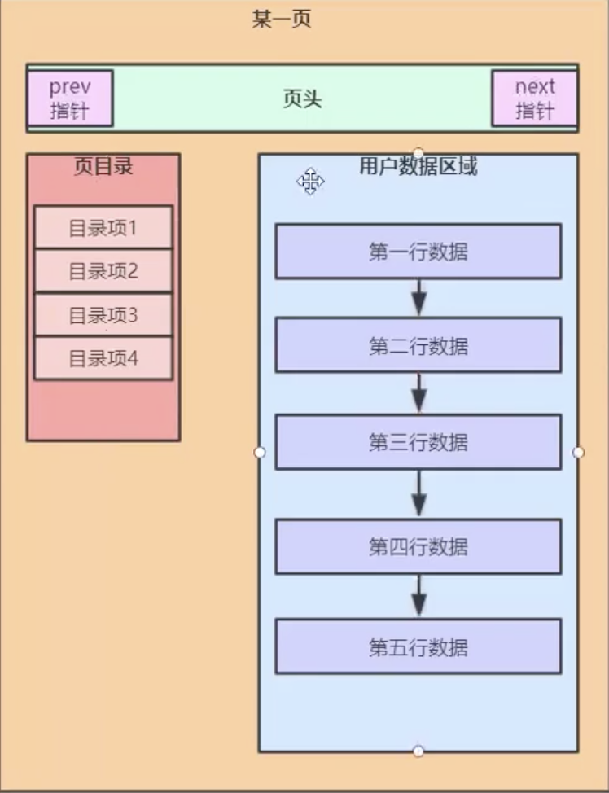


链表和数组正好相反, 链表写易读难.

页目录存放这一组的范围(即这一组记录行中,id的起始值和终点值`----`实际只需要记起点值,终点值即下一组的起点)

**页目录**这个东西,才是真正提高检索效率的东西


<br>

当这一页(16KB空间)已经放满了数据(比如放了18行),则需要新开辟一页.

写入时需要(重新)排序,这个动作任何(写入)时都会有,所以提升读效率的同时,降低了写的效率.


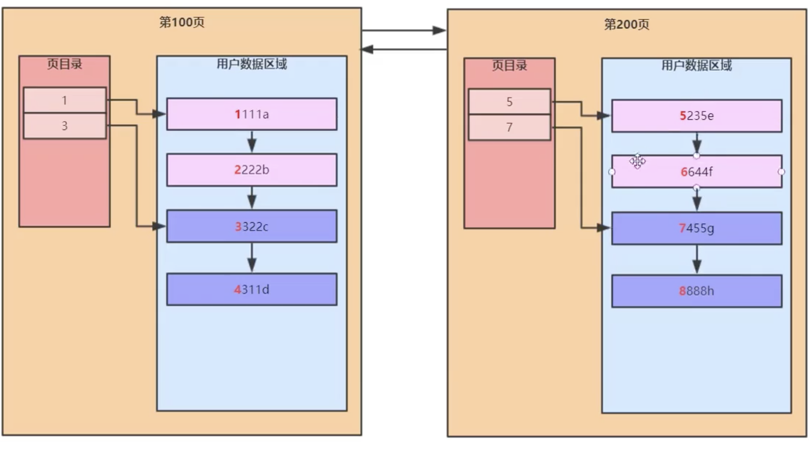

页头部分有两个指针,指向前一页和后一页.

<br>


当记录有几千几万行,由一个个page组成的一个链表,又会出现之前的问题.

把每一页,当做之前的每一行,再增加一个用于*管理页*的目录,称为*目录页*,被它管理的这些个页,成为*数据页*.


(注意区分`目录页`和数据页的`页目录`)

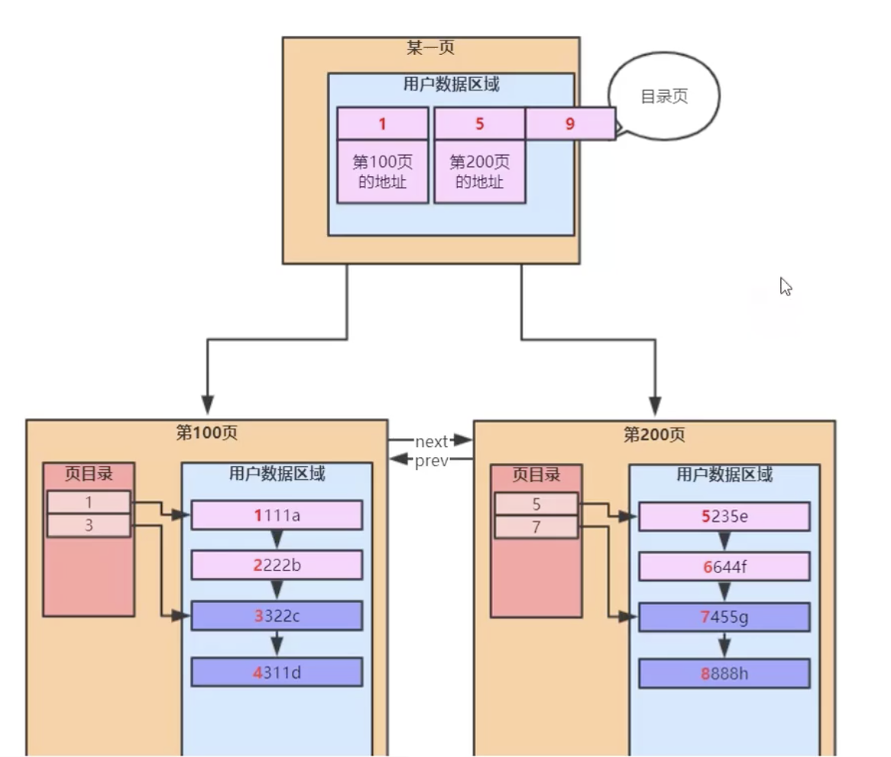


这就是一棵B+树(其实和学术上的纯粹B+树不完全一致)


---

<br>


abcde五个字段,a为主键,abcd均为int型,e为varchar类型

`create index idx_t1_bcd on t1(b,c,d)`,

为t1表的bcd字段,创建一个联合索引,名为*idx_t1_bcd*


B+树的一个节点可以存多个元素


随着数据增多,其*深度*(或称*高度*)增加的不多


MySql中的"索引",和es中的"索引",含义不完全一样.


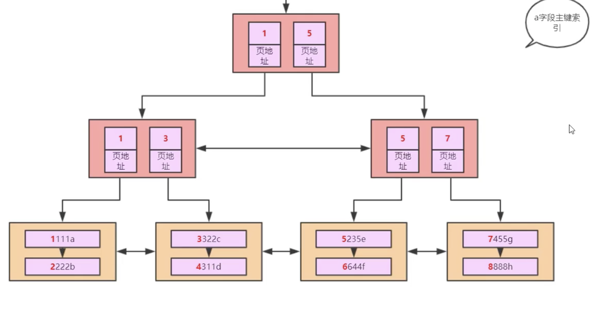


以上都是以主键的大小对一行行记录进行排序.


同时还是聚簇索引(或称 聚集索引),即 数据和索引存放在一起(上图中最底层为用户数据,其上为索引数据;  即叶子节点为用户数据,非叶子节点为索引数据).

在MySiam中,不存在聚集索引,即数据和索引是分开的. 在Innodb中,主键索引就是一个聚簇索引. 


<br>


如果从上到下找,则用到了索引; 如果从左到右找,就是全表扫描.


<br>


对于非主键索引,下图黄色部分,存的实际是其对应记录的主键的值.
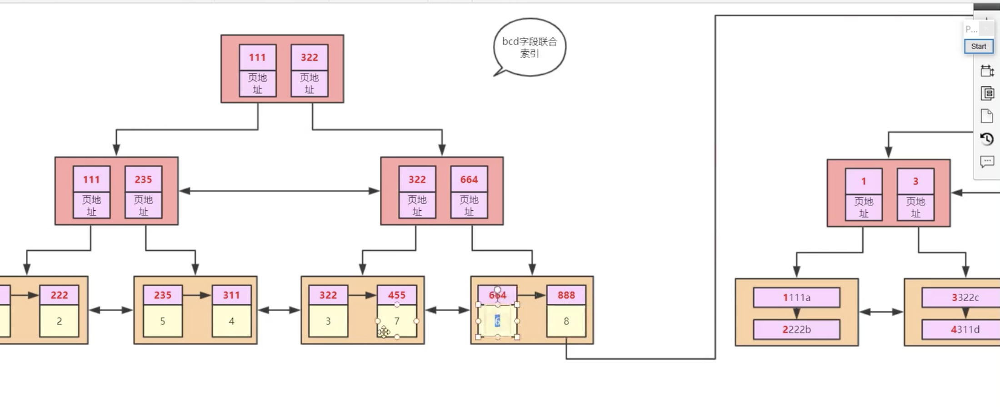

如果不这样的话, 如上图是"b-c-d"的联合索引,此时只能得到bcd的值. 但如果查询的是`select *`,如果不存黄色部分即主键的值, 是拿不到其他字段的值; 而如果有主键的值,就可以再进行一次查询,拿到整条记录的所有字段的信息(主键那个索引的每个叶子节点,即存了一行记录的全部信息, abcde 5个字段都存了)

这也就是建`联合索引`的意义. 所以即便where后面的是`b=? and c=? and d=?`,但如果前面是`select *`或`select e`,那还是无法避免**回表**. 如果前面是`select b,c,d`,则无需回表


对于Innode,完整的数据,只存在主键索引的叶子节点上面..所以但凡是`select *`,都少不了要去那里查

<br>

---

"最左匹配原则",也称"最左前缀原则"

当除了主键索引,只还有一个'bcd'的联合索引,
如果是`select * from t1 where c=1 and d=2`,这时是会全表扫描,而无法走索引.(explain一下, 结果的type字段肯定是`ALL`)

从数学上看, 就是在一个按大小排好序的树状结构里,`11*`是可以确定大致范围的,而`*11`则不行. 这其实就是*最左匹配*的数学含义 

B+树 就是按照比较大小的规则排序而来的...

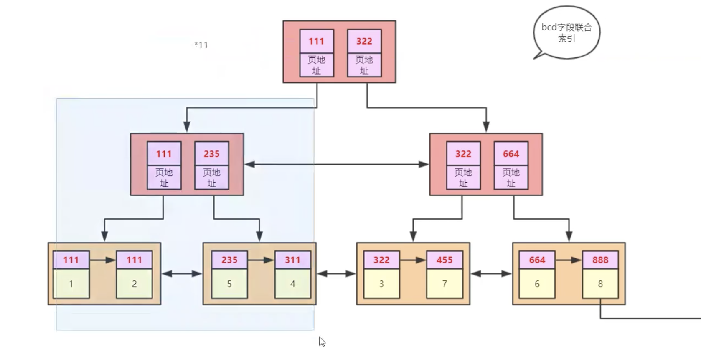


like "%123" 同理

---


<br>

如果是`select * from t1 where b=1 and d=2`,

即`1*1`, 其实是会走索引, 但只能确定一个范围.

explain看一下,type字段值为ref, key_len字段为5,即走了索引的字段的大小 (int型占4个字节,还有可能为null,即占5个字节,如果bcd都走了索引,这个字段的值就是15;如果只有b走了索引,这个字段的值就是5)

---

<br>

对于不等操作, 如

`select * from t1 where a>1`,


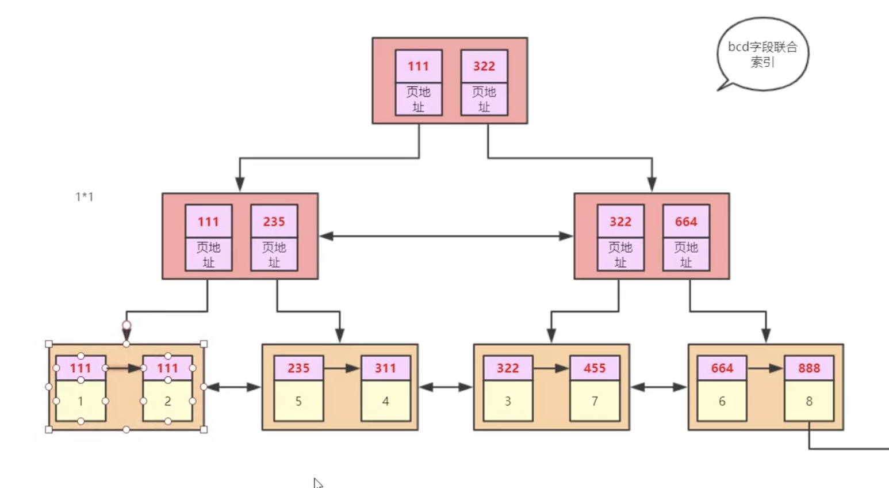

可以走索引,先按=1查找,找到之后,叶子节点之间的指针就起了作用,在=1对应的位置右侧的值都符合条件.


<br>

对于

`select * from t1 where b>1`,

explain之后的type字段是ALL,即没有走索引.但possible_key字段不为null,即可以走索引,但还是选了全表扫描. 这是因为虽然可以从上往下查用上索引(bcd为联合索引),但因为是`select *`,还得回表,而且是回表多次(有多少行符合条件的记录,就得回表那么多次)...在记录数不多时,不如全表扫描效率更高.

如果是
`select b from t1 where b>1`,则会走索引(range)


<br>

`select * from t1 where b>5` (假设共有7行记录)

这时也是会走索引的(range), 查询优化器会做权衡,决定到底用哪一种


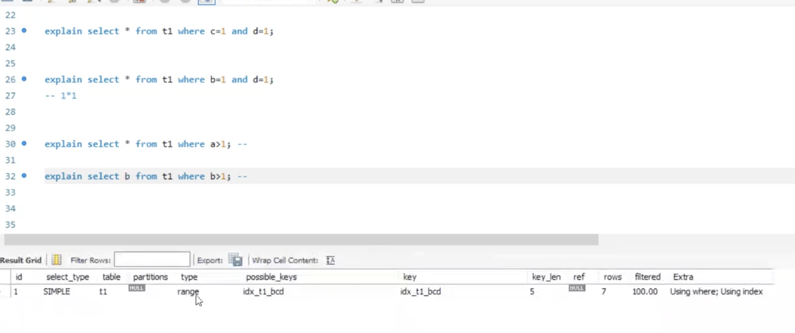

<br>

如果不加where条件,即如

`select * from t1 `,

目的是找到表中所有b字段的值.

这个值在当前(这两个索引下)的表中,有两个地方有,即在bcd索引和在主键索引上.

那会从那个地方取呢?

主键索引的叶子节点存的是 一行记录 完整的数据,而bcd的叶子节点存的只是部分字段(即bcd)的数据,同样大小的一个page, bcd索引能存放的记录行数更多.(或者说,相同的记录数,bcd用的page更少)

explain一下,type字段为`index`. 前面的索引检索方式都是从上到下,这里是利用了叶子节点从左到右来扫描.

---

<br>


先看这样几条sql:

`select 1=1`     返回为1,即认为相等.

`select 0='a'`   返回为1,mysql认为两者相等

`select 0='1'`   返回为0


两个数据类型不同的值进行比较时,需要先进行类型转换.
一般都会把字符转换为数字:

如果是数字类型的字符,则会转为其对应的int型.

如果不是,比如为"abcd",则直接会转为0..


这会引发出很多问题....


如下图,结果会是第一条记录

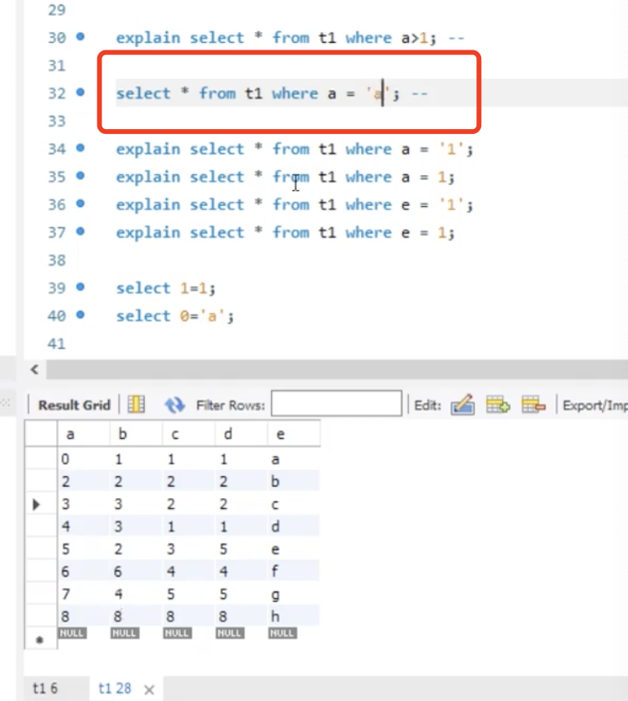


<br>


再创建一个索引:

`select index idx_t1_e on t1(e)`


对于:


`select * from t1 where a = '1'` // '1'会被转换为1,可以走索引

`select * from t1 where a = 1`   // 本来就可以走索引

`select * from t1 where e = '1'` // 本来就可以走索引

`select * from t1 where e = 1`  // 不会走索引..需要把字符转换为数字,需要把t1表所有的e字段的记录都转为int后,才可以执行判断..这时索引已经没有作用了...


在执行sql时需要 类型转换/计算/日期格式的转换 等时,如果需要对整张表的某个字段对操作,则不会走索引.

如

`select * from t1 where a+1 = 2`, 不会走索引(type字段为ALL),需要全表扫描(即会认为需要对所有的a都先加1)


<br>


---

limit

使用`limit`时,越取后面的会越慢,即

`select * from t1 limit 0,1000`

和

`select * from t1 limit 10000,11000`,

后者要慢的多.

因为找起点时,后者要花更多时间.


<br>

解决办法:

加一个子查询,


---


<br>

order by

`select * from t1 order by b asc, c asc, d asc`

不会走索引,而会全表扫描.  且explain的`Extra`字段是**Using filesort**(之前大多为**where**)

会先把bcd字段所有的记录取出来,然后在内存的buffer中进行排序.如果数据量非常大,内存不够,就需要用到文件(磁盘)做swap交换.


排序本身还是比较快的.


而如果走bcd索引,虽然已经排好序了,但是,用的是`select *`,需要回表...需要把这n条数据每一个主键,重新走一遍主键索引...这样还不如全表扫描再排序


如果是

`select b from t1 order by b asc, c asc, d asc`,

则会利用bcd索引,从左到右走一遍.explain的type字段为index

(index一般是叶子节点从左到右扫描)


---


<br>


如果是

`select * from t1 where b=1 order by b asc, c asc, d asc`,

这样回表的成本就小多了,有可能会走bcd这个索引


---

<br>


如果是

`select * from t1 where  order by b asc, c asc, d desc`,

这样是用不到索引的.

mysql 8.0 正式支持**降序索引**(之前版本只是语法上支持)

对于如下创建索引的语句:

`create index idx_t1_bcd on t1(b asc,c asc,d desc)`,

8.0之前,不管怎么写,底层其实都是`asc`(只是语法上支持,所以8.0之前创建索引时,都省略后面的asc/desc)

8.0之后,desc起作用了


所以在8.0中,如果建这样的索引`create index idx_t1_bcd on t1(b asc,c asc,d desc)`,上面的sql是可以用到索引的

更多 参考:

[Backward index scan](https://note.youdao.com/web/#/file/WEB511ced6263aae866775462fd7ba0faf3/note/WEBf073d5180d705125d443d68b1d36a5e0/)

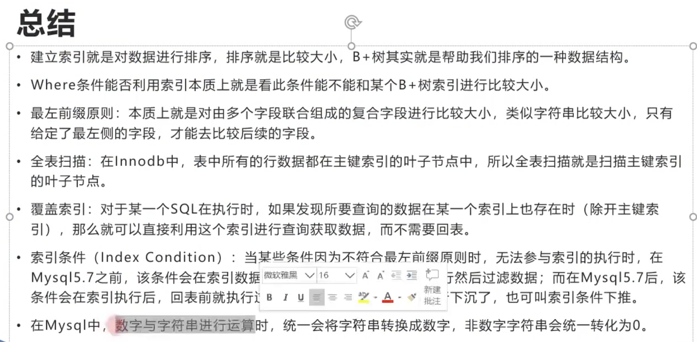


---

<br>


基于一些合理的前提和假设,当B+树高度为3时,最多只能存2000多万行数据.


B+树变成4层,即多了一次磁盘IO,效率便会大幅度降低.

<br>


假设一行记录的数据大小为1k，实际上现在很多互联网业务数据记录大小通常就是1K左右.

所以(主键索引中)叶子节点的一个节点(即一个page,且为数据页),在这里认为可以放16行记录.

假设主键ID为bigint类型(长度为8字节)，而指针大小在InnoDB源码中是**6字节**，这样一共14字节，我们一个页(Page,在此为目录页)中能存放多少这样的(索引)单元，其实就代表有多少指针，即16384/14=1170。即一个目录Page,能存大概1170个(索引)单元.


那么可以算出一棵高度为2的B+树，能存放`1170*16=18720`条这样的数据记录。

根据同样原理, 可以算出一个高度为3的B+树可以存放：`1170*1170*16=21902400`条这样的记录。

所以在InnoDB中B+树高度一般为1-3层，就能满足千万级的数据存储。在查找数据时**一次页的查找代表一次磁盘IO**，所以通过主键索引查询通常只需要1-3次IO操作即可查找到数据。

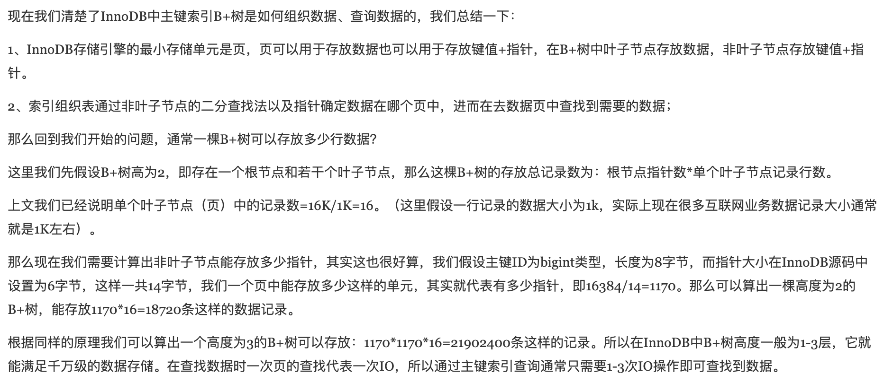

<br>

"在InnoDB的表空间文件中，约定page number为3的代表主键索引的根页，而在根页偏移量为64的地方存放了该B+树的page level。如果page level为1，树高为2，page level为2，则树高为3。即B+树的高度=page level+1；"

```sql
SELECT
b.name, a.name, index_id, type, a.space, a.PAGE_NO
FROM
information_schema.INNODB_SYS_INDEXES a,
information_schema.INNODB_SYS_TABLES b
WHERE
a.table_id = b.table_id AND a.space <> 0;
```


详细操作参见原文:[InnoDB一棵B+树,可以存放多少行数据](https://www.cnblogs.com/leefreeman/p/8315844.html)

<br>

结论:

表A的数据行数为600多万，B+树高度为3，表B的数据行数只有15万，B+树高度也为3。可以看出尽管数据量差异较大，这两个表树的高度都是3，换句话说这两个表通过索引查询效率并没有太大差异，因为都只需要做3次IO。如果有一张表行数是一千万，那么其B+树高度依旧是3，查询效率仍然不会相差太大。

当然如果一张表只有5行数据，那么它的B+树高度为1。

即当数据量在18720到21902400行之间时,B+树的高度都是3,查询的速度几乎相同.

因为二分查找是在内存里边进行的,速度很快.和磁盘IO差几个数量级,可以忽略. 那么即从2万行记录到2200万行记录,主体的查询性能差不多

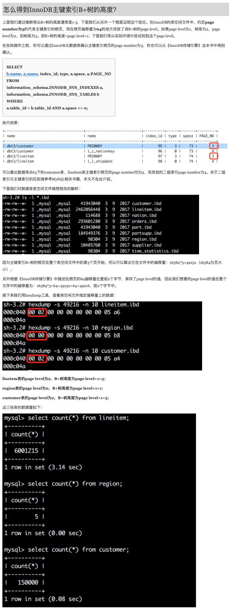

参考:

[InnoDB一棵B+树,可以存放多少行数据](https://www.cnblogs.com/leefreeman/p/8315844.html)

[备存地址](https://note.youdao.com/web/#/file/WEB9be9b66990383bfd305c44dfa828442a/note/WEBb2635ee863c1d82f56f6437dd47f38f5/)


---


<br>


索引和锁 有非常密切的关系


