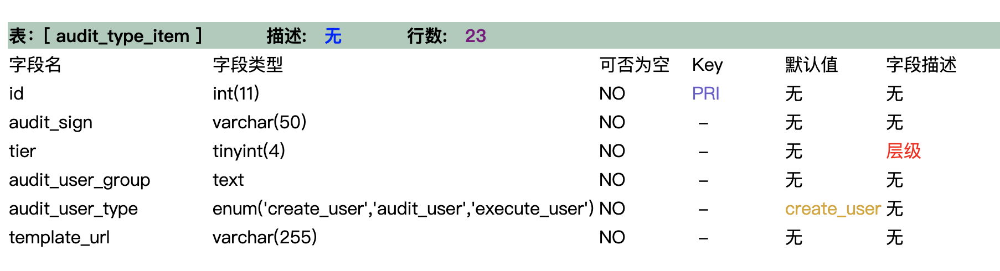
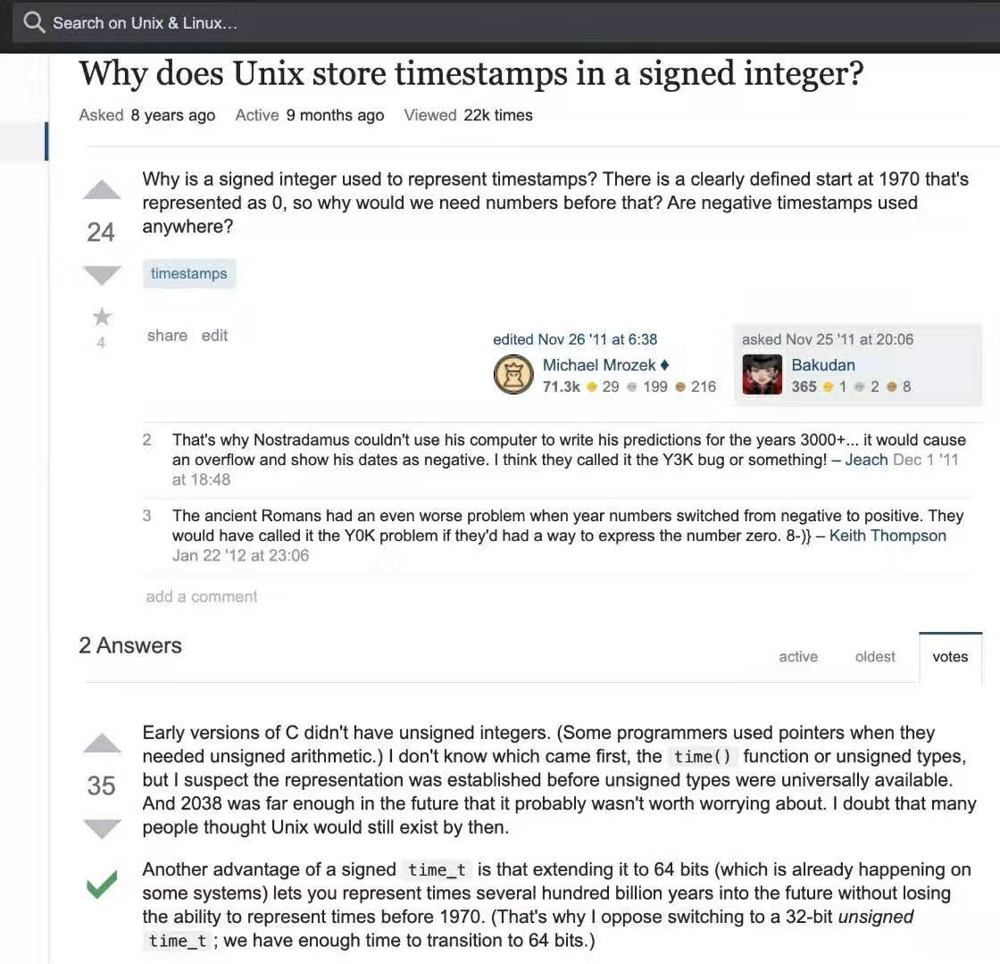
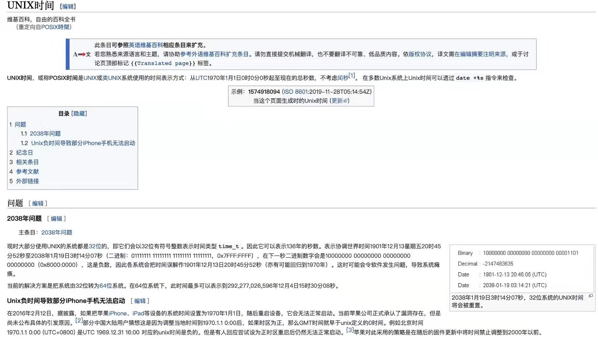
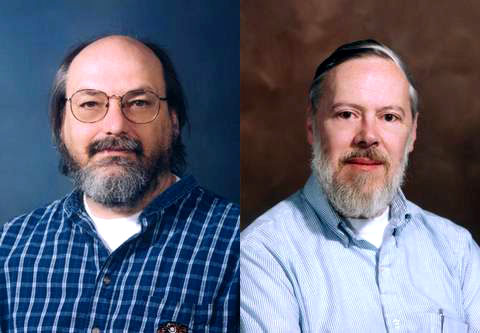
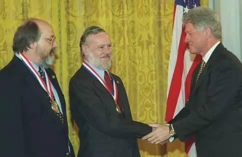
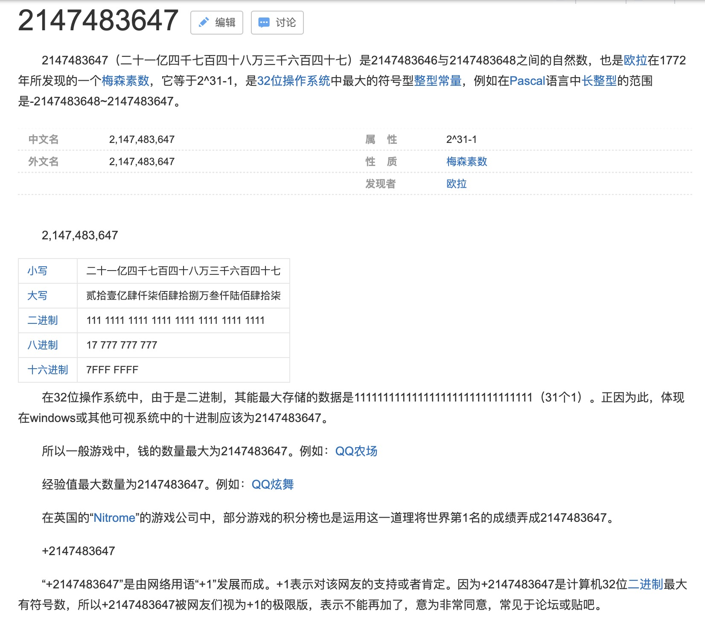
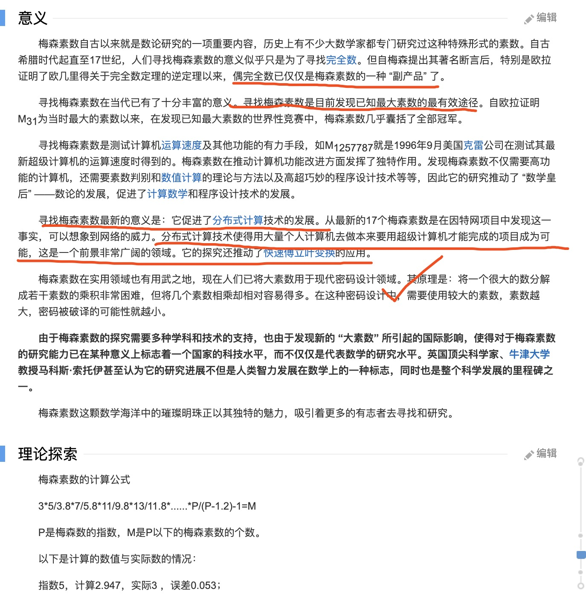
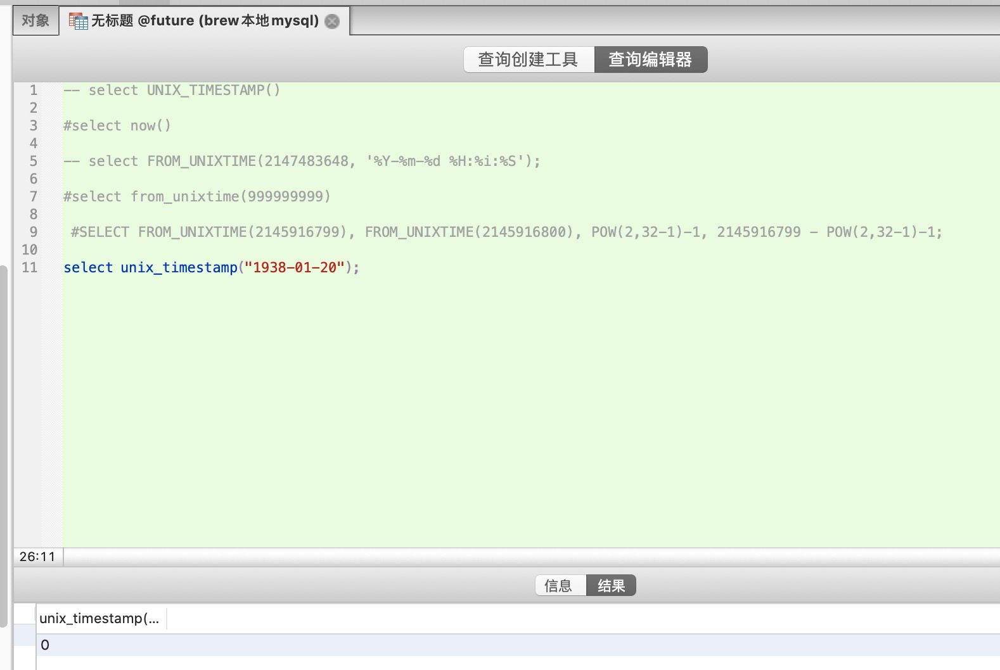

<br>




### 前情回顾

<br>

已经知道,对于int了tinyint了这些MySql类型,后面那个4或者11没啥实际意义,只是说(当位数不足时)前面填充多少个0,然后使之变为4位或者11位,对这个类型的字段实际能存的长度没啥影响.

即占据1个Byte的tinyint类型,最多就能表征256个不同值. 可以表征无符号的连续数字0-255,或者有符号的数字-128到127.

char类型括号里的数字和tinyint/int差不多;


而varchar不同,括号里的这个数字确实有实际意义,可以指定其最大能存多少,其所谓"可变",也就是在这里.即varchar这个类型能存的最大长度,根据后面括号里的这个数值而变.

且自MySql 5.0后,**这个数字指"字符",而不再是"字节",即对一个varchar(6),存"张三李四王五"没问题,但"1234567"或"abcdefg",则会溢出.**


<br>


timestamp类型 占4Byte即32个Bit，也即最多能表征2的32次方个不同值。如果考虑正负，可存纳从0到2的32次方-1的数;若考虑符号，则可容纳-2的31次方到2的31次方-1多的数。…也即如果存时间戳类型，最多在从格林尼治时间1970-01-01 00:00:00开始，过后2的32次方-1秒后，将会出现溢出问题。

但问题是，实际是过2的31次方-1秒，(即2147483647秒,巧合的是，这个数竟然是个梅森素数！)也就是格林尼治时间2038-01-19 03:14:07，就会因达到边界而出现问题。


那这里为何要用有符号的整型而白白浪费一个比特位？丝毫没有必要。而不这样做的好处却很显然，可以表示2的32次方-1秒，即4294967295，这样可以直接使可用时间到格林尼治时间2106-06-07 14:28:15。


---

<br>


### 孜孜以求

<br>

为这问题可真是上穷碧落下尘埃，没写过C++的我，甚至硬着头皮看了总共有2.2GB的[MySql源码](https://github.com/mysql/mysql-server)……数据库时间戳字段其实会读取系统时间(如`根据当前时间戳更新`功能)，这也就牵扯到了unix早期开发时，K&R两位天神的设计。


几经寻索,我在[这里](https://unix.stackexchange.com/questions/25361/why-does-unix-store-timestamps-in-a-signed-integer)找到了与我相同的疑问:




一种说法是，当时还没有无符号的整数这种类型(uint)，也没有考虑到脱胎于贝尔实验室，Ken用来打游戏的unix，能够存活那么久，并作为信息时代最最重要基础设施，深刻改变了整个世界的面貌`----`失败的MULTICS启发了Ken和Dmr，于是有了Unix(和C语言)，又在逾20年后，使芬兰人Linus一举成名，取代RMS，成为geek新一代精神领袖。今天，全世界90%以上的服务，包括MacOS，iOS，Android，以及几乎所有App和web网站的服务端代码，和unix/linux有最直接联系。




实际上，在这个一日千里的时代和行业，人类并不会使『Year 2038 Problem』有机会真实发生，但这个探索的过程和过程中形成的一套方法论，却是特别具有意义。


---

### 附录小记

<br>




另:Dmr于2011年10月，在西海岸硅谷叱咤风云的乔布斯去世后不久，被人发现默默死于东海岸寓所中，对这位Unix和C语言之父，图灵奖得主，祭奠者屈指可数。




<br>

另一位Unix之父和图灵奖得主Ken(一种说法是Unix主要是Ken开发，但Dmr做了大量优秀设计，因而业界`肯`排`里奇`前面，学界则恰好相反)，同时亦是B语言之父，utf-8设计者。后来。他加入Google，和另外几位同僚一道(包括当年贝尔实验室的小弟Rob Pike)，设计了一种叫做Golang的全新语言。


`1999年肯·汤普逊(左)和丹尼斯·里奇因开发C语言和 Unix 操作系统一起获得了美国国家技术奖。`


<br>


---

拓展:







『梅森素数是由梅森数而来。
所谓梅森数，是指形如2的p次方－1的一类数，其中指数p是素数，常记为Mp 。如果梅森数是素数，就称为梅森素数。

用因式分解法可以证明，若2n－1是素数，则指数n也是素数；反之，当n是素数时，2n－1（即Mp）却未必是素数。前几个较小的梅森数大都是素数，然而梅森数越大，梅森素数也就越难出现。
目前仅发现51个梅森素数，最大的是M82589933（即2的82589933次方减1），有24862048位数。

真真是15年前便曾听过,但也仅限于此』


---

<br>

### 时间函数

在MySql中:




`#` 获取当前时间戳
```sql
select UNIX_TIMESTAMP()
```

- 1575379809

<br>

`#` 获取当前时间
```sql
select now()
```
- 2019-12-03 21:31:32

<br>


`#` 2147483647时间戳(2的31次方-1)对应的当地时间
```sql
select FROM_UNIXTIME(2147483647,"%Y-%m-%d %H:%i:%S")
```
- 2038-01-19 11:14:07

<br>


`#` 从格林尼治时间1970-01-01 00:00:00 过后9999999999秒后对应的当地时间(越界..)

```sql
select FROM_UNIXTIME(9999999999)
```

- Null

<br>


`#` 1938-01-20 00:00:00 对应的"时间戳"(并不是负数)

```sql
select UNIX_TIMESTAMP("1938-01-20 00:00:00")
```

- 0

