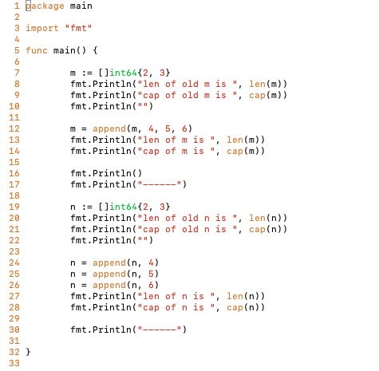
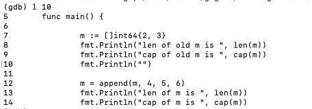
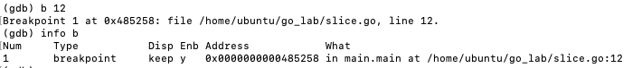
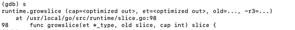
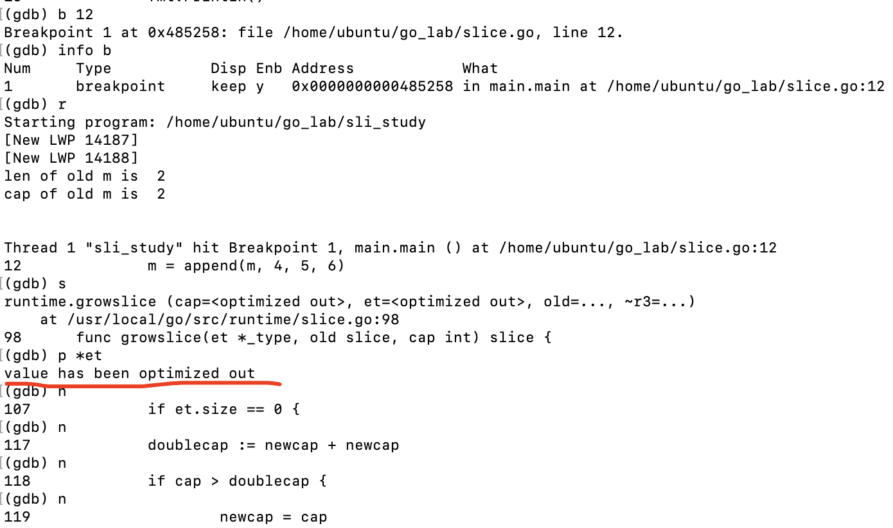
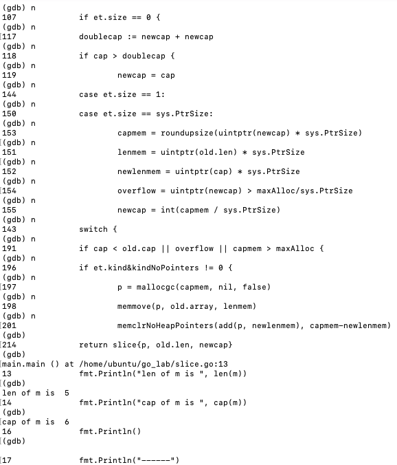

本文是对 [Go slice扩容分析之 不是double或1.25那么简单](https://cloud.tencent.com/developer/article/1422350)的学习与记录

<br>


### 问题

<br>


依据大多数资料,slice的扩容机制是`当切片的容量小于1024时,进行双倍扩容;当大于1024时,进行1.25倍扩容`,见如下代码:

```go
	var sli = []int{}

	sli = append(sli, 666)

	fmt.Println(cap(sli))

	sli = append(sli, 777)

	fmt.Println(cap(sli))

	sli = append(sli, 888)

	fmt.Println(sli)

	fmt.Println(cap(sli))

	sli = append(sli, 999)

	fmt.Println(cap(sli))

	sli = append(sli, 1000)

	fmt.Println(cap(sli))
```
输出为:

```
1
2
[666 777 888]
4
4
8
```
---

又见如下代码:

```go
	var sli2 = []int{}

	for i := 0; i < 10; i++ {
		sli2 = append(sli2, i)
	}

	fmt.Println(sli2)

	fmt.Println(len(sli2))

	fmt.Println(cap(sli2))
```

输出为:

```
[0 1 2 3 4 5 6 7 8 9]
10
16
```


用更"准确"的话描述,是`当cap<1024时,cap的值一定是2的n次方,且cap>=len;每当发生append使len增加,如果导致len>cap,此时cap会先于append操作进行double`


即有

```go
	var sli3 = []int{}

	for i := 0; i < 512; i++ {
		sli3 = append(sli3, i)
	}

	fmt.Println(len(sli3))

	fmt.Println(cap(sli3))

	sli3 = append(sli3, 123)

	fmt.Println(len(sli3))

	fmt.Println(cap(sli3))
```

结果为:

```
512
512
513
1024
```

<br>

对于

```go
	var sli4 = []int{}

	for i := 0; i < 1024; i++ {
		sli4 = append(sli4, i)
	}

	fmt.Println(len(sli4))

	fmt.Println(cap(sli4))

	sli4 = append(sli4, 123)

	fmt.Println(len(sli4))

	fmt.Println(cap(sli4))
```

结果为:

```
1024
1024
1025
1280
```

<br>

1024`*`1.25 = 1280

看似无懈可击的结果, 不过, 果真确凿如此吗?


<br>

---

<br>

上面的操作是每次append一个元素，考虑另一种情形，一次性append很多元素，会发生什么呢？

当同时append进多个元素时,如下:

```go
package main

import "fmt"

func main() {
	a := []byte{1, 0}
	fmt.Println("len of old a is ", len(a))
	fmt.Println("cap of old a is ", cap(a))
	fmt.Println("")

	a = append(a, 1, 1, 1)
	fmt.Println("len of a is ", len(a))
	fmt.Println("cap of a is ", cap(a))

	fmt.Println("------")

	b := []int{23, 51}
	fmt.Println("len of old b is ", len(b))
	fmt.Println("cap of old b is ", cap(b))
	fmt.Println("")

	b = append(b, 4, 5, 6)
	fmt.Println("len of b is ", len(b))
	fmt.Println("cap of b is ", cap(b))

	fmt.Println("------")

	c := []int32{1, 23}
	fmt.Println("len of old c is ", len(c))
	fmt.Println("cap of old c is ", cap(c))
	fmt.Println("")

	c = append(c, 2, 5, 6)
	fmt.Println("len of c is ", len(c))
	fmt.Println("cap of c is ", cap(c))

	fmt.Println("------")

	type D struct {
		age  byte
		name string
	}
	d := []D{
		{1, "123"},
		{2, "234"},
	}
	fmt.Println("len of old d is ", len(d))
	fmt.Println("cap of old d is ", cap(d))
	fmt.Println("")

	d = append(d, D{4, "456"}, D{5, "567"}, D{6, "678"})
	fmt.Println("len of d is ", len(d))
	fmt.Println("cap of d is ", cap(d))

}
```

结果为:

```go
len of old a is  2
cap of old a is  2

len of a is  5
cap of a is  8
------
len of old b is  2
cap of old b is  2

len of b is  5
cap of b is  6
------
len of old c is  2
cap of old c is  2

len of c is  5
cap of c is  6
------
len of old d is  2
cap of old d is  2

len of d is  5
cap of d is  5

```

匪夷所思?


其实是因为内存对齐

<br>


简化以上代码：


```go
package main

import "fmt"

func main() {

	m := []int64{2, 3}
	fmt.Println("len of old m is ", len(m))
	fmt.Println("cap of old m is ", cap(m))
	fmt.Println("")

	m = append(m, 4, 5, 6)
	fmt.Println("len of m is ", len(m))
	fmt.Println("cap of m is ", cap(m))

	fmt.Println()
	fmt.Println("------")

	n := []int64{2, 3}
	fmt.Println("len of old n is ", len(n))
	fmt.Println("cap of old n is ", cap(n))
	fmt.Println("")

	n = append(n, 4)
	n = append(n, 5)
	n = append(n, 6)
	fmt.Println("len of n is ", len(n))
	fmt.Println("cap of n is ", cap(n))

	fmt.Println("------")

}
```

<br>

输出为：

```go
len of old m is  2
cap of old m is  2

len of m is  5
cap of m is  6

------
len of old n is  2
cap of old n is  2

len of n is  5
cap of n is  8
------
```

<br>

**为什么一次性append多个，最后切片的长度为6； 而多次append单个元素，最后切片的长度为8？**


切片扩容的源码,是[/src/runtime/slice.go]()中的`growslice`方法：

```go

// growslice handles slice growth during append.
// It is passed the slice element type, the old slice, and the desired new minimum capacity,
// and it returns a new slice with at least that capacity, with the old data
// copied into it.
// The new slice's length is set to the old slice's length,
// NOT to the new requested capacity.
// This is for codegen convenience. The old slice's length is used immediately
// to calculate where to write new values during an append.
// TODO: When the old backend is gone, reconsider this decision.
// The SSA backend might prefer the new length or to return only ptr/cap and save stack space.
func growslice(et *_type, old slice, cap int) slice {
	if raceenabled {
		callerpc := getcallerpc()
		racereadrangepc(old.array, uintptr(old.len*int(et.size)), callerpc, funcPC(growslice))
	}
	if msanenabled {
		msanread(old.array, uintptr(old.len*int(et.size)))
	}

	if cap < old.cap {
		panic(errorString("growslice: cap out of range"))
	}

	if et.size == 0 {
		// append should not create a slice with nil pointer but non-zero len.
		// We assume that append doesn't need to preserve old.array in this case.
		return slice{unsafe.Pointer(&zerobase), old.len, cap}
	}

	newcap := old.cap
	doublecap := newcap + newcap
	if cap > doublecap {
		newcap = cap
	} else {
		if old.len < 1024 {
			newcap = doublecap
		} else {
			// Check 0 < newcap to detect overflow
			// and prevent an infinite loop.
			for 0 < newcap && newcap < cap {
				newcap += newcap / 4
			}
			// Set newcap to the requested cap when
			// the newcap calculation overflowed.
			if newcap <= 0 {
				newcap = cap
			}
		}
	}

	var overflow bool
	var lenmem, newlenmem, capmem uintptr
	// Specialize for common values of et.size.
	// For 1 we don't need any division/multiplication.
	// For sys.PtrSize, compiler will optimize division/multiplication into a shift by a constant.
	// For powers of 2, use a variable shift.
	switch {
	case et.size == 1:
		lenmem = uintptr(old.len)
		newlenmem = uintptr(cap)
		capmem = roundupsize(uintptr(newcap))
		overflow = uintptr(newcap) > maxAlloc
		newcap = int(capmem)
	case et.size == sys.PtrSize:
		lenmem = uintptr(old.len) * sys.PtrSize
		newlenmem = uintptr(cap) * sys.PtrSize
		capmem = roundupsize(uintptr(newcap) * sys.PtrSize)
		overflow = uintptr(newcap) > maxAlloc/sys.PtrSize
		newcap = int(capmem / sys.PtrSize)
	case isPowerOfTwo(et.size):
		var shift uintptr
		if sys.PtrSize == 8 {
			// Mask shift for better code generation.
			shift = uintptr(sys.Ctz64(uint64(et.size))) & 63
		} else {
			shift = uintptr(sys.Ctz32(uint32(et.size))) & 31
		}
		lenmem = uintptr(old.len) << shift
		newlenmem = uintptr(cap) << shift
		capmem = roundupsize(uintptr(newcap) << shift)
		overflow = uintptr(newcap) > (maxAlloc >> shift)
		newcap = int(capmem >> shift)
	default:
		lenmem = uintptr(old.len) * et.size
		newlenmem = uintptr(cap) * et.size
		capmem, overflow = math.MulUintptr(et.size, uintptr(newcap))
		capmem = roundupsize(capmem)
		newcap = int(capmem / et.size)
	}

	// The check of overflow in addition to capmem > maxAlloc is needed
	// to prevent an overflow which can be used to trigger a segfault
	// on 32bit architectures with this example program:
	//
	// type T [1<<27 + 1]int64
	//
	// var d T
	// var s []T
	//
	// func main() {
	//   s = append(s, d, d, d, d)
	//   print(len(s), "\n")
	// }
	if overflow || capmem > maxAlloc {
		panic(errorString("growslice: cap out of range"))
	}

	var p unsafe.Pointer
	if et.kind&kindNoPointers != 0 {
		p = mallocgc(capmem, nil, false)
		// The append() that calls growslice is going to overwrite from old.len to cap (which will be the new length).
		// Only clear the part that will not be overwritten.
		memclrNoHeapPointers(add(p, newlenmem), capmem-newlenmem)
	} else {
		// Note: can't use rawmem (which avoids zeroing of memory), because then GC can scan uninitialized memory.
		p = mallocgc(capmem, et, true)
		if writeBarrier.enabled {
			// Only shade the pointers in old.array since we know the destination slice p
			// only contains nil pointers because it has been cleared during alloc.
			bulkBarrierPreWriteSrcOnly(uintptr(p), uintptr(old.array), lenmem)
		}
	}
	memmove(p, old.array, lenmem)

	return slice{p, old.len, newcap}
}

```


<br>


---

<br>


### 原理

<br>


使用gdb调试工具进行调试


强烈建议先阅读此文，学习[GDB基本用法](https://www.cnblogs.com/euphie/p/9781482.html)





<br>


使用`l 10`可查看第10行附近的源码




使用 `b 12` 在第12行处设置断点 (可以设置多个断点)

这样会在运行到第12行时停止，可查看变量的值、堆栈情况等；


使用`info b` 查看断点处情况 




<br>


可使用 `s`, 跳入断点，并看执行情况




<br>


可使用 `r`运行代码


可使用 `p 变量名`，显示变量值


<font size=1 color="grey">

如果调试过程中出现*value optimized out*，说明编译器进行了内联优化。

可通过`go build -gcflags "-N -l" -o  自定义的二进制文件名称  原始Go文件.go`命令，禁用编译器优化




[gdb调试 出现value optimized out解决方法](https://blog.csdn.net/qq_21127151/article/details/106699827)


</font>


<br>


可使用`n`单步运行. 非常好用，可以看到调用链





<br>


使用`c`, 使程序继续往下运行，直到再次遇到断点或程序结束


使用`q`, 退出gdb


<br>


调用roundupsize()函数，进行(向上)内存对齐


<font size=1 color="orange">

roundupsize()位于[go/src/runtime/msize.go]()，更具体介绍与使用可参考[]()

```go
// Copyright 2009 The Go Authors. All rights reserved.
// Use of this source code is governed by a BSD-style
// license that can be found in the LICENSE file.

// Malloc small size classes.
//
// See malloc.go for overview.
// See also mksizeclasses.go for how we decide what size classes to use.

package runtime

// Returns size of the memory block that mallocgc will allocate if you ask for the size.
func roundupsize(size uintptr) uintptr {
	if size < _MaxSmallSize {
		if size <= smallSizeMax-8 {
			return uintptr(class_to_size[size_to_class8[divRoundUp(size, smallSizeDiv)]])
		} else {
			return uintptr(class_to_size[size_to_class128[divRoundUp(size-smallSizeMax, largeSizeDiv)]])
		}
	}
	if size+_PageSize < size {
		return size
	}
	return alignUp(size, _PageSize)
}

```

[go/src/runtime/sizeclasses.go]()

```go
// Code generated by mksizeclasses.go; DO NOT EDIT.
//go:generate go run mksizeclasses.go

package runtime

// class  bytes/obj  bytes/span  objects  tail waste  max waste
//     1          8        8192     1024           0     87.50%
//     2         16        8192      512           0     43.75%
//     3         24        8192      341           8     29.24%
//     4         32        8192      256           0     21.88%
//     5         48        8192      170          32     31.52%
//     6         64        8192      128           0     23.44%
//     7         80        8192      102          32     19.07%
//     8         96        8192       85          32     15.95%
//     9        112        8192       73          16     13.56%
//    10        128        8192       64           0     11.72%
//    11        144        8192       56         128     11.82%
//    12        160        8192       51          32      9.73%
//    13        176        8192       46          96      9.59%
//    14        192        8192       42         128      9.25%
//    15        208        8192       39          80      8.12%
//    16        224        8192       36         128      8.15%
//    17        240        8192       34          32      6.62%
//    18        256        8192       32           0      5.86%
//    19        288        8192       28         128     12.16%
//    20        320        8192       25         192     11.80%
//    21        352        8192       23          96      9.88%
//    22        384        8192       21         128      9.51%
//    23        416        8192       19         288     10.71%
//    24        448        8192       18         128      8.37%
//    25        480        8192       17          32      6.82%
//    26        512        8192       16           0      6.05%
//    27        576        8192       14         128     12.33%
//    28        640        8192       12         512     15.48%
//    29        704        8192       11         448     13.93%
//    30        768        8192       10         512     13.94%
//    31        896        8192        9         128     15.52%
//    32       1024        8192        8           0     12.40%
//    33       1152        8192        7         128     12.41%
//    34       1280        8192        6         512     15.55%
//    35       1408       16384       11         896     14.00%
//    36       1536        8192        5         512     14.00%
//    37       1792       16384        9         256     15.57%
//    38       2048        8192        4           0     12.45%
//    39       2304       16384        7         256     12.46%
//    40       2688        8192        3         128     15.59%
//    41       3072       24576        8           0     12.47%
//    42       3200       16384        5         384      6.22%
//    43       3456       24576        7         384      8.83%
//    44       4096        8192        2           0     15.60%
//    45       4864       24576        5         256     16.65%
//    46       5376       16384        3         256     10.92%
//    47       6144       24576        4           0     12.48%
//    48       6528       32768        5         128      6.23%
//    49       6784       40960        6         256      4.36%
//    50       6912       49152        7         768      3.37%
//    51       8192        8192        1           0     15.61%
//    52       9472       57344        6         512     14.28%
//    53       9728       49152        5         512      3.64%
//    54      10240       40960        4           0      4.99%
//    55      10880       32768        3         128      6.24%
//    56      12288       24576        2           0     11.45%
//    57      13568       40960        3         256      9.99%
//    58      14336       57344        4           0      5.35%
//    59      16384       16384        1           0     12.49%
//    60      18432       73728        4           0     11.11%
//    61      19072       57344        3         128      3.57%
//    62      20480       40960        2           0      6.87%
//    63      21760       65536        3         256      6.25%
//    64      24576       24576        1           0     11.45%
//    65      27264       81920        3         128     10.00%
//    66      28672       57344        2           0      4.91%
//    67      32768       32768        1           0     12.50%

const (
	_MaxSmallSize   = 32768
	smallSizeDiv    = 8
	smallSizeMax    = 1024
	largeSizeDiv    = 128
	_NumSizeClasses = 68
	_PageShift      = 13
)

var class_to_size = [_NumSizeClasses]uint16{0, 8, 16, 24, 32, 48, 64, 80, 96, 112, 128, 144, 160, 176, 192, 208, 224, 240, 256, 288, 320, 352, 384, 416, 448, 480, 512, 576, 640, 704, 768, 896, 1024, 1152, 1280, 1408, 1536, 1792, 2048, 2304, 2688, 3072, 3200, 3456, 4096, 4864, 5376, 6144, 6528, 6784, 6912, 8192, 9472, 9728, 10240, 10880, 12288, 13568, 14336, 16384, 18432, 19072, 20480, 21760, 24576, 27264, 28672, 32768}
var class_to_allocnpages = [_NumSizeClasses]uint8{0, 1, 1, 1, 1, 1, 1, 1, 1, 1, 1, 1, 1, 1, 1, 1, 1, 1, 1, 1, 1, 1, 1, 1, 1, 1, 1, 1, 1, 1, 1, 1, 1, 1, 1, 2, 1, 2, 1, 2, 1, 3, 2, 3, 1, 3, 2, 3, 4, 5, 6, 1, 7, 6, 5, 4, 3, 5, 7, 2, 9, 7, 5, 8, 3, 10, 7, 4}

type divMagic struct {
	shift    uint8
	shift2   uint8
	mul      uint16
	baseMask uint16
}

var class_to_divmagic = [_NumSizeClasses]divMagic{{0, 0, 0, 0}, {3, 0, 1, 65528}, {4, 0, 1, 65520}, {3, 11, 683, 0}, {5, 0, 1, 65504}, {4, 11, 683, 0}, {6, 0, 1, 65472}, {4, 10, 205, 0}, {5, 9, 171, 0}, {4, 11, 293, 0}, {7, 0, 1, 65408}, {4, 13, 911, 0}, {5, 10, 205, 0}, {4, 12, 373, 0}, {6, 9, 171, 0}, {4, 13, 631, 0}, {5, 11, 293, 0}, {4, 13, 547, 0}, {8, 0, 1, 65280}, {5, 9, 57, 0}, {6, 9, 103, 0}, {5, 12, 373, 0}, {7, 7, 43, 0}, {5, 10, 79, 0}, {6, 10, 147, 0}, {5, 11, 137, 0}, {9, 0, 1, 65024}, {6, 9, 57, 0}, {7, 9, 103, 0}, {6, 11, 187, 0}, {8, 7, 43, 0}, {7, 8, 37, 0}, {10, 0, 1, 64512}, {7, 9, 57, 0}, {8, 6, 13, 0}, {7, 11, 187, 0}, {9, 5, 11, 0}, {8, 8, 37, 0}, {11, 0, 1, 63488}, {8, 9, 57, 0}, {7, 10, 49, 0}, {10, 5, 11, 0}, {7, 10, 41, 0}, {7, 9, 19, 0}, {12, 0, 1, 61440}, {8, 9, 27, 0}, {8, 10, 49, 0}, {11, 5, 11, 0}, {7, 13, 161, 0}, {7, 13, 155, 0}, {8, 9, 19, 0}, {13, 0, 1, 57344}, {8, 12, 111, 0}, {9, 9, 27, 0}, {11, 6, 13, 0}, {7, 14, 193, 0}, {12, 3, 3, 0}, {8, 13, 155, 0}, {11, 8, 37, 0}, {14, 0, 1, 49152}, {11, 8, 29, 0}, {7, 13, 55, 0}, {12, 5, 7, 0}, {8, 14, 193, 0}, {13, 3, 3, 0}, {7, 14, 77, 0}, {12, 7, 19, 0}, {15, 0, 1, 32768}}
var size_to_class8 = [smallSizeMax/smallSizeDiv + 1]uint8{0, 1, 2, 3, 4, 5, 5, 6, 6, 7, 7, 8, 8, 9, 9, 10, 10, 11, 11, 12, 12, 13, 13, 14, 14, 15, 15, 16, 16, 17, 17, 18, 18, 19, 19, 19, 19, 20, 20, 20, 20, 21, 21, 21, 21, 22, 22, 22, 22, 23, 23, 23, 23, 24, 24, 24, 24, 25, 25, 25, 25, 26, 26, 26, 26, 27, 27, 27, 27, 27, 27, 27, 27, 28, 28, 28, 28, 28, 28, 28, 28, 29, 29, 29, 29, 29, 29, 29, 29, 30, 30, 30, 30, 30, 30, 30, 30, 31, 31, 31, 31, 31, 31, 31, 31, 31, 31, 31, 31, 31, 31, 31, 31, 32, 32, 32, 32, 32, 32, 32, 32, 32, 32, 32, 32, 32, 32, 32, 32}
var size_to_class128 = [(_MaxSmallSize-smallSizeMax)/largeSizeDiv + 1]uint8{32, 33, 34, 35, 36, 37, 37, 38, 38, 39, 39, 40, 40, 40, 41, 41, 41, 42, 43, 43, 44, 44, 44, 44, 44, 45, 45, 45, 45, 45, 45, 46, 46, 46, 46, 47, 47, 47, 47, 47, 47, 48, 48, 48, 49, 49, 50, 51, 51, 51, 51, 51, 51, 51, 51, 51, 51, 52, 52, 52, 52, 52, 52, 52, 52, 52, 52, 53, 53, 54, 54, 54, 54, 55, 55, 55, 55, 55, 56, 56, 56, 56, 56, 56, 56, 56, 56, 56, 56, 57, 57, 57, 57, 57, 57, 57, 57, 57, 57, 58, 58, 58, 58, 58, 58, 59, 59, 59, 59, 59, 59, 59, 59, 59, 59, 59, 59, 59, 59, 59, 59, 60, 60, 60, 60, 60, 60, 60, 60, 60, 60, 60, 60, 60, 60, 60, 60, 61, 61, 61, 61, 61, 62, 62, 62, 62, 62, 62, 62, 62, 62, 62, 62, 63, 63, 63, 63, 63, 63, 63, 63, 63, 63, 64, 64, 64, 64, 64, 64, 64, 64, 64, 64, 64, 64, 64, 64, 64, 64, 64, 64, 64, 64, 64, 64, 65, 65, 65, 65, 65, 65, 65, 65, 65, 65, 65, 65, 65, 65, 65, 65, 65, 65, 65, 65, 65, 66, 66, 66, 66, 66, 66, 66, 66, 66, 66, 66, 67, 67, 67, 67, 67, 67, 67, 67, 67, 67, 67, 67, 67, 67, 67, 67, 67, 67, 67, 67, 67, 67, 67, 67, 67, 67, 67, 67, 67, 67, 67, 67}

```


> 当创建一个对象时，需要分配一块内存。假设创建的对象需要*52 byte*，系统是不会真就给分配*52byte*大小的内存，首先会根据上面代码中第6行注释部分，来计算需要分配的内存大小。<br><br>
可参考[go/src/runtime/msize.go] 中的 roundupsize 函数。也就是需要向上取整，即 *48<52<64*，所以申请52byte，实际会分配*64byte*大小的内存。<br><br>
另外还需要了解： 如果每次创建一个对象，Go runtime都向计算机中申请一块内存，而在程序运行时是会频繁的创建对象的，这样效率将会大大降低。 所以程序会预先申请好一些内存块，其大小就是 **8、16、32、48  等等**，这样在程序申请内存时序就可以把申请好的内存选一块给我们，也就提高了效率


</font>


<br>


*growslice*的三个参数： 第一个是类型(上例中为int64)，第二个是扩容前切片a（元素为2和3），第三个参数是预估容量5（原有切片容量加上新加元素个数，即2+3=5）


对容量进行计算：

```go
...
newcap := old.cap //​ 此时newcap = 2
doublecap := newcap + newcap // doublecap 为2+2=4
if cap > doublecap { // cap=5
	newcap = cap // 故而newcap 最终为5
} else {
	if old.len < 1024 {
		newcap = doublecap
	} else {
		// Check 0 < newcap to detect overflow
		// and prevent an infinite loop.
		for 0 < newcap && newcap < cap {
			newcap += newcap / 4
		}
		// Set newcap to the requested cap when
		// the newcap calculation overflowed.
		if newcap <= 0 {
			newcap = cap
		}
	}
}
...

```


又因为int64 类型大小为8字节，故而下面会走到*et.size == sys.PtrSize:*代码块

<font size=1 color="grey">

对于`const PtrSize = 4 << (^uintptr(0) >> 63)`:


```go
package main

import "fmt"

func main() {

	const PtrSize = 4 << (^uintptr(0) >> 63) // unsafe.Sizeof(uintptr(0)) but an ideal const

	fmt.Println("uintptr(0)值为:", uintptr(0))
	fmt.Println("^uintptr(0)值为:", ^uintptr(0))           // 对0取反，在64位操作系统得到18446744073709551615； uint64(所有无符号 64 位整数的集合)，范围：0 到 18446744073709551615。
	fmt.Println("^uintptr(0) >> 63值为:", ^uintptr(0)>>63) // 1

	fmt.Println("PtrSize值为:", PtrSize) // 4左移一位，即8
}
```

执行结果为：

```go
uintptr(0)值为: 0
^uintptr(0)值为: 18446744073709551615
^uintptr(0) >> 63值为: 1
PtrSize值为: 8
```
</font>


<br>

```go
	case et.size == sys.PtrSize:
		lenmem = uintptr(old.len) * sys.PtrSize //即 2*8=16
		newlenmem = uintptr(cap) * sys.PtrSize // 即 2*8=16
		capmem = roundupsize(uintptr(newcap) * sys.PtrSize) // 即5*8=40,经过roundupsize处理后为48
		overflow = uintptr(newcap) > maxAlloc/sys.PtrSize //是否超出上限，此处为false，在Darwin Arm64上maxAlloc为281474976710656
		newcap = int(capmem / sys.PtrSize) // 关键步骤，48/8=6，故而最终得到的新切片的cap为6
```


<font size=1 color="grey>

关于maxAlloc:

```go
package main

import "fmt"

const GoarchArm64 = 1
const GoarchMips = 0
const GoarchMipsle = 0
const GoarchWasm = 0

const GoosIos = 0

func main() {
	// _64bit = 1 on 64-bit systems, 0 on 32-bit systems
	_64bit := 1 << (^uintptr(0) >> 63) / 2

	fmt.Println("_64bit值为：", _64bit)

	heapAddrBits := (_64bit*(1-GoarchWasm)*(1-GoosIos*GoarchArm64))*48 + (1-_64bit+GoarchWasm)*(32-(GoarchMips+GoarchMipsle)) + 33*GoosIos*GoarchArm64

	fmt.Println("heapAddrBits值为：", heapAddrBits)

	// maxAlloc is the maximum size of an allocation. On 64-bit,
	// it's theoretically possible to allocate 1<<heapAddrBits bytes. On
	// 32-bit, however, this is one less than 1<<32 because the
	// number of bytes in the address space doesn't actually fit
	// in a uintptr.
	maxAlloc := (1 << heapAddrBits) - (1-_64bit)*1

	fmt.Println("maxAlloc值为：", maxAlloc)

}
```

输出为：

```go
_64bit值为： 1
heapAddrBits值为： 48
maxAlloc值为： 281474976710656
```

</font>


<br>


---


<br>


更多参考：


[Go Slice Growth](https://godeamon.com/post/go-slice-growth/)


[Golang 切片容量（cap）增长探秘](https://blog.csdn.net/khn64/article/details/107224978)


[深度解密Go语言之Slice](https://zhuanlan.zhihu.com/p/61121325) 搜关键字 *roundupsize*


[讨论群中关于切片的一个问题](https://lday.me/2017/02/25/0004_golang-slice-depth/)


[Go源码解读-切片slice](https://3030.xyz/tech/golang/go-slice.html)

<br>


Linux内核中有rounddown方法，取数的最高二进制阶数

[取数的最高二进制阶数rounddown_pow_of_two](http://www.360doc.com/content/12/0610/04/7775902_217163224.shtml)