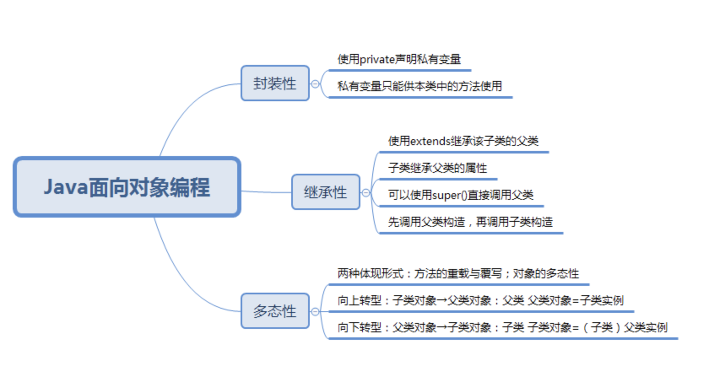
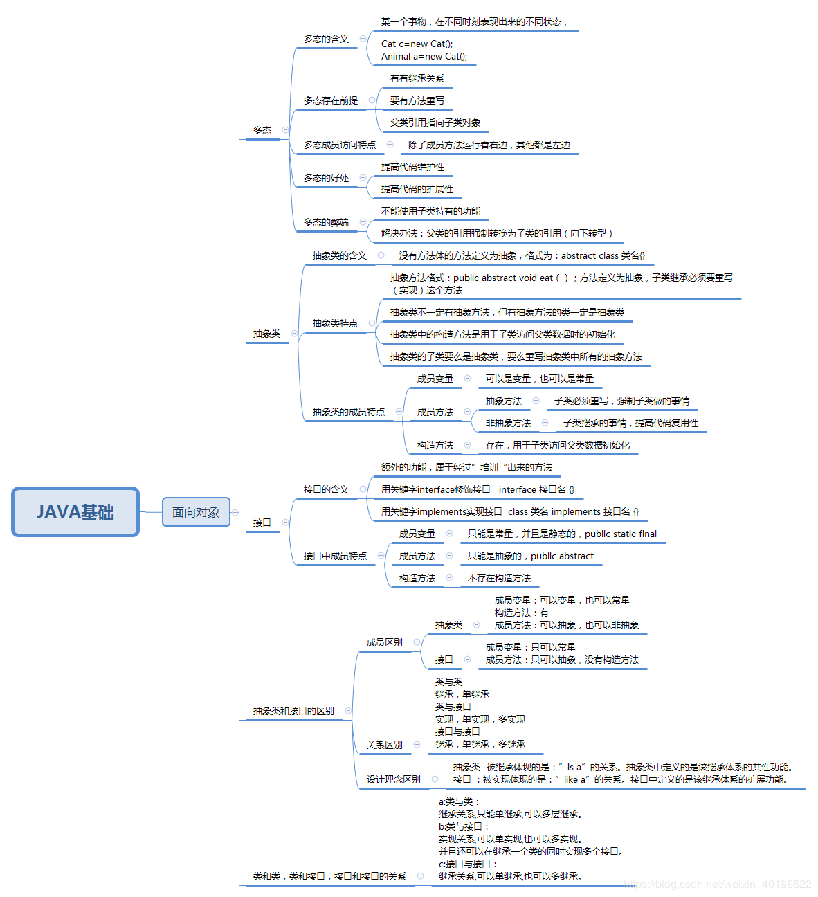
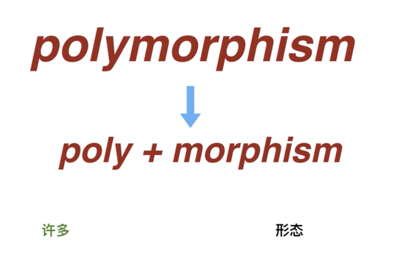
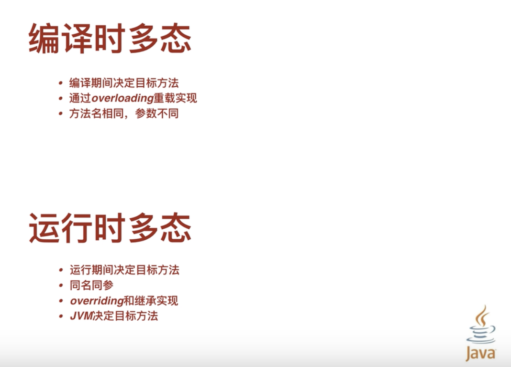
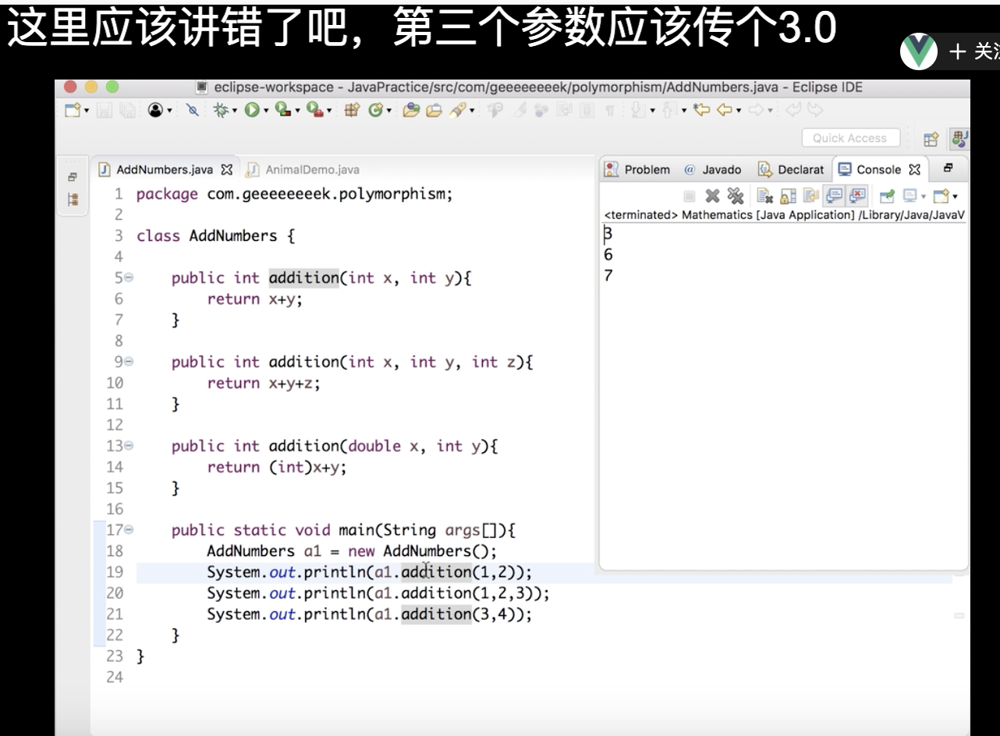
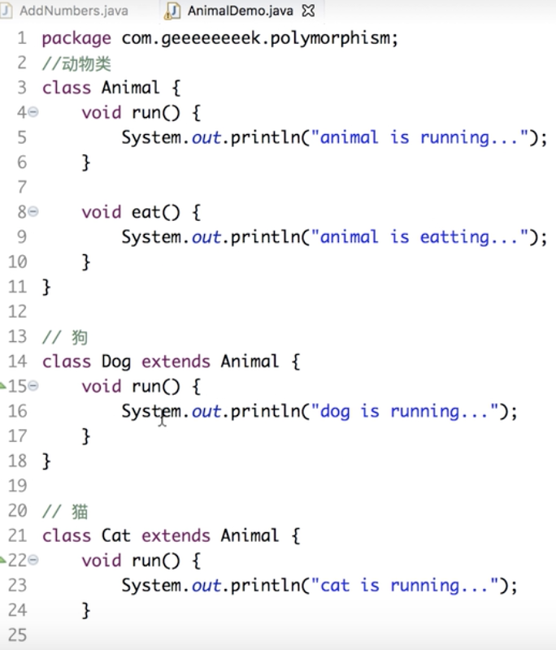
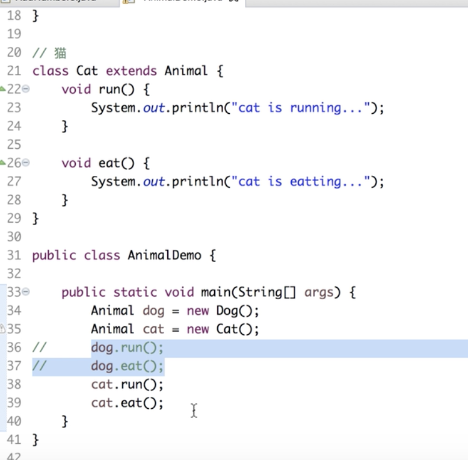
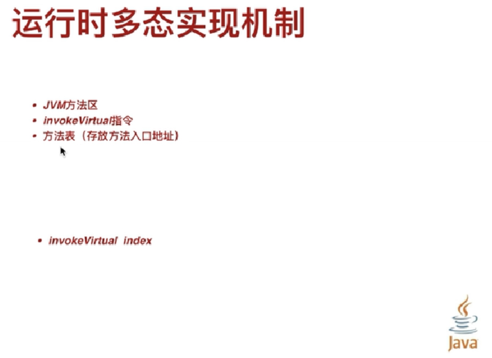
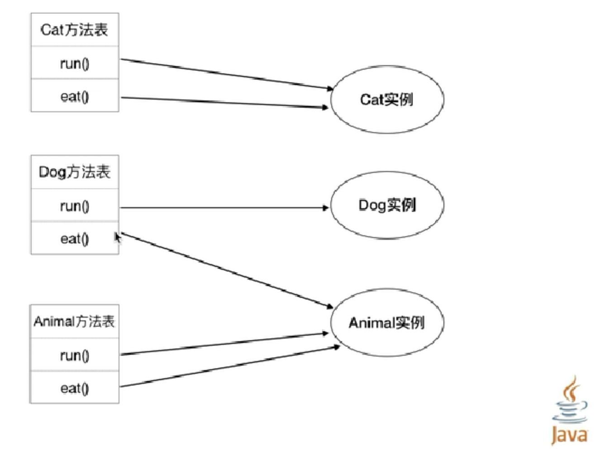
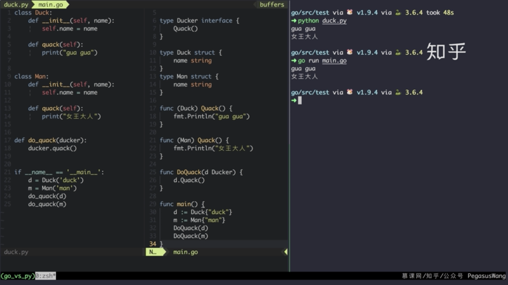

<br>

系列文章：


[golang利用组合实现继承,和php或java面向对象的继承有何不同](https://dashen.tech/2014/03/01/golang%E5%88%A9%E7%94%A8%E7%BB%84%E5%90%88%E5%AE%9E%E7%8E%B0%E7%BB%A7%E6%89%BF-%E5%92%8Cphp%E6%88%96java%E9%9D%A2%E5%90%91%E5%AF%B9%E8%B1%A1%E7%9A%84%E7%BB%A7%E6%89%BF%E6%9C%89%E4%BD%95%E4%B8%8D%E5%90%8C/)


[Golang类型断言](https://dashen.tech/2017/07/26/Golang%E7%B1%BB%E5%9E%8B%E6%96%AD%E8%A8%80/)


[golang之interface入门](https://dashen.tech/2010/03/02/golang%E4%B9%8Binterface%E5%85%A5%E9%97%A8/)


[interface,鸭子类型与泛型](https://dashen.tech/2020/09/05/interface-%E9%B8%AD%E5%AD%90%E7%B1%BB%E5%9E%8B%E4%B8%8E%E6%B3%9B%E5%9E%8B/)


<br>


## <font color="#00CED1">golang中「实现」OOP</font>


<br>


[封装、继承和多态](https://www.cnblogs.com/zongmin/p/11342221.html)

[面向对象的三个基本特征](https://blog.csdn.net/zhouge000/article/details/82427208)




**继承,多态,封装,是面向对象的三大特性.**



<br>

### <font color="#ADFF2F">封装 Encapsulation</font>

<br>

指的是将对象的状态信息隐藏在对象内部，不允许外部程序直接访问对象内部信息，而是通过该类所提供的方法来实现对内部信息的操作和访问。


**三个访问控制符**:

private、 protected 和 public 


Go中用`大小写`以及`internal`文件夹机制,近似实现了权限控制


#### 大小写:

<br>

*无论是方法名、常量、变量名还是结构体的名称，如果首字母大写，则可以被其他的包访问；如果首字母小写，则只能在本包中使用*

*可以简单的理解成，首字母大写是公有的，首字母小写是私有的*

<br>

#### internal:

<br>

参考:

[golang internal代码包]()


<br>

---


### <font color="#ADFF2F">继承</font>

<br>

对于Java:

使用 extends 作为继承的关键字，子类扩展了父类，获得父类的全部成员变量和方法。


**在重写父类方法应遵循 “两同两小一大“ 规则：**

- “两同” 指方法名相同、形参列表相同；
- “两小” 指子类方法返回值类型和抛出的异常类型应比父类方法的更小或相等；
- “一大” 指的是子类方法的访问权限应比父类方法的访问权限更大或相等。

<br>


Go中用`结构体的嵌套`,近似实现了`继承`

[golang之struct入门](http://www.dashen.tech/2017/11/26/golang%E4%B9%8Bstruct%E5%85%A5%E9%97%A8/)


[golang利用组合实现继承,和php或java面向对象的继承有何不同]()

<br>

---


### <font color="#ADFF2F">多态 Polymorphisn</font>

<br>

继承和封装都很好理解,但多态则要相对晦涩一些.


[谈谈对Java多态的理解](https://www.bilibili.com/video/BV18W411C7TC)



**相同类型的变量调用同一个方法时呈现出多种不同的行为特征。**(仅指`运行时多态`)


<font color="orange">编译类型看左边，运行类型看右边</font>





#### Java的编译时多态: (也称`静态多态`)

<br>


- 在编译期间就能决定要执行的方法,
- 一般通过`重载`(overloading)来实现
- 方法名相同,参数不同(如参数`类型`/`数量`不同)



使用时只要传的参数不同,在代码编译期,就能知道需要执行哪个方法


<br>

#### Java的运行时多态 (也称`动态多态`)

<br>


- 在运行期间才能决定要执行的是哪个方法
- 通过`覆盖`(overriding,也称为*重写*)和继承来实现(即在继承时,子类覆写父类的方法,且方法名和参数完全一致)
- 同名同参
- JVM决定目标方法








执行结果为:

```java
dog is running...

animal is eatting...


cat is running...

cat is eatting...
```

在编译时,还无法确定要执行的方法,只有在运行时才能决定到底执行哪个


**动态多态的实现:**







借助于JVM中的方法表,方法的实际入口地址,指向的是最终实现了这份方法的实例(即为何会输出dog is running而不是animal is running)


<br>

---

<br>

**重载（Overload）和重写（Override）区别：**

- 重载指的是同一类中多个同名方法；
- 重写指的是子类和父类的同名方法。


参考:

[重写(Override)与重载(Overload)]()

<br>


---

<br>

## <font color="#00CED1">golang"实现"多态</font>

<br>

### <font color="#ADFF2F">接口与鸭子类型</font>


<br>

<font color="orange">

只要能"嘎嘎叫",即只要有鸭子的这个行为,就认为这是个鸭子...

管你是鸭子还是鸡,还是飞禽走兽,甚至是电脑是玩具,只要能发出叫声,即只要实现了"叫"这个方法,就认为这是鸭子

即更关注对象的行为,而不是它的类型


</font>

<font color="lightblue">

更关注行为,不关注类型...

即不问出身,不管是不是贫农,只要一起干革命,心向马列主义,就认为是自己人
</font>


[golang中的鸭子类型](http://blog.sina.com.cn/s/blog_713f44f60102wxht.html)


[Python Vs Go，鸭子类型，你有我也有](https://zhuanlan.zhihu.com/p/59299729)

[Golang中的接口与鸭子类型](https://blog.51cto.com/speakingbaicai/1703249)


关于上面链接中提到的:

 > 在golang中，值接收者和指针接收者的方法集是不同的。只是golang会智能地解引用和取引用，使得二者的方法集看上去是一样的。但是，在调用exchangeThese时，就凸显出二者的不同了。


可以参见 

[用好指针  肯定会与结构体,与接口联系在一起](https://note.youdao.com/web/#/file/WEBcdb22e5a7154c0a0c018b6c4f2b9f7de/note/WEB8d51de0fb218b37458ddba94f05753b6/?search=interface)

 **知道指针,可以知道值;反之则不然.**


 <br>


 


```go
package main

import "fmt"

type Substance interface { //body,substance,object均有"物体"的意思
	Say()
}

type Dog struct {
	name  string
	color string
	age   int
}

type ElectricDog struct {
	name  string
	color string
}

type Cat struct {
}

func (Dog) Say() {
	fmt.Println("汪汪汪")
}

func (ElectricDog) Say() {
	fmt.Println("哇哇哇")
}

func (Cat) Say() {
	fmt.Println("喵喵喵")
}

func DoSay(sth Substance) {
	sth.Say()
}

func main() {

	d := Dog{"狗", "黑色", 3}

	e := ElectricDog{"电动玩具狗", "白色"}

	c := Cat{}

	DoSay(d)
	DoSay(e)
	DoSay(c)

}
```

输出为:

```go
汪汪汪
哇哇哇
喵喵喵
```

<br>

---

<br>

#### 代码中的体现:


---

<br>


参考:

[理解 Go interface 的 5 个关键点](https://sanyuesha.com/2017/07/22/how-to-understand-go-interface/)