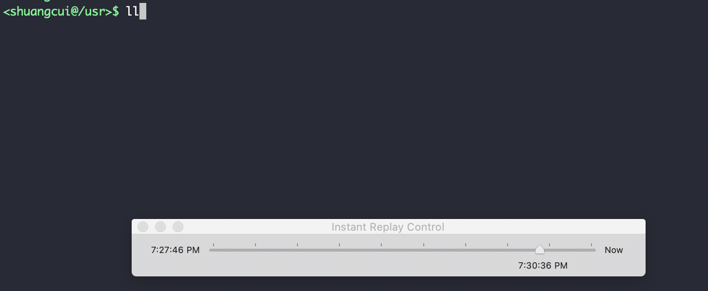
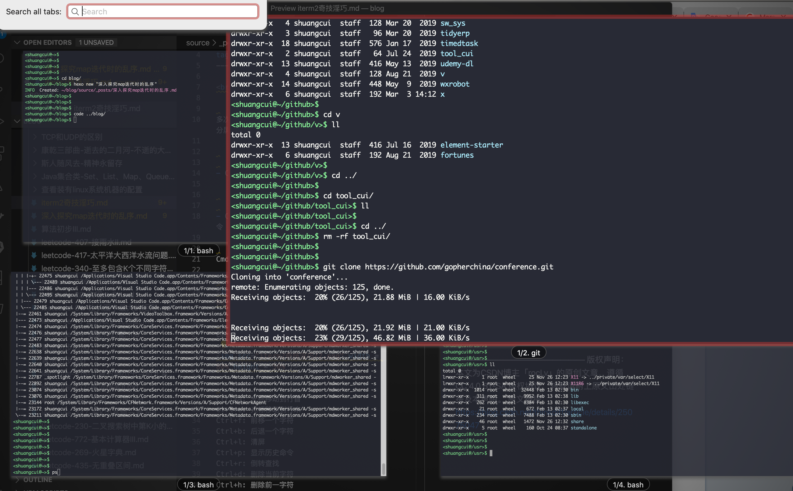
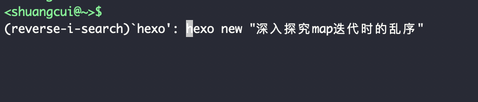
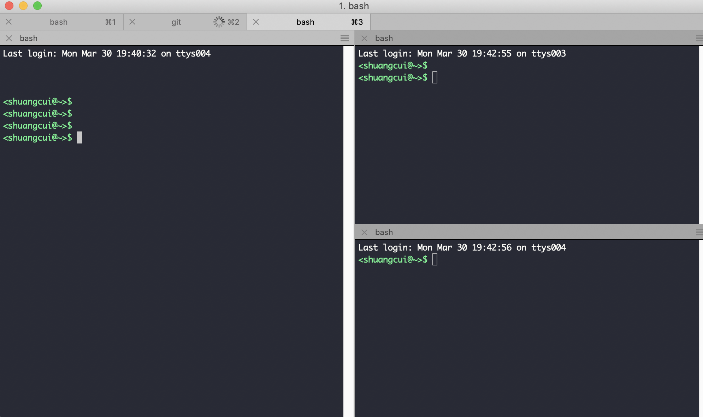

 

多次被安利过tmux,实际上iterm2本身的快捷键及分屏操作已经足够强大,在此总结常用命令:

 

- Cmd `+` ;  : 选择在当前窗口用过的命令:

- Cmd`+`Shift`+`H  :显示进行过粘贴操作的命令

Cmd`+`Option`+`B : 命令回放(非常好用)

Cmd `+` Option `+` E : 多窗口全局搜索

- Ctrl`+`a: 光标移动到行首

- Ctrl`+`e: 光标移动到行末

- Ctrl`+`f: 前移一个字符
  - 在HHKB上用很实用

- Ctrl`+`b: 后退一个字符
  - 在HHKB上用很实用

- Ctrl`+`l: 清屏
  - 类似于`clear`,往上翻还是能看到历史

- Ctrl`+`p: 回到上一个历史命令
  - 类似上下箭头

- Ctrl`+`r: 倒转查找

- Ctrl`+`d: 删除光标选中的字符
  

- Ctrl`+`h: 删除前一字符
  - 相当于delete

- Ctrl`+`w: 删除光标之前的字符

- Ctrl`+`k: 删除光标之后的字符

---

**窗口切换操作:**

- Command `+` 数字 : 切换到该窗口

- Command `+` t : 新建新的窗口

- Command `+` 左右方向键 : 切换窗口

---

**分屏操作:**

- Command `+` d: 纵向分屏

- Command `+` Shift `+` d : 横向分屏

- Command `+` [ : 切换选中的分屏

————————————————

更多参考:

[mac下超好用的终端--iterm2用法与技巧](https://blog.csdn.net/thinkdiff/article/details/25075047)