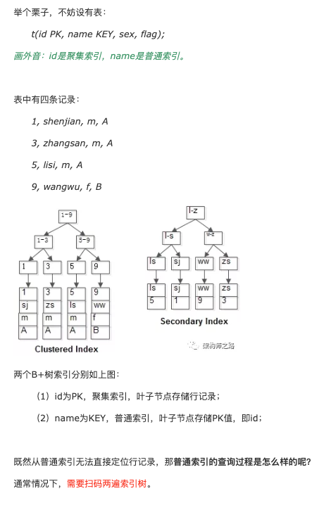
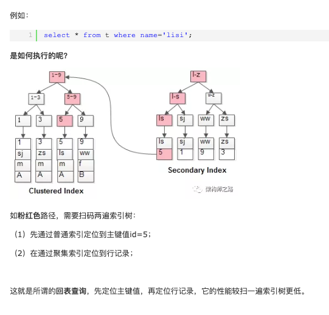
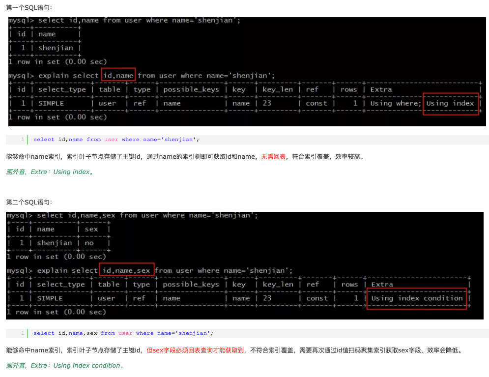
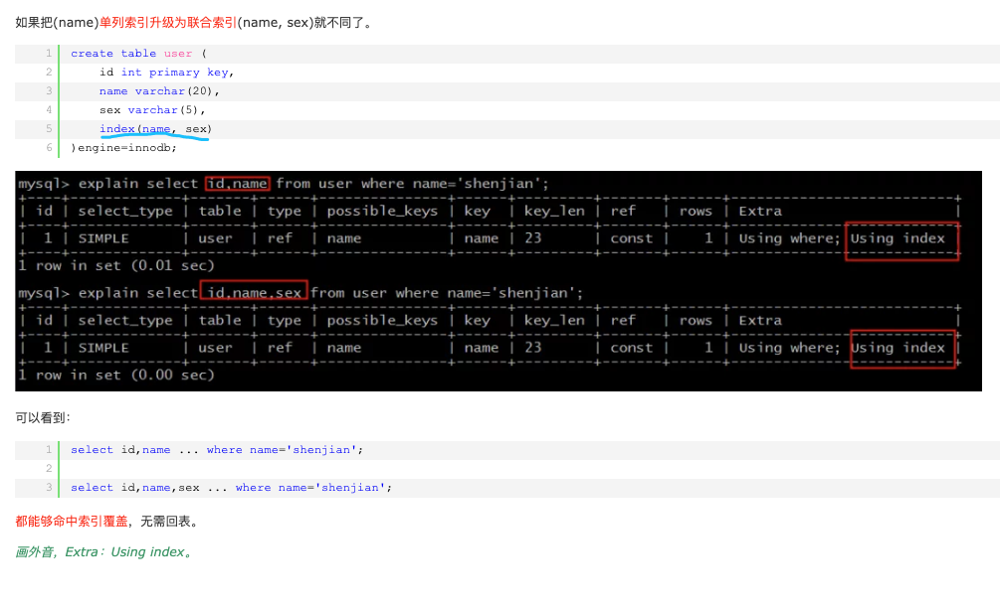
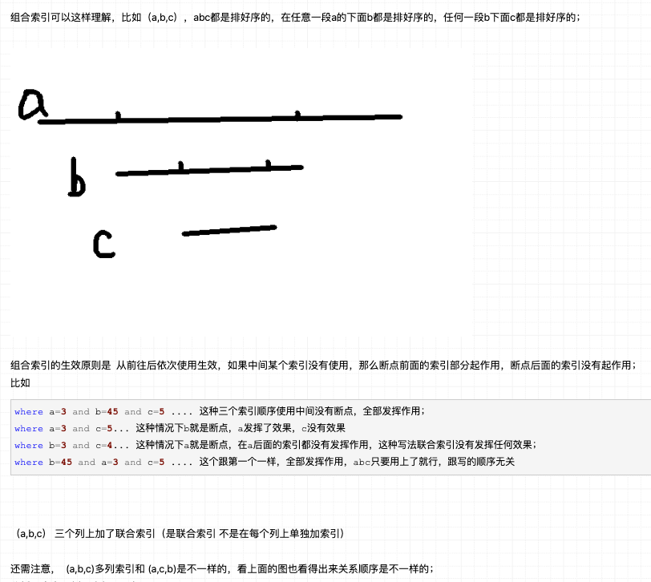
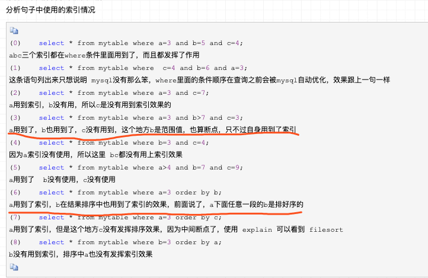

前文说到,可以通过联合索引,解决Innodb二级索引的[`回表问题`](https://www.cnblogs.com/myseries/p/11265849.html),

[如何解决Innodb二级索引的二次查询问题(回表) --- 建立联合索引](http://dashen.tech/2018/01/22/%E7%B4%A2%E5%BC%95-%E4%B9%8B%E7%B4%A2%E5%BC%95/#%E5%A6%82%E4%BD%95%E8%A7%A3%E5%86%B3Innodb%E4%BA%8C%E7%BA%A7%E7%B4%A2%E5%BC%95%E7%9A%84%E4%BA%8C%E6%AC%A1%E6%9F%A5%E8%AF%A2%E9%97%AE%E9%A2%98-%E5%9B%9E%E8%A1%A8-%E2%80%94-%E5%BB%BA%E7%AB%8B%E5%A4%8D%E5%90%88%E7%B4%A2%E5%BC%95)


### <font color="red">联合索引</font>

<br>

也称 复合索引,覆盖索引,多列索引,组合索引,

与之对应的是单列索引

<br>






`只需要在一棵索引树上就能获取SQL所需的所有列数据，无需回表，速度更快。`

```sql
一个包含查询所需字段的索引称为“覆盖索引”

MySQL只需要通过索引就可以返回查询所需要的数据，而不必在查到索引之后进行回表操作，减少IO，提高了效率
```

常见的方法是：将被查询的字段，建立到联合索引里去。

<br>


### <font color="red">亲测体验</font>

<br>

```sql
create table user (
    id int primary key,
    name varchar(20),
    sex varchar(5),
    index(name)
)engine=innodb;
```

<br>







注: 当select *且where或order by的字段为主键索引id时,自然也无需回表即可查到所有内容

<br>

### <font color="red">联合索引的创建原则</font>

<br>

对于联合索引(abc), 基于`最左匹配原则`, 匹配条件为 a,ab,abc,acb时,均可以用上该索引,而b,c,bc则使用不到索引






- 最可能被单独使用的排在最前面.

- where或order by的顺序不需要按照联合索引的顺序

- 当有`>`或`<`操作,该字段还可以使用索引,但该列之后将出现断点,无法再用索引


**最左匹配原则:**

mysql会一直向右匹配直到遇到范围查询(>、<、between、like)就停止匹配，比如a = 1 and b = 2 and c > 3 and d = 4 如果建立(a,b,c,d)顺序的索引，d是用不到索引的，如果建立(a,b,d,c)的索引则都可以用到，a,b,d的顺序可以任意调整。


---


<br>

[更多可参考](https://www.google.com/search?q=%E8%81%94%E5%90%88%E7%B4%A2%E5%BC%95%E5%A4%B1%E6%95%88&rlz=1C5CHFA_enCN758CN758&oq=%E8%81%94%E5%90%88%E7%B4%A2%E5%BC%95%E5%A4%B1%E6%95%88&aqs=chrome..69i57j69i60l4j69i65l2.5337j0j1&sourceid=chrome&ie=UTF-8)