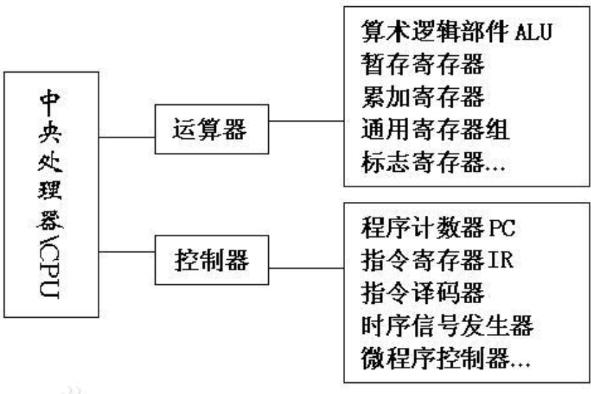
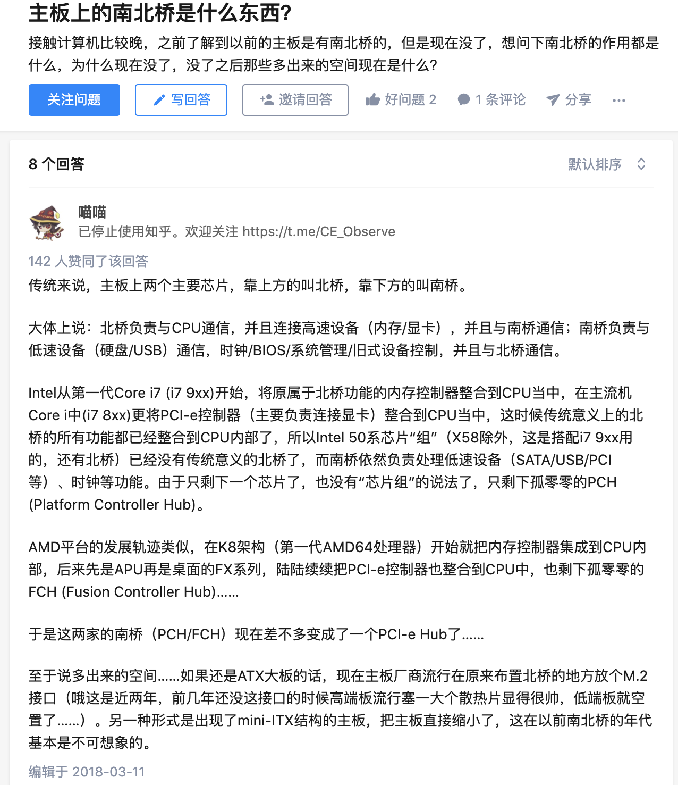
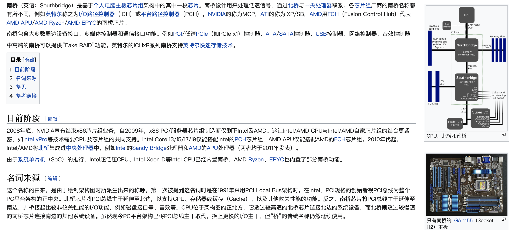
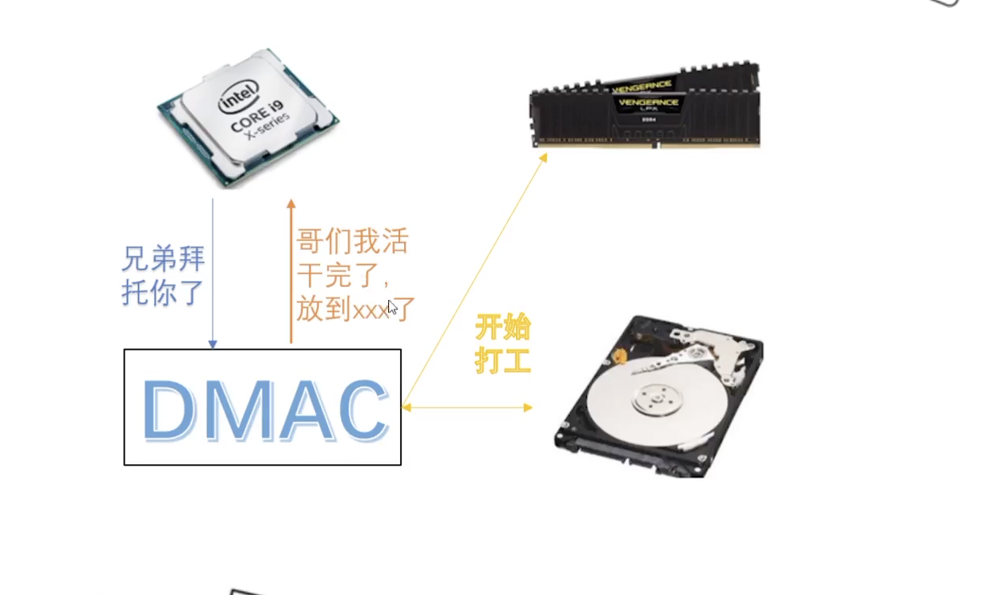
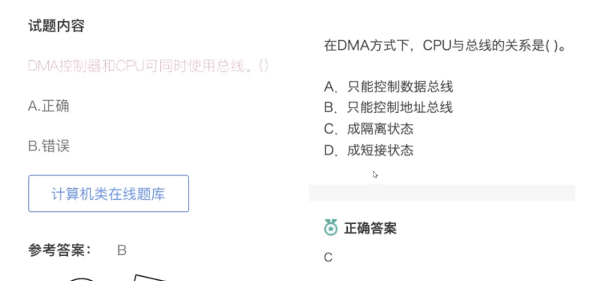
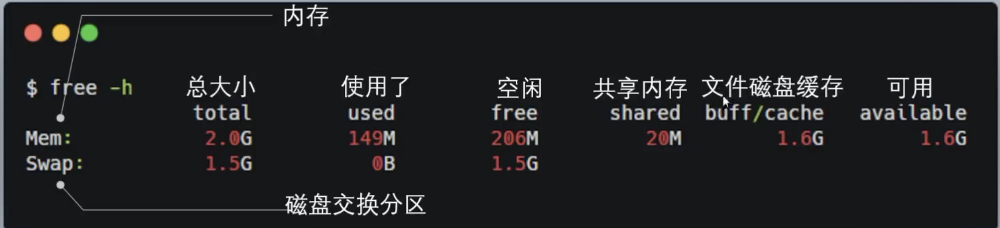
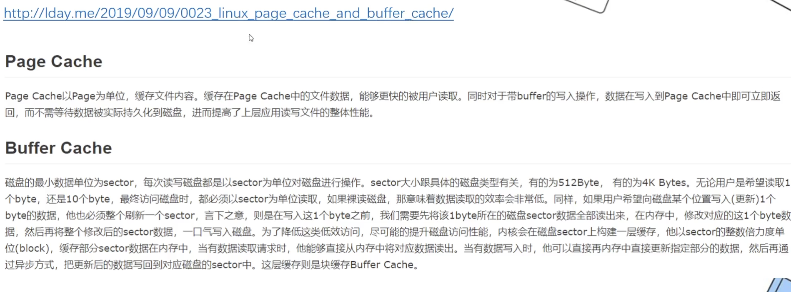
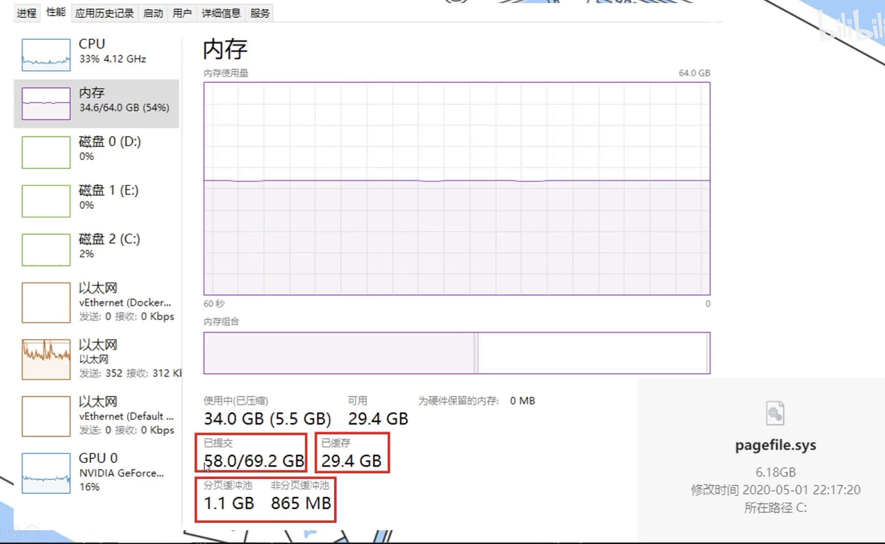
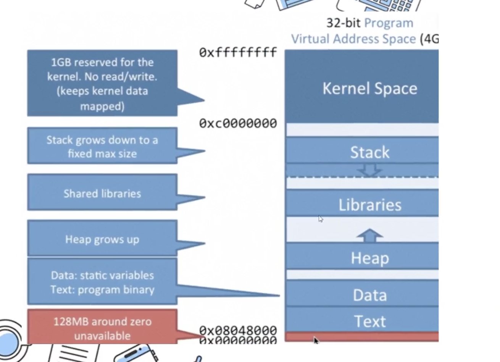
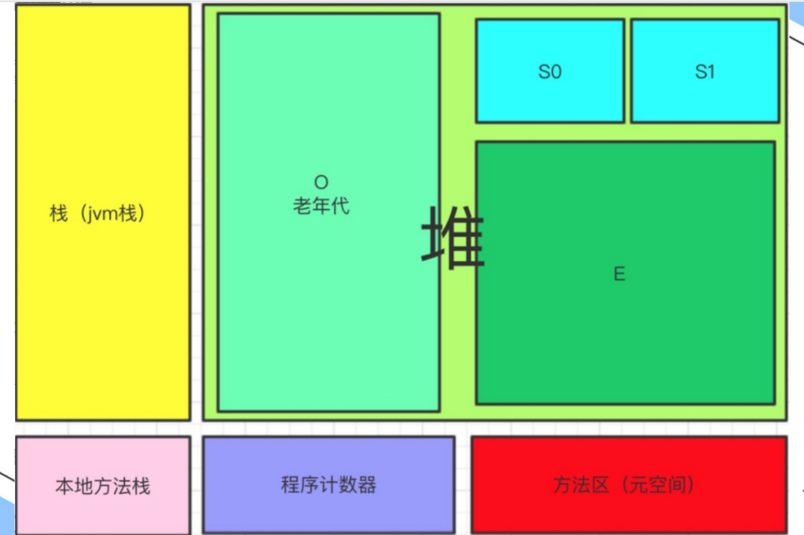

### CPU

 

CPU: central processing unit,中央处理器,主要包括两个部分，即运算器、控制器

**运算器:**

- ALU: Arithmetic and Logic Unit,算术逻辑单元

- ACC: Accumulator,累加寄存器

- DR: Data Register,数据缓冲寄存器

- PSW: Program Status Word,程序状态字(也称程序状态寄存器)

 

**控制器:**

- IR: Instruction Register,指令寄存器, 临时放置从内存里面取得的程序指令的寄存器

- PC: Program Counter,程序计数器, 用于存放下一条指令所在单元的地址的地方

- AR: Address Register,地址寄存器. 用来保存当前CPU所访问的内存单元的地址。由于在内存和CPU之间存在着操作速度上的差别，所以必须使用地址寄存器来保持地址信息，直到内存的读/写操作完成为止

- ID: Instruction Decoder,指令译码器.

 

---

 

### 内存篇

 

DMA:直接内存访问

DMAC:直接内存访问 控制器

DMAC位于主板的另一块芯片`南桥`中.

读取文件是非常机械重复性地工作,CPU这么金贵不适合干.DMAC可以直接访问内存,将磁盘中的文件读取到内存.而后以`中断`的形式通知CPU,

为什么DMA可以直接访问内存?因为CPU在把读取文件的指令给DMA时,也会把总线的控制权给它.这时CPU与总线是隔离的...

DMA在读取文件过程中,不是一直持有总线的控制权,而是与CPU约定,轮流坐庄. 即像之前普京和梅德韦杰夫那样,轮换掌握总线的控制权..因为时间极短极短,用户是无感知的

 

---

 

MMU:内存管理单元（memory management unit，MMU），有时称作分页内存管理单元（paged memory management unit，PMMU）。

是一种负责处理CPU内存访问请求的计算机硬件。其功能包括**虚拟地址到物理地址的转换（即虚拟内存管理）、内存保护、中央处理器高速缓存的控制**

 

MMU通常借助一种叫做**转译旁观缓冲器（Translation Lookaside Buffer，TLB）** 的相联高速缓存（associative cache）来将虚拟页号转换为物理页号。当后备缓冲器中没有转换记录时，则使用一种较慢的机制，其中包括专用硬件（hardware-specific）的数据结构（Data structure）或软件辅助手段。这个数据结构称为分页表，页表中的数据就叫做**分页表项（page table entry，缩写为PTE）**。物理页号结合页偏移量便提供出了完整的物理地址。

页表或转换后备缓冲器中数据项包括的信息有：

一、“脏位”（页面重写标志位，dirty bit）——表示该页是否被写过。

二、“访问位”（accessed bit）——表示该页最后使用于何时，以便于最近最少使用页面置换算法（least recently used page replacement algorithm）的实现。

三、哪种进程可以读写该页的信息，例如用户模式（user mode）进程还是特权模式（supervisor mode）进程。

四、该页是否应被高速缓冲的信息。

 

有时，TLB或PTE会禁止对虚拟页的访问，这可能是因为没有物理随机存取存储器（random access memory）与虚拟页相关联。如果是这种情况，MMU将向CPU发出页错误（page fault）的信号。操作系统(operating system）将进行处理，也许会尝试寻找RAM的空白帧，同时创建一个新的PTE将之映射到所请求的虚拟地址。如果没有空闲的RAM，可能必须关闭一个已经存在的页面，使用一些替换算法，将之保存到磁盘中（这被称之为页面调度（paging）。在一些MMU中，PTEs或者TLB也存在一些缺点，在这样的情况下操作系统将必须释放空间以供新的映射。

[为什么 Linux 默认页大小是 4KB](https://draveness.me/whys-the-design-linux-default-page/)

 

虚拟地址和物理内存映射,虚拟地址还可以映射到磁盘上,即Swap分区.

 

`cache`和`buffer`的区别:
两者有在合二为一的趋向

 

Windows中的pagefiles.sys相当于Linux的Swap

已提交的量可以远远大于物理硬件的上限..类似好几个T的网盘,实际占用的空间根本没那么多,用多少给多少,几个T只是一个给你分配的上限.

---

`系统调用`是 用户态 切换到 内核态 的方式之一(还有另外两种方式,`中断`和`异常`).

申请内存时就需要进行系统调用.

C语言的malloc只是一个库函数,封装了`brk`和`mmap`这两个系统调用的封装.小于128K时,调用*brk*,大于128k时,调用*mmap*

brk分配的是连续内存(即并不是在堆空间随意找内存,即提高了Heap部分的上界),可以用C语言的sbrk库来测试检验

mmap是在堆和栈之间的一段(游离)区域来申请内存

> pidstat工具可用来检测进程

 

关于[零拷贝技术](https://medium.com/@xunnan.xu/its-all-about-buffers-zero-copy-mmap-and-java-nio-50f2a1bfc05c)

---

 

Java中的内存:

 

内存五区:

*程序记录器* 记录程序运行到哪里了.

局部变量存在栈上,全局变量在堆上分配.(经逃逸分析后发现没有出方法的变量仍然定义在栈上)

 

