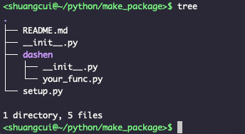
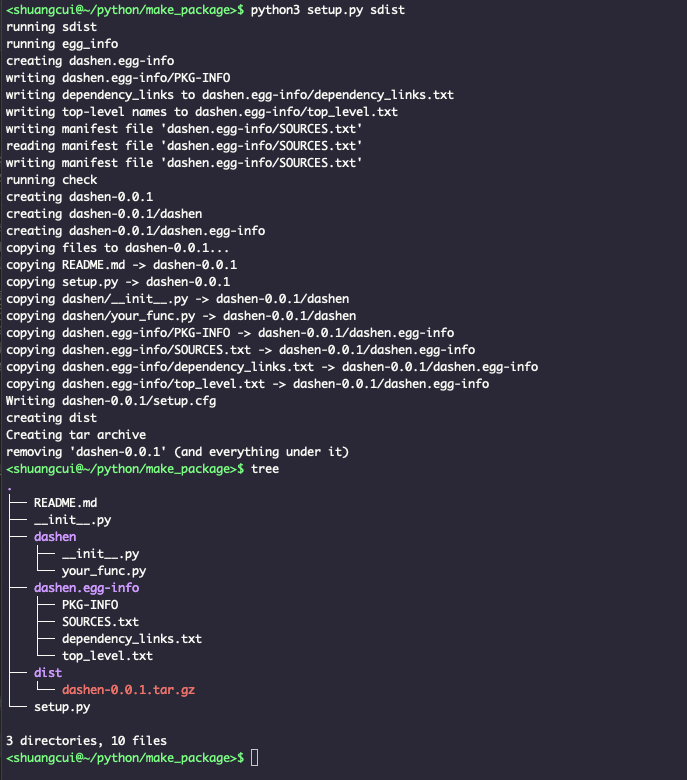
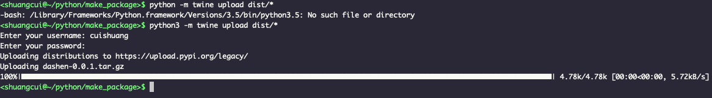
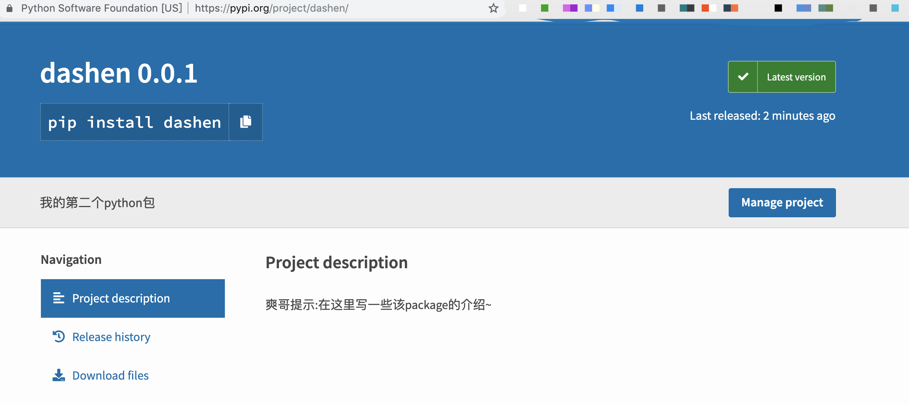
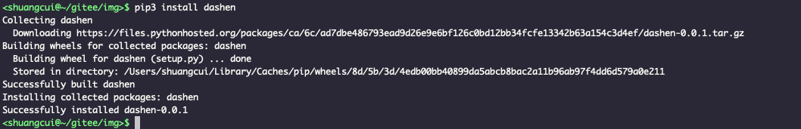
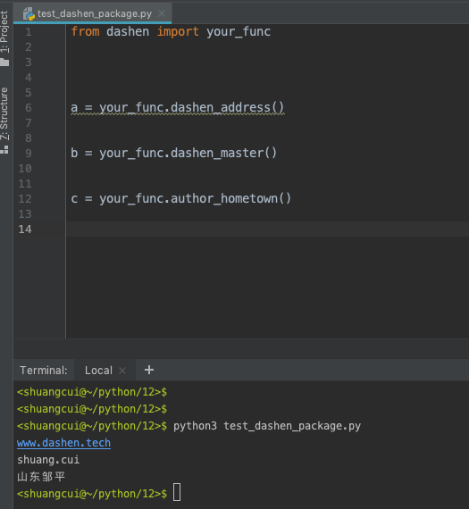

> 平时写Python,需要用到一个新包时,习惯了pip install packageName,写多了就会想,这些包都是怎么来的?自己能不能"制作"一个,任何人也都可以通过pip安装?


有此想法,躬行实践.答案显然是肯定的,而且难度也绝没有想的那样大,或者说 `It is easy`.


#### 1.编写代码

如要制作的包名为`dashen`,新建如下目录结构



- 其中两个`__init__.py`为空即可

- README.md写一些该package的介绍,非必选

- `your_func.py`是具体的功能实现,在此示例如下:

```python
def dashen_address():
    print('www.dashen.tech')


def dashen_master():
    print('shuang.cui')


def author_hometown():
    print('山东邹平')

```

- `setup.py`内容如下:

```python
import setuptools

with open("README.md","r") as fh:
    long_description = fh.read()

setuptools.setup(
    # 包的分发名称，使用字母、数字、_、-
    name="dashen",
     # 版本号, 版本号规范：https://www.python.org/dev/peps/pep-0440/
    version="0.0.1",
    # 作者名
    author="fliter",
     # 作者邮箱
    author_email="i@dashen.tech",  
    # 包的简介描述
    description="我的第二个python包",
    # 包的详细介绍(一般通过加载README.md)
    long_description=long_description, 
    # 和上条命令配合使用，声明加载的是markdown文件
    long_description_content_type="text/markdown",
    # 项目开源地址
    url="http://www.dashen.tech",
     # 如果项目由多个文件组成，我们可以使用find_packages()自动发现所有包和子包，而不是手动列出每个包，在这种情况下，包列表将是example_pkg
    packages=setuptools.find_packages(),
    # 关于包的其他元数据(metadata)
    classifiers=[
         # 该软件包仅与Python3兼容
        "Programming Language :: Python :: 3",
        # 根据MIT许可证开源
        "License :: OSI Approved :: MIT License",
        # 与操作系统无关
        "Operating System :: OS Independent",
    ],
)
```

#### 2.账号注册及打包

- [注册Pypi](https://pypi.org/)

- 更新pip,setuptools和wheel

`pip install --upgrade pip setuptools wheel`

- 切换到setup.py的同级目录,进行打包

`python setup.py sdist`



**会出现两个新文件**


#### 3.上传

 上传Pypi

`pip install twine `<br>
(如果已经安装twine，跳过此步骤)

`python -m twine upload dist/*`<br>
输入Pypi的账号及密码



---

#### 4.查看及检验




<br>




<br>




---

<font color:"red">完结,撒花</font>