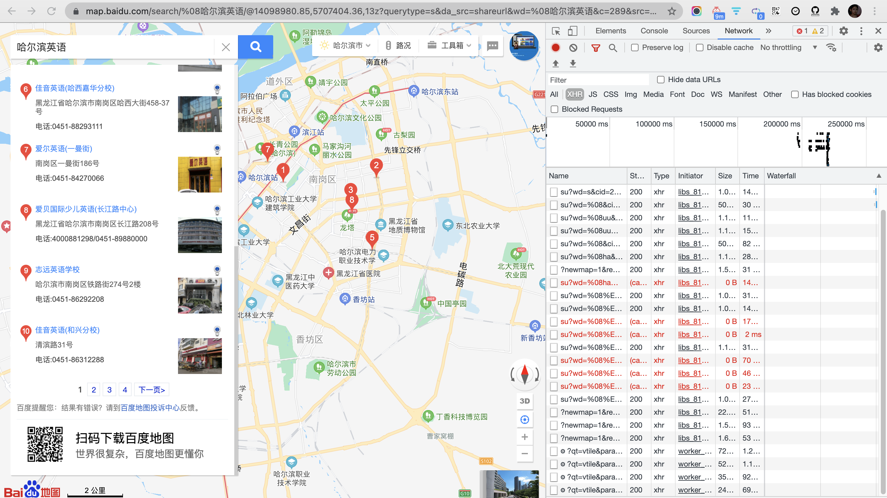
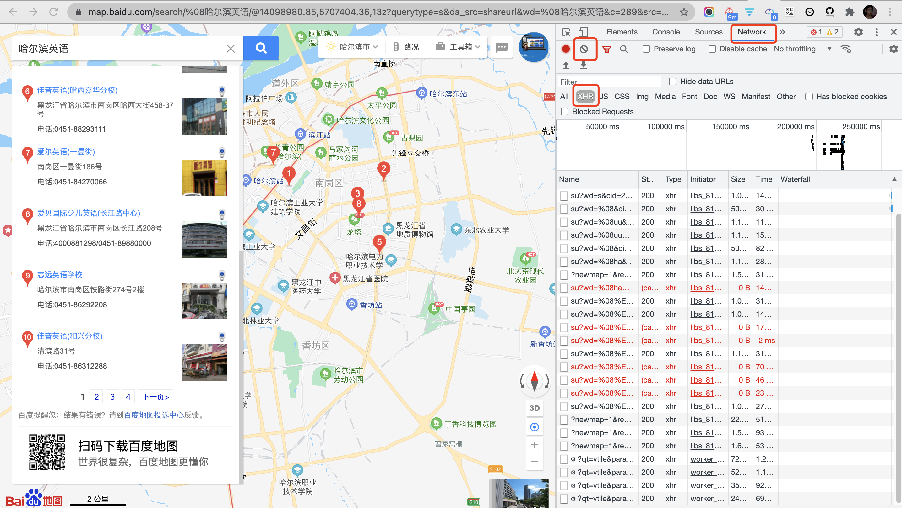
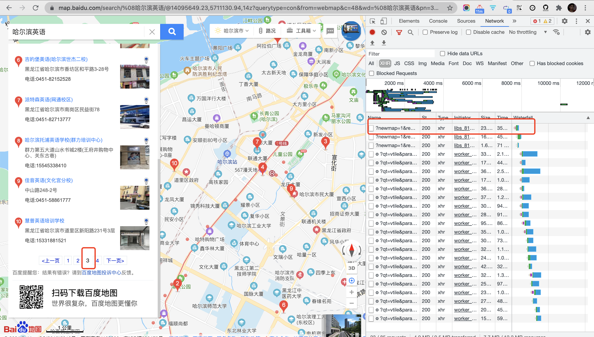
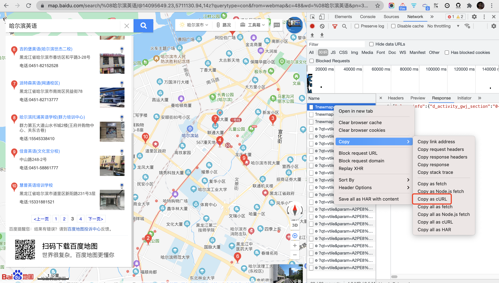
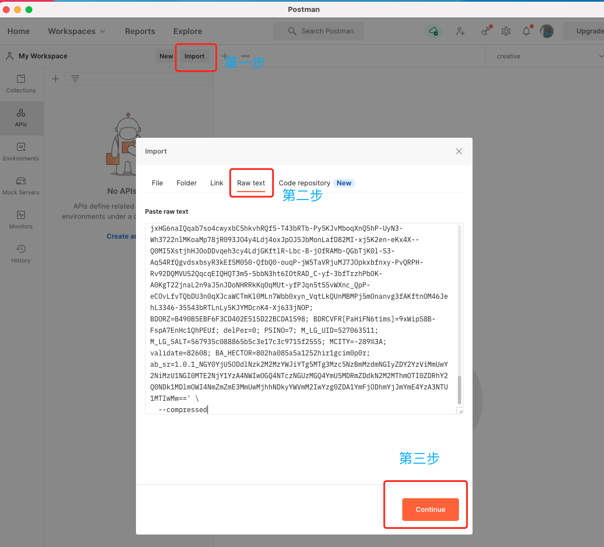
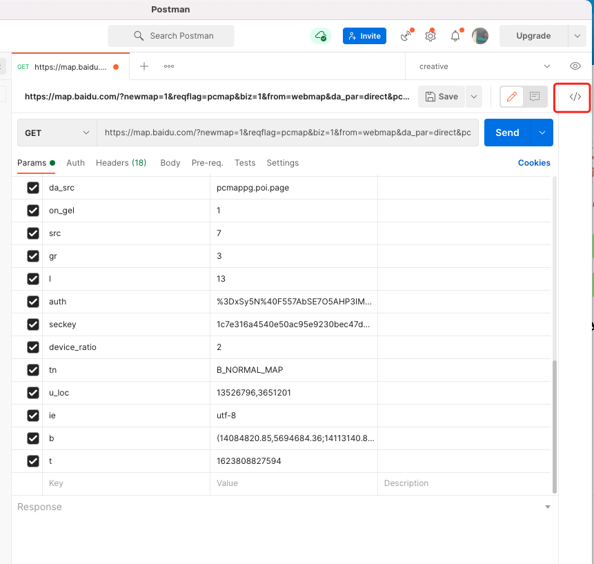
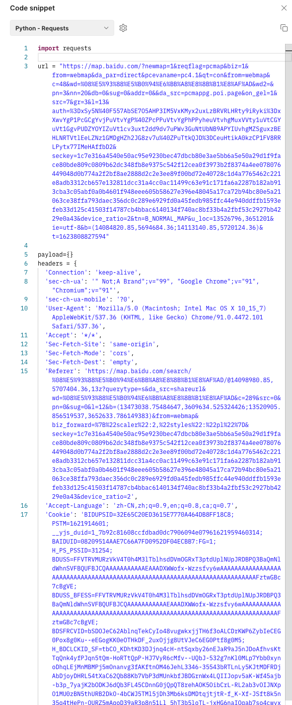
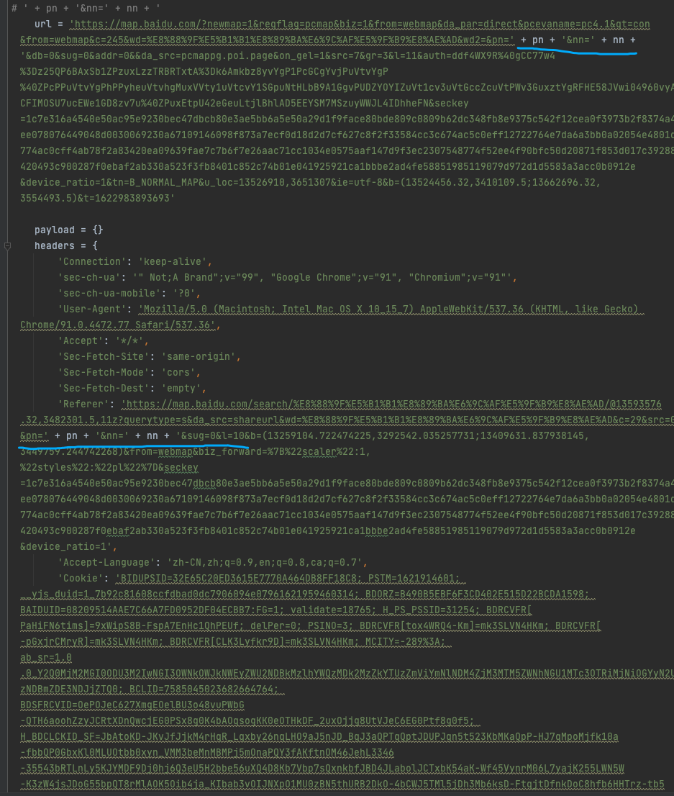
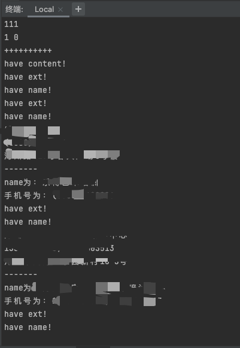

一直想教女票写代码,但苦于工作就占据她好大部分精力,周末不辞奔波从杭来沪相聚,实在不忍也无心思.


恰好她工作中需要获取地图上的一些数据, 手工找寻复制 费时费力, 逢此契机, 当然要用代码尽可能简化机械重复操作, 力图一劳永逸. 

首选简洁易入门的Python. 下文就是对流程的总结, 及简述每步的意义. 并不Hack,重在感受编程的用途和基本工具的使用.


<br>


以[百度地图](https://map.baidu.com/@13529796,3654201,13z)为例,需求如下:



想要收集该关键词匹配到的所有公司的名称,地址,和联系方式(没有电话/手机的则忽略),

<br>

### 1. ctrl+shift+i 调出开发者工具 (Mac为Command+Option+i)

<br>



(1). 点击 *Network*,选择*XHR*

这是为了能够获取接口的返回值,即为了能拿到原始的数据


(2). 点击clear,清理掉当前所有接口信息的返回

(3). 点击左侧下方的页码,如第3页. 这时在控制台就发现有新的接口请求




(4). 选中第一个,`右键->Copy->Copy as Curl `(Windows为Copy as Curl Bash)



这时就把这个接口的请求复制了下来

<br>


### 2.借助Postman,生成Python代码


<br>

(1). 依次点击 `Import->Raw text`,粘贴,点击`Continue->Import`




(2). 点击右侧`</>`图标,选择 `Python - Requests`




<br>

### 3.添加逻辑并执行

<br>

(1). 复制代码到Pycharm, 找到url和headers里面的pn, 将其后面的内容替换为 `' + pn + '&nn=' + nn + '`

（这是为了把页码写活, 多次请求替代人工翻页；）




(2). 再在代码中添加对数据的筛选, 如去掉没有联系方式的内容； 及最后将数据写入到csv的逻辑





最终代码如下:

```python

import requests
import json
import csv
import urllib


def cui():
    a = 1
    pnInt = 1
    print(111)
    wd = urllib.parse.quote("xxxx")

    while a < 30:
        nnInt = pnInt * 10 - 10
        print(pnInt, nnInt)
        print("++++++++++")
        fetch(pnInt, nnInt, wd)
        a = a + 1
        pnInt = pnInt + 1


def fetch(pnInt, nnInt, wd):
    pn = str(pnInt)
    nn = str(nnInt)

    # ' + pn + '&nn=' + nn + '
    url = 'https://map.baidu.com/?newmap=1&reqflag=pcmap&biz=1&from=webmap&da_par=direct&pcevaname=pc4.1&qt=con&from=webmap&c=245&wd=%E8%88%9F%E5%B1%B1%E8%89%BA%E6%9C%AF%E5%9F%B9%E8%AE%AD&wd2=&pn=' + pn + '&nn=' + nn + '&db=0&sug=0&addr=0&&da_src=pcmappg.poi.page&on_gel=1&src=7&gr=3&l=11&auth=xxxxxxxseckey=xxxxxxxxxxxxxxxxxxxxxxxxxxxxcb80e3ae5bb6a5e50a29d1f9face80bde809c0809b62dc348fb8e9375c542f12cea0f3973b2f8374a4ee078076449048d0030069230a67109146098f873a7ecf0d18d2d7cf627c8f2f33584cc3c674ac5c0eff12722764e7da6a3bb0a02054e4801d774ac0cff4ab78f2a83420ea09639fae7c7b6f7e26aac71cc1034e0575aaf147d9f3ec2307548774f52ee4f90bfc50d20871f853d017c39288420493c900287f0ebaf2ab330a523f3fb8401c852c74b01e041925921ca1bbbe2ad4fe58851985119079d972d1d5583a3acc0b0912e&device_ratio=1&tn=B_NORMAL_MAP&u_loc=13526910,3651307&ie=utf-8&b=(13524456.32,3410109.5;13662696.32,3554493.5)&t=1622983893693'

    payload = {}
    headers = {
        'Connection': 'keep-alive',
        'sec-ch-ua': '" Not;A Brand";v="99", "Google Chrome";v="91", "Chromium";v="91"',
        'sec-ch-ua-mobile': '?0',
        'User-Agent': 'Mozilla/5.0 (Macintosh; Intel Mac OS X 10_15_7) AppleWebKit/537.36 (KHTML, like Gecko) Chrome/91.0.4472.77 Safari/537.36',
        'Accept': '*/*',
        'Sec-Fetch-Site': 'same-origin',
        'Sec-Fetch-Mode': 'cors',
        'Sec-Fetch-Dest': 'empty',
        'Referer': 'https://map.baidu.com/search/%E8%88%9F%E5%B1%B1%E8%89%BA%E6%9C%AF%E5%9F%B9%E8%AE%AD/@13593576.32,3482301.5,11z?querytype=s&da_src=shareurl&wd=%E8%88%9F%E5%B1%B1%E8%89%BA%E6%9C%AF%E5%9F%B9%E8%AE%AD&c=29&src=0&pn=' + pn + '&nn=' + nn + '&sug=0&l=10&b=(13259104.722474225,3292542.035257731;13409631.837938145,3449759.244742268)&from=webmap&biz_forward=%7B%22scaler%22:1,%22styles%22:%22pl%22%7D&seckey=xxxxxxxxxxx9c0809b62dc348fb8e9375c542f12cea0f3973b2f8374a4ee078076449048d0030069230a67109146098f873a7ecf0d18d2d7cf627c8f2f33584cc3c674ac5c0eff12722764e7da6a3bb0a02054e4801d774ac0cff4ab78f2a83420ea09639fae7c7b6f7e26aac71cc1034e0575aaf147d9f3ec2307548774f52ee4f90bfc50d20871f853d017c39288420493c900287f0ebaf2ab330a523f3fb8401c852c74b01e041925921ca1bbbe2ad4fe58851985119079d972d1d5583a3acc0b0912e&device_ratio=1',
        'Accept-Language': 'zh-CN,zh;q=0.9,en;q=0.8,ca;q=0.7',
        'Cookie': 'BIDUPSID=32E65C20ED3615E7770A464DB8FF18C8; PSTM=1621914601; __yjs_duid=1_7b92c81608ccfdbad0dc7906094e07961621959460314; BDORZ=B490B5EBF6F3CD402E515D22BCDA1598; BAIDUID=08209514AAE7C66A7FD0952DF04ECBB7:FG=1; validate=18765; H_PS_PSSID=31254; BDRCVFR[PaHiFN6tims]=9xWipS8B-FspA7EnHc1QhPEUf; delPer=0; PSINO=3; BDRCVFR[tox4WRQ4-Km]=mk3SLVN4HKm; BDRCVFR[-pGxjrCMryR]=mk3SLVN4HKm; BDRCVFR[CLK3Lyfkr9D]=mk3SLVN4HKm; MCITY=-289%3A; ab_sr=1.0.0_Y2Q0MjM2MGI0ODU3M2IwNGI3OWNkOWJkNWEyZWU2NDBkMzlhYWQzMDk2MzZkYTUzZmViYmNlNDM4ZjM3MTM5ZWNhNGU1MTc3OTRiMjNiOGYyN2UzNDBmZDE3NDJjZTQ0; BCLID=7585045023682664764; BDSFRCVID=OePOJeC627XmgEOelBU3o48vuPWbG-QTH6aoohZzyJCRtXDnQwcjEG0PSx8g0K4bAOqsogKK0eOTHkDF_2uxOjjg8UtVJeC6EG0Ptf8g0f5; H_BDCLCKID_SF=JbAtoKD-JKvJfJjkM4rHqR_Lqxby26nqLHO9aJ5nJD_BqJ3aQPTqQptJDUPJqn5t523KbMKaQpP-HJ7qMpoMjfk10a-fbbQP0GbxKl0MLUOtbb0xyn_VMM3beMnMBMPj5mOnaPQY3fAKftnOM46JehL3346-35543bRTLnLy5KJYMDF9Dj0hj6Q3eU5H2bbe56uXQ4D8Kb7Vbp7sQxnkbfJBD4JLabolJCTxbK54aK-Wf45VynrM06L7yajK255LWN5W-K3zW4jsJDoG55bpQT8rMlAOK5Oib4ja_KIbab3vOIJNXpO1MU0zBN5thURB2DkO-4bCWJ5TMl5jDh3Mb6ksD-FtqjtDfnkDoC8hfb6HHTrz-tb5-ICShUFshjbTB2Q-5KL-ytbv8-jkbfJWWfFeja7q-lQ7tJ603fbdJJjoOqcuXPr1ett_babhaPvmQgTxoUJvBCnJhhvG-4clb60ebPRiJPQ9QgbWKpQ7tt5W8ncFbT7l5hKpbt-q0x-jLTnhVn0M5DK0hID9jTLaDToMhfQ2etrKK572sJOOaCvbjbvOy4oTj6j-3-c9el3-JnRiLbA2fPQhSDbRjpJG3MvB-fnjb4DDX57MafjaLJ7sffDlQft205kbeMtjBbQaaGTh_n7jWhk2eq72y-RUQlRX5q79atTMfNTJ-qcH0KQpsIJM5-DWbT8EjHCeJT_OJbkJVCvMaP55K43xKITjh6PgbJ39BtQmJJufhn6j3l7qDhoaDPPMebK00bJa0KrIQg-q3R7O2Uc0JqcJ0ROiQ-Cu5UbB0x-jLN7OVn0MWKbDEq7lKPnJyUnQbtnnBPnR3H8HL4nv2JcJbM5m3x6qLTKkQN3T-PKO5bRh_CcJ-J8XMC_xjj3P; BCLID_BFESS=7585045023682664764; BDSFRCVID_BFESS=OePOJeC627XmgEOelBU3o48vuPWbG-QTH6aoohZzyJCRtXDnQwcjEG0PSx8g0K4bAOqsogKK0eOTHkDF_2uxOjjg8UtVJeC6EG0Ptf8g0f5; H_BDCLCKID_SF_BFESS=JbAtoKD-JKvJfJjkM4rHqR_Lqxby26nqLHO9aJ5nJD_BqJ3aQPTqQptJDUPJqn5t523KbMKaQpP-HJ7qMpoMjfk10a-fbbQP0GbxKl0MLUOtbb0xyn_VMM3beMnMBMPj5mOnaPQY3fAKftnOM46JehL3346-35543bRTLnLy5KJYMDF9Dj0hj6Q3eU5H2bbe56uXQ4D8Kb7Vbp7sQxnkbfJBD4JLabolJCTxbK54aK-Wf45VynrM06L7yajK255LWN5W-K3zW4jsJDoG55bpQT8rMlAOK5Oib4ja_KIbab3vOIJNXpO1MU0zBN5thURB2DkO-4bCWJ5TMl5jDh3Mb6ksD-FtqjtDfnkDoC8hfb6HHTrz-tb5-ICShUFshjbTB2Q-5KL-ytbv8-jkbfJWWfFeja7q-lQ7tJ603fbdJJjoOqcuXPr1ett_babhaPvmQgTxoUJvBCnJhhvG-4clb60ebPRiJPQ9QgbWKpQ7tt5W8ncFbT7l5hKpbt-q0x-jLTnhVn0M5DK0hID9jTLaDToMhfQ2etrKK572sJOOaCvbjbvOy4oTj6j-3-c9el3-JnRiLbA2fPQhSDbRjpJG3MvB-fnjb4DDX57MafjaLJ7sffDlQft205kbeMtjBbQaaGTh_n7jWhk2eq72y-RUQlRX5q79atTMfNTJ-qcH0KQpsIJM5-DWbT8EjHCeJT_OJbkJVCvMaP55K43xKITjh6PgbJ39BtQmJJufhn6j3l7qDhoaDPPMebK00bJa0KrIQg-q3R7O2Uc0JqcJ0ROiQ-Cu5UbB0x-jLN7OVn0MWKbDEq7lKPnJyUnQbtnnBPnR3H8HL4nv2JcJbM5m3x6qLTKkQN3T-PKO5bRh_CcJ-J8XMC_xjj3P; BA_HECTOR=8k240g80012g85akjb1gbpdtl0q; BAIDUID_BFESS=EE9C87CC527526D94BAF4BBF7C68C795:FG=1; BAIDUID=119C90F3DD22536C575B00C437176785:FG=1; MCITY=-289%3A'
    }

    response = requests.request("GET", url, headers=headers, data=payload)

    # print(response.text)

    d = json.loads(response.text)

    if "content" in d.keys():
        print("have content!")
        rs = d["content"]
        # print("json对象d_json: ", d["content"][0]["addr"])

        for val in rs:
            address = val["addr"]
            if "ext" in val.keys():
                print("have ext!")
                extInfo = val["ext"]
                if len(extInfo) > 0:
                    info = extInfo["detail_info"]
                    if "name" in info.keys():
                        print("have name!")
                        name = info["name"]
                        phone = info["phone"]
                        if len(phone) > 0:
                            print(name)
                            print(phone)
                            print(address)
                            print("-------")
                            writeCsv(name, phone, address)


def writeCsv(name, phone, address):
    print("name为：" + name)
    print("手机号为：" + phone)

    # 1. 创建文件对象； 以a+的方式打开是追加数据，而不是覆盖数据
    f = open('所需信息.csv', 'a+', encoding='utf-8')
    # 2. 基于文件对象构建 csv写入对象
    csv_writer = csv.writer(f)
    # 3. 构建列表头
    # csv_writer.writerow(["机构名称", "联系方式", "详细地址"])
    csv_writer.writerow([name, str(phone) + '\t', address])

    f.close()


cui()

```


<br>

(3). 点击下方的 Terminal（终端），运行 python 文件名.py,这时在同级文件夹里,就出现了生成的csv文件

