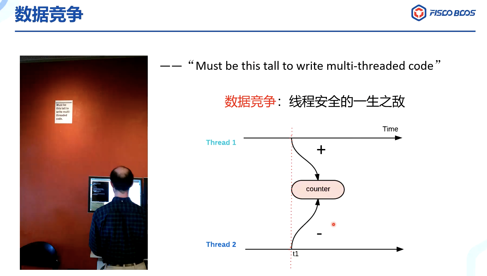
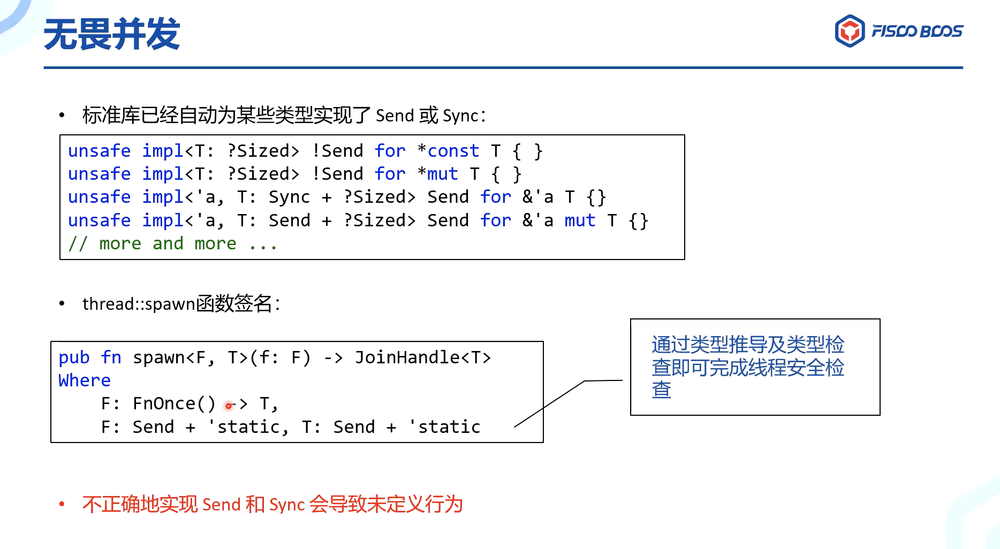

[想要改变世界的 Rust 语言](https://blog.csdn.net/weixin_39445733/article/details/99307054)

[Rust 学习笔记之内存管理与生命周期](https://blog.csdn.net/guyu2019/article/details/113749257)

> 很难编写内存安全的代码

> 很难编写线程安全的代码

Rust 中默认是是移动语义。C++ 默认则是 Copy语义，直到 C++ 11 才引入 Move 移义。复制语义意味着得到是值的副本，两个变量之间其实并没有联系。至于移动语义，并不进行拷贝，而是进行了所有权的转移。Rust 由于它的类型系统是仿射类型系统，默认具有移动语义。仿射类型系统的一个突出的特点就是值或者资源只能用一次。

如果 Rust 只有移动语义，有时就有一定的局限性。因此，Rust 提供了 Copy trait 来实现 Copy 语义。
————————————————
版权声明：本文为CSDN博主「谷雨の梦」的原创文章，遵循CC 4.0 BY-SA版权协议，转载请附上原文出处链接及本声明。
原文链接：https://blog.csdn.net/guyu2019/article/details/113749257

Rust 借鉴了很多语言，比如Cyclone（一种安全的C语言方言）的基于区域的内存管理模型；C++ 的RAII 原理；Haskell 的类型系统、错误处理类型、typeclasses等等。Rust 有非常小的 runtime，不需要垃圾回收，默认情况下是在栈上进行分类内存，而不是堆上。Rust 的编译器 rustc，一开始使用 Ocaml （一种函数式语言）编写，后来在2011年 Rust 实现了自举。

————————————————
版权声明：本文为CSDN博主「谷雨の梦」的原创文章，遵循CC 4.0 BY-SA版权协议，转载请附上原文出处链接及本声明。
原文链接：https://blog.csdn.net/guyu2019/article/details/105132774

---

Rust 还有一个静态的生命周期，使用 'static 表示，Rust 中所有的字符串文本都是具有 static 的生命周期长度，意味着在程序的整个时间内都持续有效。

[张汉东老师](https://www.zhihu.com/people/blackanger)在 [三万字 | 2021 年 Rust 行业调研报告](https://mp.weixin.qq.com/s/9rjeVgVzmrC0wWhV4wA9FA)中，

> 有Go基础：Go语言开发者比较容易理解Rust的类型和trait抽象模式，但Go也是GC语言，所以所有权机制和函数式语言特性是他们的学习重点。

*1、Rust所有权机制，包括所有权的语义，生命周期和借用检查
所有权机制是Rust语言最核心的特性，它保证了在没有垃圾回收机制下的内存安全，所以对于习惯了GC的开发者，理解Rust的所有权是最关键的一环，切记这三点：
Rust中的每一个值都有一个被称为其所有者 (owner)的变量。
值有且只有一个所有者。
当所有者（变量）离开作用域，这个值将被丢弃。这其中又涉及到生命周期和借用检查等概念，是相对比较难啃的一块硬骨头。*

https://www.bilibili.com/video/BV1564y1177A?t=2333

### 编程语言的变革者

Ada语言，当时很先进，但没有流行起来

近些年来，所以编程语言思想的集大成者

汲取百家之长

编译期就能检测出大多数问题，而无需等到运行时才发现

 

锈菌，生命了顽强，5种孢子

**R**obust+Tr**ust**=Rust

 

---

 

### 设计

[Rust playground](https://play.rust-lang.org/)

悬垂指针(野指针)，Use after free，Double free， 目前内存三大问题

RAII(资源获取即初始化)，C缺少这种机制，C++有

- Rust将**堆上的**数据视为资源，每个资源都只能拥有*唯一的所有者* (解决了Double free问题)

- 能够从资源的所有者处借用资源 (只有使用权，没有所有权)

- 当资源被其他代码借用时，资源的所有者不可以释放资源或修改资源 (第2点和第3点结合，一定程度保证了不会有悬垂指针的问题，即指针不会指向无效区域)

（整数比较特殊）

- 

 

借用规则：

- 可变借用&mut 和只读(共享)借用&  （类似mysql的共享锁和排它锁）

-

-  彻底解决了悬垂指针的问题

-

可变借用 &mut：我能拿到你的指针，而且可以通过你的指针进行数据的修改. （去掉了Aliasing，保留了Mutation）

#### 可变性：

#### 生命周期

即 变量作用域的长度

和大多数语言不一样...

数据构建和析构的顺序

如果在同一样中声明两个变量，那它们的声明周期是一样的。但如果之间存在依赖关系，编译器会报错

#### 拒绝迭代器失效

其实是一种误报

 

### 解决并发安全问题

#### 借用 + 生命周期 = 痛苦之源

[一个关于rust生命周期的问题分析](https://zhuanlan.zhihu.com/p/104742696)

借用 + 生命周期 保证了程序不会有内存问题~

 

#### 泛型与Trait

Trait的作用

- 接口抽象(类似Go的interface)

- 泛型参数约束 (传入了泛型，必须具有xx特征，起到泛型参数约束的效果。)

- 类型标签(Copy,Clone) (不关心具体类型，只要事现这个特征就行了~ 即鸭子类型)

- 抽象类型

#### 数据竞争： 线程安全的一生之敌

 

闭包，静态生命周期：

#### Unsafe

所有权：Rust 语言内存安全机制

Rust 的设计深深地吸取了关于安全系统编程的学术研究的精髓。特别是，与其他主流语言相比，Rust 设计的最大特色在于采用了所有权类型系统（在学术文献中通常称为仿射或子结构类型系统36[10]）。
所有权机制，就是Rust 语言借助类型系统，承载其“内存安全”的思想，表达出来的安全编程语义和模型。
所有权机制要解决的内存不安全问题包括：
引用空指针。
使用未初始化内存。
释放后使用，也就是使用悬垂指针。
缓冲区溢出，比如数组越界。
非法释放已经释放过的指针或未分配的指针，也就是重复释放。
注意，内存泄露不属于内存安全问题范畴，所以 Rust 也不解决内存泄露问题。
为了保证内存安全，Rust 语言建立了严格的安全内存管理模型：
所有权系统。每个被分配的内存都有一个独占其所有权的指针。只有当该指针被销毁时，其对应的内存才能随之被释放。
借用和生命周期。每个变量都有其生命周期，一旦超出生命周期，变量就会被自动释放。如果是借用，则可以通过标记生命周期参数供编译器检查的方式，防止出现悬垂指针，也就是释放后使用的情况。
其中所有权系统还包括了从现代 C++ 那里借鉴的 RAII 机制，这是 Rust 无 GC 但是可以安全管理内存的基石。
建立了安全内存管理模型之后，再用类型系统表达出来即可。Rust 从 Haskell 的类型系统那里借鉴了以下特性：
没有空指针
默认不可变
表达式
高阶函数
代数数据类型
模式匹配
泛型
trait 和关联类型
本地类型推导
为了实现内存安全，Rust 还具备以下独有的特性：
仿射类型（Affine Type），该类型用来表达 Rust 所有权中的 Move 语义。
借用、生命周期。
借助类型系统的强大，Rust 编译器可以在编译期对类型进行检查，看其是否满足安全内存模型，在编译期就能发现内存不安全问题，有效地阻止未定义行为的发生。
内存安全的 Bug 和并发安全的 Bug 产生的内在原因是相同的，都是因为内存的不正当访问而造成的。同样，利用装载了所有权的强大类型系统，Rust 还解决了并发安全的问题。Rust 编译器会通过静态检查分析，在编译期就检查出多线程并发代码中所有的数据竞争问题。

