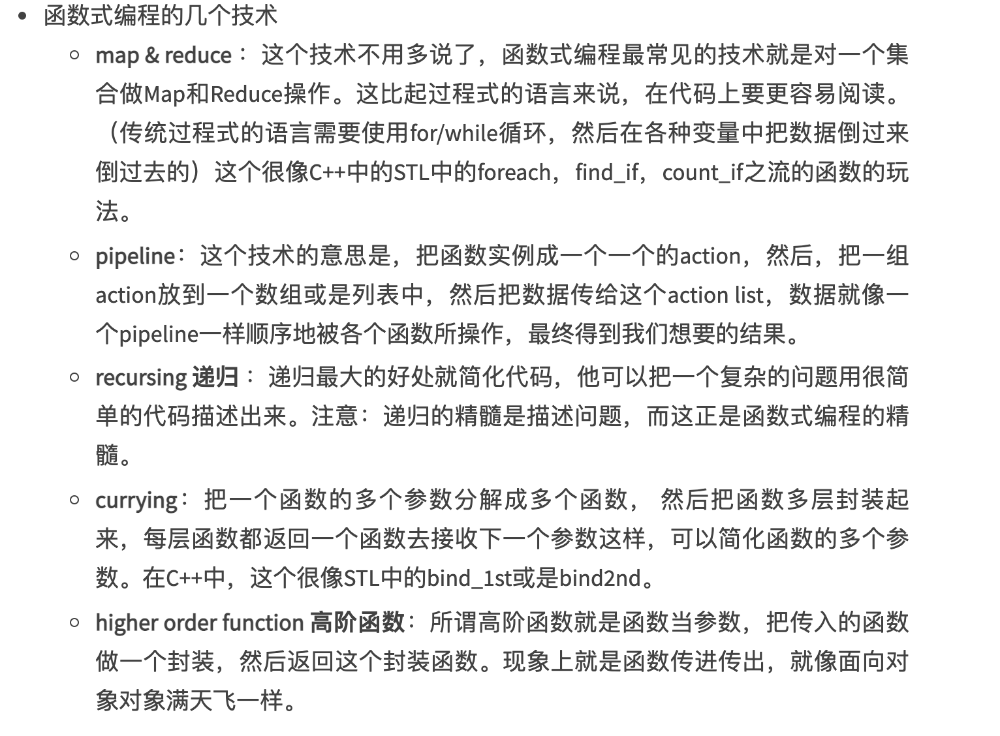

如[函数式编程--酷壳](https://coolshell.cn/articles/10822.html) 总结，

函数式编程的三大特性;


- 数据不可变性

- 函数作为一等公民(函数可以像变量一样来创建/修改/传递 等)

- 尾递归优化(重用stack,减轻栈的压力)


<br>

函数式编程用到的几个技术：



<br>


**函数式编程的理念：把函数当成变量来用，关注于描述问题而不是怎么实现**（这样可以让代码更易读）


<br>


---


<br>


下面详细探讨 `Map & Reduce`

其实完整的操作有三种，即**Map、Reduce、Filter**，这三种操作可以非常方便灵活地对一些数据进行处理，而不是大量使用for循环

（有的也把Reduce称为fold，比较早期且经典的函数式语言有OCaml， Lisp，Haskell等)

其实恰好对应PHP中的array_map()、array_reduce()、array_filter()


<br>


### Map

如 有这样一个人名的集合["ZhangSan","lisi","WANGWU"]，有大写有小写，将其全部转为大写，


#### Go语言版本

对于传统方式，对切片进行循环，在循环中进行处理即可：

```go

func UpperSli(arr []string) (newArr []string) {
	for _, item := range arr {
		newArr = append(newArr, strings.ToUpper(item))
	}
	return
}

func main() {

	arr := []string{"ZhangSan","lisi","WANGWU"}

	newArr := UpperSli(arr)

	fmt.Printf("%v\n", newArr)
    //[ZHANGSAN LISI WANGWU]

}

```

“在函数式编程中，不应该用循环迭代的方式，而该用更为高级的方法”


使用函数式编程的写法：

```go

func MapStrUpper(arr []string, fn func(s string) string) []string {
	var newArray []string
	for _, it := range arr {
		newArray = append(newArray, fn(it))
	}
	return newArray
}

func main() {
	var list = []string{"ZhangSan","lisi","WANGWU"}

	x := MapStrUpper(list, func(s string) string {
		return strings.ToUpper(s)
	})

	fmt.Printf("%v\n", x)
	 //[ZHANGSAN LISI WANGWU]
}

```


**“这样的代码很易读，因为，这样的代码是在描述要干什么，而不是怎么干”**

<br>

#### PHP版本

```php
<?php

$arr = ["ZhangSan", "lisi", "WANGWU"];
var_export($arr);

$newArr = [];
foreach ($arr as $val) {
    $newVal = strtoupper($val);
    array_push($newArr, $newVal);
}

var_export($newArr);
```


使用函数式编程的写法：

<font size=1 color="grey">
array_map()

 该函数可将用户自定义的函数作用到数组中的每个值上，并返回用户自定义函数作用后的带有新值的数组。

 可以传递多个数组，回调函数接受的参数数目应该和传递给 array_map() 函数的数组数目一致。

</font>

```php
<?php

$arr = ["ZhangSan", "lisi", "WANGWU"];
var_export($arr);

$newArr = array_map(function ($val1) {
    return strtoupper($val1);
}, $arr);

var_export($newArr);
```

<br>


#### Rust版本

传统方式，对数组进行循环，在循环中进行处理：

```rust
fn main() {
    let arr: [String;3] = ["ZhangSan".to_string(),"lisi".to_string(),"WANGWU".to_string()];
    println!("{:?}",arr);
    
     let  mut new_arr: [String;3] = ["".to_string(),"".to_string(),"".to_string()];
    
    // for i in arr.iter() {
    //     println!("值为 : {}", i);
    // }
    
    for index in 0..3 {
         println!("index is: {} & value is : {}",index,arr[index]);
         new_arr[index] = arr[index].to_ascii_uppercase();
    }
    
    
     println!("{:?}",new_arr);  
    
}
```

输出：

```rust
["ZhangSan", "lisi", "WANGWU"]
// 值为 : ZhangSan
// 值为 : lisi
// 值为 : WANGWU
index is: 0 & value is : ZhangSan
index is: 1 & value is : lisi
index is: 2 & value is : WANGWU
["ZHANGSAN", "LISI", "WANGWU"]
```

麻雀虽小，却涉及到

[关于rust：如何打印结构和数组？](https://www.codenong.com/30253422/)  {:?}

[Rust 数组](https://www.twle.cn/c/yufei/rust/rust-basic-array.html)

[Rust中的String和&str](https://mp.weixin.qq.com/s/yY8hhEjHCmUg1_PULSFaIg)

<br>

函数式编程的方式：

```rust

```


<br>

---

<br>


### Reduce

> map()是将传入的函数依次作用到序列的每个元素，每个元素都是独自被函数“作用”一次; 
reduce()是将传入的函数作用在序列的第一个元素得到结果后，把这个结果继续与下一个元素作用（累积计算）


reduce()方法是对数组的遍历,返回一个单个返回值


如 有一个数字集合[1，4，7，2，8]，计算其和

<br>


会把上一次迭代返回的结果存起来,带到下一次迭代中,使用reduce方法可以很容易的计算数组累加,累乘

#### Go语言版本

```go
package main

import "fmt"

func Reduce(arr []int, fn func(s int) int) int {
	sum := 0
	for _, it := range arr {
		sum += fn(it)
	}
	return sum
}

func main() {
	var list = []int{1,4,7,2,8}

	x := Reduce(list, func(s int) int {
		return s
	})
	fmt.Printf("%v\n", x)
	// 22
}
```

<br>

#### PHP版本

```php
<?php

function sum($carry, $item)
{
    var_dump($carry, $item);
    $carry += $item;
    echo "\n";
    return $carry;
}

$a = array(1, 4, 7, 2, 8);

$sum = array_reduce($a, 'sum', 0);

echo $sum;
```

输出为：

```php
int(0)
int(1)

int(1)
int(4)

int(5)
int(7)

int(12)
int(2)

int(14)
int(8)

22
```

更多参考 

[array_reduce 的理解](https://www.jianshu.com/p/3c856976813e)

[JS中的Array.reduce()方法](https://www.cnblogs.com/steamed-twisted-roll/p/10917405.html)

<br>


#### Rust版本


<br>


---


### Filter


Filter 重点在于过滤（而不是新增）某个元素


如 有一个数字集合[1, 2, 3, 4, 5, 6, 7, 8, 9, 10]，筛选出哪些是奇数，哪些大于5

<br>

#### Go版本

```go
package main

import "fmt"

func Filter(arr []int, fn func(n int) bool) []int {
	var newArray []int
	for _, it := range arr {
		if fn(it) {
			newArray = append(newArray, it)
		}
	}
	return newArray
}

func main() {
	var intset = []int{1, 2, 3, 4, 5, 6, 7, 8, 9, 10}
	out := Filter(intset, func(n int) bool {
		return n%2 == 1
	})
	fmt.Printf("%v\n", out) //[1 3 5 7 9]

	out = Filter(intset, func(n int) bool {
		return n > 5
	})
	fmt.Printf("%v\n", out) //[6 7 8 9 10]

}

```


<br>

#### PHP版本


```php
<?php

$arr = [1, 2, 3, 4, 5, 6, 7, 8, 9, 10];

$newArr = array_filter($arr, function ($val) {
    return $val % 2 == 1;
});
//返回结果
var_export($newArr);


$newArr = array_filter($arr, function ($val) {
    return $val > 5;
});
//返回结果
var_export($newArr);

```

输出：

```php
array (
  0 => 1,
  2 => 3,
  4 => 5,
  6 => 7,
  8 => 9,
)

array (
  5 => 6,
  6 => 7,
  7 => 8,
  8 => 9,
  9 => 10,
)
```

<br>

#### Rust版本


<br>

---


参考：


[GO编程模式：MAP-REDUCE](https://coolshell.cn/articles/21164.html)

[robpike/filter](https://github.com/robpike/filter)

[array_filter()、array_map()、array_walk()三者的用法和区别](https://blog.csdn.net/kelinfeng16/article/details/95243982)

```php
 array_filter() 重点在于过滤（而不是新增）某个元素，当你处理到一个元素时，返回过滤后的数组
 array_map() 重点在于遍历一个数组或多个数组的元素，返回一个新的数组
 array_walk() 重点在于遍历数组进行某种操作

 array_filter() 和 array_walk()对一个数组进行操作，数组参数在前，函数参数在后
 array_map() 可以处理多个数组，因此函数参数在前，数组参数在后，可以根据实际情况放入多个数组参数
```


更多可参见

[阮一峰-函数式编程初探](https://www.ruanyifeng.com/blog/2012/04/functional_programming.html)

[阮一峰-函数式编程入门教程](https://www.ruanyifeng.com/blog/2017/02/fp-tutorial.html)

[阮一峰-图解 Monad](https://www.ruanyifeng.com/blog/2015/07/monad.html)