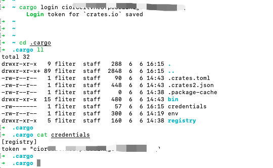
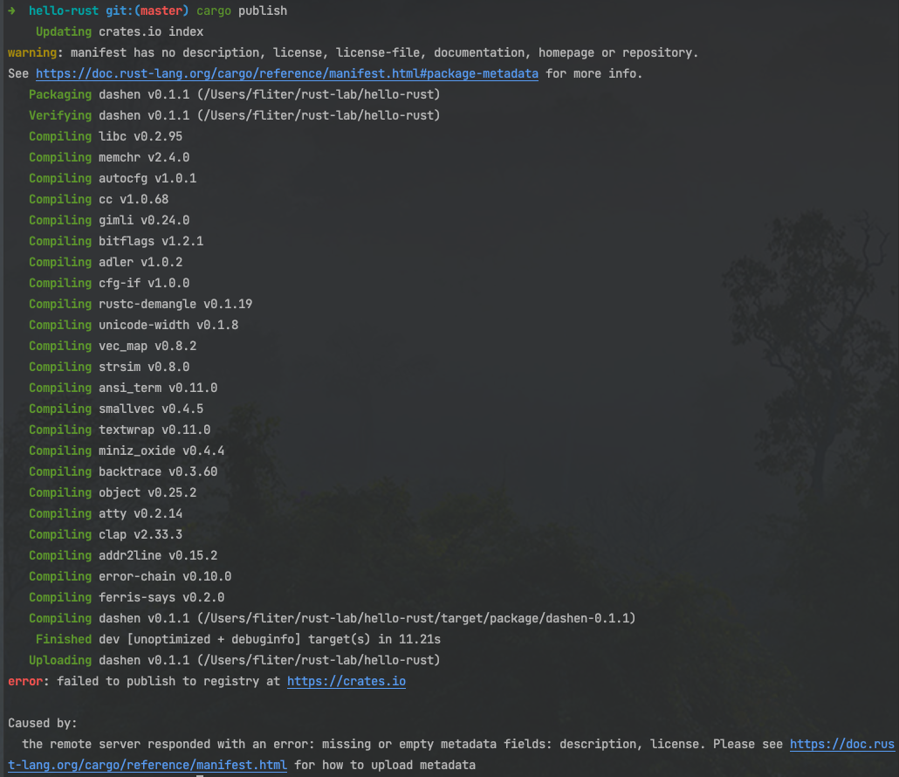
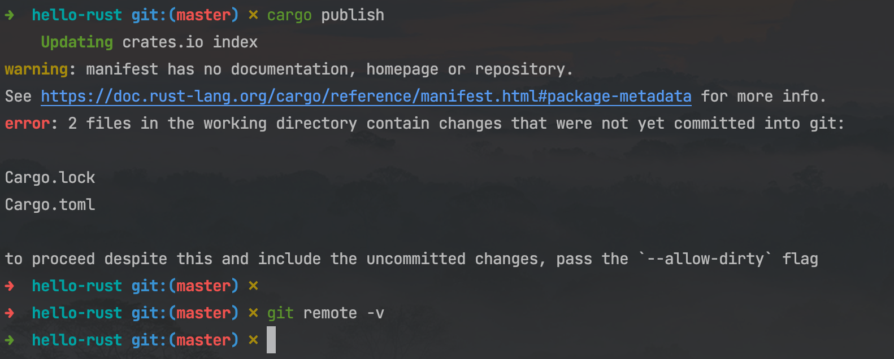
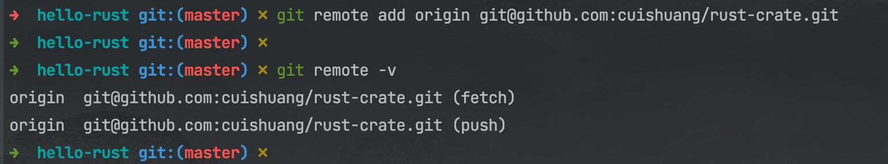
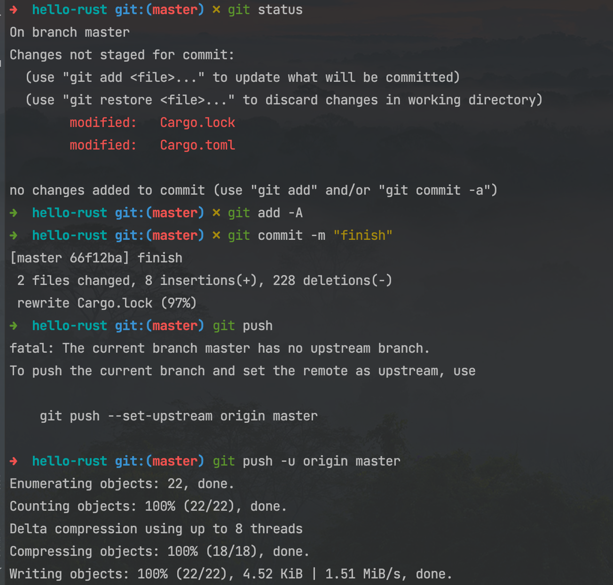
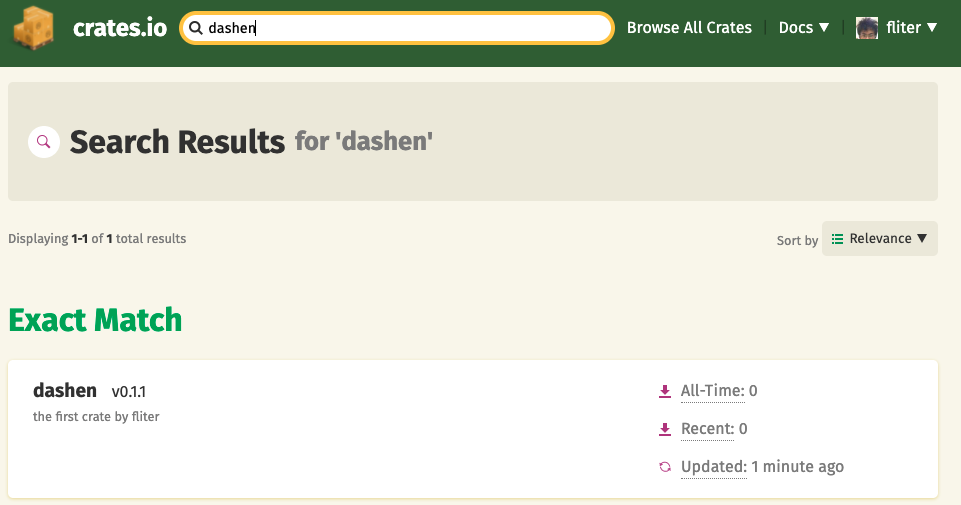

### 准备

<br>

发布 `crate` 时, 一旦发布无法修改,无法覆盖, 因此要注意邮箱等一些个人信息

访问crates.io 的 [帐号设定页面](https://crates.io/me),生成Token

并在命令行 执行 `cargo login your token`


此命令将告诉 `Cargo` 你的 API 令牌, 并将其存储在本地 `~/.cargo/credentials`





<br>

`crates.io` 上`crate`的名字, 会采取先到先得的方式分配.

<br>

---

<br>


### 打包 & 发布


<br>

对于 **Cargo.toml**:

```rs
[package]
name = "dashen"
version = "0.1.1"
authors = ["cuishuang <i@dashen.tech>"]
edition = "2018"

# See more keys and their definitions at https://doc.rust-lang.org/cargo/reference/manifest.html

[dependencies]
ferris-says = "0.2"
```

执行`cargo publish`:





这是因为缺少一些关键信息：关于该 *crate* 用途的描述和用户可能在何种条款下使用该 *crate* 的 *license*


想要修正这个错误, 需要在 **Cargo.toml** 中引入这些信息.


<font size=1 color="grey">

描述通常是一两句话, 它会出现在 *crate* 的搜索结果中和 *crate* 页面里.  

对于 *license* 字段, 需要一个 **license 标识符值**（license identifier value）


Linux 基金会的 [Software Package Data Exchange (SPDX)](http://spdx.org/licenses/) 列出了可以使用的标识符


例如指定 *crate* 使用 **MIT License**,可增加 MIT 标识符

</font>


```rs
[package]
name = "dashen"
version = "0.1.1"
authors = ["cuishuang <i@dashen.tech>"]
edition = "2018"
description = "the first crate by fliter"
license = "MIT"

# See more keys and their definitions at https://doc.rust-lang.org/cargo/reference/manifest.html

[dependencies]
ferris-says = "0.2"

```

<br>


再次执行 `cargo publish`:




<br>

这是因为没有指定git仓库

<br>

新建一个仓库,指定为远程仓库,并提交代码





<br>

再次执行 `cargo publish`:


<br>

此时也能在[crates.io](https://crates.io/search?page=1&per_page=10&q=dashen)搜到刚刚发布的crate




<br>

---

<br>


英文版文档:

[Publishing a Crate to Crates.io](https://doc.rust-lang.org/book/ch14-02-publishing-to-crates-io.html)


中文版文档:

[将 crate 发布到 Crates.io](https://kaisery.github.io/trpl-zh-cn/ch14-02-publishing-to-crates-io.html)