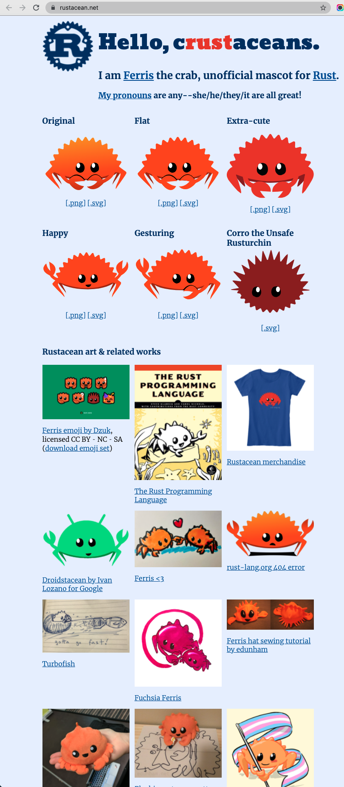

### 安装:

<br>


`curl --proto '=https' --tlsv1.2 -sSf https://sh.rustup.rs | sh`

<br>


### 更新:

<br>


Rust 的升级非常频繁. 如果安装 Rustup 后已有一段时间,那么很可能 Rust 版本已经过时, 运行 `rustup update` 获取最新版本的 Rust


<br>


### Cargo：Rust 的构建工具和包管理器

<br>

在安装 Rustup 时, 也会安装 Rust 构建工具和包管理器的最新稳定版,即 Cargo.

Cargo 可以做很多事情：

- cargo build 可以构建项目
- cargo run 可以运行项目
- cargo test 可以测试项目
- cargo doc 可以为项目构建文档
- cargo publish 可以将库发布到 crates.io

<br>


要检查否安装了 Rust 和 Cargo, 可在终端中运行:

`cargo --version`


<br>

在Mac上,Cargo可以像brew一样,安装很多Rust写的工具,如安装一款比Tmux还要好用的终端工具[zellij](https://github.com/zellij-org/zellij):

`cargo install zellij`


<br>


### 为编辑器安装Rust插件:


<br>


<br>


### 创建新项目:

<br>


`cargo new hello-rust`


这会生成一个名为 *hello-rust* 的新目录, 其中包含以下文件：


其中, *Cargo.toml* 为 Rust 的清单文件, 包含了项目的元数据和依赖库

*src/main.rs* 为编写应用代码的地方


<br>


进入项目中,执行 `cargo run`


<br>


### 添加依赖:

<br>


在 Rust 中, 通常把包称作 **crates**

可以在 [crates.io](https://crates.io/), 即 Rust 包的仓库中找到所有类别的库

(包和库,可以认为是一回事)


<br>

此处使用名为 **ferris-says** 的库. 

在 *Cargo.toml* 文件中添加以下信息:

（从 crate 页面上获取）
```rs
[dependencies]
ferris-says = "0.2"
```

<br>


(点击这个小图标,就会跳到这个包的[官方地址](https://docs.rs/ferris-says/0.2.0/ferris_says/))


<br>


然后运行：

`cargo build`


*Cargo* 就会安装该依赖.


(运行此命令会创建一个新文件 **Cargo.lock**, 该文件记录了本地所用依赖库的精确版本.  类似于**yarn.lock**)

<br>


### 编写应用:

<br>


在 *main.rs* 中:

```rs
use std::io::{BufWriter, stdout};
use ferris_says::say;

fn main() {
    let stdout = stdout();
    let message = String::from("Hello fellow Rustaceans! --- by shuang");
    let width = message.chars().count();


    let mut writer = BufWriter::new(stdout.lock());
    say(message.as_bytes(), width, &mut writer).unwrap();
}
```

<br>

执行 `cargo run`:


<br>


### 了解更多:

<br>


[Ferris](https://rustacean.net/) 是 Rust 社区的 *非官方吉祥物*. 

很多 Rust 程序员自称 `Rustaceans`, 它与**crustacean**<font size=1 color="grey">(甲壳纲动物)</font> 相似

建议用“they”、“them”等代词, 而不用带性别的代词来指代 Ferris


Ferris 与形容词 **ferrous**<font size=1 color="grey">(adj. [化学] 亚铁的；铁的，含铁的)</font> 相似, 其的含义与铁有关.

由于 Rust（锈）通常由铁形成,  因此算得上是这个吉祥物名字的有趣来源

<br>





<br>


---


<br>

参考:

[入门:快速配置 Rust 开发环境并编写一个小应用！](https://www.rust-lang.org/zh-CN/learn/get-started)


连微软也在力推:

[Take your first steps with Rust](https://docs.microsoft.com/en-us/learn/paths/rust-first-steps/)