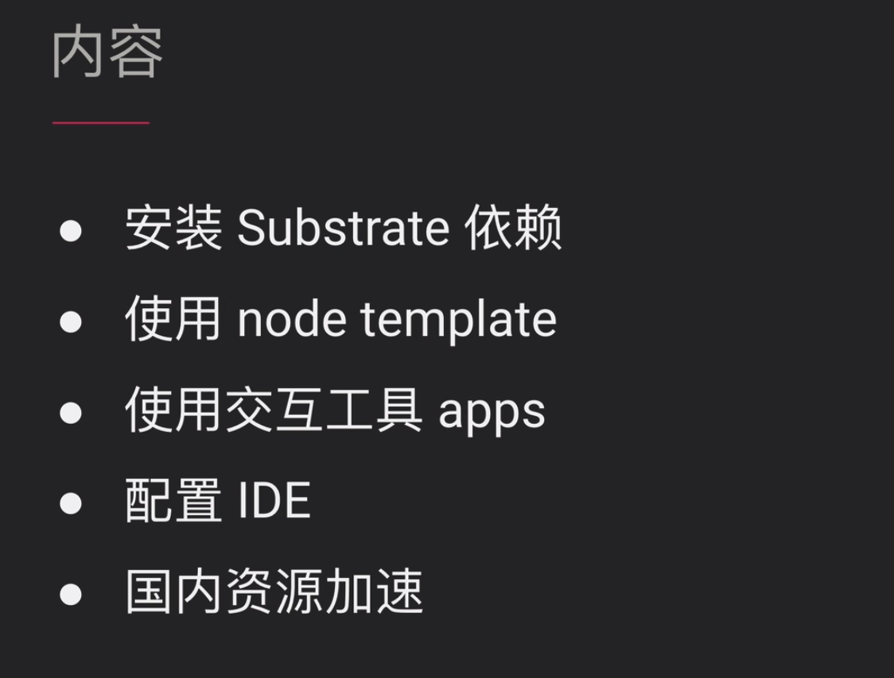
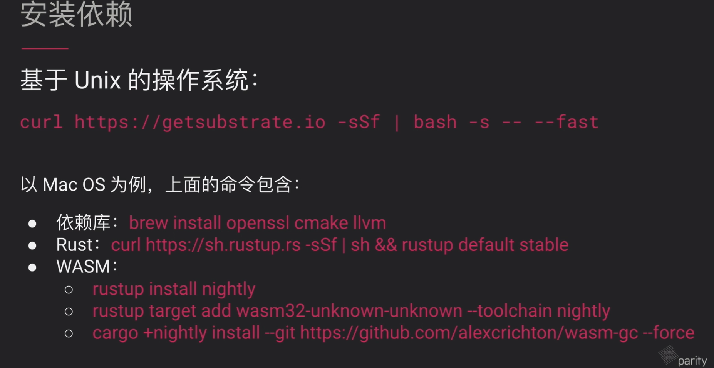
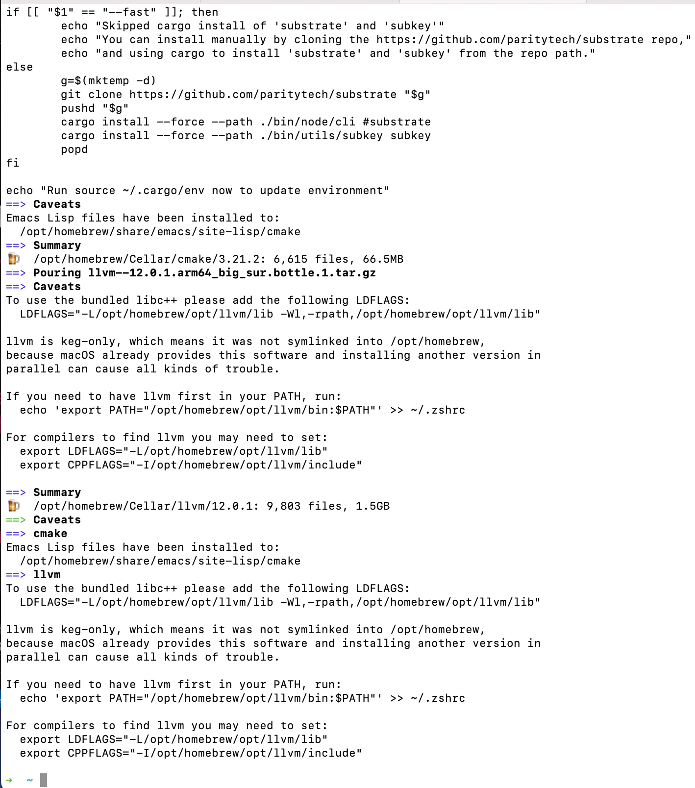
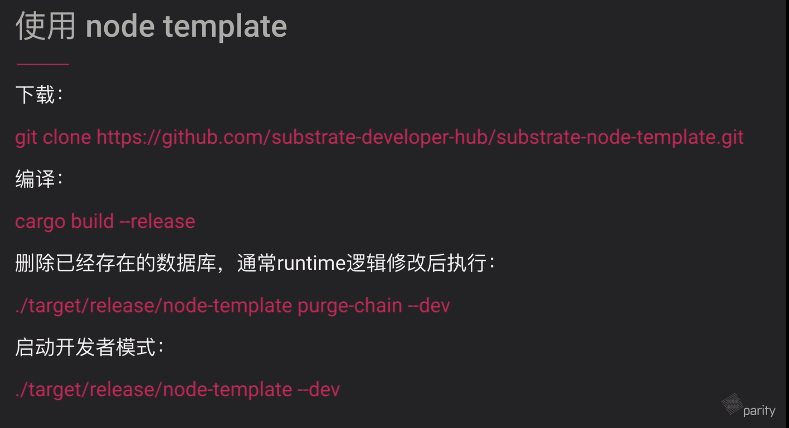
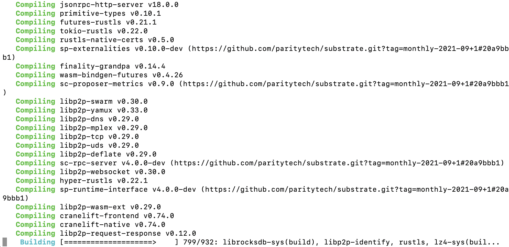
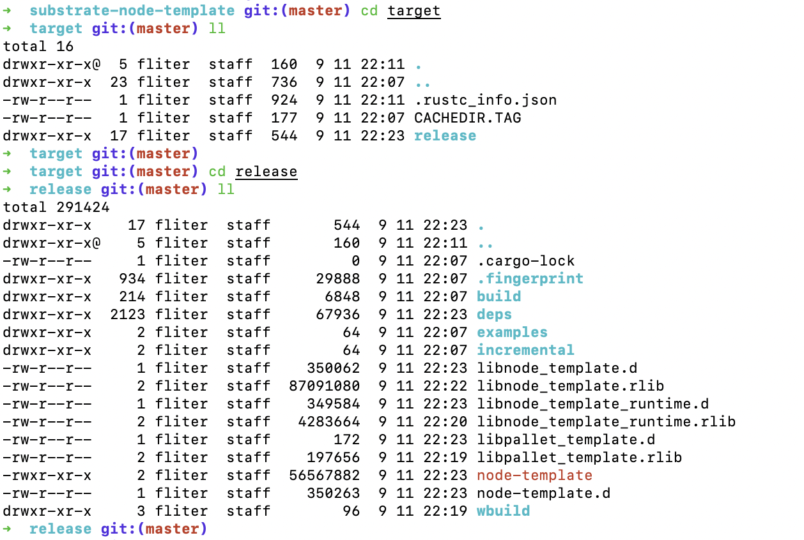
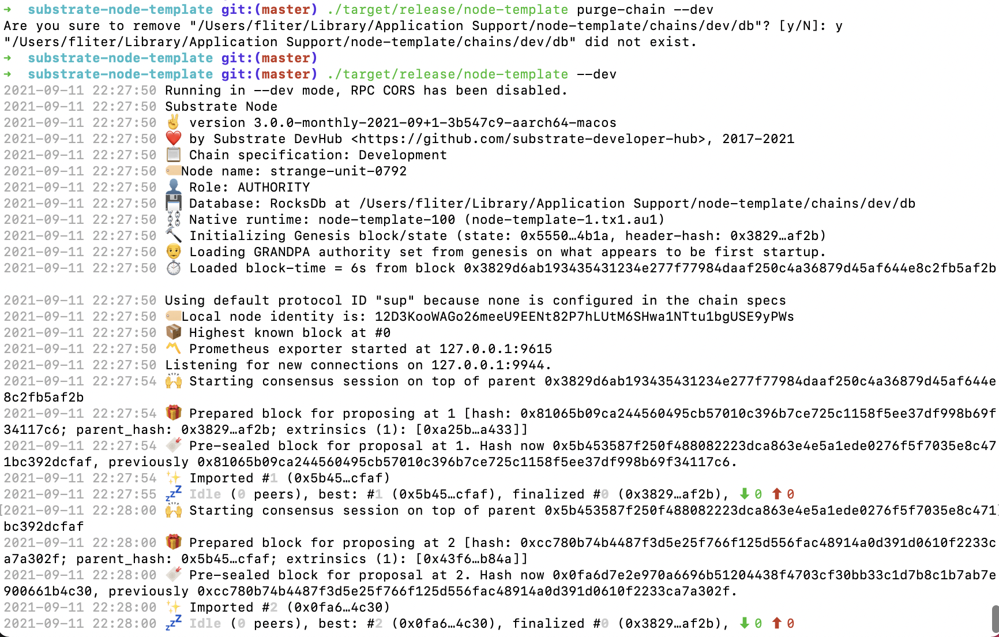
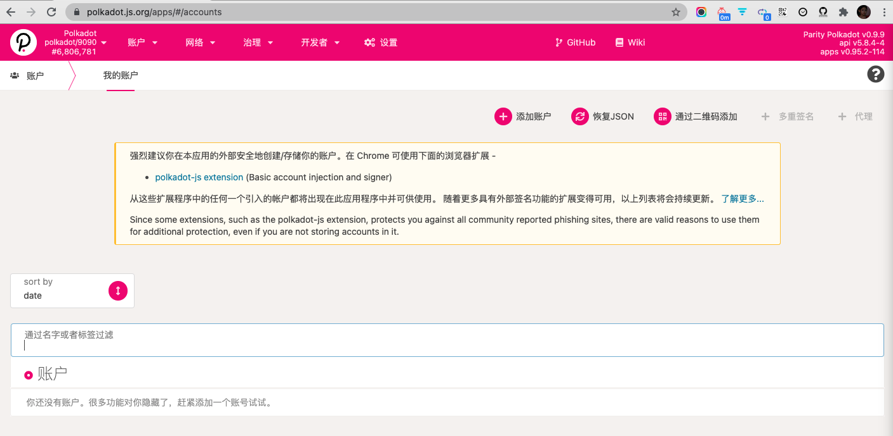

<br>

### 安装Substrate依赖

<br>

> curl https://getsubstrate.io/-o- https://raw.githubusercontent.com/creationix/nvm/v0.33.8/install.sh | bash


<details>
<summary><b>实际的shell为:</b></summary>


```sh
#!/bin/bash
# Copyright 2015-2020 Parity Technologies (UK) Ltd.

if [[ "$OSTYPE" == "linux-gnu" ]]; then
	set -e
	if [[ $(whoami) == "root" ]]; then
		MAKE_ME_ROOT=
	else
		MAKE_ME_ROOT=sudo
	fi

	if [ -f /etc/redhat-release ]; then
		echo "Redhat Linux detected."
		echo "This OS is not supported with this script at present. Sorry."
		echo "Please refer to https://github.com/paritytech/substrate for setup information."
		exit 1
	elif [ -f /etc/SuSE-release ]; then
		echo "Suse Linux detected."
		echo "This OS is not supported with this script at present. Sorry."
		echo "Please refer to https://github.com/paritytech/substrate for setup information."
		exit 1
	elif [ -f /etc/arch-release ]; then
		echo "Arch Linux detected."
		$MAKE_ME_ROOT pacman -Syu --needed --noconfirm cmake gcc openssl-1.0 pkgconf git clang
		export OPENSSL_LIB_DIR="/usr/lib/openssl-1.0";
		export OPENSSL_INCLUDE_DIR="/usr/include/openssl-1.0"
	elif [ -f /etc/mandrake-release ]; then
		echo "Mandrake Linux detected."
		echo "This OS is not supported with this script at present. Sorry."
		echo "Please refer to https://github.com/paritytech/substrate for setup information."
		exit 1
	elif [ -f /etc/debian_version ]; then
		echo "Ubuntu/Debian Linux detected."
		$MAKE_ME_ROOT apt update
		$MAKE_ME_ROOT apt install -y cmake pkg-config libssl-dev git gcc build-essential git clang libclang-dev
	else
		echo "Unknown Linux distribution."
		echo "This OS is not supported with this script at present. Sorry."
		echo "Please refer to https://github.com/paritytech/substrate for setup information."
		exit 1
	fi
elif [[ "$OSTYPE" == "darwin"* ]]; then
	set -e
	echo "Mac OS (Darwin) detected."

	if ! which brew >/dev/null 2>&1; then
		/bin/bash -c "$(curl -fsSL https://raw.githubusercontent.com/Homebrew/install/master/install.sh)"
	fi

	brew update
	brew install openssl cmake llvm
elif [[ "$OSTYPE" == "freebsd"* ]]; then
	echo "FreeBSD detected."
	echo "This OS is not supported with this script at present. Sorry."
	echo "Please refer to https://github.com/paritytech/substrate for setup information."
	exit 1
else
	echo "Unknown operating system."
	echo "This OS is not supported with this script at present. Sorry."
	echo "Please refer to https://github.com/paritytech/substrate for setup information."
	exit 1
fi

if ! which rustup >/dev/null 2>&1; then
	curl https://sh.rustup.rs -sSf | sh -s -- -y
	source ~/.cargo/env
	rustup default stable
else
	rustup update
	rustup default stable
fi

rustup update nightly
rustup target add wasm32-unknown-unknown --toolchain nightly

if [[ "$1" == "--fast" ]]; then
	echo "Skipped cargo install of 'substrate' and 'subkey'"
	echo "You can install manually by cloning the https://github.com/paritytech/substrate repo,"
	echo "and using cargo to install 'substrate' and 'subkey' from the repo path."
else 
	g=$(mktemp -d)
	git clone https://github.com/paritytech/substrate "$g"
	pushd "$g"
	cargo install --force --path ./bin/node/cli #substrate
	cargo install --force --path ./bin/utils/subkey subkey
	popd
fi

echo "Run source ~/.cargo/env now to update environment"
```
</details>




(wasm-gc，可以压缩wasm二进制文件的大小)




<br>


---

<br>

### 使用node template

<br>




> git clone git@github.com:substrate-developer-hub/substrate-node-template.git


（cd substrate-node-template）

> cargo build --release

(编译确实非常慢)




> ./target/release/node-template purge-chain --dev




> ./target/release/node-template --dev  





<br>

可使用 **./target/release/node-template -h ** 查看所有命令：


<details>
<summary><b>./target/release/node-template -h:</b></summary>


```sh
node-template 3.0.0-monthly-2021-09+1-3b547c9-aarch64-macos

Substrate DevHub <https://github.com/substrate-developer-hub>
A fresh FRAME-based Substrate node, ready for hacking.

USAGE:
    node-template [FLAGS] [OPTIONS]
    node-template <SUBCOMMAND>

FLAGS:
        --alice                            Shortcut for `--name Alice --validator` with session keys for `Alice` added
                                           to keystore
        --allow-private-ipv4               Always accept connecting to private IPv4 addresses (as specified in
                                           [RFC1918](https://tools.ietf.org/html/rfc1918)). Enabled by default for
                                           chains marked as "local" in their chain specifications, or when `--dev` is
                                           passed
        --bob                              Shortcut for `--name Bob --validator` with session keys for `Bob` added to
                                           keystore
        --charlie                          Shortcut for `--name Charlie --validator` with session keys for `Charlie`
                                           added to keystore
        --dave                             Shortcut for `--name Dave --validator` with session keys for `Dave` added to
                                           keystore
        --dev                              Specify the development chain
        --disable-log-color                Disable log color output
        --disable-log-reloading            Disable feature to dynamically update and reload the log filter
        --discover-local                   Enable peer discovery on local networks
        --eve                              Shortcut for `--name Eve --validator` with session keys for `Eve` added to
                                           keystore
        --ferdie                           Shortcut for `--name Ferdie --validator` with session keys for `Ferdie` added
                                           to keystore
        --force-authoring                  Enable authoring even when offline
    -h, --help                             Prints help information
        --ipfs-server                      Join the IPFS network and serve transactions over bitswap protocol
        --kademlia-disjoint-query-paths    Require iterative Kademlia DHT queries to use disjoint paths for increased
                                           resiliency in the presence of potentially adversarial nodes
        --light                            Experimental: Run in light client mode
        --no-grandpa                       Disable GRANDPA voter when running in validator mode, otherwise disable the
                                           GRANDPA observer
        --no-mdns                          Disable mDNS discovery
        --no-private-ipv4                  Always forbid connecting to private IPv4 addresses (as specified in
                                           [RFC1918](https://tools.ietf.org/html/rfc1918)), unless the address was
                                           passed with `--reserved-nodes` or `--bootnodes`. Enabled by default for
                                           chains marked as "live" in their chain specifications
        --no-prometheus                    Do not expose a Prometheus exporter endpoint
        --no-telemetry                     Disable connecting to the Substrate telemetry server
        --one                              Shortcut for `--name One --validator` with session keys for `One` added to
                                           keystore
        --password-interactive             Use interactive shell for entering the password used by the keystore
        --prometheus-external              Expose Prometheus exporter on all interfaces
        --reserved-only                    Whether to only synchronize the chain with reserved nodes
        --rpc-external                     Listen to all RPC interfaces
        --storage-chain                    Enable storage chain mode
        --tmp                              Run a temporary node
        --two                              Shortcut for `--name Two --validator` with session keys for `Two` added to
                                           keystore
        --unsafe-pruning                   Force start with unsafe pruning settings
        --unsafe-rpc-external              Listen to all RPC interfaces
        --unsafe-ws-external               Listen to all Websocket interfaces
        --validator                        Enable validator mode
    -V, --version                          Prints version information
        --ws-external                      Listen to all Websocket interfaces

OPTIONS:
    -d, --base-path <PATH>                                       Specify custom base path
        --bootnodes <ADDR>...                                    Specify a list of bootnodes
        --chain <CHAIN_SPEC>                                     Specify the chain specification
        --database <DB>
            Select database backend to use [possible values: rocksdb, paritydb-experimental, auto]

        --db-cache <MiB>                                         Limit the memory the database cache can use
        --offchain-worker <ENABLED>
            Should execute offchain workers on every block [default: WhenValidating]  [possible values:
            Always, Never, WhenValidating]
        --execution <STRATEGY>
            The execution strategy that should be used by all execution contexts [possible values: Native,
            Wasm, Both, NativeElseWasm]
        --execution-block-construction <STRATEGY>
            The means of execution used when calling into the runtime while constructing blocks [possible values:
            Native, Wasm, Both, NativeElseWasm]
        --execution-import-block <STRATEGY>
            The means of execution used when calling into the runtime for general block import (including locally
            authored blocks) [possible values: Native, Wasm, Both, NativeElseWasm]
        --execution-offchain-worker <STRATEGY>
            The means of execution used when calling into the runtime while using an off-chain worker [possible values:
            Native, Wasm, Both, NativeElseWasm]
        --execution-other <STRATEGY>
            The means of execution used when calling into the runtime while not syncing, importing or constructing
            blocks [possible values: Native, Wasm, Both, NativeElseWasm]
        --execution-syncing <STRATEGY>
            The means of execution used when calling into the runtime for importing blocks as part of an initial sync
            [possible values: Native, Wasm, Both, NativeElseWasm]
        --in-peers <COUNT>
            Specify the maximum number of incoming connections we're accepting [default: 25]

        --enable-offchain-indexing <ENABLE_OFFCHAIN_INDEXING>
            Enable Offchain Indexing API, which allows block import to write to Offchain DB

        --ipc-path <PATH>                                        Specify IPC RPC server path
        --keep-blocks <COUNT>
            Specify the number of finalized blocks to keep in the database

        --keystore-path <PATH>                                   Specify custom keystore path
        --keystore-uri <keystore-uri>                            Specify custom URIs to connect to for keystore-services
        --listen-addr <LISTEN_ADDR>...                           Listen on this multiaddress
    -l, --log <LOG_PATTERN>...
            Sets a custom logging filter. Syntax is <target>=<level>, e.g. -lsync=debug

        --max-parallel-downloads <COUNT>
            Maximum number of peers from which to ask for the same blocks in parallel [default: 5]

        --max-runtime-instances <max-runtime-instances>          The size of the instances cache for each runtime
        --name <NAME>                                            The human-readable name for this node
        --node-key <KEY>                                         The secret key to use for libp2p networking
        --node-key-file <FILE>
            The file from which to read the node's secret key to use for libp2p networking

        --node-key-type <TYPE>
            The type of secret key to use for libp2p networking [default: Ed25519]  [possible values:
            Ed25519]
        --out-peers <COUNT>
            Specify the number of outgoing connections we're trying to maintain [default: 25]

        --password <password>
            Password used by the keystore. This allows appending an extra user-defined secret to the seed

        --password-filename <PATH>                               File that contains the password used by the keystore
        --pool-kbytes <COUNT>
            Maximum number of kilobytes of all transactions stored in the pool [default: 20480]

        --pool-limit <COUNT>
            Maximum number of transactions in the transaction pool [default: 8192]

        --port <PORT>                                            Specify p2p protocol TCP port
        --prometheus-port <PORT>                                 Specify Prometheus exporter TCP Port
        --pruning <PRUNING_MODE>
            Specify the state pruning mode, a number of blocks to keep or 'archive'

        --public-addr <PUBLIC_ADDR>...
            The public address that other nodes will use to connect to it. This can be used if there's a proxy in front
            of this node
        --reserved-nodes <ADDR>...                               Specify a list of reserved node addresses
        --rpc-cors <ORIGINS>
            Specify browser Origins allowed to access the HTTP & WS RPC servers

        --rpc-http-threads <COUNT>                               Size of the RPC HTTP server thread pool
        --rpc-max-payload <rpc-max-payload>
            Set the the maximum RPC payload size for both requests and responses (both http and ws), in megabytes.
            Default is 15MiB
        --rpc-methods <METHOD SET>
            RPC methods to expose. [default: Auto]  [possible values: Auto, Safe, Unsafe]

        --rpc-port <PORT>                                        Specify HTTP RPC server TCP port
        --state-cache-size <Bytes>                               Specify the state cache size [default: 67108864]
        --sync <SYNC_MODE>                                       Blockchain syncing mode [default: Full]
        --telemetry-url <URL VERBOSITY>...                       The URL of the telemetry server to connect to
        --tracing-receiver <RECEIVER>
            Receiver to process tracing messages [default: Log]  [possible values: Log]

        --tracing-targets <TARGETS>
            Sets a custom profiling filter. Syntax is the same as for logging: <target>=<level>

        --wasm-execution <METHOD>
            Method for executing Wasm runtime code [default: Compiled]  [possible values: interpreted-i-know-
            what-i-do, compiled]
        --wasm-runtime-overrides <PATH>                          Specify the path where local WASM runtimes are stored
        --ws-max-connections <COUNT>                             Maximum number of WS RPC server connections
        --ws-port <PORT>                                         Specify WebSockets RPC server TCP port

SUBCOMMANDS:
    benchmark        Benchmark runtime pallets.
    build-spec       Build a chain specification
    check-block      Validate blocks
    export-blocks    Export blocks
    export-state     Export the state of a given block into a chain spec
    help             Prints this message or the help of the given subcommand(s)
    import-blocks    Import blocks
    key              Key management cli utilities
    purge-chain      Remove the whole chain
    revert           Revert the chain to a previous state
```


</details>


<br>

### 使用交互工具 apps

<br>


#### 方法一，使用官方的apps：


https://polkadot.js.org/apps/#/accounts

https://polkadot.js.org/apps/#/explorer





#### 方法二，(编译)安装本地的apps，安装步骤参考项目的readme文档

其实是一个react的项目


https://github.com/polkadot-js/apps#development


<br>

### 配置IDE 

<br>


#### VSCode 插件

- Better toml

- Rust-analyzer：https://github.com/rust-analyzer/rust-analyzer

- Intellij IDEA Keybindings

- Settings Sync(将配置保存到github，换机器时好同步)

<br>

#### IntelliJ IDEA 插件：

- Rust


<br>

### 国内资源加速 crates.io

<br>

[中科大Rust crates源](https://mirrors.ustc.edu.cn/help/crates.io-index.html)，修改 ~/.cargo/config;

（之前没有设置过，则需新建config文件）

修改如下：

```rust
[source.crates-io]
registry = "https://github.com/rust-lang/crates.io-index"
replace-with = 'ustc'

[source.ustc]
registry = "git://mirrors.ustc.edu.cn/crates.io-index"
```

<br>

### 国内资源加速Github

<br>


方法一： 使用代理

- Shadowsocks，通过https协议拉取最新代码

方法二： 将Github的代码仓库映射到国内的代码托管网站

- 如gitee.com


<br>

[文档参见](https://substrate.dev/docs/zh-CN/)