<br>


> 循环冗余校验码 (Cyclic Redundancy Check, CRC) ，简称循环码，是一种常用的、具有**检错、纠错能力的校验码**，在早期的通信中运用广泛。循环冗余校验码常用于外存储器和计算机同步通信的数据校验。<br > *奇偶校验码(Parity Check, PC)* 和 *海明校验码(Hamming Check, HC)* 都是采用奇偶检测为手段检错和纠错的(奇偶校验码不具有纠错能力)，而循环冗余校验则是通过某种数学运算来建立数据位和校验位的约定关系的。


<br>

```
Cyclic

adj. 环的；循环的；周期的

cyclic: 循环的
cyclic voltammetry: 循环伏安法
cyclic loading: 循环荷载


Redundancy

n. [计][数] 冗余（等于redundance）；裁员；人浮于事

Redundancy: 冗余
redundancy payment: 裁员支出
redundancy package: 遣散超额员工计划

```


循环冗余校验码（CRC）广泛应用于数据通信领域和磁介质存储系统中。它利用生成多项式为k个数据位产生r个校验位来进行编码，其编码长度为k+r。

循环冗余校验码是由两部分组成的，左边为信息码（数据），右边为校验码。若信息码占k位，则校验码就占n-k位。其中，n为CRC码的字长，所以又称为 **(n，k)码** 。校验码是由信息码产生的，校验码位数越多，该代码的校验能力就越强。在求CRC编码时，采用的是模2运算。


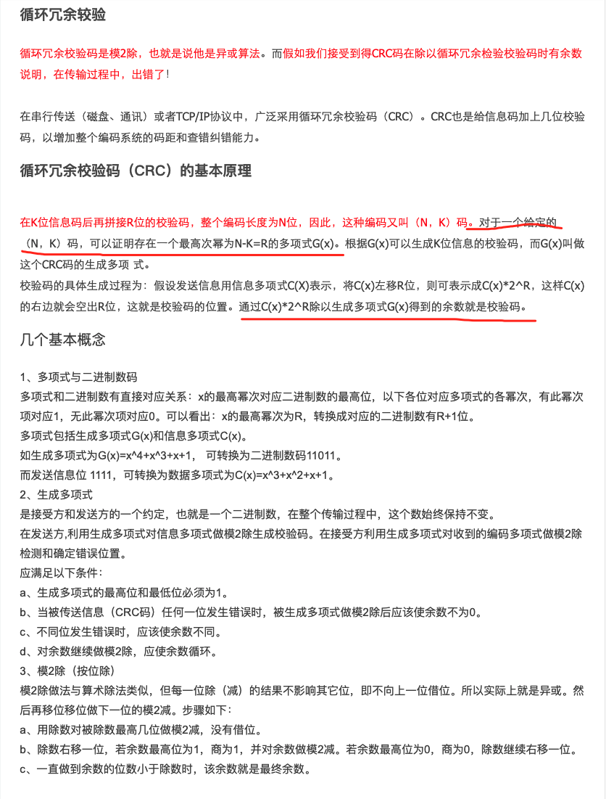


<br>

---


<br>

### **CRC码的生成步骤** 

<br>


精简版如下:


- 1、将x的最高幂次为R的生成多项式G(x)转换成对应的R+1位二进制数。

- 2、将信息码左移R位，相当于对应的信息多项式C(x)*2R 

- 3、用生成多项式（二进制数）对信息码做模2除，得到R位的余数。 

- 4、拼接，将余数拼到信息码左移后空出的位置，得到完整的CRC码。 


<br>

左移:

`如xxxxxx<<2即左移2位,右边空出的位用0填补，高位左移溢出则舍弃该高位 `


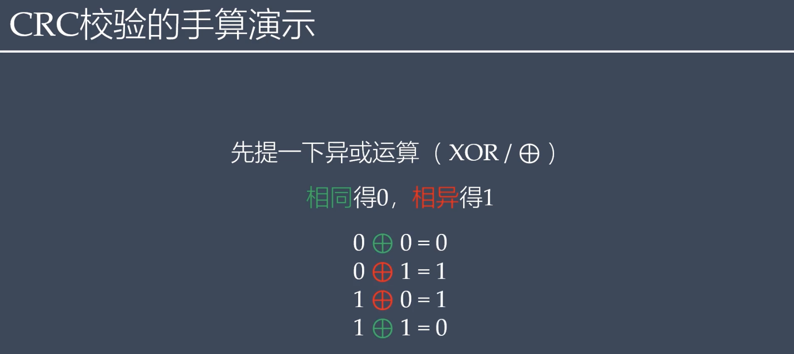
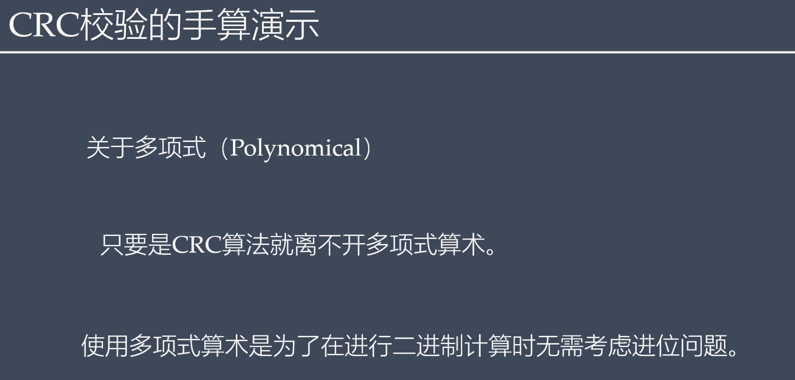
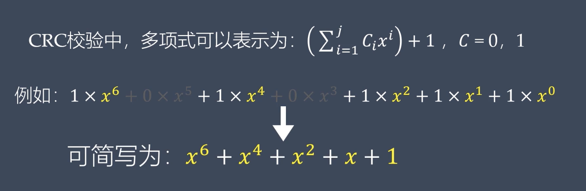
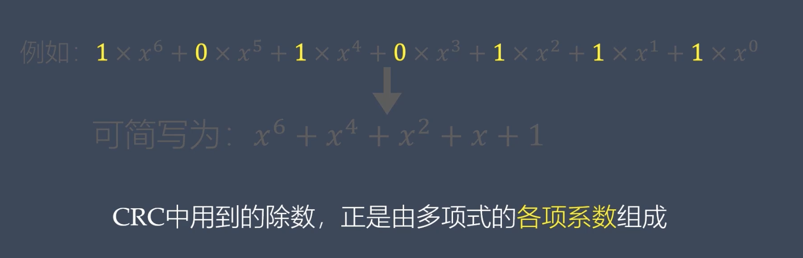
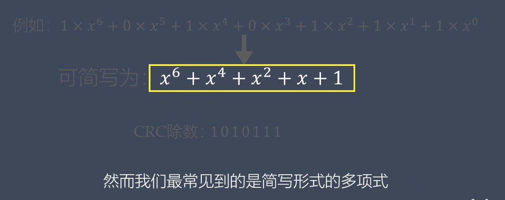
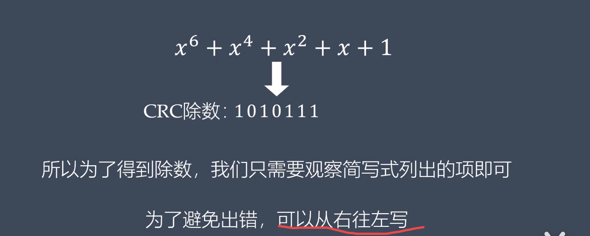
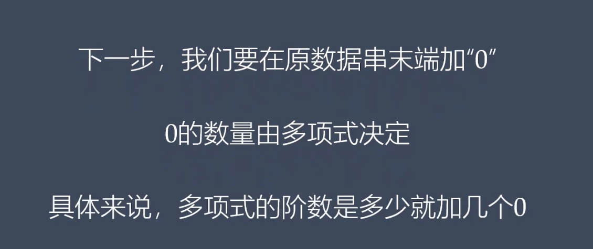
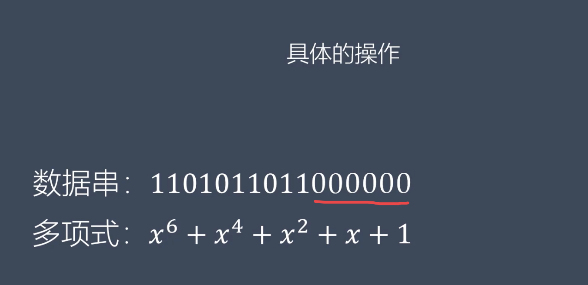
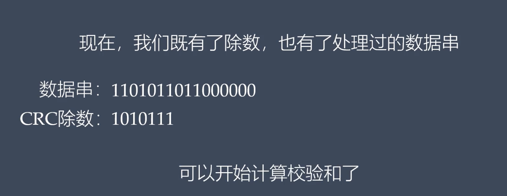
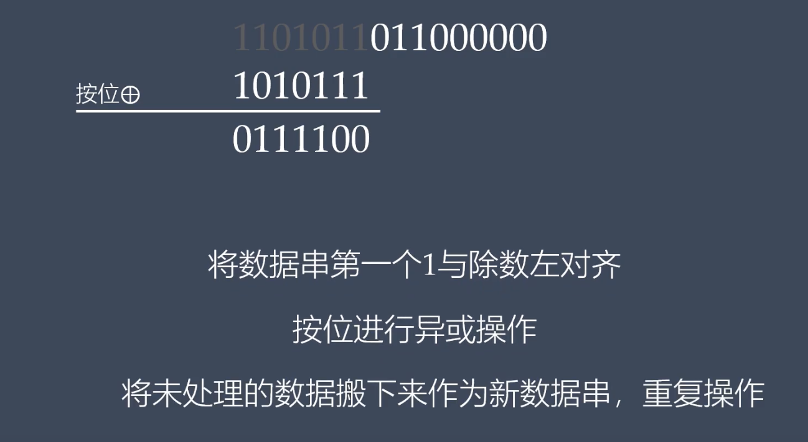
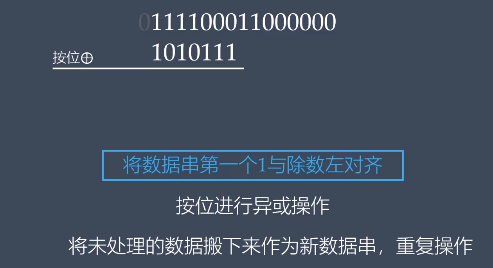
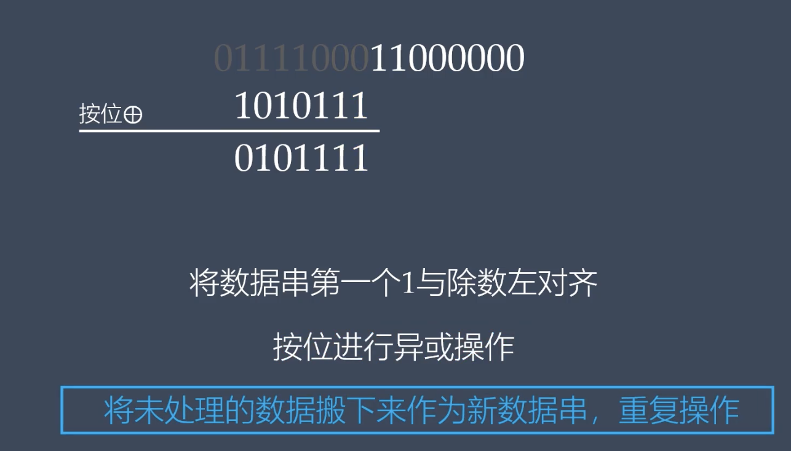

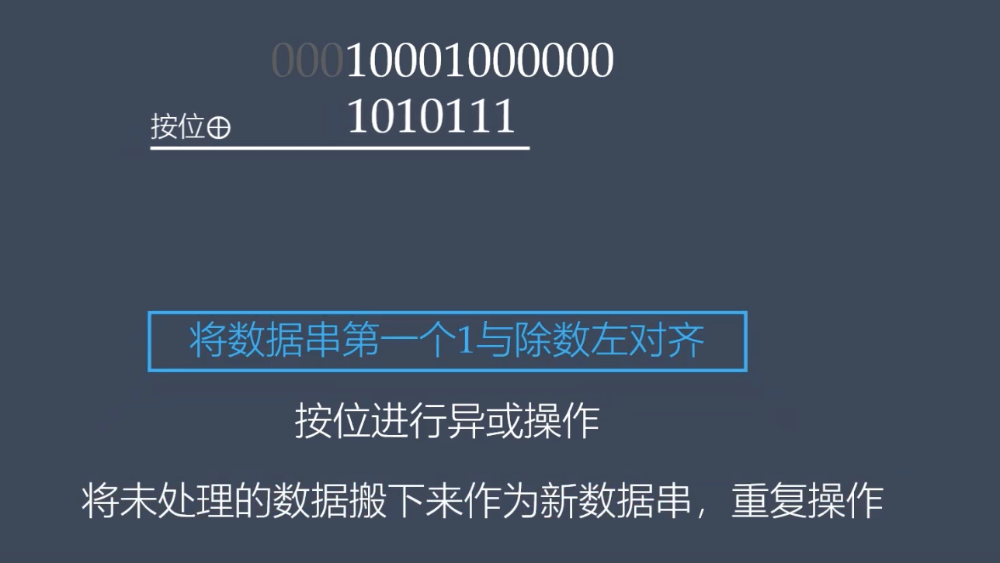

这里正体现了**"循环"**

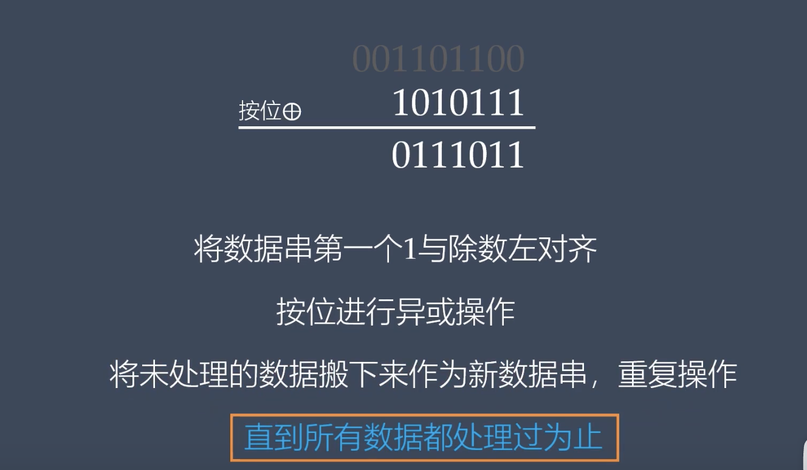


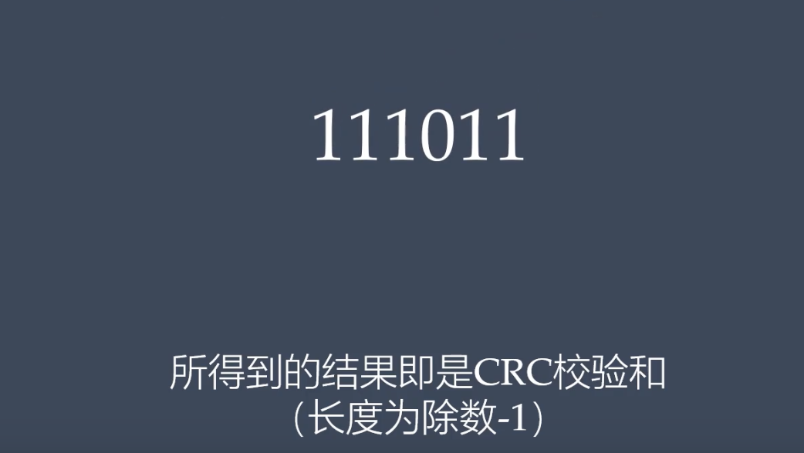


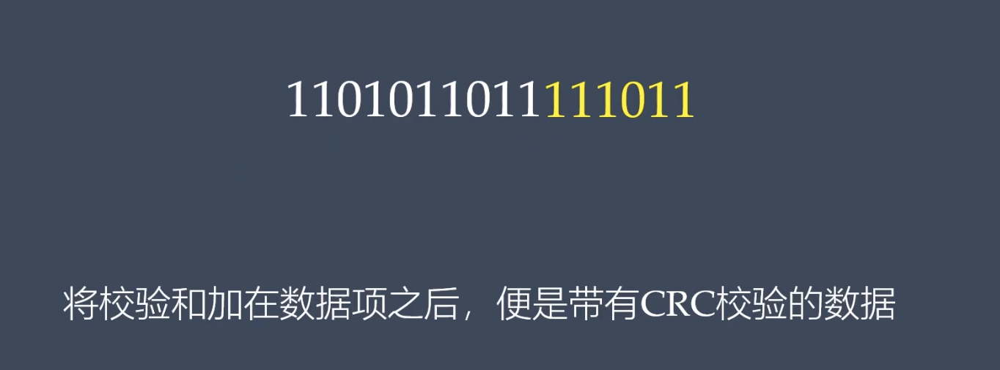


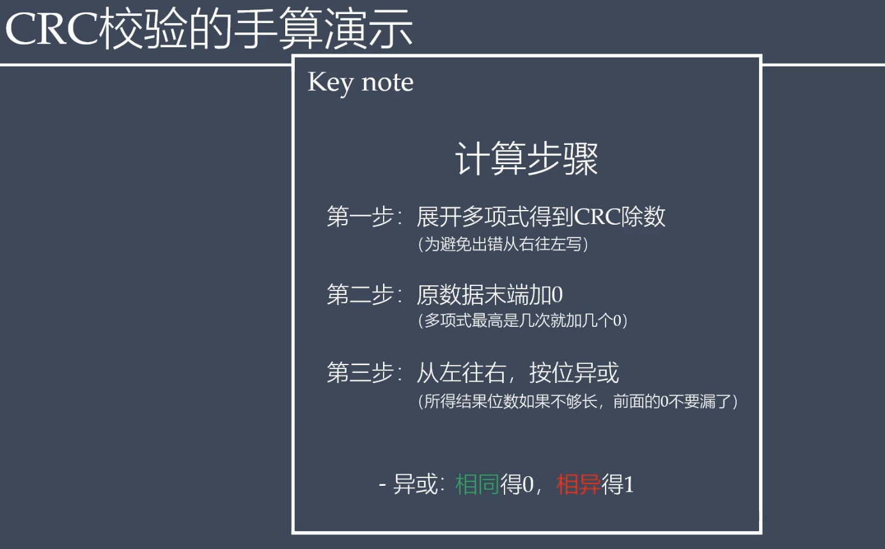


<br>

---


<br>


### 实例

<br>


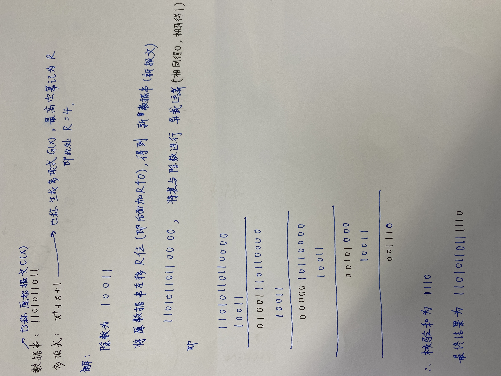

<br>


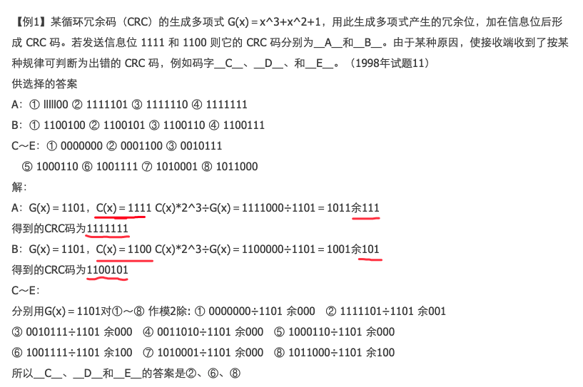


<br>


---

<br>

参考:

[[CRC校验]手算与直观演示](https://www.bilibili.com/video/BV1V4411Z7VA)


[原码、反码、补码与位运算](https://dashen.tech/2015/07/25/%E5%8E%9F%E7%A0%81%E3%80%81%E5%8F%8D%E7%A0%81%E3%80%81%E8%A1%A5%E7%A0%81%E4%B8%8E%E4%BD%8D%E8%BF%90%E7%AE%97/)


[循环冗余校验码例题](https://blog.csdn.net/leo115/article/details/8038141)


[软考-CRC检验码计算](https://zhuanlan.zhihu.com/p/82967915)


[计算机组成与体系结构考点总结](https://blog.csdn.net/weixin_43823808/article/details/108002550)