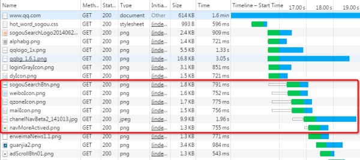

 

[Demo](https://http2.akamai.com/demo):  同时请求 379 张图片，从Load time 的对比可以看出 HTTP/2 在速度上的优势。

http 1.1用时接近15秒,http 2.0用时不到2秒.

大概能快4-6倍这个数量级

gRPC底层基于http 2.0

---

**相比 HTTP/1.x，HTTP/2 在底层传输做了很大的改动和优化：**

## 单一长连接&多路复用

 

### 单一长连接：

> HTTP/2中，客户端向某个域名的服务器请求页面的过程中，只会创建一条TCP连接，即使这页面可能包含上百个资源。  单一的连接是HTTP2的主要优势，单一的连接能减少TCP握手带来的时延 。HTTP2中用一条单一的长连接，避免了创建多个TCP连接带来的网络开销，提高了吞吐量。

### 多路复用：

> 直白的说就是所有的请求都是通过一个 TCP 连接并发完成。HTTP/1.x 虽然通过 pipeline 也能并发请求，但是多个请求之间的响应会被阻塞的，所以 pipeline 至今也没有被普及应用，而 HTTP/2 做到了真正的并发请求。同时，流还支持优先级和流量控制。当流并发时，就会涉及到流的优先级和依赖。优先级高的流会被优先发送。图片请求的优先级要低于 CSS 和 SCRIPT，这个设计可以确保重要的东西可以被优先加载完。

HTTP1中，请求就因域名链接数已超过限制，而被挂起等待了一段时间

---

## 头部压缩和二进制格式

 

### 头部压缩：

> HTTP/2 对消息头采用 HPACK 进行压缩传输，能够节省消息头占用的网络的流量。而 HTTP/1.x 每次请求，都会携带大量冗余头信息，浪费了很多带宽资源。头压缩能够很好的解决该问题。 

1. HTTP/2在客户端和服务器端使用“首部表”来跟踪和存储之前发送的键－值对，对于相同的数据，不再通过每次请求和响应发送；

2. 首部表在HTTP/2的连接存续期内始终存在，由客户端和服务器共同渐进地更新;

3. 每个新的首部键－值对要么被追加到当前表的末尾，要么替换表中之前的值。

### 二进制分帧：

> HTTP/2 采用二进制格式传输数据，而非 HTTP/1.x 的文本格式。 HTTP/2 中，同域名下所有通信都在单个连接上完成，该连接可以承载任意数量的双向数据流。每个数据流都以消息的形式发送，而消息又由一个或多个帧组成。多个帧之间可以乱序发送，根据帧首部的流标识可以重新组装。

---

## 服务端推动Server Push

 

### Server Push：

> 服务端能够更快的把资源推送给客户端。例如服务端可以主动把 JS 和 CSS 文件推送给客户端，而不需要客户端解析 HTML 再发送这些请求。当客户端需要的时候，它已经在客户端了。

该功能通常被称作“缓存推送”。主要的思想是：当一个客户端请求资源X，而服务器知道它很可能也需要资源Z的情况下，服务器可以在客户端发送请求前，主动将资源Z推送给客户端。

这个功能帮助客户端将Z放进缓存以备将来之需。

---

参考:

[HTTP/2 相比 1.0 有哪些重大改进？](https://www.zhihu.com/question/34074946/answer/202831825)